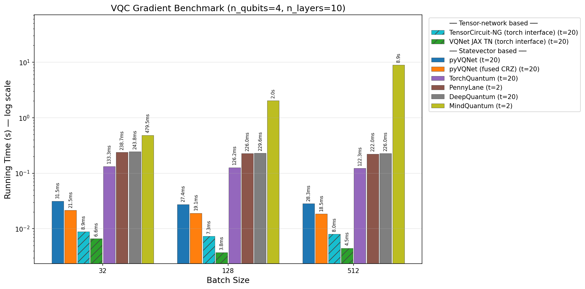
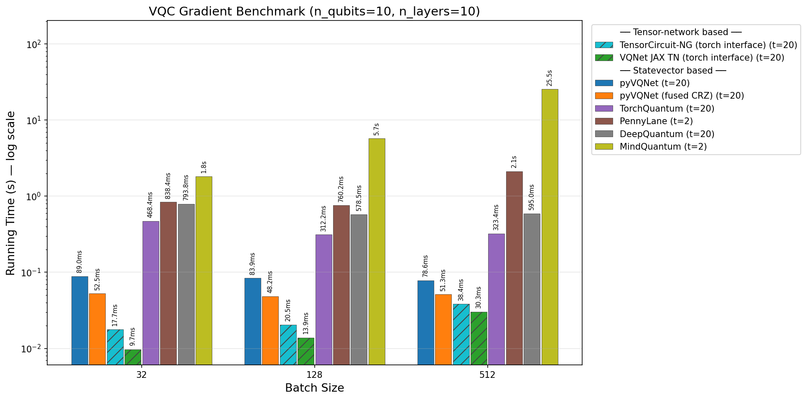

.. _torch_api:

=============================================================
VQNet uses torch for low-level computation
=============================================================

Starting from version 2.15.0, this software supports using `PyTorch` as the computing backend for low-level operations and can be integrated with models, codes, and third-party libraries based on `PyTorch` for secondary development.

    .. important::

        To use the following features, please install torch>=2.11.0 yourself. If installing a GPU version of torch, you need to use a version compatible with CUDA 12.6, otherwise your torch may not work due to NVIDIA CUDA runtime library issues. This software does not automatically install torch during installation.

    .. note::

        Variational quantum computation functions (such as ``rx``, ``ry``, ``rz``, ``cnot``, etc.) based on the torch backend have high-performance CUDA kernel implementations compiled under torch 2.11.0 + CUDA 12.6. When the torch and CUDA versions match, this implementation is automatically enabled; otherwise, it automatically falls back to the native torch implementation.

    .. important::

        The variational quantum computation functions (with lowercase naming, such as `rx` , `ry` , `rz` , etc.) in :ref:`vqc_api`, as well as the basic computation functions of QTensor in :ref:`qtensor_api` ,
        can take a ``QTensor`` as input after calling ``pyvqnet.backends.set_backend("torch")`` , with the `data` member of `QTensor` changing from pyvqnet's ``_core.Tensor`` to ``torch.Tensor`` for computation.

        ``to_tensor`` can be used to wrap a ``torch.Tensor`` into a ``QTensor`` .

        When using the ``pytorch`` backend, the neural network modules and pyqpanda quantum neural network modules used must inherit from ``pyvqnet.nn.torch.TorchModule``,
        and the automatic-differentiation variational quantum modules must inherit from ``pyvqnet.qnn.vqc.sv.torch.QModule`` . Otherwise, their parameters cannot be trained via automatic differentiation or saved.

        In ``pyvqnet.nn.torch.TorchModule`` and ``pyvqnet.qnn.vqc.sv.torch.QModule`` , the data in ``_buffers`` is of ``torch.Tensor`` type,
        and the data in ``_parameters`` is of ``torch.nn.Parameter`` type; QTensor interfaces cannot be used on them.

        ``pyvqnet.backends.set_backend("torch")`` and ``pyvqnet.backends.set_backend("pyvqnet")`` modify the global computation backend.
        ``QTensor`` objects created under different backend configurations cannot be mixed in computations.

Basic Backend Configuration
============================================

set_backend
------------------------------------------------

.. py:function:: pyvqnet.backends.set_backend(backend_name)

    Sets the backend for current computations and data storage. The default is "pyvqnet-ad", which can be set to "torch" (``torch-native`` and ``torch`` have been merged, both have the same effect).
    
    After calling ``pyvqnet.backends.set_backend("pyvqnet")``, VQNet ``QTensor`` ``data`` member variables use ``pyvqnet._core.Tensor`` to store data, and computations use the pyvqnet C++ library, with automatic differentiation completed in C++.

    ``pyvqnet.backends.set_backend("pyvqnet-ad")`` has the same effect as ``pyvqnet.backends.set_backend("pyvqnet")``.

    After calling ``pyvqnet.backends.set_backend("torch")``, the interface remains unchanged. VQNet's ``QTensor`` ``data`` member variable uses ``torch.Tensor`` to store data.
    :ref:`qtensor_api`, :ref:`vqc_api`, and interfaces under `pyvqnet.nn.torch` accept ``QTensor`` or ``torch.Tensor`` as input, and output ``torch.Tensor``.

    ``pyvqnet.backends.set_backend("torch-native")`` has the same effect as ``pyvqnet.backends.set_backend("torch")``.

    .. note::

        This function modifies the current computation backend. ``QTensor`` objects created under different backends cannot be used together in computations.

    :param backend_name: Name of the backend,can be "pyvqnet" or "torch".

    Example::

        import pyvqnet
        pyvqnet.backends.set_backend("torch")

get_backend
-------------------------------

.. py:function:: pyvqnet.backends.get_backend(t=None)

    If `t` is None, it retrieves the current computation backend.
    If `t` is a QTensor, it returns the backend used to create the QTensor based on its ``data`` property.
    If "torch" is the backend, it returns the pyvqnet torchAPI backend.
    If "pyvqnet" is the backend, it simply returns "pyvqnet".
    
    :param t: The current tensor (default: None).
    :return: The backend. By default, it returns "pyvqnet".

    Example::

        import pyvqnet
        pyvqnet.backends.set_backend("torch")
        pyvqnet.backends.get_backend()

QTensor Functions
===================

After setting the backend to ``torch``:

.. code-block::

    import pyvqnet
    pyvqnet.backends.set_backend("torch")

All member functions, creation functions, mathematical functions, logical functions, matrix transformations, etc., under :ref:`qtensor_api` will use torchfor computation. The `QTensor.data` can be accessed to retrieve the torchdata.

Classical Neural Network and Variational Quantum Neural Network Modules
==========================================================================================

Base Class
------------------------------------------------

TorchModule
^^^^^^^^^^^^^^^^^^^^^^^^^^^^^^^^^

.. py:class:: pyvqnet.nn.torch.TorchModule(*args, **kwargs)

    The base class that defines models when using the `torch` backend. This class inherits from both ``pyvqnet.nn.Module`` and ``torch.nn.Module``.
    It can be added as a submodule to a torchmodel.

    .. note::

        This class and its derived classes are only suitable for use with ``pyvqnet.backends.set_backend("torch")``.
        Do not mix with the default ``pyvqnet.nn`` `Module`.
    
        The data in the ``_buffers`` of this class is of type ``torch.Tensor``.
        The data in the ``_parameters`` of this class is of type ``torch.nn.Parameter``.

    .. py:method:: pyvqnet.nn.torch.TorchModule.forward(x, *args, **kwargs)

        Abstract forward computation function for the TorchModule class.

        :param x: Input QTensor.
        :param args: Non-keyword variable arguments.
        :param kwargs: Keyword variable arguments.

        :return: Output QTensor, with the internal `data` being a ``torch.Tensor``.

        Example::

            import numpy as np
            from pyvqnet.tensor import QTensor
            import pyvqnet
            pyvqnet.backends.set_backend("torch")
            from pyvqnet.nn.torch import Conv2D
            b = 2
            ic = 3
            oc = 2
            test_conv = Conv2D(ic, oc, (3, 3), (2, 2), "valid")
            x0 = QTensor(np.arange(1, b * ic * 5 * 5 + 1).reshape([b, ic, 5, 5]),
                        requires_grad=True,
                        dtype=pyvqnet.kfloat32)
            x = test_conv.forward(x0)
            print(x)

    .. py:method:: pyvqnet.nn.torch.TorchModule.state_dict(destination=None, prefix='')

        Returns a dictionary containing the entire state of the module, including parameters and buffer values.
        The keys are the names of the corresponding parameters and buffers.

        :param destination: The dictionary to store the internal module parameters.
        :param prefix: A prefix used for the names of parameters and buffers.

        :return: A dictionary containing the entire state of the module.

        Example::

            from pyvqnet.nn.torch import Conv2D
            import pyvqnet
            pyvqnet.backends.set_backend("torch")
            test_conv = Conv2D(2,3,(3,3),(2,2),"same")
            print(test_conv.state_dict().keys())

    .. py:method:: pyvqnet.nn.torch.TorchModule.load_state_dict(state_dict, strict=True)

        Copies parameters and buffers from the :attr:`state_dict` into this module and its submodules.

        :param state_dict: A dictionary containing parameters and persistent buffers.
        :param strict: Whether to enforce that the keys in the state_dict match the model's `state_dict()`. Default: True.

        :return: An error message if there is an issue.

        Example::

            from pyvqnet.nn.torch import TorchModule, Conv2D
            import pyvqnet
            import pyvqnet.utils
            pyvqnet.backends.set_backend("torch")

            class Net(TorchModule):
                def __init__(self):
                    super(Net, self).__init__()
                    self.conv1 = Conv2D(input_channels=1, output_channels=6, kernel_size=(5, 5),
                        stride=(1, 1), padding="valid")

                def forward(self, x):
                    return super().forward(x)

            model = Net()
            pyvqnet.utils.storage.save_parameters(model.state_dict(), "tmp.model")
            model_param = pyvqnet.utils.storage.load_parameters("tmp.model")
            model.load_state_dict(model_param)

    .. py:method:: pyvqnet.nn.torch.TorchModule.toGPU(device: int = DEV_GPU_0)

        Moves the module and its submodule parameters and buffer data to the specified GPU device.

        The device specifies where the internal data is stored. When device >= DEV_GPU_0, data is stored on the GPU.
        If your computer has multiple GPUs, you can specify different devices to store data. For example, device = DEV_GPU_1, DEV_GPU_2, DEV_GPU_3, ... refers to storage on GPUs with different serial numbers.
        
        .. note::

            Modules cannot perform computations across different GPUs.
            If you attempt to create a QTensor on a GPU ID exceeding the maximum allowed for validation, a Cuda error will be raised.

        :param device: The device to store the QTensor on. Default: DEV_GPU_0. device = pyvqnet.DEV_GPU_0 stores on the first GPU, device = DEV_GPU_1 stores on the second GPU, and so on.
        :return: The Module moved to the GPU device.

        Example::

            from pyvqnet.nn.torch import ConvT2D
            import pyvqnet
            pyvqnet.backends.set_backend("torch")
            test_conv = ConvT2D(3, 2, [4, 4], [2, 2], (0, 0))
            test_conv = test_conv.toGPU()
            print(test_conv.backend)
            #1000

    .. py:method:: pyvqnet.torch.TorchModule.toCPU()

        Moves the module and its submodule parameters and buffer data to a specific CPU device.

        :return: The Module moved to the CPU device.

        Example::

            from pyvqnet.nn.torch import ConvT2D
            import pyvqnet
            pyvqnet.backends.set_backend("torch")
            test_conv = ConvT2D(3, 2, [4, 4], [2, 2], (0, 0))
            test_conv = test_conv.toCPU()
            print(test_conv.backend)
            #0

TorchModuleList
^^^^^^^^^^^^^^^^^^^^^^^^^^^^^^^^

.. py:class:: pyvqnet.nn.torch.TorchModuleList(modules = None)

    This module is used to store child ``TorchModule`` instances in a list. The TorchModuleList can be indexed like a regular Python list, and the internal parameters it contains can be saved.
    
    This class inherits from ``pyvqnet.nn.torch.TorchModule`` and ``pyvqnet.nn.ModuleList``, and can be added as a submodule to a torchmodel.

    :param modules: A list of ``pyvqnet.nn.torch.TorchModule``

    :return: A TorchModuleList class

    Example::

        from pyvqnet.tensor import *
        from pyvqnet.nn.torch import TorchModule, Linear, TorchModuleList

        import pyvqnet
        pyvqnet.backends.set_backend("torch")

        class M(TorchModule):
            def __init__(self):
                super(M, self).__init__()
                self.pqc2 = TorchModuleList([Linear(4, 1), Linear(4, 1)])

            def forward(self, x):
                y = self.pqc2[0](x) + self.pqc2[1](x)
                return y

        mm = M()

TorchParameterList
^^^^^^^^^^^^^^^^^^^^^^^^^^^^^^^^

.. py:class:: pyvqnet.nn.torch.TorchParameterList(value=None)

    This module is used to store child ``pyvqnet.nn.Parameter`` instances in a list. The TorchParameterList can be indexed like a regular Python list, and the internal parameters it contains can be saved.
    
    This class inherits from ``pyvqnet.nn.torch.TorchModule`` and ``pyvqnet.nn.ParameterList``, and can be added as a submodule to a torchmodel.

    :param value: A list of ``nn.Parameter``

    :return: A TorchParameterList class

    Example::

        from pyvqnet.tensor import *
        from pyvqnet.nn.torch import TorchModule, Linear, TorchParameterList
        import pyvqnet.nn as nn
        import pyvqnet
        pyvqnet.backends.set_backend("torch")

        class MyModule(TorchModule):
            def __init__(self):
                super().__init__()
                self.params = TorchParameterList([nn.Parameter((10, 10)) for i in range(10)])

            def forward(self, x):
                # ParameterList can act as an iterable, or be indexed using ints
                for i, p in enumerate(self.params):
                    x = self.params[i // 2] * x + p * x
                return x

        model = MyModule()
        print(model.state_dict().keys())

TorchSequential
^^^^^^^^^^^^^^^^^^^^^^^^^^^^^^^^

.. py:class:: pyvqnet.nn.torch.TorchSequential(*args)

    The module adds modules in the order they are passed. Alternatively, you can pass an ``OrderedDict`` of modules. The ``forward()`` method of the ``Sequential`` class accepts any input and forwards it to its first module.
    The output is then sequentially linked to the input of each subsequent module, with the final output being the result of the last module.

    This class inherits from ``pyvqnet.nn.torch.TorchModule`` and ``pyvqnet.nn.Sequential``, and can be added as a submodule to a torchmodel.

    :param args: Modules to be added

    :return: A TorchSequential class

    Example::

        import pyvqnet
        from collections import OrderedDict
        from pyvqnet.tensor import *
        from pyvqnet.nn.torch import TorchModule, Conv2D, ReLu, \
            TorchSequential
        pyvqnet.backends.set_backend("torch")
        model = TorchSequential(
                    Conv2D(1, 20, (5, 5)),
                    ReLu(),
                    Conv2D(20, 64, (5, 5)),
                    ReLu()
                )
        print(model.state_dict().keys())

        model = TorchSequential(OrderedDict([
                    ('conv1', Conv2D(1, 20, (5, 5))),
                    ('relu1', ReLu()),
                    ('conv2', Conv2D(20, 64, (5, 5))),
                    ('relu2', ReLu())
                ]))
        print(model.state_dict().keys())

Saving and Loading Model Parameters
--------------------------------------------

You can use :ref:`save_parameters`'s ``save_parameters`` and ``load_parameters`` to save the parameters of a ``TorchModule`` model as a dictionary to a file, with the values saved as `numpy.ndarray`. Alternatively, you can load the parameter file from disk. Note that the model structure is not saved in the file, and you will need to manually reconstruct the model structure. You can also directly use ``torch.save`` and ``torch.load`` to read the ``torch`` model parameters since the parameters of ``TorchModule`` are stored as ``torch.Tensor`` objects.

Classic Neural Network Modules
--------------------------------------------

The following classic neural network modules all inherit from ``pyvqnet.nn.Module`` and ``torch.nn.Module``, and can be added as submodules to a torchmodel.

Linear
^^^^^^^^^^^^^^^^^^^^^^^^

.. py:class:: pyvqnet.nn.torch.Linear(input_channels, output_channels, weight_initializer=None, bias_initializer=None, use_bias=True, dtype=None, name: str = "")

    A linear module (fully connected layer), :math:`y = x@A.T + b`.
    This class inherits from ``pyvqnet.nn.Module`` and ``torch.nn.Module`` and can be used as a submodule of a torchmodel.

    The data in the class's ``_buffers`` is of type ``torch.Tensor``.
    The data in the class's ``_parameters`` is of type ``torch.nn.Parameter``.

    :param input_channels: `int` - The number of input channels.
    :param output_channels: `int` - The number of output channels.
    :param weight_initializer: `callable` - Weight initialization function, default is empty, using he_uniform.
    :param bias_initializer: `callable` - Bias initialization function, default is empty, using he_uniform.
    :param use_bias: `bool` - Whether to use the bias term, default is True.
    :param dtype: Data type for the parameters, defaults to None, uses the default data type `kfloat32`, which represents 32-bit floating point numbers.
    :param name: The name of the linear layer, default is "".

    :return: An instance of the Linear layer.

    Example::

        import numpy as np
        import pyvqnet
        from pyvqnet.tensor import QTensor
        from pyvqnet.nn.torch import Linear
        pyvqnet.backends.set_backend("torch")
        c1 = 2
        c2 = 3
        cin = 7
        cout = 5
        n = Linear(cin, cout)
        input = QTensor(np.arange(1, c1 * c2 * cin + 1).reshape((c1, c2, cin)), requires_grad=True, dtype=pyvqnet.kfloat32)
        y = n.forward(input)
        print(y)

Conv1D
^^^^^^^^^^^^^^^^^^^^^^^^

.. py:class:: pyvqnet.nn.torch.Conv1D(input_channels: int, output_channels: int, kernel_size: int, stride: int = 1, padding = "valid", use_bias: bool = True, kernel_initializer = None, bias_initializer = None, dilation_rate: int = 1, group: int = 1, dtype = None, name = "")

    Perform 1D convolution on the input. The input to the Conv1D module has the shape (batch_size, input_channels, in_height).
    This class inherits from ``pyvqnet.nn.Module`` and ``torch.nn.Module``, and can be used as a submodule of a torchmodel.

    The data in the class's ``_buffers`` is of type ``torch.Tensor``.
    The data in the class's ``_parameters`` is of type ``torch.nn.Parameter``.

    :param input_channels: `int` - The number of input channels.
    :param output_channels: `int` - The number of output channels.
    :param kernel_size: `int` - The size of the convolution kernel. The kernel shape is [output_channels, input_channels/group, kernel_size, 1].
    :param stride: `int` - The stride, default is 1.
    :param padding: `str|int` - Padding options, it can either be a string {'valid', 'same'} or an integer specifying the padding amount to be applied to the input. Default is "valid".
    :param use_bias: `bool` - Whether to use the bias term, default is True.
    :param kernel_initializer: `callable` - The convolution kernel initialization method. Default is empty, using kaiming_uniform.
    :param bias_initializer: `callable` - The bias initialization method. Default is empty, using kaiming_uniform.
    :param dilation_rate: `int` - The dilation size, default is 1.
    :param group: `int` - The number of groups in the grouped convolution. Default is 1.
    :param dtype: Data type for the parameters, defaults to None, uses the default data type `kfloat32`, which represents 32-bit floating point numbers.
    :param name: The name of the module, default is "".

    :return: An instance of the 1D convolution.

    .. note::

        ``padding='valid'`` does not apply padding.

        ``padding='same'`` applies zero-padding to the input, with the output's `out_height` equal to `ceil(in_height / stride)`, and does not support `stride > 1`.

    Example::

        import numpy as np
        import pyvqnet
        from pyvqnet.tensor import QTensor
        from pyvqnet.nn.torch import Conv1D
        pyvqnet.backends.set_backend("torch")
        b = 2
        ic = 3
        oc = 2
        test_conv = Conv1D(ic, oc, 3, 2)
        x0 = QTensor(np.arange(1, b * ic * 5 * 5 + 1).reshape([b, ic, 25]), requires_grad=True, dtype=pyvqnet.kfloat32)
        x = test_conv.forward(x0)
        print(x)

Conv2D
^^^^^^^^^^^^^^^^^^^^^^^^

.. py:class:: pyvqnet.nn.torch.Conv2D(input_channels: int, output_channels: int, kernel_size: tuple, stride: tuple = (1, 1), padding = "valid", use_bias = True, kernel_initializer = None, bias_initializer = None, dilation_rate: int = 1, group: int = 1, dtype = None, name = "")

    Perform 2D convolution on the input. The input to the Conv2D module has the shape (batch_size, input_channels, height, width).
    This class inherits from ``pyvqnet.nn.Module`` and ``torch.nn.Module``, and can be used as a submodule of a torchmodel.

    The data in the class's ``_buffers`` is of type ``torch.Tensor``.
    The data in the class's ``_parameters`` is of type ``torch.nn.Parameter``.

    :param input_channels: `int` - The number of input channels.
    :param output_channels: `int` - The number of output channels.
    :param kernel_size: `tuple|list` - The size of the convolution kernel. The kernel shape is [output_channels, input_channels/group, kernel_size, kernel_size].
    :param stride: `tuple|list` - The stride, default is (1, 1).
    :param padding: `str|tuple` - Padding options, it can either be a string {'valid', 'same'} or a tuple specifying the padding to apply to both sides. Default is "valid".
    :param use_bias: `bool` - Whether to use the bias term, default is True.
    :param kernel_initializer: `callable` - The convolution kernel initialization method. Default is empty, using kaiming_uniform.
    :param bias_initializer: `callable` - The bias initialization method. Default is empty, using kaiming_uniform.
    :param dilation_rate: `int` - The dilation size, default is 1.
    :param group: `int` - The number of groups in the grouped convolution. Default is 1.
    :param dtype: Data type for the parameters, defaults to None, uses the default data type `kfloat32`, which represents 32-bit floating point numbers.
    :param name: The name of the module, default is "".

    :return: An instance of the 2D convolution.

    .. note::

        ``padding='valid'`` does not apply padding.

        ``padding='same'`` applies zero-padding to the input, with the output's height equal to `ceil(in_height / stride)`.

    Example::

        import numpy as np
        import pyvqnet
        from pyvqnet.tensor import QTensor
        from pyvqnet.nn.torch import Conv2D
        pyvqnet.backends.set_backend("torch")
        b = 2
        ic = 3
        oc = 2
        test_conv = Conv2D(ic, oc, (3, 3), (2, 2))
        x0 = QTensor(np.arange(1, b * ic * 5 * 5 + 1).reshape([b, ic, 5, 5]), requires_grad=True, dtype=pyvqnet.kfloat32)
        x = test_conv.forward(x0)
        print(x)

ConvT2D
^^^^^^^^^^^^^^^^^^^^^^^^

.. py:class:: pyvqnet.nn.torch.ConvT2D(input_channels, output_channels, kernel_size, stride=[1, 1], padding=(0, 0), use_bias="True", kernel_initializer=None, bias_initializer=None, dilation_rate: int = 1, out_padding=(0, 0), group=1, dtype=None, name="")

    Perform 2D transpose convolution on the input. The input to the ConvT2D module has the shape (batch_size, input_channels, height, width).
    This class inherits from ``pyvqnet.nn.Module`` and ``torch.nn.Module``, and can be used as a submodule of a torchmodel.

    The data in the class's ``_buffers`` is of type ``torch.Tensor``.
    The data in the class's ``_parameters`` is of type ``torch.nn.Parameter``.

    :param input_channels: `int` - The number of input channels.
    :param output_channels: `int` - The number of output channels.
    :param kernel_size: `tuple|list` - The size of the convolution kernel, with kernel shape = [input_channels, output_channels/group, kernel_size, kernel_size].
    :param stride: `tuple|list` - The stride, default is (1, 1).
    :param padding: `tuple` - Padding options, a tuple specifying the padding to apply to both sides. Default is (0, 0).
    :param use_bias: `bool` - Whether to use the bias term, default is True.
    :param kernel_initializer: `callable` - The convolution kernel initialization method. Default is empty, using kaiming_uniform.
    :param bias_initializer: `callable` - The bias initialization method. Default is empty, using kaiming_uniform.
    :param dilation_rate: `int` - The dilation size, default is 1.
    :param out_padding: Extra size added to the output's shape for each dimension. Default is (0, 0).
    :param group: `int` - The number of groups in the grouped convolution. Default is 1.
    :param dtype: Data type for the parameters, defaults to None, uses the default data type `kfloat32`, which represents 32-bit floating point numbers.
    :param name: The name of the module, default is "".

    :return: An instance of the 2D transpose convolution.

    .. note::

        ``padding='valid'`` does not apply padding.

        ``padding='same'`` applies zero-padding to the input, with the output's height equal to `ceil(height / stride)`.

    Example::

        import numpy as np
        import pyvqnet
        from pyvqnet.tensor import QTensor
        from pyvqnet.nn.torch import ConvT2D
        pyvqnet.backends.set_backend("torch")
        test_conv = ConvT2D(3, 2, (3, 3), (1, 1))
        x = QTensor(np.arange(1, 1 * 3 * 5 * 5 + 1).reshape([1, 3, 5, 5]), requires_grad=True, dtype=pyvqnet.kfloat32)
        y = test_conv.forward(x)
        print(y)

AvgPool1D
^^^^^^^^^^^^^^^^^^^^^^^^

.. py:class:: pyvqnet.nn.torch.AvgPool1D(kernel, stride, padding=0, name = "")

    Perform average pooling on 1D input. The input has the shape (batch_size, input_channels, in_height).
    This class inherits from ``pyvqnet.nn.Module`` and ``torch.nn.Module``, and can be added as a submodule to a torchmodel.

    The data in the class's ``_buffers`` is of type ``torch.Tensor``.
    The data in the class's ``_parameters`` is of type ``torch.nn.Parameter``.

    :param kernel: The size of the pooling window.
    :param stride: The step size for moving the window.
    :param padding: Padding option, an integer specifying the padding length. Default is 0.
    :param name: The name of the module, default is "".

    :return: An instance of the 1D average pooling layer.

    Example::

        import numpy as np
        import pyvqnet
        from pyvqnet.tensor import QTensor
        from pyvqnet.nn.torch import AvgPool1D
        pyvqnet.backends.set_backend("torch")
        test_mp = AvgPool1D([3],[2],0)
        x = QTensor(np.array([0, 1, 0, 4, 5,
                             2, 3, 2, 1, 3,
                             4, 4, 0, 4, 3,
                             2, 5, 2, 6, 4,
                             1, 0, 0, 5, 7], dtype=float).reshape([1, 5, 5]), requires_grad=True)
        y = test_mp.forward(x)
        print(y)

MaxPool1D
^^^^^^^^^^^^^^^^^^^^^^^^

.. py:class:: pyvqnet.nn.torch.MaxPool1D(kernel, stride, padding=0, name="")

    Perform max pooling on 1D input. The input has the shape (batch_size, input_channels, in_height).
    This class inherits from ``pyvqnet.nn.Module`` and ``torch.nn.Module``, and can be added as a submodule to a torchmodel.

    The data in the class's ``_buffers`` is of type ``torch.Tensor``.
    The data in the class's ``_parameters`` is of type ``torch.nn.Parameter``.

    :param kernel: The size of the pooling window.
    :param stride: The step size for moving the window.
    :param padding: Padding option, an integer specifying the padding length. Default is 0.
    :param name: The name of the module, default is "".

    :return: An instance of the 1D max pooling layer.

    Example::

        import numpy as np
        import pyvqnet
        from pyvqnet.tensor import QTensor
        from pyvqnet.nn.torch import MaxPool1D
        pyvqnet.backends.set_backend("torch")
        test_mp = MaxPool1D([3],[2],0)
        x = QTensor(np.array([0, 1, 0, 4, 5,
                             2, 3, 2, 1, 3,
                             4, 4, 0, 4, 3,
                             2, 5, 2, 6, 4,
                             1, 0, 0, 5, 7], dtype=float).reshape([1, 5, 5]), requires_grad=True)
        y = test_mp.forward(x)
        print(y)

AvgPool2D
^^^^^^^^^^^^^^^^^^^^^^^^

.. py:class:: pyvqnet.nn.torch.AvgPool2D(kernel, stride, padding=(0,0), name="")

    Perform average pooling on 2D input. The input has the shape (batch_size, input_channels, height, width).
    This class inherits from ``pyvqnet.nn.Module`` and ``torch.nn.Module``, and can be added as a submodule to a torchmodel.

    The data in the class's ``_buffers`` is of type ``torch.Tensor``.
    The data in the class's ``_parameters`` is of type ``torch.nn.Parameter``.

    :param kernel: The size of the pooling window.
    :param stride: The step size for moving the window.
    :param padding: Padding option, a tuple containing two integers specifying padding for both dimensions. Default is (0,0).
    :param name: The name of the module, default is "".

    :return: An instance of the 2D average pooling layer.

    Example::

        import numpy as np
        import pyvqnet
        from pyvqnet.tensor import QTensor
        from pyvqnet.nn.torch import AvgPool2D
        pyvqnet.backends.set_backend("torch")
        test_mp = AvgPool2D([2, 2], [2, 2], 1)
        x = QTensor(np.array([0, 1, 0, 4, 5,
                             2, 3, 2, 1, 3,
                             4, 4, 0, 4, 3,
                             2, 5, 2, 6, 4,
                             1, 0, 0, 5, 7], dtype=float).reshape([1, 1, 5, 5]), requires_grad=True)
        y = test_mp.forward(x)
        print(y)

MaxPool2D
^^^^^^^^^^^^^^^^^^^^^^^^

.. py:class:: pyvqnet.nn.torch.MaxPool2D(kernel, stride, padding=(0,0), name="")

    Perform max pooling on 2D input. The input has the shape (batch_size, input_channels, height, width).
    This class inherits from ``pyvqnet.nn.Module`` and ``torch.nn.Module``, and can be added as a submodule to a torchmodel.

    The data in the class's ``_buffers`` is of type ``torch.Tensor``.
    The data in the class's ``_parameters`` is of type ``torch.nn.Parameter``.

    :param kernel: The size of the pooling window.
    :param stride: The step size for moving the window.
    :param padding: Padding option, a tuple containing two integers specifying padding for both dimensions. Default is (0,0).
    :param name: The name of the module, default is "".

    :return: An instance of the 2D max pooling layer.

    Example::

        import numpy as np
        import pyvqnet
        from pyvqnet.tensor import QTensor
        from pyvqnet.nn.torch import MaxPool2D
        pyvqnet.backends.set_backend("torch")
        test_mp = MaxPool2D([2, 2], [2, 2], (0, 0))
        x = QTensor(np.array([0, 1, 0, 4, 5,
                             2, 3, 2, 1, 3,
                             4, 4, 0, 4, 3,
                             2, 5, 2, 6, 4,
                             1, 0, 0, 5, 7], dtype=float).reshape([1, 1, 5, 5]), requires_grad=True)
        y = test_mp.forward(x)
        print(y)

Embedding
^^^^^^^^^^^^^^^^^^^^^^^^

.. py:class:: pyvqnet.nn.torch.Embedding(num_embeddings, embedding_dim, weight_initializer=xavier_normal, dtype=None, name: str = "")

    This module is typically used to store word embeddings and retrieve them using indices. The input to the module is a list of indices, and the output is the corresponding word embeddings.
    The input to this layer should be of type `kint64`. 
    This class inherits from ``pyvqnet.nn.Module`` and ``torch.nn.Module``, and can be added as a submodule to a torchmodel.

    The data in the class's ``_buffers`` is of type ``torch.Tensor``.
    The data in the class's ``_parameters`` is of type ``torch.nn.Parameter``.

    :param num_embeddings: `int` - The size of the embedding dictionary.
    :param embedding_dim: `int` - The size of each embedding vector.
    :param weight_initializer: `callable` - The weight initialization method, default is Xavier Normal.
    :param dtype: The data type for the parameters, defaults to None, which uses the default data type: `kfloat32` (32-bit floating point).
    :param name: The name of the embedding layer, default is "".

    :return: An instance of the Embedding layer.

    Example::

        import numpy as np
        import pyvqnet
        from pyvqnet.tensor import QTensor
        from pyvqnet.nn.torch import Embedding
        pyvqnet.backends.set_backend("torch")
        vlayer = Embedding(30, 3)
        x = QTensor(np.arange(1, 25).reshape([2, 3, 2, 2]), dtype=pyvqnet.kint64)
        y = vlayer(x)
        print(y)

BatchNorm2d
^^^^^^^^^^^^^^^^^^^^^^^^

.. py:class:: pyvqnet.nn.torch.BatchNorm2d(channel_num:int, momentum:float=0.1, epsilon:float = 1e-5, affine=True, beta_initializer=zeros, gamma_initializer=ones, dtype=None, name="")

    Applies batch normalization on 4D input (B, C, H, W). Refer to the paper
    `Batch Normalization: Accelerating Deep Network Training by Reducing
    Internal Covariate Shift <https://arxiv.org/abs/1502.03167>`__.

    This class inherits from ``pyvqnet.nn.Module`` and ``torch.nn.Module``, and can be added as a submodule to a torchmodel.

    The data in the class's ``_buffers`` is of type ``torch.Tensor``.
    The data in the class's ``_parameters`` is of type ``torch.nn.Parameter``.

    .. math::
        y = \frac{x - \mathrm{E}[x]}{\sqrt{\mathrm{Var}[x] + \epsilon}} * \gamma + \beta

    where :math:`\gamma` and :math:`\beta` are trainable parameters. Additionally, by default, during training, the layer continues to estimate the mean and variance, which are then used for normalization during evaluation. The momentum for the moving averages is set to the default value of 0.1.

    :param channel_num: `int` - The number of input channels.
    :param momentum: `float` - Momentum for the moving average calculation, default is 0.1.
    :param epsilon: `float` - A small constant for numerical stability, default is 1e-5.
    :param affine: `bool` - Whether to include learnable affine parameters for each channel. Default is `True`, which initializes the parameters as 1 for weights and 0 for biases.
    :param beta_initializer: `callable` - The initialization method for beta, default is zero initialization.
    :param gamma_initializer: `callable` - The initialization method for gamma, default is one initialization.
    :param dtype: The data type for the parameters, defaults to None, using `kfloat32` (32-bit floating point).
    :param name: The name of the batch normalization layer, default is "".

    :return: An instance of the 2D batch normalization layer.

    Example::

        import numpy as np
        import pyvqnet
        from pyvqnet.tensor import QTensor
        from pyvqnet.nn.torch import BatchNorm2d
        pyvqnet.backends.set_backend("torch")
        b = 2
        ic = 2
        test_conv = BatchNorm2d(ic)
        x = QTensor(np.arange(1, 17).reshape([b, ic, 4, 1]), requires_grad=True, dtype=pyvqnet.kfloat32)
        y = test_conv.forward(x)
        print(y)

BatchNorm1d
^^^^^^^^^^^^^^^^^^^^^^^^

.. py:class:: pyvqnet.nn.torch.BatchNorm1d(channel_num:int, momentum:float=0.1, epsilon:float = 1e-5, affine=True, beta_initializer=zeros, gamma_initializer=ones, dtype=None, name="")

    Applies batch normalization on 2D input (B, C). Refer to the paper
    `Batch Normalization: Accelerating Deep Network Training by Reducing
    Internal Covariate Shift <https://arxiv.org/abs/1502.03167>`__.

    .. math::
        y = \frac{x - \mathrm{E}[x]}{\sqrt{\mathrm{Var}[x] + \epsilon}} * \gamma + \beta

    where :math:`\gamma` and :math:`\beta` are trainable parameters. Additionally, by default, during training, the layer continues to estimate the mean and variance, which are then used for normalization during evaluation. The momentum for the moving averages is set to the default value of 0.1.

    This class inherits from ``pyvqnet.nn.Module`` and ``torch.nn.Module``, and can be added as a submodule to a torchmodel.

    The data in the class's ``_buffers`` is of type ``torch.Tensor``.
    The data in the class's ``_parameters`` is of type ``torch.nn.Parameter``.

    :param channel_num: `int` - The number of input channels.
    :param momentum: `float` - Momentum for the moving average calculation, default is 0.1.
    :param epsilon: `float` - A small constant for numerical stability, default is 1e-5.
    :param affine: `bool` - Whether to include learnable affine parameters for each channel. Default is `True`, which initializes the parameters as 1 for weights and 0 for biases.
    :param beta_initializer: `callable` - The initialization method for beta, default is zero initialization.
    :param gamma_initializer: `callable` - The initialization method for gamma, default is one initialization.
    :param dtype: The data type for the parameters, defaults to None, using `kfloat32` (32-bit floating point).
    :param name: The name of the batch normalization layer, default is "".

    :return: An instance of the 1D batch normalization layer.

    Example::

        import numpy as np
        import pyvqnet
        from pyvqnet.tensor import QTensor
        from pyvqnet.nn.torch import BatchNorm1d
        pyvqnet.backends.set_backend("torch")
        test_conv = BatchNorm1d(4)
        x = QTensor(np.arange(1, 17).reshape([4, 4]), requires_grad=True, dtype=pyvqnet.kfloat32)
        y = test_conv.forward(x)
        print(y)

LayerNormNd
^^^^^^^^^^^^^^^^^^^^^^^^

.. py:class:: pyvqnet.nn.torch.LayerNormNd(normalized_shape: list, epsilon: float = 1e-5, affine=True, dtype=None, name="")

    Applies layer normalization on the last D dimensions of any input. The specific method is described in the paper:
    `Layer Normalization <https://arxiv.org/abs/1607.06450>`__.

    .. math::
        y = \frac{x - \mathrm{E}[x]}{ \sqrt{\mathrm{Var}[x] + \epsilon}} * \gamma + \beta

    For inputs such as (B, C, H, W, D), the ``norm_shape`` can be [C, H, W, D], [H, W, D], [W, D], or [D].

    This class inherits from ``pyvqnet.nn.Module`` and ``torch.nn.Module``, and can be added as a submodule to a torchmodel.

    The data in the class's ``_buffers`` is of type ``torch.Tensor``.
    The data in the class's ``_parameters`` is of type ``torch.nn.Parameter``.

    :param norm_shape: `list` - The shape to normalize.
    :param epsilon: `float` - A small constant for numerical stability, default is 1e-5.
    :param affine: `bool` - If `True`, this module has learnable affine parameters for each channel, initialized to 1 (for weights) and 0 (for biases). Default is `True`.
    :param dtype: The data type for the parameters, defaults to None, using `kfloat32` (32-bit floating point).
    :param name: The name of the module, default is "".

    :return: An instance of the LayerNormNd class.

    Example::

        import numpy as np
        from pyvqnet.tensor import QTensor
        from pyvqnet import kfloat32
        from pyvqnet.nn.torch import LayerNormNd
        import pyvqnet
        pyvqnet.backends.set_backend("torch")
        ic = 4
        test_conv = LayerNormNd([2,2])
        x = QTensor(np.arange(1,17).reshape([2,2,2,2]), requires_grad=True, dtype=kfloat32)
        y = test_conv.forward(x)
        print(y)

LayerNorm2d
^^^^^^^^^^^^^^^^^^^^^^^^

.. py:class:: pyvqnet.nn.torch.LayerNorm2d(norm_size:int, epsilon:float = 1e-5, affine=True, dtype=None, name="")

    Applies layer normalization on 4D inputs. The specific method is described in the paper:
    `Layer Normalization <https://arxiv.org/abs/1607.06450>`__.

    .. math::
        y = \frac{x - \mathrm{E}[x]}{ \sqrt{\mathrm{Var}[x] + \epsilon}} * \gamma + \beta

    The mean and standard deviation are computed across the remaining dimensions, excluding the first one. For inputs like (B, C, H, W), ``norm_size`` should be equal to C * H * W.

    This class inherits from ``pyvqnet.nn.Module`` and ``torch.nn.Module``, and can be added as a submodule to a torchmodel.

    The data in the class's ``_buffers`` is of type ``torch.Tensor``.
    The data in the class's ``_parameters`` is of type ``torch.nn.Parameter``.

    :param norm_size: `int` - The size of the normalization, should be equal to C * H * W.
    :param epsilon: `float` - A small constant for numerical stability, default is 1e-5.
    :param affine: `bool` - If `True`, this module has learnable affine parameters for each channel, initialized to 1 (for weights) and 0 (for biases). Default is `True`.
    :param dtype: The data type for the parameters, defaults to None, using `kfloat32` (32-bit floating point).
    :param name: The name of the module, default is "".

    :return: An instance of the 2D layer normalization.

    Example::

        import numpy as np
        import pyvqnet
        from pyvqnet.tensor import QTensor
        from pyvqnet.nn.torch import LayerNorm2d
        import pyvqnet
        pyvqnet.backends.set_backend("torch")
        ic = 4
        test_conv = LayerNorm2d(8)
        x = QTensor(np.arange(1,17).reshape([2,2,4,1]), requires_grad=True, dtype=pyvqnet.kfloat32)
        y = test_conv.forward(x)
        print(y)

LayerNorm1d
^^^^^^^^^^^^^^^^^^^^^^^^

.. py:class:: pyvqnet.nn.torch.LayerNorm1d(norm_size:int, epsilon:float = 1e-5, affine=True, dtype=None, name="")

    Applies layer normalization on 2D inputs. The specific method is described in the paper:
    `Layer Normalization <https://arxiv.org/abs/1607.06450>`__.

    .. math::
        y = \frac{x - \mathrm{E}[x]}{ \sqrt{\mathrm{Var}[x] + \epsilon}} * \gamma + \beta

    The mean and standard deviation are computed across the last dimension size, where ``norm_size`` is the value of the last dimension.

    This class inherits from ``pyvqnet.nn.Module`` and ``torch.nn.Module``, and can be added as a submodule to a torchmodel.

    The data in the class's ``_buffers`` is of type ``torch.Tensor``.
    The data in the class's ``_parameters`` is of type ``torch.nn.Parameter``.

    :param norm_size: `int` - The size of the normalization, should be equal to the size of the last dimension.
    :param epsilon: `float` - A small constant for numerical stability, default is 1e-5.
    :param affine: `bool` - If `True`, this module has learnable affine parameters for each channel, initialized to 1 (for weights) and 0 (for biases). Default is `True`.
    :param dtype: The data type for the parameters, defaults to None, using `kfloat32` (32-bit floating point).
    :param name: The name of the module, default is "".

    :return: An instance of the 1D layer normalization.

    Example::

        import numpy as np
        from pyvqnet.tensor import QTensor
        from pyvqnet.nn.torch import LayerNorm1d
        import pyvqnet
        pyvqnet.backends.set_backend("torch")
        test_conv = LayerNorm1d(4)
        x = QTensor(np.arange(1,17).reshape([4,4]), requires_grad=True, dtype=pyvqnet.kfloat32)
        y = test_conv.forward(x)
        print(y)

GroupNorm
^^^^^^^^^^^^^^^^^^^^^^^^

.. py:class:: pyvqnet.nn.torch.GroupNorm(num_groups: int, num_channels: int, epsilon = 1e-5, affine = True, dtype = None, name = "")

    Applies group normalization on mini-batch inputs. Input: :math:`(N, C, *)` where :math:`C=\mathrm{num\_channels}`, Output: :math:`(N, C, *)`.

    This layer implements the operation described in the paper `Group Normalization <https://arxiv.org/abs/1803.08494>`__.

    .. math::
        
        y = \frac{x - \mathrm{E}[x]}{ \sqrt{\mathrm{Var}[x] + \epsilon}} * \gamma + \beta

    The input channels are divided into :attr:`num_groups` groups, each containing ``num_channels / num_groups`` channels. The :attr:`num_channels` must be divisible by :attr:`num_groups`. The mean and standard deviation are computed separately within each group. If :attr:`affine` is ``True``, then :math:`\gamma` and :math:`\beta` are learnable. The affine transformation parameters for each channel are vectors of size :attr:`num_channels`.

    This class inherits from ``pyvqnet.nn.Module`` and ``torch.nn.Module``, and can be added as a submodule to a torchmodel.

    The data in the class's ``_buffers`` is of type ``torch.Tensor``.
    The data in the class's ``_parameters`` is of type ``torch.nn.Parameter``.

    :param num_groups (int): The number of groups to divide the channels into.
    :param num_channels (int): The number of expected input channels.
    :param epsilon: A small value added to the denominator for numerical stability. Default is 1e-5.
    :param affine: A boolean value. If set to ``True``, this module has learnable affine parameters for each channel, initialized to 1 (for weights) and 0 (for biases). Default is ``True``.
    :param dtype: The data type for the parameters. Defaults to None, using `kfloat32` (32-bit floating point).
    :param name: The name of the module. Default is "".

    :return: An instance of the GroupNorm class.

    Example::

        import numpy as np
        from pyvqnet.tensor import QTensor, kfloat32
        from pyvqnet.nn.torch import GroupNorm
        import pyvqnet
        pyvqnet.backends.set_backend("torch")
        test_conv = GroupNorm(2, 10)
        x = QTensor(np.arange(0, 60*2*5).reshape([2, 10, 3, 2, 5]), requires_grad=True, dtype=kfloat32)
        y = test_conv.forward(x)
        print(y)

Dropout
^^^^^^^^^^^^^^^^^^^^^^^^

.. py:class:: pyvqnet.nn.torch.Dropout(dropout_rate = 0.5)

    Dropout module. The dropout module randomly sets some units' output to zero, while scaling the remaining units by the given dropout_rate probability.

    This class inherits from ``pyvqnet.nn.Module`` and ``torch.nn.Module``, and can be added as a submodule to a torchmodel.

    :param dropout_rate: `float` - The probability of setting neurons to zero.
    :param name: The name of the module. Default is "".

    :return: An instance of the Dropout class.

    Example::

        import numpy as np
        from pyvqnet.nn.torch import Dropout
        from pyvqnet.tensor import arange
        import pyvqnet
        pyvqnet.backends.set_backend("torch")
        b = 2
        ic = 2
        x = arange(-1 * ic * 2 * 2.0, (b - 1) * ic * 2 * 2).reshape([b, ic, 2, 2])
        droplayer = Dropout(0.5)
        droplayer.train()
        y = droplayer(x)
        print(y)

DropPath
^^^^^^^^^^^^^^^^^^^^^^^^

.. py:class:: pyvqnet.nn.torch.DropPath(dropout_rate = 0.5, name="")

    DropPath module applies random sample path dropout (random depth).

    This class inherits from ``pyvqnet.nn.Module`` and ``torch.nn.Module``, and can be added as a submodule to a torchmodel.

    :param dropout_rate: `float` - The probability of setting neurons to zero.
    :param name: The name of the module. Default is "".

    :return: An instance of the DropPath class.

    Example::

        import pyvqnet.nn.torch as nn
        import pyvqnet.tensor as tensor
        import pyvqnet
        pyvqnet.backends.set_backend("torch")
        x = tensor.randu([4])
        y = nn.DropPath()(x)
        print(y)

Pixel_Shuffle
^^^^^^^^^^^^^^^^^^^^^^^^

.. py:class:: pyvqnet.nn.torch.Pixel_Shuffle(upscale_factors, name="")

    Re-arranges a tensor of shape: (*, C * r^2, H, W) to a tensor of shape (*, C, H * r, W * r), where r is the scaling factor.

    This class inherits from ``pyvqnet.nn.Module`` and ``torch.nn.Module``, and can be added as a submodule to a torchmodel.

    :param upscale_factors: The scaling factor for the transformation.
    :param name: The name of the module. Default is "".

    :return: An instance of the Pixel_Shuffle module.

    Example::

        from pyvqnet.nn.torch import Pixel_Shuffle
        from pyvqnet.tensor import tensor
        import pyvqnet
        pyvqnet.backends.set_backend("torch")
        ps = Pixel_Shuffle(3)
        inx = tensor.ones([5, 2, 3, 18, 4, 4])
        inx.requires_grad = True
        y = ps(inx)

Pixel_Unshuffle
^^^^^^^^^^^^^^^^^^^^^^^^

.. py:class:: pyvqnet.nn.torch.Pixel_Unshuffle(downscale_factors, name="")

    Reverses the Pixel_Shuffle operation by re-arranging elements. Transforms a tensor of shape (*, C, H * r, W * r) to (*, C * r^2, H, W), where r is the downscaling factor.

    This class inherits from ``pyvqnet.nn.Module`` and ``torch.nn.Module``, and can be added as a submodule to a torchmodel.

    :param downscale_factors: The downscaling factor for the transformation.
    :param name: The name of the module. Default is "".

    :return: An instance of the Pixel_Unshuffle module.

    Example::

        from pyvqnet.nn.torch import Pixel_Unshuffle
        from pyvqnet.tensor import tensor
        import pyvqnet
        pyvqnet.backends.set_backend("torch")
        ps = Pixel_Unshuffle(3)
        inx = tensor.ones([5, 2, 3, 2, 12, 12])
        inx.requires_grad = True
        y = ps(inx)

GRU
^^^^^^^^^^^^^^^^^^^^^^^^

.. py:class:: pyvqnet.nn.torch.GRU(input_size, hidden_size, num_layers=1, nonlinearity='tanh', batch_first=True, use_bias=True, bidirectional=False, dtype=None, name: str = "")

    Gated Recurrent Unit (GRU) module. Supports multi-layer stacking and bidirectional configuration. The formula for a single-layer unidirectional GRU is:

    .. math::
        \begin{array}{ll}
            r_t = \sigma(W_{ir} x_t + b_{ir} + W_{hr} h_{(t-1)} + b_{hr}) \\
            z_t = \sigma(W_{iz} x_t + b_{iz} + W_{hz} h_{(t-1)} + b_{hz}) \\
            n_t = \tanh(W_{in} x_t + b_{in} + r_t * (W_{hn} h_{(t-1)}+ b_{hn})) \\
            h_t = (1 - z_t) * n_t + z_t * h_{(t-1)}
        \end{array}

    This class inherits from ``pyvqnet.nn.Module`` and ``torch.nn.Module``, and can be added as a submodule to a torchmodel.

    The class's ``_buffers`` contain ``torch.Tensor`` data, and the class's ``_parameters`` contain ``torch.nn.Parameter`` data.

    :param input_size: The input feature dimension.
    :param hidden_size: The hidden feature dimension.
    :param num_layers: The number of stacked GRU layers, default: 1.
    :param batch_first: If True, the input shape is [batch_size, seq_len, feature_dim], if False, the shape is [seq_len, batch_size, feature_dim], default: True.
    :param use_bias: If False, the module does not use bias terms, default: True.
    :param bidirectional: If True, makes the GRU bidirectional, default: False.
    :param dtype: The data type of the parameters, defaults to None, using the default data type: kfloat32 (32-bit float).
    :param name: The name of the module, default: "".

    :return: An instance of the GRU module.

    Example::

        import pyvqnet
        pyvqnet.backends.set_backend("torch")
        from pyvqnet.nn.torch import GRU
        from pyvqnet.tensor import tensor

        rnn2 = GRU(4, 6, 2, batch_first=False, bidirectional=True)

        input = tensor.ones([5, 3, 4])
        h0 = tensor.ones([4, 3, 6])

        output, hn = rnn2(input, h0)

RNN
^^^^^^^^^^^^^^^^^^^^^^^^

.. py:class:: pyvqnet.nn.torch.RNN(input_size, hidden_size, num_layers=1, nonlinearity='tanh', batch_first=True, use_bias=True, bidirectional=False, dtype=None, name: str = "")

    Recurrent Neural Network (RNN) module, using :math:`\tanh` or :math:`\text{ReLU}` as the activation function. Supports bidirectional and multi-layer configurations. The formula for a single-layer unidirectional RNN is:

    .. math::
        h_t = \tanh(W_{ih} x_t + b_{ih} + W_{hh} h_{(t-1)} + b_{hh})

    If :attr:`nonlinearity` is ``'relu'``, then :math:`\text{ReLU}` will replace :math:`\tanh`.

    This class inherits from ``pyvqnet.nn.Module`` and ``torch.nn.Module``, and can be added as a submodule to a torchmodel.

    The class's ``_buffers`` contain ``torch.Tensor`` data, and the class's ``_parameters`` contain ``torch.nn.Parameter`` data.

    :param input_size: The input feature dimension.
    :param hidden_size: The hidden feature dimension.
    :param num_layers: The number of stacked RNN layers, default: 1.
    :param nonlinearity: The non-linearity activation function, default: ``'tanh'``.
    :param batch_first: If True, the input shape is [batch_size, seq_len, feature_dim], if False, the shape is [seq_len, batch_size, feature_dim], default: True.
    :param use_bias: If False, the module does not use bias terms, default: True.
    :param bidirectional: If True, makes the RNN bidirectional, default: False.
    :param dtype: The data type of the parameters, defaults to None, using the default data type: kfloat32 (32-bit float).
    :param name: The name of the module, default: "".

    :return: An instance of the RNN module.

    Example::

        import pyvqnet
        pyvqnet.backends.set_backend("torch")
        from pyvqnet.nn.torch import RNN
        from pyvqnet.tensor import tensor

        rnn2 = RNN(4, 6, 2, batch_first=False, bidirectional = True)

        input = tensor.ones([5, 3, 4])
        h0 = tensor.ones([4, 3, 6])
        output, hn = rnn2(input, h0)

LSTM
^^^^^^^^^^^^^^^^^^^^^^^^

.. py:class:: pyvqnet.nn.torch.LSTM(input_size, hidden_size, num_layers=1, batch_first=True, use_bias=True, bidirectional=False, dtype=None, name: str = "")

    Long Short-Term Memory (LSTM) module. Supports bidirectional LSTM and stacked multi-layer LSTM configurations. The formula for a single-layer unidirectional LSTM is as follows:

    .. math::
        \begin{array}{ll} \\
            i_t = \sigma(W_{ii} x_t + b_{ii} + W_{hi} h_{t-1} + b_{hi}) \\
            f_t = \sigma(W_{if} x_t + b_{if} + W_{hf} h_{t-1} + b_{hf}) \\
            g_t = \tanh(W_{ig} x_t + b_{ig} + W_{hg} h_{t-1} + b_{hg}) \\
            o_t = \sigma(W_{io} x_t + b_{io} + W_{ho} h_{t-1} + b_{ho}) \\
            c_t = f_t \odot c_{t-1} + i_t \odot g_t \\
            h_t = o_t \odot \tanh(c_t) \\
        \end{array}

    This class inherits from ``pyvqnet.nn.Module`` and ``torch.nn.Module``, and can be added as a submodule to a torchmodel.

    The class's ``_buffers`` contain ``torch.Tensor`` data, and the class's ``_parameters`` contain ``torch.nn.Parameter`` data.

    :param input_size: The input feature dimension.
    :param hidden_size: The hidden feature dimension.
    :param num_layers: The number of stacked LSTM layers, default: 1.
    :param batch_first: If True, the input shape is [batch_size, seq_len, feature_dim], if False, the shape is [seq_len, batch_size, feature_dim], default: True.
    :param use_bias: If False, the module does not use bias terms, default: True.
    :param bidirectional: If True, makes the LSTM bidirectional, default: False.
    :param dtype: The data type of the parameters, defaults to None, using the default data type: kfloat32 (32-bit float).
    :param name: The name of the module, default: "".

    :return: An instance of the LSTM module.

    Example::

        import pyvqnet
        pyvqnet.backends.set_backend("torch")
        from pyvqnet.nn.torch import LSTM
        from pyvqnet.tensor import tensor

        rnn2 = LSTM(4, 6, 2, batch_first=False, bidirectional = True)

        input = tensor.ones([5, 3, 4])
        h0 = tensor.ones([4, 3, 6])
        c0 = tensor.ones([4, 3, 6])
        output, (hn, cn) = rnn2(input, (h0, c0))

Dynamic_GRU
^^^^^^^^^^^^^^^^^^^^^^^^

.. py:class:: pyvqnet.nn.torch.Dynamic_GRU(input_size,hidden_size, num_layers=1, batch_first=True, use_bias=True, bidirectional=False, dtype=None, name: str = "")

    Applies a multi-layer Gated Recurrent Unit (GRU) RNN to dynamic length input sequences.

    The first input should be a batch sequence input with variable length defined
    via a ``tensor.PackedSequence`` class.

    The ``tensor.PackedSequence`` class can be constructed by
    calling the next functions consecutively: ``pad_sequence``, ``pack_pad_sequence``.

    The first output of Dynamic_GRU is also a ``tensor.PackedSequence`` class,
    which can be unpacked to a normal QTensor using ``tensor.pad_pack_sequence``.

    For each element in the input sequence, each layer calculates the following formula:

    .. math::
        \begin{array}{ll}
        r_t = \sigma(W_{ir} x_t + b_{ir} + W_{hr} h_{(t-1)} + b_{hr}) \\
        z_t = \sigma(W_{iz} x_t + b_{iz} + W_{hz} h_{(t-1)} + b_{hz}) \\
        n_t = \tanh(W_{in} x_t + b_{in} + r_t * (W_{hn} h_{(t-1)}+ b_{hn})) \\
        h_t = (1 - z_t) * n_t + z_t * h_{(t-1)}
        \end{array}

    This class inherits from ``pyvqnet.nn.Module`` and ``torch.nn.Module`` can be added to the torch model as a submodule of ``torch.nn.Module``.

    The data in ``_buffers`` of this class is of ``torch.Tensor`` type.

    The data in ``_parameters`` of this class is of ``torch.nn.Parameter`` type.

    :param input_size: Input feature dimension.
    :param hidden_size: Hidden feature dimension.
    :param num_layers: Number of loop layers. Default value: 1
    :param batch_first: If True, the input shape is provided as [batch size, sequence length, feature dimension]. If False, the input shape is provided as [sequence length, batch size, feature dimension]. Default value: True.
    :param use_bias: If False, the bias weights b_ih and b_hh are not used for this layer. Default value: True.
    :param bidirectional: If true, it becomes a bidirectional GRU. Default value: False.
    :param dtype: The data type of the parameter, default: None, use the default data type: kfloat32, representing 32-bit floating point numbers.
    :param name: The name of this module, defaults to "".

    :return: A Dynamic_GRU class

    Example::

        import pyvqnet
        pyvqnet.backends.set_backend("torch")
        from pyvqnet.nn.torch import Dynamic_GRU
        from pyvqnet.tensor import tensor
        seq_len = [4,1,2]
        input_size = 4
        batch_size =3
        hidden_size = 2
        ml = 2
        rnn2 = Dynamic_GRU(input_size,
                        hidden_size=2,
                        num_layers=2,
                        batch_first=False,
                        bidirectional=True)

        a = tensor.arange(1, seq_len[0] * input_size + 1).reshape(
            [seq_len[0], input_size])
        b = tensor.arange(1, seq_len[1] * input_size + 1).reshape(
            [seq_len[1], input_size])
        c = tensor.arange(1, seq_len[2] * input_size + 1).reshape(
            [seq_len[2], input_size])

        y = tensor.pad_sequence([a, b, c], False)

        input = tensor.pack_pad_sequence(y,
                                        seq_len,
                                        batch_first=False,
                                        enforce_sorted=False)

        h0 = tensor.ones([ml * 2, batch_size, hidden_size])

        output, hn = rnn2(input, h0)

        seq_unpacked, lens_unpacked = \
        tensor.pad_packed_sequence(output, batch_first=False)

Dynamic_RNN 
^^^^^^^^^^^^^^^^^^^^^^^^

.. py:class:: pyvqnet.nn.torch.Dynamic_RNN(input_size, hidden_size, num_layers=1, nonlinearity='tanh', batch_first=True, use_bias=True, bidirectional=False, dtype=None, name: str = "")

    Apply a recurrent neural network (RNN) to a dynamic length input sequence.

    The first input should be a batch sequence input with variable length defined
    via the ``tensor.PackedSequence`` class.

    The ``tensor.PackedSequence`` class can be constructed by
    calling the next function in succession: ``pad_sequence``, ``pack_pad_sequence``.

    The first output of Dynamic_RNN is also a ``tensor.PackedSequence`` class,
    which can be unpacked to a normal QTensor using ``tensor.pad_pack_sequence``.

    Recurrent neural network (RNN) module, using :math:`\tanh` or :math:`\text{ReLU}` as activation function. Supports bidirectional, multi-layer configurations.
    The calculation formula of single-layer unidirectional RNN is as follows:

    .. math::
        h_t = \tanh(W_{ih} x_t + b_{ih} + W_{hh} h_{(t-1)} + b_{hh})

    If :attr:`nonlinearity` is ``'relu'``, then :math:`\text{ReLU}` will replace :math:`\tanh`.

    This class inherits from ``pyvqnet.nn.Module`` and ``torch.nn.Module``, and can be added to the torch model as a submodule of ``torch.nn.Module``.

    The data in ``_buffers`` of this class is of ``torch.Tensor`` type.

    The data in ``_parmeters`` of this class is of ``torch.nn.Parameter`` type.

    :param input_size: Input feature dimension.
    :param hidden_size: Hidden feature dimension.
    :param num_layers: Number of stacked RNN layers, default: 1.
    :param nonlinearity: Nonlinear activation function, default is ``'tanh'``.
    :param batch_first: If True, the input shape is [batch size, sequence length, feature dimension],If False, the input shape is [sequence length, batch size, feature dimension], default is True.
    :param use_bias: If False, this module does not apply bias, default: True.
    :param bidirectional: If True, it becomes a bidirectional RNN, default: False.
    :param dtype: The data type of the parameter, default: None, use the default data type: kfloat32, representing 32-bit floating point numbers.
    :param name: The name of this module, default is "".

    :return: Dynamic_RNN instance

    Example::

        import pyvqnet
        pyvqnet.backends.set_backend("torch")
        from pyvqnet.nn.torch import Dynamic_RNN
        from pyvqnet.tensor import tensor
        seq_len = [4,1,2]
        input_size = 4
        batch_size =3
        hidden_size = 2
        ml = 2
        rnn2 = Dynamic_RNN(input_size,
                        hidden_size=2,
                        num_layers=2,
                        batch_first=False,
                        bidirectional=True,
                        nonlinearity='relu')

        a = tensor.arange(1, seq_len[0] * input_size + 1).reshape(
            [seq_len[0], input_size])
        b = tensor.arange(1, seq_len[1] * input_size + 1).reshape(
            [seq_len[1], input_size])
        c = tensor.arange(1, seq_len[2] * input_size + 1).reshape(
            [seq_len[2], input_size])

        y = tensor.pad_sequence([a, b, c], False)

        input = tensor.pack_pad_sequence(y,
                                        seq_len,
                                        batch_first=False,
                                        enforce_sorted=False)

        h0 = tensor.ones([ml * 2, batch_size, hidden_size])

        output, hn = rnn2(input, h0)

        seq_unpacked, lens_unpacked = \
        tensor.pad_packed_sequence(output, batch_first=False)

Dynamic_LSTM
^^^^^^^^^^^^^^^^^^^^^^^^

.. py:class:: pyvqnet.nn.torch.Dynamic_LSTM(input_size, hidden_size, num_layers=1, batch_first=True, use_bias=True, bidirectional=False, dtype=None, name: str = "")

    Apply a Long Short-Term Memory (LSTM) RNN to dynamic length input sequences.

    The first input should be a batch sequence input with variable length defined
    via a ``tensor.PackedSequence`` class.

    The ``tensor.PackedSequence`` class can be constructed by
    calling the next functions in succession: ``pad_sequence``, ``pack_pad_sequence``.

    The first output of Dynamic_LSTM is also a ``tensor.PackedSequence`` class,
    which can be unpacked to a normal QTensor using ``tensor.pad_pack_sequence``.

    Recurrent Neural Network (RNN) module, using :math:`\tanh` or :math:`\text{ReLU}` as activation function. Supports bidirectional, multi-layer configurations.
    The calculation formula of single-layer one-way RNN is as follows: 
    
    
    .. math::
        \begin{array}{ll} \\
            i_t = \sigma(W_{ii} x_t + b_{ii} + W_{hi} h_{t-1} + b_{hi}) \\
            f_t = \sigma(W_{if} x_t + b_{if} + W_{hf} h_{t-1} + b_{hf}) \\
            g_t = \tanh(W_{ig} x_t + b_{ig} + W_{hg} h_{t-1} + b_{hg}) \\
            o_t = \sigma(W_{io} x_t + b_{io} + W_{ho} h_{t-1} + b_{ho}) \\
            c_t = f_t \odot c_{t-1} + i_t \odot g_t \\
            h_t = o_t \odot \tanh(c_t) \\
        \end{array}

    This class inherits from ``pyvqnet.nn.Module`` and ``torch.nn.Module``, and can be added to the torch model as a submodule of ``torch.nn.Module``.

    The data in ``_buffers`` of this class is of ``torch.Tensor`` type.

    The data in ``_parmeters`` of this class is of ``torch.nn.Parameter`` type.

    :param input_size: Input feature dimension.
    :param hidden_size: Hidden feature dimension.
    :param num_layers: Number of stacked LSTM layers, default: 1.
    :param batch_first: If True, the input shape is [batch size, sequence length, feature dimension],If False, the input shape is [sequence length, batch size, feature dimension], default is True.
    :param use_bias: If False, this module does not apply bias, default: True.
    :param bidirectional: If True, it becomes a bidirectional LSTM, default: False.
    :param dtype: The data type of the parameter, default: None, use the default data type: kfloat32, representing 32-bit floating point numbers.
    :param name: The name of this module, default is "".

    :return: Dynamic_LSTM instance

    Example::

        import pyvqnet
        pyvqnet.backends.set_backend("torch")
        from pyvqnet.nn.torch import Dynamic_LSTM
        from pyvqnet.tensor import tensor

        input_size = 2
        hidden_size = 2
        ml = 2
        seq_len = [3, 4, 1]
        batch_size = 3
        rnn2 = Dynamic_LSTM(input_size,
                            hidden_size=hidden_size,
                            num_layers=ml,
                            batch_first=False,
                            bidirectional=True)

        a = tensor.arange(1, seq_len[0] * input_size + 1).reshape(
            [seq_len[0], input_size])
        b = tensor.arange(1, seq_len[1] * input_size + 1).reshape(
            [seq_len[1], input_size])
        c = tensor.arange(1, seq_len[2] * input_size + 1).reshape(
            [seq_len[2], input_size])
        a.requires_grad = True
        b.requires_grad = True
        c.requires_grad = True
        y = tensor.pad_sequence([a, b, c], False)

        input = tensor.pack_pad_sequence(y,
                                        seq_len,
                                        batch_first=False,
                                        enforce_sorted=False)

        h0 = tensor.ones([ml * 2, batch_size, hidden_size])
        c0 = tensor.ones([ml * 2, batch_size, hidden_size])

        output, (hn, cn) = rnn2(input, (h0, c0))

        seq_unpacked, lens_unpacked = \
        tensor.pad_packed_sequence(output, batch_first=False)

 

Interpolate
^^^^^^^^^^^^^^^^^^^^^^^^

.. py:class:: pyvqnet.nn.torch.Interpolate(size = None, scale_factor = None, mode = "nearest", align_corners = None,  recompute_scale_factor = None, name = "")

    Down/upsample the input.

    Currently only supports 4D input data.

    The input size is interpreted as `B x C x H x W`.

    The available `mode` options are ``nearest``, ``bilinear``, ``bicubic``.

    This class inherits from ``pyvqnet.nn.Module`` and ``torch.nn.Module`` and can be added to the torch model as a submodule of ``torch.nn.Module``.

    :param size: Output size, default is None.
    :param scale_factor: Scaling factor, default is None.
    :param mode: Algorithm used for upsampling ``nearest`` | ``bilinear`` | ``bicubic``.
    :param align_corners: From a geometric point of view, we treat the pixels of the input and output as squares instead of points. The pixels of the input and output are treated as squares instead of points.If set to `true`, the input and output tensors will be aligned by the center points of their corner pixels. Corner pixel center points are aligned, and the values ​​of the corner pixels are preserved.If set to `false`, the input and output tensors will be aligned by the corner points of their corner pixels, and the values ​​of the corner pixels are preserved. Corner pixel corner points are aligned, and interpolation will use edge values ​​for padding.Values ​​outside the boundaries are padded, making this operation independent of the input size.When ``scale_factor`` remains unchanged. This only works when ``mode`` is ``bilinear``.
    :param recompute_scale_factor: Recompute the scale factor for use in the interpolation calculation. When ``scale_factor`` is passed as an argument, it will be used to calculate the output size.
    :param name: Module name.

    Example::

        from pyvqnet.nn.torch import Interpolate
        from pyvqnet.tensor import tensor
        import pyvqnet
        pyvqnet.backends.set_backend("torch")
        pyvqnet.utils.set_random_seed(1)

        mode_ = "bilinear"
        size_ = 3

        model = Interpolate(size=size_, mode=mode_)
        input_vqnet = tensor.randu((1, 1, 6, 6),
                                dtype=pyvqnet.kfloat32,
                                requires_grad=True)
        output_vqnet = model(input_vqnet)

SDPA
^^^^^^^^^^^^^^^^^^^^^^^^

.. py:class:: pyvqnet.nn.torch.SDPA(attn_mask=None,dropout_p=0.,scale=None,is_causal=False)

    Constructs a class that computes scaled dot product attention for query, key, and value tensors.

    This class inherits from ``pyvqnet.nn.Module`` and ``torch.nn.Module``, and can be added to the torch model as a submodule of ``torch.nn.Module``.

    :param attn_mask: Attention mask; default value: None. shape must be broadcastable to the shape of attention weights.
    :param dropout_p: Dropout probability; default value: 0, if greater than 0.0, dropout is applied.
    :param scale: Scaling factor applied before softmax, default value: None.
    :param is_causal: default value: False, if set to true, the attention mask is a lower triangular matrix when the mask is a square matrix. If both attn_mask and is_causal are set, an error is raised.
    :return: An SDPA class

    Example::
    
        from pyvqnet.nn.torch import SDPA
        from pyvqnet import tensor
        import pyvqnet
        pyvqnet.backends.set_backend("torch")
        model = SDPA(tensor.QTensor([1.]))

   .. py:method:: forward(query,key,value)

        Performs forward computation.

        :param query: The query input QTensor.
        :param key: The key input QTensor.
        :param value: The key input QTensor.
        :return: The QTensor returned by the SDPA calculation.
        
        Example::
        
            from pyvqnet.nn.torch import SDPA
            from pyvqnet import tensor
            import pyvqnet
            pyvqnet.backends.set_backend("torch")

            import numpy as np

            model = SDPA(tensor.QTensor([1.]))

            query_np = np.random.randn(3, 3, 3, 5).astype(np.float32) 
            key_np = np.random.randn(3, 3, 3, 5).astype(np.float32)   
            value_np = np.random.randn(3, 3, 3, 5).astype(np.float32) 

            query_p = tensor.QTensor(query_np, dtype=pyvqnet.kfloat32, requires_grad=True)
            key_p = tensor.QTensor(key_np, dtype=pyvqnet.kfloat32, requires_grad=True)
            value_p = tensor.QTensor(value_np, dtype=pyvqnet.kfloat32, requires_grad=True)

            out_sdpa = model(query_p, key_p, value_p)

            out_sdpa.backward(pyvqnet.tensor.ones_like(out_sdpa))

Loss Functions API
------------------------

MeanSquaredError
^^^^^^^^^^^^^^^^^^^^^^^^

.. py:class:: pyvqnet.nn.torch.MeanSquaredError(name="")

    Calculate the root mean square error between the input :math:`x` and the target value :math:`y`.

    If the square root error can be described by the following function:

    .. math::
        \ell(x, y) = L = \{l_1,\dots,l_N\}^\top, \quad
        l_n = \left( x_n - y_n \right)^2,

    :math:`x` and :math:`y` are QTensor s of arbitrary shapes, and the root mean square error of the total :math:`n` elements is calculated as follows.

    .. math::
        \ell(x, y) =
        \operatorname{mean}(L)

    This class inherits from ``pyvqnet.nn.Module`` and ``torch.nn.Module``, and can be added to the torch model as a submodule of ``torch.nn.Module``.

    :param name: The name of this module, defaults to "".
    :return: An RMS error instance.

    Required parameters for the RMS error forward calculation function:

        x: :math:`(N, *)` predicted value, where :math:`*` represents any dimension.

        y: :math:`(N, *)`, target value, a QTensor of the same dimension as the input.

    .. note::

        Please note that unlike frameworks such as PyTorch, in the forward function of the following MeanSquaredError function, the first parameter is the target value and the second parameter is the predicted value.

    Example::

        from pyvqnet.tensor import QTensor
        from pyvqnet import kfloat64
        from pyvqnet.nn.torch import MeanSquaredError
        import pyvqnet
        pyvqnet.backends.set_backend("torch")
        y = QTensor([[0, 0, 1, 0, 0, 0, 0, 0, 0, 0]],
                    requires_grad=False,
                    dtype=kfloat64)
        x = QTensor([[0.1, 0.05, 0.7, 0, 0.05, 0.1, 0, 0, 0, 0]],
                    requires_grad=True,
                    dtype=kfloat64)

        loss_result = MeanSquaredError()
        result = loss_result(y, x)
        print(result)

BinaryCrossEntropy
^^^^^^^^^^^^^^^^^^^^^^^^

.. py:class:: pyvqnet.nn.torch.BinaryCrossEntropy(name="")

    Measures the average binary cross entropy loss between the target and the input.

    The binary cross entropy without averaging is as follows:

    .. math::
        \ell(x, y) = L = \{l_1,\dots,l_N\}^\top, \quad
        l_n = - w_n \left[ y_n \cdot \log x_n + (1 - y_n) \cdot \log (1 - x_n) \right],

    where :math:`N` is the batch size.

    .. math::
        \ell(x, y) = \operatorname{mean}(L)

    This class inherits from ``pyvqnet.nn.Module`` and ``torch.nn.Module`` and can be added to torch models as a submodule of ``torch.nn.Module``.

    :param name: The name of this module, defaults to "".
    :return: An average binary cross entropy instance.

    Required parameters for the average binary cross entropy error forward calculation function:

        x: :math:`(N, *)` predicted value, where :math:`*` represents any dimension.

        y: :math:`(N, *)`, target value, a QTensor of the same dimension as the input.

    .. note::

        Please note that unlike frameworks such as PyTorch, in the forward function of the BinaryCrossEntropy function, the first parameter is the target value and the second parameter is the predicted value.
        
    Example::

        from pyvqnet.tensor import QTensor
        from pyvqnet.nn.torch import BinaryCrossEntropy
        import pyvqnet
        pyvqnet.backends.set_backend("torch")
        x = QTensor([[0.3, 0.7, 0.2], [0.2, 0.3, 0.1]], requires_grad=True)
        y = QTensor([[0.0, 1.0, 0], [0.0, 0, 1]], requires_grad=False)

        loss_result = BinaryCrossEntropy()
        result = loss_result(y, x)
        result.backward(pyvqnet.tensor.ones_like(result))
        print(result)

CategoricalCrossEntropy
^^^^^^^^^^^^^^^^^^^^^^^^^^^^^^^^^^^^^^^^^

.. py:class:: pyvqnet.nn.torch.CategoricalCrossEntropy(name="")

    This loss function combines LogSoftmax and NLLLoss to calculate the average categorical cross entropy.

    The loss function is calculated as follows, where class is the corresponding category label of the target value:

    .. math::
        \text{loss}(x, y) = -\log\left(\frac{\exp(x[class])}{\sum_j \exp(x[j])}\right)
        = -x[class] + \log\left(\sum_j \exp(x[j])\right)

    :param name: The name of this module, defaults to "".
    :return: The average categorical cross entropy instance.

    Required parameters for the error forward calculation function:

        x: :math:`(N, *)` Predicted value, where :math:`*` indicates any dimension.

        y: :math:`(N, *)`, target value, a QTensor of the same dimension as the input. Must be a 64-bit integer, kint64.

    .. note::

        Please note that unlike PyTorch and other frameworks, in the forward function of CategoricalCrossEntropy function, the first parameter is the target value and the second parameter is the predicted value.

        This class inherits from ``pyvqnet.nn.Module`` and ``torch.nn.Module``, and can be added to the torch model as a submodule of ``torch.nn.Module``.

    Example::

        from pyvqnet.tensor import QTensor
        from pyvqnet import kfloat32,kint64
        from pyvqnet.nn.torch import CategoricalCrossEntropy
        import pyvqnet
        pyvqnet.backends.set_backend("torch")
        x = QTensor([[1, 2, 3, 4, 5],
        [1, 2, 3, 4, 5],
        [1, 2, 3, 4, 5]], requires_grad=True,dtype=kfloat32)
        y = QTensor([[0, 1, 0, 0, 0], [0, 1, 0, 0, 0], [1, 0, 0, 0, 0]], requires_grad=False,dtype=kint64)
        loss_result = CategoricalCrossEntropy()
        result = loss_result(y, x)
        print(result)

SoftmaxCrossEntropy
^^^^^^^^^^^^^^^^^^^^^^^^

.. py:class:: pyvqnet.nn.torch.SoftmaxCrossEntropy(name="")

    This loss function combines LogSoftmax and NLLLoss to calculate the average classification cross entropy, and has higher numerical stability.

    The loss function is calculated as follows, where class is the corresponding classification label of the target value:

    .. math::
        \text{loss}(x, y) = -\log\left(\frac{\exp(x[class])}{\sum_j \exp(x[j])}\right)
        = -x[class] + \log\left(\sum_j \exp(x[j])\right)

    :param name: The name of this module, defaults to "".
    :return: A Softmax cross entropy loss function instance

    Required parameters for the error forward calculation function:

        x: :math:`(N, *)` predicted value, where :math:`*` indicates any dimension.

        y: :math:`(N, *)`, target value, a QTensor of the same dimension as the input. Must be a 64-bit integer, kint64.

    .. note::

        Please note that unlike PyTorch and other frameworks, in the forward function of the SoftmaxCrossEntropy function, the first parameter is the target value and the second parameter is the predicted value.

        This class inherits from ``pyvqnet.nn.Module`` and ``torch.nn.Module``, and can be added to the torch model as a submodule of ``torch.nn.Module``.
        
    Example::

        from pyvqnet.tensor import QTensor
        from pyvqnet import kfloat32, kint64
        from pyvqnet.nn.torch import SoftmaxCrossEntropy
        import pyvqnet
        pyvqnet.backends.set_backend("torch")
        x = QTensor([[1, 2, 3, 4, 5], [1, 2, 3, 4, 5], [1, 2, 3, 4, 5]],
                    requires_grad=True,
                    dtype=kfloat32)
        y = QTensor([[0, 1, 0, 0, 0], [0, 1, 0, 0, 0], [1, 0, 0, 0, 0]],
                    requires_grad=False,
                    dtype=kint64)
        loss_result = SoftmaxCrossEntropy()
        result = loss_result(y, x)
        result.backward(pyvqnet.tensor.ones_like(result))
        print(result)

NLL_Loss
^^^^^^^^^^^^^^^^^^^^^^^^

.. py:class:: pyvqnet.nn.torch.NLL_Loss(name="")

    
    Average negative log-likelihood loss. Useful for classification problems with C classes.

    `x` is the probability likelihood given by the model. Its shape can be :math:`(N, C)` or :math:`(N, C, d_1, d_2, ..., d_K)`. `y` is the expected true value of the loss function, containing class indices in :math:`[0, C-1]`.

    .. math::
        \ell(x, y) = L = \{l_1,\dots,l_N\}^\top, \quad
        l_n = -
        \sum_{n=1}^N \frac{1}{N}x_{n,y_n} \quad

    :param name: The name of this module, defaults to "".
    :return: An NLL_Loss loss function instance

    Required parameters for the error forward calculation function:

        x: :math:`(N, *)`, the output prediction value of the loss function, which can be a multi-dimensional variable.

        y: :math:`(N, *)`, the target value of the loss function. Must be a 64-bit integer, kint64.

    .. note::

        Please note that unlike frameworks such as PyTorch, in the forward function of the NLL_Loss function, the first parameter is the target value and the second parameter is the prediction value.

        This class inherits from ``pyvqnet.nn.Module`` and ``torch.nn.Module``, and can be added to the torch model as a submodule of ``torch.nn.Module``.
            
    Example::

        from pyvqnet.tensor import QTensor
        from pyvqnet import kint64
        from pyvqnet.nn.torch import NLL_Loss
        import pyvqnet
        pyvqnet.backends.set_backend("torch")
        x = QTensor([
            0.9476322568516703, 0.226547421131723, 0.5944201443911326,
            0.42830868492969476, 0.76414068655387, 0.00286059168094277,
            0.3574236812873617, 0.9096948856639084, 0.4560809854582528,
            0.9818027091583286, 0.8673569904602182, 0.9860275114020933,
            0.9232667066664217, 0.303693313961628, 0.8461034903175555
        ])
        x=x.reshape([1, 3, 1, 5])
        x.requires_grad = True
        y = QTensor([[[2, 1, 0, 0, 2]]], dtype=kint64)

        loss_result = NLL_Loss()
        result = loss_result(y, x)
        print(result)

CrossEntropyLoss
^^^^^^^^^^^^^^^^^^^^^^^^

.. py:class:: pyvqnet.nn.torch.CrossEntropyLoss(name="")

    This function calculates the loss of LogSoftmax and NLL_Loss together.

    `x` contains the unnormalized output. Its shape can be :math:`(C)`, :math:`(N, C)` two-dimensional or :math:`(N, C, d_1, d_2, ..., d_K)` multidimensional.

    The formula of the loss function is as follows, where class is the corresponding class label of the target value:

    .. math::
        \text{loss}(x, y) = -\log\left(\frac{\exp(x[class])}{\sum_j \exp(x[j])}\right)
        = -x[class] + \log\left(\sum_j \exp(x[j])\right)

    :param name: The name of this module, default is "".
    :return: A CrossEntropyLoss loss function instance

    Required parameters for the error forward calculation function:

        x: :math:`(N, *)`, the output of the loss function, which can be a multi-dimensional variable.

        y: :math:`(N, *)`, the expected true value of the loss function. Must be a 64-bit integer, kint64.

    .. note::

        Please note that unlike frameworks such as PyTorch, in the forward function of the CrossEntropyLoss function, the first parameter is the target value and the second parameter is the predicted value.

        This class inherits from ``pyvqnet.nn.Module`` and ``torch.nn.Module``, and can be added to the torch model as a submodule of ``torch.nn.Module``.

    Example::

        from pyvqnet.tensor import QTensor
        from pyvqnet import kint64
        from pyvqnet.nn.torch import CrossEntropyLoss
        import pyvqnet
        pyvqnet.backends.set_backend("torch")
        x = QTensor([
            0.9476322568516703, 0.226547421131723, 0.5944201443911326,
            0.42830868492969476, 0.76414068655387, 0.00286059168094277,
            0.3574236812873617, 0.9096948856639084, 0.4560809854582528,
            0.9818027091583286, 0.8673569904602182, 0.9860275114020933,
            0.9232667066664217, 0.303693313961628, 0.8461034903175555
        ])
        x=x.reshape([1, 3, 1, 5])
        x.requires_grad = True
        y = QTensor([[[2, 1, 0, 0, 2]]], dtype=kint64)

        loss_result = CrossEntropyLoss()
        result = loss_result(y, x)
        print(result)

Activation Fucntions
---------------------

Sigmoid
^^^^^^^^^^^^^^^^^^^^^^^^

.. py:class:: pyvqnet.nn.torch.Sigmoid(name:str="")

    Sigmoid activation function layer.

    .. math::
        \text{Sigmoid}(x) = \frac{1}{1 + \exp(-x)}

    This class inherits from ``pyvqnet.nn.Module`` and ``torch.nn.Module``, and can be added to the torch model as a submodule of ``torch.nn.Module``.

    :param name: The name of the activation function layer, default is "".

    :return: A Sigmoid activation function layer instance.

    Example::

        from pyvqnet.nn.torch import Sigmoid
        from pyvqnet.tensor import QTensor
        import pyvqnet
        pyvqnet.backends.set_backend("torch")
        layer = Sigmoid()
        y = layer(QTensor([1.0, 2.0, 3.0, 4.0]))
        print(y)

Softplus
^^^^^^^^^^^^^^^^^^^^^^^^

.. py:class:: pyvqnet.nn.torch.Softplus(name:str="")

    Softplus 

    .. math::
        \text{Softplus}(x) = \log(1 + \exp(x))

    This class inherits from ``pyvqnet.nn.Module`` and ``torch.nn.Module``, and can be added to the torch model as a submodule of ``torch.nn.Module``.

    :param name: The name of the activation function layer, default is "".

    :return: a Softplus instance.

    Example::

        from pyvqnet.nn.torch import Softplus
        from pyvqnet.tensor import QTensor
        import pyvqnet
        pyvqnet.backends.set_backend("torch")
        layer = Softplus()
        y = layer(QTensor([1.0, 2.0, 3.0, 4.0]))

Softsign
^^^^^^^^^^^^^^^^^^^^^^^^

.. py:class:: pyvqnet.nn.torch.Softsign(name:str="")

    Softsign .

    .. math::
        \text{SoftSign}(x) = \frac{x}{ 1 + |x|}

    This class inherits from ``pyvqnet.nn.Module`` and ``torch.nn.Module``, and can be added to the torch model as a submodule of ``torch.nn.Module``.

    :param name: The name of the activation function layer, default is "".

    :return: a SoftSign instance.

    Example::

        from pyvqnet.nn.torch import Softsign
        from pyvqnet.tensor import QTensor
        import pyvqnet
        pyvqnet.backends.set_backend("torch")
        layer = Softsign()
        y = layer(QTensor([1.0, 2.0, 3.0, 4.0]))

Softmax
^^^^^^^^^^^^^^^^^^^^^^^^

.. py:class:: pyvqnet.nn.torch.Softmax(dim:int = -1,name:str="")

    Softmax 

    .. math::
        \text{Softmax}(x_{i}) = \frac{\exp(x_i)}{\sum_j \exp(x_j)}

    This class inherits from ``pyvqnet.nn.Module`` and ``torch.nn.Module``, and can be added to the torch model as a submodule of ``torch.nn.Module``.

    :param dim: the dimension to calculate (the last dim is -1), default： -1.
    :param name: The name of the activation function layer, default is "".

    :return: a Softmax instance.

    Example::

        from pyvqnet.nn.torch import Softmax
        from pyvqnet.tensor import QTensor
        import pyvqnet
        pyvqnet.backends.set_backend("torch")
        layer = Softmax()
        y = layer(QTensor([1.0, 2.0, 3.0, 4.0]))

HardSigmoid
^^^^^^^^^^^^^^^^^^^^^^^^

.. py:class:: pyvqnet.nn.torch.HardSigmoid(name:str="")

    HardSigmoid 

    .. math::
        \text{Hardsigmoid}(x) = \begin{cases}
            0 & \text{ if } x \le -3, \\
            1 & \text{ if } x \ge +3, \\
            x / 6 + 1 / 2 & \text{otherwise}
        \end{cases}

    This class inherits from ``pyvqnet.nn.Module`` and ``torch.nn.Module``, and can be added to the torch model as a submodule of ``torch.nn.Module``.

    :param name: The name of the activation function layer, default is "".

    :return: HardSigmoid instance.

    Example::

        from pyvqnet.nn.torch import HardSigmoid
        from pyvqnet.tensor import QTensor
        import pyvqnet
        pyvqnet.backends.set_backend("torch")
        layer = HardSigmoid()
        y = layer(QTensor([1.0, 2.0, 3.0, 4.0]))

ReLu
^^^^^^^^^^^^^^^^^^^^^^^^

.. py:class:: pyvqnet.nn.torch.ReLu(name:str="")

    ReLu.

    .. math::
        \text{ReLu}(x) = \begin{cases}
        x, & \text{ if } x > 0\\
        0, & \text{ if } x \leq 0
        \end{cases}

    This class inherits from ``pyvqnet.nn.Module`` and ``torch.nn.Module``, and can be added to the torch model as a submodule of ``torch.nn.Module``.

    :param name: The name of the activation function layer, default is "".

    :return: a ReLu instance.

    Example::

        from pyvqnet.nn.torch import ReLu
        from pyvqnet.tensor import QTensor
        import pyvqnet
        pyvqnet.backends.set_backend("torch")
        layer = ReLu()
        y = layer(QTensor([-1, 2.0, -3, 4.0]))

        

LeakyReLu
^^^^^^^^^^^^^^^^^^^^^^^^

.. py:class:: pyvqnet.nn.torch.LeakyReLu(alpha:float=0.01,name:str="")

    LeakyReLu  

    .. math::
        \text{LeakyRelu}(x) =
        \begin{cases}
        x, & \text{ if } x \geq 0 \\
        \alpha * x, & \text{ otherwise }
        \end{cases}

    This class inherits from ``pyvqnet.nn.Module`` and ``torch.nn.Module``, and can be added to the torch model as a submodule of ``torch.nn.Module``.

    :param alpha: LeakyRelu coefficient, default: 0.01.
    :param name: The name of the activation function layer, default is "".

    :return: a LeakyReLu activation instance.

    Example::

        from pyvqnet.nn.torch import LeakyReLu
        from pyvqnet.tensor import QTensor
        import pyvqnet
        pyvqnet.backends.set_backend("torch")
        layer = LeakyReLu()
        y = layer(QTensor([-1, 2.0, -3, 4.0]))

Gelu
^^^^^^^^^^^^^^^^^^^^^^^^

.. py:class:: pyvqnet.nn.torch.Gelu(approximate="tanh", name="")
    
    Gelu:

    .. math:: \text{GELU}(x) = x * \Phi(x)

    When the approximation parameter is 'tanh', GELU is estimated as follows:

    .. math:: \text{GELU}(x) = 0.5 * x * (1 + \text{Tanh}(\sqrt{2 / \pi} * (x + 0.044715 * x^3)))

    This class inherits from ``pyvqnet.nn.Module`` and ``torch.nn.Module``, and can be added to the torch model as a submodule of ``torch.nn.Module``.

    :param approximate: Approximate calculation method, the default is "tanh".
    :param name: The name of the activation function layer, default is "".

    :return: Gelu activation instance.

    Example::

        from pyvqnet.tensor import randu, ones_like
        from pyvqnet.nn.torch import Gelu
        import pyvqnet
        pyvqnet.backends.set_backend("torch")
        qa = randu([5,4])
        qb = Gelu()(qa)

ELU
^^^^^^^^^^^^^^^^^^^^^^^^

.. py:class:: pyvqnet.nn.torch.ELU(alpha:float=1,name:str="")

    ELU Exponential Linear Unit activation function layer.

    .. math::
        \text{ELU}(x) = \begin{cases}
        x, & \text{ if } x > 0\\
        \alpha * (\exp(x) - 1), & \text{ if } x \leq 0
        \end{cases}

    This class inherits from ``pyvqnet.nn.Module`` and ``torch.nn.Module``, and can be added to the torch model as a submodule of ``torch.nn.Module``.

    :param alpha: ELU Coefficient, default:1.
    :param name: The name of the activation function layer, default is "".

    :return: ELU activation instance.

    Example::

        from pyvqnet.nn.torch import ELU
        from pyvqnet.tensor import QTensor
        import pyvqnet
        pyvqnet.backends.set_backend("torch")
        layer = ELU()
        y = layer(QTensor([-1, 2.0, -3, 4.0]))

Tanh
^^^^^^^^^^^^^^^^^^^^^^^^

.. py:class:: pyvqnet.nn.torch.Tanh(name:str="")

    Tanh hyperbolic tangent activation function.

    .. math::
        \text{Tanh}(x) = \frac{\exp(x) - \exp(-x)} {\exp(x) + \exp(-x)}

    This class inherits from ``pyvqnet.nn.Module`` and ``torch.nn.Module``, and can be added to the torch model as a submodule of ``torch.nn.Module``.

    :param name: The name of the activation function layer, default is "".

    :return: Tanh activation instance.

    Example::

        from pyvqnet.nn.torch import Tanh
        from pyvqnet.tensor import QTensor
        import pyvqnet
        pyvqnet.backends.set_backend("torch")
        layer = Tanh()
        y = layer(QTensor([-1, 2.0, -3, 4.0]))

Optimizer module
---------------------------------------------

For classical and quantum circuit modules inherited from `TorchModule`, the parameters `model.paramters()` can continue to be optimized using optimizers other than `Rotosolve` under :ref:`Optimizer`.

Using pyqpanda to run quantum variational circuit
.. warning::

    The quantum computing part of the following TorchQcloud3QuantumLayer and TorchQpanda3QuantumLayer interfaces uses pyqpanda3 https://qcloud.originqc.com.cn/document/qpanda-3/index.html.

TorchQcloud3QuantumLayer
^^^^^^^^^^^^^^^^^^^^^^^^^^^^^^^^^

When you install the latest version of pyqpanda3, you can use this interface to define a variational circuit and submit it to the real chip of originqc for operation.

.. py:class:: pyvqnet.qnn.vqc.sv.torch.TorchQcloud3QuantumLayer(origin_qprog_func, qcloud_token, para_num, pauli_str_dict=None, shots = 1000, initializer=None, dtype=None, name="", diff_method="parameter_shift", submit_kwargs={}, query_kwargs={})
    
    An abstract computation module for real chips using originqc of pyqpanda3. It submits parameterized quantum circuits to real chips and obtains measurement results.
    If diff_method == "random_coordinate_descent" , the layer will randomly select a single parameter to calculate the gradient, and other parameters will remain zero. Reference: https://arxiv.org/abs/2311.00088

    .. note::

        qcloud_token is the api token you applied for at https://qcloud.originqc.com.cn/.

        origin_qprog_func needs to return data of type pypqanda3.core.QProg. If pauli_str_dict is not set, it is necessary to ensure that the measure has been inserted into the QProg.

        origin_qprog_func must be in the following format:

        origin_qprog_func(input,param )

        `input`: Input 1~2D classical data. In the case of 2D, the first dimension is the batch size.

        `param`: Input the parameters to be trained of the 1D variational quantum circuit.

    .. warning::

        This class inherits from ``pyvqnet.nn.Module`` and ``torch.nn.Module``, and can be added to the torch model as a submodule of ``torch.nn.Module``.

        The data in ``_buffers`` of this class is of ``torch.Tensor`` type.

        The data in ``_parmeters`` of this class is of ``torch.nn.Parameter`` type.

    :param origin_qprog_func: The variational quantum circuit function built by QPanda, which must return QProg.
    :param qcloud_token: `str` - The type of quantum machine or cloud token for execution.
    :param para_num: `int` - The number of parameters, the parameter is a QTensor of size [para_num].
    :param pauli_str_dict: `dict|list` - Dictionary or list of dictionaries representing Pauli operators in quantum circuits. Defaults to "None", which means measurement operations are performed. If a dictionary of Pauli operators is entered, a single expectation or multiple expectations are calculated.
    :param shot: `int` - Number of measurements. The default value is 1000.
    :param initializer: Initializer for parameter values. The default value is "None", using a 0~2*pi normal distribution.
    :param dtype: Data type of the parameter. The default value is None, which means using the default data type pyvqnet.kfloat32.
    :param name: The name of the module. The default value is an empty string.
    :param diff_method: Differentiation method for gradient calculation. The default value is "parameter_shift", "random_coordinate_descent".
    :param submit_kwargs: Additional keyword parameters for submitting quantum circuits, default: {"if_print_qcloud_log":False,"chip_id":"WK_C180","is_amend":True,"is_mapping":True,"is_optimization":True,"compile_level":3,"default_task_group_size":200,"test_qcloud_fake":False,"server_ip_address":"","use_qwc":True}, when test_qcloud_fake is set to True, local CPUQVM simulation.
    :param query_kwargs: Additional keyword parameters for querying quantum results, default: {"timeout":2,"print_query_info":True,"sub_circuits_split_size":1}.
    :return: A module that can calculate quantum circuits.

    Example::

        import pyqpanda3.core as pq
        import pyvqnet
        from pyvqnet.qnn.vqc.sv.torch import TorchQcloud3QuantumLayer

        pyvqnet.backends.set_backend("torch")
        def qfun(input,param):

            m_qlist = range(6)
            cbits = range(6)
            measure_qubits = [0,2]
            m_prog = pq.QProg()
            cir = pq.QCircuit()
            cir<<pq.RZ(m_qlist[0],input[0])
            cir<<pq.CNOT(m_qlist[0],m_qlist[1])
            cir<<pq.RY(m_qlist[1],param[0])
            cir<<pq.CNOT(m_qlist[0],m_qlist[2])
            cir<<pq.RZ(m_qlist[1],input[1])
            cir<<pq.RY(m_qlist[2],param[1])
            cir<<pq.H(m_qlist[2])
            m_prog<<cir

            for idx, ele in enumerate(measure_qubits):
                m_prog << pq.measure(m_qlist[ele], cbits[idx])  # pylint: disable=expression-not-assigned
            return m_prog

        l = TorchQcloud3QuantumLayer(qfun,
                        ""your_api_token"",
                        2,
                        pauli_str_dict=None,
                        shots = 1000,
                        initializer=None,
                        dtype=None,
                        name="",
                        diff_method="parameter_shift",
                        submit_kwargs={"test_qcloud_fake":True},
                        query_kwargs={})
        x = pyvqnet.tensor.QTensor([[0.56,1.2],[0.56,1.2],[0.56,1.2],[0.56,1.2],[0.56,1.2]],requires_grad= True)
        y = l(x)
        print(y)
        y.backward(pyvqnet.tensor.ones_like(y))
        print(l.m_para.grad)
        print(x.grad)

        def qfun2(input,param ):

            m_qlist = range(6)
            cbits = range(6)
            measure_qubits = [0,2]
            m_prog = pq.QProg()
            cir = pq.QCircuit()
            cir<<pq.RZ(m_qlist[0],input[0])
            cir<<pq.CNOT(m_qlist[0],m_qlist[1])
            cir<<pq.RY(m_qlist[1],param[0])
            cir<<pq.CNOT(m_qlist[0],m_qlist[2])
            cir<<pq.RZ(m_qlist[1],input[1])
            cir<<pq.RY(m_qlist[2],param[1])
            cir<<pq.H(m_qlist[2])
            m_prog<<cir

            return m_prog
        l = TorchQcloud3QuantumLayer(qfun2,
                ""your_api_token"",
                2,

                pauli_str_dict={'Z0 X1':10,'':-0.5,'Y2':-0.543},
                shots = 1000,
                initializer=None,
                dtype=None,
                name="",
                diff_method="parameter_shift",
                submit_kwargs={"test_qcloud_fake":True},
                query_kwargs={})
        x = pyvqnet.tensor.QTensor([[0.56,1.2],[0.56,1.2],[0.56,1.2],[0.56,1.2]],requires_grad= True)
        y = l(x)
        print(y)
        y.backward(pyvqnet.tensor.ones_like(y))
        print(l.m_para.grad)
        print(x.grad)

TorchQpanda3QuantumLayer
^^^^^^^^^^^^^^^^^^^^^^^^^^^^^^^^^

If you are more familiar with pyQPanda3 syntax, you can use the interface TorchQpanda3QuantumLayer.

.. py:class:: pyvqnet.qnn.vqc.sv.torch.TorchQpanda3QuantumLayer(qprog_with_measure,para_num,diff_method:str = "parameter_shift",delta:float = 0.01,dtype=None,name="")

    Abstract computation module of variational quantum layer. Use pyQPanda3 to simulate a parameterized quantum circuit and get the measurement results. This variational quantum layer inherits the gradient computation module of the VQNet framework. You can use the parameter drift method to calculate the gradient of the circuit parameters, train the variational quantum circuit model, or embed the variational quantum circuit into a hybrid quantum and classical model.

    :param qprog_with_measure: Quantum circuit operation and measurement functions built with pyQPand.
    :param para_num: `int` - number of parameters.
    :param diff_method: method for solving quantum circuit parameter gradients, "parameter shift" or "finite difference", default parameter shift.
    :param delta: \delta when calculating gradients by finite difference.
    :param dtype: data type of parameter, default: None, use default data type: kfloat32, representing 32-bit floating point numbers.
    :param name: the name of this module, default is "".

    :return: a module that can calculate quantum circuits.

    .. note::

        qprog_with_measure is a quantum circuit function defined in pyQPanda: https://qcloud.originqc.com.cn/document/qpanda-3/db/d6c/tutorial_circuit_and_program.html..

        This function must include the following parameters as function inputs (even if a parameter is not actually used), otherwise it will not work properly in this function.

        The use of the quantum circuit function qprog_with_measure (input,param,nqubits,ncbits) can refer to the following example.

        `input`: Input one-dimensional classical data. If not, input None.

        `param`: Input the parameters to be trained for the one-dimensional variational quantum circuit.

    Example::

        import pyqpanda3.core as pq
        from pyvqnet.qnn.pq3 import ProbsMeasure
        import numpy as np
        from pyvqnet.tensor import QTensor
        import pyvqnet
        pyvqnet.backends.set_backend("torch")
        from pyvqnet.qnn.vqc.sv.torch import TorchQpanda3QuantumLayer
        def pqctest (input,param):
            num_of_qubits = 4

            m_machine = pq.CPUQVM()# outside
        
            qubits =range(num_of_qubits)

            circuit = pq.QCircuit()
            circuit<<pq.H(qubits[0])
            circuit<<pq.H(qubits[1])
            circuit<<pq.H(qubits[2])
            circuit<<pq.H(qubits[3])

            circuit<<pq.RZ(qubits[0],input[0])
            circuit<<pq.RZ(qubits[1],input[1])
            circuit<<pq.RZ(qubits[2],input[2])
            circuit<<pq.RZ(qubits[3],input[3])

            circuit<<pq.CNOT(qubits[0],qubits[1])
            circuit<<pq.RZ(qubits[1],param[0])
            circuit<<pq.CNOT(qubits[0],qubits[1])

            circuit<<pq.CNOT(qubits[1],qubits[2])
            circuit<<pq.RZ(qubits[2],param[1])
            circuit<<pq.CNOT(qubits[1],qubits[2])

            circuit<<pq.CNOT(qubits[2],qubits[3])
            circuit<<pq.RZ(qubits[3],param[2])
            circuit<<pq.CNOT(qubits[2],qubits[3])

            prog = pq.QProg()
            prog<<circuit

            rlt_prob = ProbsMeasure(m_machine,prog,[0,2])
            return rlt_prob

        pqc = TorchQpanda3QuantumLayer(pqctest,3)

        #classic data as input
        input = QTensor([[1.0,2,3,4],[4,2,2,3],[3,3,2,2]],requires_grad=True)

        #forward circuits
        rlt = pqc(input)

        print(rlt)

        grad = pyvqnet.tensor.ones(rlt.data.shape)*1000
        #backward circuits
        rlt.backward(grad)

        print(pqc.m_para.grad)
        print(input.grad)

Variational quantum circuit module and interface based on automatic differentiation
---------------------------------------------------------------------------------------------
Base Class
^^^^^^^^^^^^^^^^^^^^^^^^^^^^^^^^^

Writing a variational quantum circuit model requires inheriting from ``QModule``.

QModule
""""""""""""""""""

.. py:class:: pyvqnet.qnn.vqc.sv.torch.QModule(name="")

    When the user uses the `torch` backend, define the base class that the quantum variational circuit model `Module` should inherit.
    This class inherits from ``pyvqnet.nn.torch.TorchModule`` and ``torch.nn.Module``.

    This class can be added to the torch model as a submodule of ``torch.nn.Module``.

    .. note::

        This class and its derived classes are only applicable to ``pyvqnet.backends.set_backend("torch")``, do not mix with the ``Module`` under the default ``pyvqnet.nn``.

        The data in ``_buffers`` of this class is of ``torch.Tensor`` type.

        The data in ``_parmeters`` of this class is of ``torch.nn.Parameter`` type.

QMachine
""""""""""""""""""

.. py:class:: pyvqnet.qnn.vqc.sv.torch.QMachine(num_wires, dtype=pyvqnet.kcomplex64,grad_mode="",save_ir=False)

    Simulator class for variational quantum computing, including statevectors whose states attribute is quantum circuits.

    This class inherits from ``pyvqnet.nn.torch.TorchModule`` and ``pyvqnet.qnn.QMachine``.

    This class can be added to the torch model as a submodule of ``torch.nn.Module``.

    .. note::

        Before each run of the complete quantum circuit, you must use `pyvqnet.qnn.vqc.QMachine.reset_states(batchsize)` to reinitialize the initial state in the simulator and broadcast it to
        (batchsize,*) dimensions to adapt to batch data training.

    :param num_wires: The number of quantum bits.
    :param dtype: The data type of the calculated data. The default value is pyvqnet. kcomplex64, and the corresponding parameter precision is pyvqnet.kfloat32.
    :param grad_mode: The gradient calculation mode, which can be "adjoint", the default value: "", uses automatic differentiation.
    :param save_ir: When set to True, save the operation to originIR, the default value: False.

    :return: Output a QMachine object.

    Example::
        
        from pyvqnet.qnn.vqc.sv.torch import QMachine
        import pyvqnet
        pyvqnet.backends.set_backend("torch")
        qm = QMachine(4)
        print(qm.states)

   .. py:method:: reset_states(batchsize)

        Reinitialize the initial state in the simulator and broadcast it to
        (batchsize,*) dimensions to adapt to batch data training.

        :param batchsize: Batch processing dimension.

Variational quantum logic gate module
^^^^^^^^^^^^^^^^^^^^^^^^^^^^^^^^^^^^^^^^^^^^^^^^^^

The following function interfaces in ``pyvqnet.qnn.vqc`` directly support ``QTensor`` of ``torch`` backend for calculation.

.. csv-table:: List of supported pyvqnet.qnn.vqc interfaces
    :file: ./images/same_apis_from_vqc.csv

The following quantum circuit modules inherit from ``pyvqnet.qnn.vqc.sv.torch.QModule``, where calculations are performed using ``torch.Tensor``.

.. note::

    This class and its derived classes are only applicable to ``pyvqnet.backends.set_backend("torch")``, do not mix with ``Module`` under the default ``pyvqnet.nn``.

    If these classes have non-parameter member variables ``_buffers``, the data in them is of type ``torch.Tensor``.
    If these classes have parameter member variables ``_parmeters``, the data in them is of type ``torch.nn.Parameter``.

I
""""""""""""""""""

.. py:class:: pyvqnet.qnn.vqc.sv.torch.I(has_params: bool = False,trainable: bool = False,init_params=None,wires=None,dtype=pyvqnet.kcomplex64,use_dagger=False)
    
    define a I quantum gate .

    This class inherits from ``pyvqnet.qnn.vqc.sv.torch.QModule`` and ``torch.nn.Module``.
    This class can be added to the torch model as a submodule of ``torch.nn.Module``.

    :param has_params: whether it has parameters, such as RX, RY and other gates need to be set to True, and those without parameters need to be set to False, the default is False.
    :param trainable: whether it has parameters to be trained. If the layer uses external input data to build the logic gate matrix, set to False. If the parameters to be trained need to be initialized from this layer, it is True, the default is False.
    :param init_params: Initialization parameters used to encode classic data QTensor, the default is None.
    :param wires: Bit index of the line effect, the default is None.
    :param dtype: The data precision of the internal matrix of the logic gate can be set to pyvqnet.kcomplex64 or pyvqnet.kcomplex128, corresponding to float input or double input respectively.
    :param use_dagger: whether to use the transposed conjugate version of the gate, the default is False.
    :return: a ``pyvqnet.qnn.vqc.sv.torch.QModule`` instance

    Example::
        
        from pyvqnet.qnn.vqc.sv.torch import I,QMachine
        import pyvqnet
        pyvqnet.backends.set_backend("torch")
        device = QMachine(4)
        layer = I(wires=0)
        batchsize = 1
        device.reset_states(1)
        layer(q_machine = device)
        print(device.states)

Hadamard
""""""""""""""""""

.. py:class:: pyvqnet.qnn.vqc.sv.torch.Hadamard(has_params: bool = False,trainable: bool = False,init_params=None,wires=None,dtype=pyvqnet.kcomplex64,use_dagger=False)
    
    define a Hadamard quantum gate .

    This class inherits from ``pyvqnet.qnn.vqc.sv.torch.QModule`` and ``torch.nn.Module``.
    This class can be added to the torch model as a submodule of ``torch.nn.Module``.

    :param has_params: whether it has parameters, such as RX, RY and other gates need to be set to True, and those without parameters need to be set to False, the default is False.
    :param trainable: whether it has parameters to be trained. If the layer uses external input data to build the logic gate matrix, set to False. If the parameters to be trained need to be initialized from this layer, it is True, the default is False.
    :param init_params: Initialization parameters used to encode classic data QTensor, the default is None.
    :param wires: Bit index of the line effect, the default is None.
    :param dtype: The data precision of the internal matrix of the logic gate can be set to pyvqnet.kcomplex64 or pyvqnet.kcomplex128, corresponding to float input or double input respectively.
    :param use_dagger: whether to use the transposed conjugate version of the gate, the default is False.
    :return: a ``pyvqnet.qnn.vqc.sv.torch.QModule`` instance

    Example::
        
        from pyvqnet.qnn.vqc.sv.torch import Hadamard,QMachine
        import pyvqnet
        pyvqnet.backends.set_backend("torch")
        device = QMachine(4)
        layer = Hadamard(wires=0)
        batchsize = 1
        device.reset_states(1)
        layer(q_machine = device)
        print(device.states)

T
""""""""""""""""""

.. py:class:: pyvqnet.qnn.vqc.sv.torch.T(has_params: bool = False,trainable: bool = False,init_params=None,wires=None,dtype=pyvqnet.kcomplex64,use_dagger=False)
    
    define a T quantum gate .

    This class inherits from ``pyvqnet.qnn.vqc.sv.torch.QModule`` and ``torch.nn.Module``.
    This class can be added to the torch model as a submodule of ``torch.nn.Module``.

    :param has_params: whether it has parameters, such as RX, RY and other gates need to be set to True, and those without parameters need to be set to False, the default is False.
    :param trainable: whether it has parameters to be trained. If the layer uses external input data to build the logic gate matrix, set to False. If the parameters to be trained need to be initialized from this layer, it is True, the default is False.
    :param init_params: Initialization parameters used to encode classic data QTensor, the default is None.
    :param wires: Bit index of the line effect, the default is None.
    :param dtype: The data precision of the internal matrix of the logic gate can be set to pyvqnet.kcomplex64 or pyvqnet.kcomplex128, corresponding to float input or double input respectively.
    :param use_dagger: whether to use the transposed conjugate version of the gate, the default is False.
    :return: a ``pyvqnet.qnn.vqc.sv.torch.QModule`` instance

    Example::
        
        from pyvqnet.qnn.vqc.sv.torch import T,QMachine
        import pyvqnet
        pyvqnet.backends.set_backend("torch")
        device = QMachine(4)
        layer = T(wires=0)
        batchsize = 1
        device.reset_states(1)
        layer(q_machine = device)
        print(device.states)

S
""""""""""""""""""

.. py:class:: pyvqnet.qnn.vqc.sv.torch.S(has_params: bool = False,trainable: bool = False,init_params=None,wires=None,dtype=pyvqnet.kcomplex64,use_dagger=False)
    
    define a S quantum gate .

    This class inherits from ``pyvqnet.qnn.vqc.sv.torch.QModule`` and ``torch.nn.Module``.
    This class can be added to the torch model as a submodule of ``torch.nn.Module``.

    :param has_params: whether it has parameters, such as RX, RY and other gates need to be set to True, and those without parameters need to be set to False, the default is False.
    :param trainable: whether it has parameters to be trained. If the layer uses external input data to build the logic gate matrix, set to False. If the parameters to be trained need to be initialized from this layer, it is True, the default is False.
    :param init_params: Initialization parameters used to encode classic data QTensor, the default is None.
    :param wires: Bit index of the line effect, the default is None.
    :param dtype: The data precision of the internal matrix of the logic gate can be set to pyvqnet.kcomplex64 or pyvqnet.kcomplex128, corresponding to float input or double input respectively.
    :param use_dagger: whether to use the transposed conjugate version of the gate, the default is False.
    :return: a ``pyvqnet.qnn.vqc.sv.torch.QModule`` instance

    Example::
        
        from pyvqnet.qnn.vqc.sv.torch import S,QMachine
        import pyvqnet
        pyvqnet.backends.set_backend("torch")
        device = QMachine(4)
        layer = S(wires=0)
        batchsize = 1
        device.reset_states(1)
        layer(q_machine = device)
        print(device.states)

PauliX
""""""""""""""""""

.. py:class:: pyvqnet.qnn.vqc.sv.torch.PauliX(has_params: bool = False,trainable: bool = False,init_params=None,wires=None,dtype=pyvqnet.kcomplex64,use_dagger=False)
    
    define a PauliX quantum gate .

    This class inherits from ``pyvqnet.qnn.vqc.sv.torch.QModule`` and ``torch.nn.Module``.
    This class can be added to the torch model as a submodule of ``torch.nn.Module``.

    :param has_params: whether it has parameters, such as RX, RY and other gates need to be set to True, and those without parameters need to be set to False, the default is False.
    :param trainable: whether it has parameters to be trained. If the layer uses external input data to build the logic gate matrix, set to False. If the parameters to be trained need to be initialized from this layer, it is True, the default is False.
    :param init_params: Initialization parameters used to encode classic data QTensor, the default is None.
    :param wires: Bit index of the line effect, the default is None.
    :param dtype: The data precision of the internal matrix of the logic gate can be set to pyvqnet.kcomplex64 or pyvqnet.kcomplex128, corresponding to float input or double input respectively.
    :param use_dagger: whether to use the transposed conjugate version of the gate, the default is False.
    :return: a ``pyvqnet.qnn.vqc.sv.torch.QModule`` instance

    Example::
        
        from pyvqnet.qnn.vqc.sv.torch import PauliX,QMachine
        import pyvqnet
        pyvqnet.backends.set_backend("torch")
        device = QMachine(4)
        layer = PauliX(wires=0)
        batchsize = 1
        device.reset_states(1)
        layer(q_machine = device)
        print(device.states)

PauliY
""""""""""""""""""

.. py:class:: pyvqnet.qnn.vqc.sv.torch.PauliY(has_params: bool = False,trainable: bool = False,init_params=None,wires=None,dtype=pyvqnet.kcomplex64,use_dagger=False)
    
    define a PauliY quantum gate .

    This class inherits from ``pyvqnet.qnn.vqc.sv.torch.QModule`` and ``torch.nn.Module``.
    This class can be added to the torch model as a submodule of ``torch.nn.Module``.

    :param has_params: whether it has parameters, such as RX, RY and other gates need to be set to True, and those without parameters need to be set to False, the default is False.
    :param trainable: whether it has parameters to be trained. If the layer uses external input data to build the logic gate matrix, set to False. If the parameters to be trained need to be initialized from this layer, it is True, the default is False.
    :param init_params: Initialization parameters used to encode classic data QTensor, the default is None.
    :param wires: Bit index of the line effect, the default is None.
    :param dtype: The data precision of the internal matrix of the logic gate can be set to pyvqnet.kcomplex64 or pyvqnet.kcomplex128, corresponding to float input or double input respectively.
    :param use_dagger: whether to use the transposed conjugate version of the gate, the default is False.
    :return: a ``pyvqnet.qnn.vqc.sv.torch.QModule`` instance

    Example::
        
        from pyvqnet.qnn.vqc.sv.torch import PauliY,QMachine
        import pyvqnet
        pyvqnet.backends.set_backend("torch")
        device = QMachine(4)
        layer = PauliY(wires=0)
        batchsize = 1
        device.reset_states(1)
        layer(q_machine = device)
        print(device.states)

PauliZ
""""""""""""""""""

.. py:class:: pyvqnet.qnn.vqc.sv.torch.PauliZ(has_params: bool = False,trainable: bool = False,init_params=None,wires=None,dtype=pyvqnet.kcomplex64,use_dagger=False)
    
    define a PauliZ quantum gate .

    This class inherits from ``pyvqnet.qnn.vqc.sv.torch.QModule`` and ``torch.nn.Module``.
    This class can be added to the torch model as a submodule of ``torch.nn.Module``.

    :param has_params: whether it has parameters, such as RX, RY and other gates need to be set to True, and those without parameters need to be set to False, the default is False.
    :param trainable: whether it has parameters to be trained. If the layer uses external input data to build the logic gate matrix, set to False. If the parameters to be trained need to be initialized from this layer, it is True, the default is False.
    :param init_params: Initialization parameters used to encode classic data QTensor, the default is None.
    :param wires: Bit index of the line effect, the default is None.
    :param dtype: The data precision of the internal matrix of the logic gate can be set to pyvqnet.kcomplex64 or pyvqnet.kcomplex128, corresponding to float input or double input respectively.
    :param use_dagger: whether to use the transposed conjugate version of the gate, the default is False.
    :return: a ``pyvqnet.qnn.vqc.sv.torch.QModule`` instance

    Example::
        
        from pyvqnet.qnn.vqc.sv.torch import PauliZ,QMachine
        import pyvqnet
        pyvqnet.backends.set_backend("torch")
        device = QMachine(4)
        layer = PauliZ(wires=0)
        batchsize = 1
        device.reset_states(1)
        layer(q_machine = device)
        print(device.states)

X1
""""""""""""""""""

.. py:class:: pyvqnet.qnn.vqc.sv.torch.X1(has_params: bool = False,trainable: bool = False,init_params=None,wires=None,dtype=pyvqnet.kcomplex64,use_dagger=False)
    
    define a X1 quantum gate .

    This class inherits from ``pyvqnet.qnn.vqc.sv.torch.QModule`` and ``torch.nn.Module``.
    This class can be added to the torch model as a submodule of ``torch.nn.Module``.

    :param has_params: whether it has parameters, such as RX, RY and other gates need to be set to True, and those without parameters need to be set to False, the default is False.
    :param trainable: whether it has parameters to be trained. If the layer uses external input data to build the logic gate matrix, set to False. If the parameters to be trained need to be initialized from this layer, it is True, the default is False.
    :param init_params: Initialization parameters used to encode classic data QTensor, the default is None.
    :param wires: Bit index of the line effect, the default is None.
    :param dtype: The data precision of the internal matrix of the logic gate can be set to pyvqnet.kcomplex64 or pyvqnet.kcomplex128, corresponding to float input or double input respectively.
    :param use_dagger: whether to use the transposed conjugate version of the gate, the default is False.
    :return: a ``pyvqnet.qnn.vqc.sv.torch.QModule`` instance

    Example::
        
        from pyvqnet.qnn.vqc.sv.torch import X1,QMachine
        import pyvqnet
        pyvqnet.backends.set_backend("torch")
        device = QMachine(4)
        layer = X1(wires=0)
        batchsize = 1
        device.reset_states(1)
        layer(q_machine = device)
        print(device.states)

RX
""""""""""""""""""

.. py:class:: pyvqnet.qnn.vqc.sv.torch.RX(has_params: bool = False,trainable: bool = False,init_params=None,wires=None,dtype=pyvqnet.kcomplex64,use_dagger=False)
    
    define a RX quantum gate .

    This class inherits from ``pyvqnet.qnn.vqc.sv.torch.QModule`` and ``torch.nn.Module``.
    This class can be added to the torch model as a submodule of ``torch.nn.Module``.

    :param has_params: whether it has parameters, such as RX, RY and other gates need to be set to True, and those without parameters need to be set to False, the default is False.
    :param trainable: whether it has parameters to be trained. If the layer uses external input data to build the logic gate matrix, set to False. If the parameters to be trained need to be initialized from this layer, it is True, the default is False.
    :param init_params: Initialization parameters used to encode classic data QTensor, the default is None.
    :param wires: Bit index of the line effect, the default is None.
    :param dtype: The data precision of the internal matrix of the logic gate can be set to pyvqnet.kcomplex64 or pyvqnet.kcomplex128, corresponding to float input or double input respectively.
    :param use_dagger: whether to use the transposed conjugate version of the gate, the default is False.
    :return: a ``pyvqnet.qnn.vqc.sv.torch.QModule`` instance

    Example::

        from pyvqnet.qnn.vqc.sv.torch import RX,QMachine
        import pyvqnet
        pyvqnet.backends.set_backend("torch")
        device = QMachine(4)
        layer = RX(has_params= True, trainable= True, wires=0)
        batchsize = 2
        device.reset_states(batchsize)
        layer(q_machine = device)
        print(device.states)

RY
""""""""""""""""""

.. py:class:: pyvqnet.qnn.vqc.sv.torch.RY(has_params: bool = False,trainable: bool = False,init_params=None,wires=None,dtype=pyvqnet.kcomplex64,use_dagger=False)
    
    define a RY quantum gate .

    This class inherits from ``pyvqnet.qnn.vqc.sv.torch.QModule`` and ``torch.nn.Module``.
    This class can be added to the torch model as a submodule of ``torch.nn.Module``.

    :param has_params: whether it has parameters, such as RX, RY and other gates need to be set to True, and those without parameters need to be set to False, the default is False.
    :param trainable: whether it has parameters to be trained. If the layer uses external input data to build the logic gate matrix, set to False. If the parameters to be trained need to be initialized from this layer, it is True, the default is False.
    :param init_params: Initialization parameters used to encode classic data QTensor, the default is None.
    :param wires: Bit index of the line effect, the default is None.
    :param dtype: The data precision of the internal matrix of the logic gate can be set to pyvqnet.kcomplex64 or pyvqnet.kcomplex128, corresponding to float input or double input respectively.
    :param use_dagger: whether to use the transposed conjugate version of the gate, the default is False.
    :return: a ``pyvqnet.qnn.vqc.sv.torch.QModule`` instance

    Example::

        from pyvqnet.qnn.vqc.sv.torch import RY,QMachine
        import pyvqnet
        pyvqnet.backends.set_backend("torch")
        device = QMachine(4)
        layer = RY(has_params= True, trainable= True, wires=0)
        batchsize = 2
        device.reset_states(batchsize)
        layer(q_machine = device)
        print(device.states)

RZ
""""""""""""""""""

.. py:class:: pyvqnet.qnn.vqc.sv.torch.RZ(has_params: bool = False,trainable: bool = False,init_params=None,wires=None,dtype=pyvqnet.kcomplex64,use_dagger=False)
    
    define a RZ quantum gate .

    This class inherits from ``pyvqnet.qnn.vqc.sv.torch.QModule`` and ``torch.nn.Module``.
    This class can be added to the torch model as a submodule of ``torch.nn.Module``.

    :param has_params: whether it has parameters, such as RX, RY and other gates need to be set to True, and those without parameters need to be set to False, the default is False.
    :param trainable: whether it has parameters to be trained. If the layer uses external input data to build the logic gate matrix, set to False. If the parameters to be trained need to be initialized from this layer, it is True, the default is False.
    :param init_params: Initialization parameters used to encode classic data QTensor, the default is None.
    :param wires: Bit index of the line effect, the default is None.
    :param dtype: The data precision of the internal matrix of the logic gate can be set to pyvqnet.kcomplex64 or pyvqnet.kcomplex128, corresponding to float input or double input respectively.
    :param use_dagger: whether to use the transposed conjugate version of the gate, the default is False.
    :return: a ``pyvqnet.qnn.vqc.sv.torch.QModule`` instance

    Example::

        from pyvqnet.qnn.vqc.sv.torch import RZ,QMachine
        import pyvqnet
        pyvqnet.backends.set_backend("torch")
        device = QMachine(4)
        layer = RZ(has_params= True, trainable= True, wires=0)
        batchsize = 2
        device.reset_states(batchsize)
        layer(q_machine = device)
        print(device.states)

CRX
""""""""""""""""""

.. py:class:: pyvqnet.qnn.vqc.sv.torch.CRX(has_params: bool = False,trainable: bool = False,init_params=None,wires=None,dtype=pyvqnet.kcomplex64,use_dagger=False)
    
    define a CRX quantum gate .

    This class inherits from ``pyvqnet.qnn.vqc.sv.torch.QModule`` and ``torch.nn.Module``.
    This class can be added to the torch model as a submodule of ``torch.nn.Module``.

    :param has_params: whether it has parameters, such as RX, RY and other gates need to be set to True, and those without parameters need to be set to False, the default is False.
    :param trainable: whether it has parameters to be trained. If the layer uses external input data to build the logic gate matrix, set to False. If the parameters to be trained need to be initialized from this layer, it is True, the default is False.
    :param init_params: Initialization parameters used to encode classic data QTensor, the default is None.
    :param wires: Bit index of the line effect, the default is None.
    :param dtype: The data precision of the internal matrix of the logic gate can be set to pyvqnet.kcomplex64 or pyvqnet.kcomplex128, corresponding to float input or double input respectively.
    :param use_dagger: whether to use the transposed conjugate version of the gate, the default is False.
    :return: a ``pyvqnet.qnn.vqc.sv.torch.QModule`` instance

    Example::

        from pyvqnet.qnn.vqc.sv.torch import CRX,QMachine
        import pyvqnet
        pyvqnet.backends.set_backend("torch")
        device = QMachine(4)
        layer = CRX(has_params= True, trainable= True, wires=[0,2])
        batchsize = 2
        device.reset_states(batchsize)
        layer(q_machine = device)
        print(device.states)

CRY
""""""""""""""""""

.. py:class:: pyvqnet.qnn.vqc.sv.torch.CRY(has_params: bool = False,trainable: bool = False,init_params=None,wires=None,dtype=pyvqnet.kcomplex64,use_dagger=False)
    
    define a CRY quantum gate .

    This class inherits from ``pyvqnet.qnn.vqc.sv.torch.QModule`` and ``torch.nn.Module``.
    This class can be added to the torch model as a submodule of ``torch.nn.Module``.

    :param has_params: whether it has parameters, such as RX, RY and other gates need to be set to True, and those without parameters need to be set to False, the default is False.
    :param trainable: whether it has parameters to be trained. If the layer uses external input data to build the logic gate matrix, set to False. If the parameters to be trained need to be initialized from this layer, it is True, the default is False.
    :param init_params: Initialization parameters used to encode classic data QTensor, the default is None.
    :param wires: Bit index of the line effect, the default is None.
    :param dtype: The data precision of the internal matrix of the logic gate can be set to pyvqnet.kcomplex64 or pyvqnet.kcomplex128, corresponding to float input or double input respectively.
    :param use_dagger: whether to use the transposed conjugate version of the gate, the default is False.
    :return: a ``pyvqnet.qnn.vqc.sv.torch.QModule`` instance

    Example::

        from pyvqnet.qnn.vqc.sv.torch import CRY,QMachine
        import pyvqnet
        pyvqnet.backends.set_backend("torch")
        device = QMachine(4)
        layer = CRY(has_params= True, trainable= True, wires=[0,2])
        batchsize = 2
        device.reset_states(batchsize)
        layer(q_machine = device)
        print(device.states)

CRZ
""""""""""""""""""

.. py:class:: pyvqnet.qnn.vqc.sv.torch.CRZ(has_params: bool = False,trainable: bool = False,init_params=None,wires=None,dtype=pyvqnet.kcomplex64,use_dagger=False)
    
    define a CRZ quantum gate .

    This class inherits from ``pyvqnet.qnn.vqc.sv.torch.QModule`` and ``torch.nn.Module``.
    This class can be added to the torch model as a submodule of ``torch.nn.Module``.

    :param has_params: whether it has parameters, such as RX, RY and other gates need to be set to True, and those without parameters need to be set to False, the default is False.
    :param trainable: whether it has parameters to be trained. If the layer uses external input data to build the logic gate matrix, set to False. If the parameters to be trained need to be initialized from this layer, it is True, the default is False.
    :param init_params: Initialization parameters used to encode classic data QTensor, the default is None.
    :param wires: Bit index of the line effect, the default is None.
    :param dtype: The data precision of the internal matrix of the logic gate can be set to pyvqnet.kcomplex64 or pyvqnet.kcomplex128, corresponding to float input or double input respectively.
    :param use_dagger: whether to use the transposed conjugate version of the gate, the default is False.
    :return: a ``pyvqnet.qnn.vqc.sv.torch.QModule`` instance

    Example::

        from pyvqnet.qnn.vqc.sv.torch import CRZ,QMachine
        import pyvqnet
        pyvqnet.backends.set_backend("torch")
        device = QMachine(4)
        layer = CRZ(has_params= True, trainable= True, wires=[0,2])
        batchsize = 2
        device.reset_states(batchsize)
        layer(q_machine = device)
        print(device.states)

U1
""""""""""""""""""

.. py:class:: pyvqnet.qnn.vqc.sv.torch.U1(has_params: bool = False,trainable: bool = False,init_params=None,wires=None,dtype=pyvqnet.kcomplex64,use_dagger=False)
    
    define a U1 quantum gate .

    This class inherits from ``pyvqnet.qnn.vqc.sv.torch.QModule`` and ``torch.nn.Module``.
    This class can be added to the torch model as a submodule of ``torch.nn.Module``.

    :param has_params: whether it has parameters, such as RX, RY and other gates need to be set to True, and those without parameters need to be set to False, the default is False.
    :param trainable: whether it has parameters to be trained. If the layer uses external input data to build the logic gate matrix, set to False. If the parameters to be trained need to be initialized from this layer, it is True, the default is False.
    :param init_params: Initialization parameters used to encode classic data QTensor, the default is None.
    :param wires: Bit index of the line effect, the default is None.
    :param dtype: The data precision of the internal matrix of the logic gate can be set to pyvqnet.kcomplex64 or pyvqnet.kcomplex128, corresponding to float input or double input respectively.
    :param use_dagger: whether to use the transposed conjugate version of the gate, the default is False.
    :return: a ``pyvqnet.qnn.vqc.sv.torch.QModule`` instance

    Example::

        from pyvqnet.qnn.vqc.sv.torch import U1,QMachine
        import pyvqnet
        pyvqnet.backends.set_backend("torch")
        device = QMachine(4)
        layer = U1(has_params= True, trainable= True, wires=0)
        batchsize = 2
        device.reset_states(batchsize)
        layer(q_machine = device)
        print(device.states)

U2
""""""""""""""""""

.. py:class:: pyvqnet.qnn.vqc.sv.torch.U2(has_params: bool = False,trainable: bool = False,init_params=None,wires=None,dtype=pyvqnet.kcomplex64,use_dagger=False)
    
    define a U2 quantum gate .

    This class inherits from ``pyvqnet.qnn.vqc.sv.torch.QModule`` and ``torch.nn.Module``.
    This class can be added to the torch model as a submodule of ``torch.nn.Module``.

    :param has_params: whether it has parameters, such as RX, RY and other gates need to be set to True, and those without parameters need to be set to False, the default is False.
    :param trainable: whether it has parameters to be trained. If the layer uses external input data to build the logic gate matrix, set to False. If the parameters to be trained need to be initialized from this layer, it is True, the default is False.
    :param init_params: Initialization parameters used to encode classic data QTensor, the default is None.
    :param wires: Bit index of the line effect, the default is None.
    :param dtype: The data precision of the internal matrix of the logic gate can be set to pyvqnet.kcomplex64 or pyvqnet.kcomplex128, corresponding to float input or double input respectively.
    :param use_dagger: whether to use the transposed conjugate version of the gate, the default is False.
    :return: a ``pyvqnet.qnn.vqc.sv.torch.QModule`` instance

    Example::

        from pyvqnet.qnn.vqc.sv.torch import U2,QMachine
        import pyvqnet
        pyvqnet.backends.set_backend("torch")
        device = QMachine(4)
        layer = U2(has_params= True, trainable= True, wires=1)
        batchsize = 2
        device.reset_states(batchsize)
        layer(q_machine = device)
        print(device.states)

U3
""""""""""""""""""

.. py:class:: pyvqnet.qnn.vqc.sv.torch.U3(has_params: bool = False,trainable: bool = False,init_params=None,wires=None,dtype=pyvqnet.kcomplex64,use_dagger=False)
    
    define a U3 quantum gate .

    This class inherits from ``pyvqnet.qnn.vqc.sv.torch.QModule`` and ``torch.nn.Module``.
    This class can be added to the torch model as a submodule of ``torch.nn.Module``.

    :param has_params: whether it has parameters, such as RX, RY and other gates need to be set to True, and those without parameters need to be set to False, the default is False.
    :param trainable: whether it has parameters to be trained. If the layer uses external input data to build the logic gate matrix, set to False. If the parameters to be trained need to be initialized from this layer, it is True, the default is False.
    :param init_params: Initialization parameters used to encode classic data QTensor, the default is None.
    :param wires: Bit index of the line effect, the default is None.
    :param dtype: The data precision of the internal matrix of the logic gate can be set to pyvqnet.kcomplex64 or pyvqnet.kcomplex128, corresponding to float input or double input respectively.
    :param use_dagger: whether to use the transposed conjugate version of the gate, the default is False.
    :return: a ``pyvqnet.qnn.vqc.sv.torch.QModule`` instance

    Example::

        from pyvqnet.qnn.vqc.sv.torch import U3,QMachine
        import pyvqnet
        pyvqnet.backends.set_backend("torch")
        device = QMachine(4)
        layer = U3(has_params= True, trainable= True, wires=1)
        batchsize = 2
        device.reset_states(batchsize)
        layer(q_machine = device)
        print(device.states)

CNOT
""""""""""""""""""

.. py:class:: pyvqnet.qnn.vqc.sv.torch.CNOT(has_params: bool = False,trainable: bool = False,init_params=None,wires=None,dtype=pyvqnet.kcomplex64,use_dagger=False)
    
    define a CNOT quantum gate , alias `CX` .

    This class inherits from ``pyvqnet.qnn.vqc.sv.torch.QModule`` and ``torch.nn.Module``.
    This class can be added to the torch model as a submodule of ``torch.nn.Module``.

    :param has_params: whether it has parameters, such as RX, RY and other gates need to be set to True, and those without parameters need to be set to False, the default is False.
    :param trainable: whether it has parameters to be trained. If the layer uses external input data to build the logic gate matrix, set to False. If the parameters to be trained need to be initialized from this layer, it is True, the default is False.
    :param init_params: Initialization parameters used to encode classic data QTensor, the default is None.
    :param wires: Bit index of the line effect, the default is None.
    :param dtype: The data precision of the internal matrix of the logic gate can be set to pyvqnet.kcomplex64 or pyvqnet.kcomplex128, corresponding to float input or double input respectively.
    :param use_dagger: whether to use the transposed conjugate version of the gate, the default is False.
    :return: a ``pyvqnet.qnn.vqc.sv.torch.QModule`` instance

    Example::

        from pyvqnet.qnn.vqc.sv.torch import CNOT,QMachine
        import pyvqnet
        pyvqnet.backends.set_backend("torch")
        device = QMachine(4)
        layer = CNOT(wires=[0,1])
        batchsize = 2
        device.reset_states(batchsize)
        layer(q_machine = device)
        print(device.states)

CY
""""""""""""""""""

.. py:class:: pyvqnet.qnn.vqc.sv.torch.CY(has_params: bool = False,trainable: bool = False,init_params=None,wires=None,dtype=pyvqnet.kcomplex64,use_dagger=False)
    
    define a CY quantum gate .

    This class inherits from ``pyvqnet.qnn.vqc.sv.torch.QModule`` and ``torch.nn.Module``.
    This class can be added to the torch model as a submodule of ``torch.nn.Module``.

    :param has_params: whether it has parameters, such as RX, RY and other gates need to be set to True, and those without parameters need to be set to False, the default is False.
    :param trainable: whether it has parameters to be trained. If the layer uses external input data to build the logic gate matrix, set to False. If the parameters to be trained need to be initialized from this layer, it is True, the default is False.
    :param init_params: Initialization parameters used to encode classic data QTensor, the default is None.
    :param wires: Bit index of the line effect, the default is None.
    :param dtype: The data precision of the internal matrix of the logic gate can be set to pyvqnet.kcomplex64 or pyvqnet.kcomplex128, corresponding to float input or double input respectively.
    :param use_dagger: whether to use the transposed conjugate version of the gate, the default is False.
    :return: a ``pyvqnet.qnn.vqc.sv.torch.QModule`` instance

    Example::

        from pyvqnet.qnn.vqc.sv.torch import CY,QMachine
        import pyvqnet
        pyvqnet.backends.set_backend("torch")
        device = QMachine(4)
        layer = CY(wires=[0,1])
        batchsize = 2
        device.reset_states(batchsize)
        layer(q_machine = device)
        print(device.states)

CZ
""""""""""""""""""

.. py:class:: pyvqnet.qnn.vqc.sv.torch.CZ(has_params: bool = False,trainable: bool = False,init_params=None,wires=None,dtype=pyvqnet.kcomplex64,use_dagger=False)
    
    define a CZ quantum gate .

    This class inherits from ``pyvqnet.qnn.vqc.sv.torch.QModule`` and ``torch.nn.Module``.
    This class can be added to the torch model as a submodule of ``torch.nn.Module``.

    :param has_params: whether it has parameters, such as RX, RY and other gates need to be set to True, and those without parameters need to be set to False, the default is False.
    :param trainable: whether it has parameters to be trained. If the layer uses external input data to build the logic gate matrix, set to False. If the parameters to be trained need to be initialized from this layer, it is True, the default is False.
    :param init_params: Initialization parameters used to encode classic data QTensor, the default is None.
    :param wires: Bit index of the line effect, the default is None.
    :param dtype: The data precision of the internal matrix of the logic gate can be set to pyvqnet.kcomplex64 or pyvqnet.kcomplex128, corresponding to float input or double input respectively.
    :param use_dagger: whether to use the transposed conjugate version of the gate, the default is False.
    :return: a ``pyvqnet.qnn.vqc.sv.torch.QModule`` instance

    Example::

        from pyvqnet.qnn.vqc.sv.torch import CZ,QMachine
        import pyvqnet
        pyvqnet.backends.set_backend("torch")
        device = QMachine(4)
        layer = CZ(wires=[0,1])
        batchsize = 2
        device.reset_states(batchsize)
        layer(q_machine = device)
        print(device.states)

CR
""""""""""""""""""

.. py:class:: pyvqnet.qnn.vqc.sv.torch.CR(has_params: bool = False,trainable: bool = False,init_params=None,wires=None,dtype=pyvqnet.kcomplex64,use_dagger=False)
    
    define a CR quantum gate .

    This class inherits from ``pyvqnet.qnn.vqc.sv.torch.QModule`` and ``torch.nn.Module``.
    This class can be added to the torch model as a submodule of ``torch.nn.Module``.

    :param has_params: whether it has parameters, such as RX, RY and other gates need to be set to True, and those without parameters need to be set to False, the default is False.
    :param trainable: whether it has parameters to be trained. If the layer uses external input data to build the logic gate matrix, set to False. If the parameters to be trained need to be initialized from this layer, it is True, the default is False.
    :param init_params: Initialization parameters used to encode classic data QTensor, the default is None.
    :param wires: Bit index of the line effect, the default is None.
    :param dtype: The data precision of the internal matrix of the logic gate can be set to pyvqnet.kcomplex64 or pyvqnet.kcomplex128, corresponding to float input or double input respectively.
    :param use_dagger: whether to use the transposed conjugate version of the gate, the default is False.
    :return: a ``pyvqnet.qnn.vqc.sv.torch.QModule`` instance

    Example::

        from pyvqnet.qnn.vqc.sv.torch import CR,QMachine
        import pyvqnet
        pyvqnet.backends.set_backend("torch")
        device = QMachine(4)
        device = QMachine(4)
        layer = CR(has_params= True, trainable= True, wires=[0,2])
        batchsize = 2
        device.reset_states(batchsize)
        layer(q_machine = device)
        print(device.states)

SWAP
""""""""""""""""""

.. py:class:: pyvqnet.qnn.vqc.sv.torch.SWAP(has_params: bool = False,trainable: bool = False,init_params=None,wires=None,dtype=pyvqnet.kcomplex64,use_dagger=False)
    
    define a SWAP quantum gate .

    This class inherits from ``pyvqnet.qnn.vqc.sv.torch.QModule`` and ``torch.nn.Module``.
    This class can be added to the torch model as a submodule of ``torch.nn.Module``.

    :param has_params: whether it has parameters, such as RX, RY and other gates need to be set to True, and those without parameters need to be set to False, the default is False.
    :param trainable: whether it has parameters to be trained. If the layer uses external input data to build the logic gate matrix, set to False. If the parameters to be trained need to be initialized from this layer, it is True, the default is False.
    :param init_params: Initialization parameters used to encode classic data QTensor, the default is None.
    :param wires: Bit index of the line effect, the default is None.
    :param dtype: The data precision of the internal matrix of the logic gate can be set to pyvqnet.kcomplex64 or pyvqnet.kcomplex128, corresponding to float input or double input respectively.
    :param use_dagger: whether to use the transposed conjugate version of the gate, the default is False.
    :return: a ``pyvqnet.qnn.vqc.sv.torch.QModule`` instance

    Example::

        from pyvqnet.qnn.vqc.sv.torch import SWAP,QMachine
        import pyvqnet
        pyvqnet.backends.set_backend("torch")
        device = QMachine(4)
        layer = SWAP(wires=[0,1])
        batchsize = 2
        device.reset_states(batchsize)
        layer(q_machine = device)
        print(device.states)

CSWAP
""""""""""""""""""

.. py:class:: pyvqnet.qnn.vqc.sv.torch.CSWAP(has_params: bool = False,trainable: bool = False,init_params=None,wires=None,dtype=pyvqnet.kcomplex64,use_dagger=False)
    
    define a SWAP quantum gate .

    .. math:: CSWAP = \begin{bmatrix}
            1 & 0 & 0 & 0 & 0 & 0 & 0 & 0 \\
            0 & 1 & 0 & 0 & 0 & 0 & 0 & 0 \\
            0 & 0 & 1 & 0 & 0 & 0 & 0 & 0 \\
            0 & 0 & 0 & 1 & 0 & 0 & 0 & 0 \\
            0 & 0 & 0 & 0 & 1 & 0 & 0 & 0 \\
            0 & 0 & 0 & 0 & 0 & 0 & 1 & 0 \\
            0 & 0 & 0 & 0 & 0 & 1 & 0 & 0 \\
            0 & 0 & 0 & 0 & 0 & 0 & 0 & 1
        \end{bmatrix}.

    This class inherits from ``pyvqnet.qnn.vqc.sv.torch.QModule`` and ``torch.nn.Module``.
    This class can be added to the torch model as a submodule of ``torch.nn.Module``.

    :param has_params: whether it has parameters, such as RX, RY and other gates need to be set to True, and those without parameters need to be set to False, the default is False.
    :param trainable: whether it has parameters to be trained. If the layer uses external input data to build the logic gate matrix, set to False. If the parameters to be trained need to be initialized from this layer, it is True, the default is False.
    :param init_params: Initialization parameters used to encode classic data QTensor, the default is None.
    :param wires: Bit index of the line effect, the default is None.
    :param dtype: The data precision of the internal matrix of the logic gate can be set to pyvqnet.kcomplex64 or pyvqnet.kcomplex128, corresponding to float input or double input respectively.
    :param use_dagger: whether to use the transposed conjugate version of the gate, the default is False.
    :return: a ``pyvqnet.qnn.vqc.sv.torch.QModule`` instance

    Example::

        from pyvqnet.qnn.vqc.sv.torch import CSWAP,QMachine
        import pyvqnet
        pyvqnet.backends.set_backend("torch")
        device = QMachine(4)
        layer = CSWAP(wires=[0,1,2])
        batchsize = 2
        device.reset_states(batchsize)
        layer(q_machine = device)
        print(device.states)

RXX
""""""""""""""""""

.. py:class:: pyvqnet.qnn.vqc.sv.torch.RXX(has_params: bool = False,trainable: bool = False,init_params=None,wires=None,dtype=pyvqnet.kcomplex64,use_dagger=False)
    
    define a RXX quantum gate .

    This class inherits from ``pyvqnet.qnn.vqc.sv.torch.QModule`` and ``torch.nn.Module``.
    This class can be added to the torch model as a submodule of ``torch.nn.Module``.

    :param has_params: whether it has parameters, such as RX, RY and other gates need to be set to True, and those without parameters need to be set to False, the default is False.
    :param trainable: whether it has parameters to be trained. If the layer uses external input data to build the logic gate matrix, set to False. If the parameters to be trained need to be initialized from this layer, it is True, the default is False.
    :param init_params: Initialization parameters used to encode classic data QTensor, the default is None.
    :param wires: Bit index of the line effect, the default is None.
    :param dtype: The data precision of the internal matrix of the logic gate can be set to pyvqnet.kcomplex64 or pyvqnet.kcomplex128, corresponding to float input or double input respectively.
    :param use_dagger: whether to use the transposed conjugate version of the gate, the default is False.
    :return: a ``pyvqnet.qnn.vqc.sv.torch.QModule`` instance

    Example::

        from pyvqnet.qnn.vqc.sv.torch import RXX,QMachine
        import pyvqnet
        pyvqnet.backends.set_backend("torch")
        device = QMachine(4)
        layer = RXX(has_params= True, trainable= True, wires=[0,2])
        batchsize = 2
        device.reset_states(batchsize)
        layer(q_machine = device)
        print(device.states)

RYY
""""""""""""""""""

.. py:class:: pyvqnet.qnn.vqc.sv.torch.RYY(has_params: bool = False,trainable: bool = False,init_params=None,wires=None,dtype=pyvqnet.kcomplex64,use_dagger=False)
    
    define a RYY quantum gate .

    This class inherits from ``pyvqnet.qnn.vqc.sv.torch.QModule`` and ``torch.nn.Module``.
    This class can be added to the torch model as a submodule of ``torch.nn.Module``.

    :param has_params: whether it has parameters, such as RX, RY and other gates need to be set to True, and those without parameters need to be set to False, the default is False.
    :param trainable: whether it has parameters to be trained. If the layer uses external input data to build the logic gate matrix, set to False. If the parameters to be trained need to be initialized from this layer, it is True, the default is False.
    :param init_params: Initialization parameters used to encode classic data QTensor, the default is None.
    :param wires: Bit index of the line effect, the default is None.
    :param dtype: The data precision of the internal matrix of the logic gate can be set to pyvqnet.kcomplex64 or pyvqnet.kcomplex128, corresponding to float input or double input respectively.
    :param use_dagger: whether to use the transposed conjugate version of the gate, the default is False.
    :return: a ``pyvqnet.qnn.vqc.sv.torch.QModule`` instance

    Example::

        from pyvqnet.qnn.vqc.sv.torch import RYY,QMachine
        import pyvqnet
        pyvqnet.backends.set_backend("torch")
        device = QMachine(4)
        layer = RYY(has_params= True, trainable= True, wires=[0,2])
        batchsize = 2
        device.reset_states(batchsize)
        layer(q_machine = device)
        print(device.states)

RZZ
""""""""""""""""""

.. py:class:: pyvqnet.qnn.vqc.sv.torch.RZZ(has_params: bool = False,trainable: bool = False,init_params=None,wires=None,dtype=pyvqnet.kcomplex64,use_dagger=False)
    
    define a RZZ quantum gate .

    This class inherits from ``pyvqnet.qnn.vqc.sv.torch.QModule`` and ``torch.nn.Module``.
    This class can be added to the torch model as a submodule of ``torch.nn.Module``.

    :param has_params: whether it has parameters, such as RX, RY and other gates need to be set to True, and those without parameters need to be set to False, the default is False.
    :param trainable: whether it has parameters to be trained. If the layer uses external input data to build the logic gate matrix, set to False. If the parameters to be trained need to be initialized from this layer, it is True, the default is False.
    :param init_params: Initialization parameters used to encode classic data QTensor, the default is None.
    :param wires: Bit index of the line effect, the default is None.
    :param dtype: The data precision of the internal matrix of the logic gate can be set to pyvqnet.kcomplex64 or pyvqnet.kcomplex128, corresponding to float input or double input respectively.
    :param use_dagger: whether to use the transposed conjugate version of the gate, the default is False.
    :return: a ``pyvqnet.qnn.vqc.sv.torch.QModule`` instance

    Example::

        from pyvqnet.qnn.vqc.sv.torch import RZZ,QMachine
        import pyvqnet
        pyvqnet.backends.set_backend("torch")
        device = QMachine(4)
        layer = RZZ(has_params= True, trainable= True, wires=[0,2])
        batchsize = 2
        device.reset_states(batchsize)
        layer(q_machine = device)
        print(device.states)

RZX
""""""""""""""""""

.. py:class:: pyvqnet.qnn.vqc.sv.torch.RZX(has_params: bool = False,trainable: bool = False,init_params=None,wires=None,dtype=pyvqnet.kcomplex64,use_dagger=False)
    
    define a RZX quantum gate .

    This class inherits from ``pyvqnet.qnn.vqc.sv.torch.QModule`` and ``torch.nn.Module``.
    This class can be added to the torch model as a submodule of ``torch.nn.Module``.

    :param has_params: whether it has parameters, such as RX, RY and other gates need to be set to True, and those without parameters need to be set to False, the default is False.
    :param trainable: whether it has parameters to be trained. If the layer uses external input data to build the logic gate matrix, set to False. If the parameters to be trained need to be initialized from this layer, it is True, the default is False.
    :param init_params: Initialization parameters used to encode classic data QTensor, the default is None.
    :param wires: Bit index of the line effect, the default is None.
    :param dtype: The data precision of the internal matrix of the logic gate can be set to pyvqnet.kcomplex64 or pyvqnet.kcomplex128, corresponding to float input or double input respectively.
    :param use_dagger: whether to use the transposed conjugate version of the gate, the default is False.
    :return: a ``pyvqnet.qnn.vqc.sv.torch.QModule`` instance

    Example::

        from pyvqnet.qnn.vqc.sv.torch import RZX,QMachine
        import pyvqnet
        pyvqnet.backends.set_backend("torch")
        device = QMachine(4)
        layer = RZX(has_params= True, trainable= True, wires=[0,2])
        batchsize = 2
        device.reset_states(batchsize)
        layer(q_machine = device)
        print(device.states)

Toffoli
""""""""""""""""""

.. py:class:: pyvqnet.qnn.vqc.sv.torch.Toffoli(has_params: bool = False,trainable: bool = False,init_params=None,wires=None,dtype=pyvqnet.kcomplex64,use_dagger=False)
    
    define a Toffoli quantum gate .

    This class inherits from ``pyvqnet.qnn.vqc.sv.torch.QModule`` and ``torch.nn.Module``.
    This class can be added to the torch model as a submodule of ``torch.nn.Module``.

    :param has_params: whether it has parameters, such as RX, RY and other gates need to be set to True, and those without parameters need to be set to False, the default is False.
    :param trainable: whether it has parameters to be trained. If the layer uses external input data to build the logic gate matrix, set to False. If the parameters to be trained need to be initialized from this layer, it is True, the default is False.
    :param init_params: Initialization parameters used to encode classic data QTensor, the default is None.
    :param wires: Bit index of the line effect, the default is None.
    :param dtype: The data precision of the internal matrix of the logic gate can be set to pyvqnet.kcomplex64 or pyvqnet.kcomplex128, corresponding to float input or double input respectively.
    :param use_dagger: whether to use the transposed conjugate version of the gate, the default is False.
    :return: a ``pyvqnet.qnn.vqc.sv.torch.QModule`` instance

    Example::

        from pyvqnet.qnn.vqc.sv.torch import Toffoli,QMachine
        import pyvqnet
        pyvqnet.backends.set_backend("torch")
        device = QMachine(4)
        layer = Toffoli(wires=[0,2,1])
        batchsize = 2
        device.reset_states(batchsize)
        layer(q_machine = device)
        print(device.states)

IsingXX
""""""""""""""""""

.. py:class:: pyvqnet.qnn.vqc.sv.torch.IsingXX(has_params: bool = False,trainable: bool = False,init_params=None,wires=None,dtype=pyvqnet.kcomplex64,use_dagger=False)
    
    define a IsingXX quantum gate .

    This class inherits from ``pyvqnet.qnn.vqc.sv.torch.QModule`` and ``torch.nn.Module``.
    This class can be added to the torch model as a submodule of ``torch.nn.Module``.

    :param has_params: whether it has parameters, such as RX, RY and other gates need to be set to True, and those without parameters need to be set to False, the default is False.
    :param trainable: whether it has parameters to be trained. If the layer uses external input data to build the logic gate matrix, set to False. If the parameters to be trained need to be initialized from this layer, it is True, the default is False.
    :param init_params: Initialization parameters used to encode classic data QTensor, the default is None.
    :param wires: Bit index of the line effect, the default is None.
    :param dtype: The data precision of the internal matrix of the logic gate can be set to pyvqnet.kcomplex64 or pyvqnet.kcomplex128, corresponding to float input or double input respectively.
    :param use_dagger: whether to use the transposed conjugate version of the gate, the default is False.
    :return: a ``pyvqnet.qnn.vqc.sv.torch.QModule`` instance

    Example::

        from pyvqnet.qnn.vqc.sv.torch import IsingXX,QMachine
        import pyvqnet
        pyvqnet.backends.set_backend("torch")
        device = QMachine(4)
        layer = IsingXX(has_params= True, trainable= True, wires=[0,2])
        batchsize = 2
        device.reset_states(batchsize)
        layer(q_machine = device)
        print(device.states)

IsingYY
""""""""""""""""""

.. py:class:: pyvqnet.qnn.vqc.sv.torch.IsingYY(has_params: bool = False,trainable: bool = False,init_params=None,wires=None,dtype=pyvqnet.kcomplex64,use_dagger=False)
    
    define a IsingYY quantum gate .

    This class inherits from ``pyvqnet.qnn.vqc.sv.torch.QModule`` and ``torch.nn.Module``.
    This class can be added to the torch model as a submodule of ``torch.nn.Module``.

    :param has_params: whether it has parameters, such as RX, RY and other gates need to be set to True, and those without parameters need to be set to False, the default is False.
    :param trainable: whether it has parameters to be trained. If the layer uses external input data to build the logic gate matrix, set to False. If the parameters to be trained need to be initialized from this layer, it is True, the default is False.
    :param init_params: Initialization parameters used to encode classic data QTensor, the default is None.
    :param wires: Bit index of the line effect, the default is None.
    :param dtype: The data precision of the internal matrix of the logic gate can be set to pyvqnet.kcomplex64 or pyvqnet.kcomplex128, corresponding to float input or double input respectively.
    :param use_dagger: whether to use the transposed conjugate version of the gate, the default is False.
    :return: a ``pyvqnet.qnn.vqc.sv.torch.QModule`` instance

    Example::

        from pyvqnet.qnn.vqc.sv.torch import IsingYY,QMachine
        import pyvqnet
        pyvqnet.backends.set_backend("torch")
        device = QMachine(4)
        layer = IsingYY(has_params= True, trainable= True, wires=[0,2])
        batchsize = 2
        device.reset_states(batchsize)
        layer(q_machine = device)
        print(device.states)

IsingZZ
""""""""""""""""""

.. py:class:: pyvqnet.qnn.vqc.sv.torch.IsingZZ(has_params: bool = False,trainable: bool = False,init_params=None,wires=None,dtype=pyvqnet.kcomplex64,use_dagger=False)
    
    define a IsingZZ quantum gate .

    This class inherits from ``pyvqnet.qnn.vqc.sv.torch.QModule`` and ``torch.nn.Module``.
    This class can be added to the torch model as a submodule of ``torch.nn.Module``.

    :param has_params: whether it has parameters, such as RX, RY and other gates need to be set to True, and those without parameters need to be set to False, the default is False.
    :param trainable: whether it has parameters to be trained. If the layer uses external input data to build the logic gate matrix, set to False. If the parameters to be trained need to be initialized from this layer, it is True, the default is False.
    :param init_params: Initialization parameters used to encode classic data QTensor, the default is None.
    :param wires: Bit index of the line effect, the default is None.
    :param dtype: The data precision of the internal matrix of the logic gate can be set to pyvqnet.kcomplex64 or pyvqnet.kcomplex128, corresponding to float input or double input respectively.
    :param use_dagger: whether to use the transposed conjugate version of the gate, the default is False.
    :return: a ``pyvqnet.qnn.vqc.sv.torch.QModule`` instance

    Example::

        from pyvqnet.qnn.vqc.sv.torch import IsingZZ,QMachine
        import pyvqnet
        pyvqnet.backends.set_backend("torch")
        device = QMachine(4)
        layer = IsingZZ(has_params= True, trainable= True, wires=[0,2])
        batchsize = 2
        device.reset_states(batchsize)
        layer(q_machine = device)
        print(device.states)

IsingXY
""""""""""""""""""

.. py:class:: pyvqnet.qnn.vqc.sv.torch.IsingXY(has_params: bool = False,trainable: bool = False,init_params=None,wires=None,dtype=pyvqnet.kcomplex64,use_dagger=False)
    
    define a IsingXY quantum gate .

    This class inherits from ``pyvqnet.qnn.vqc.sv.torch.QModule`` and ``torch.nn.Module``.
    This class can be added to the torch model as a submodule of ``torch.nn.Module``.

    :param has_params: whether it has parameters, such as RX, RY and other gates need to be set to True, and those without parameters need to be set to False, the default is False.
    :param trainable: whether it has parameters to be trained. If the layer uses external input data to build the logic gate matrix, set to False. If the parameters to be trained need to be initialized from this layer, it is True, the default is False.
    :param init_params: Initialization parameters used to encode classic data QTensor, the default is None.
    :param wires: Bit index of the line effect, the default is None.
    :param dtype: The data precision of the internal matrix of the logic gate can be set to pyvqnet.kcomplex64 or pyvqnet.kcomplex128, corresponding to float input or double input respectively.
    :param use_dagger: whether to use the transposed conjugate version of the gate, the default is False.
    :return: a ``pyvqnet.qnn.vqc.sv.torch.QModule`` instance

    Example::

        from pyvqnet.qnn.vqc.sv.torch import IsingXY,QMachine
        import pyvqnet
        pyvqnet.backends.set_backend("torch")
        device = QMachine(4)
        layer = IsingXY(has_params= True, trainable= True, wires=[0,2])
        batchsize = 2
        device.reset_states(batchsize)
        layer(q_machine = device)
        print(device.states)

PhaseShift
""""""""""""""""""

.. py:class:: pyvqnet.qnn.vqc.sv.torch.PhaseShift(has_params: bool = False,trainable: bool = False,init_params=None,wires=None,dtype=pyvqnet.kcomplex64,use_dagger=False)
    
    define a PhaseShift quantum gate .

    This class inherits from ``pyvqnet.qnn.vqc.sv.torch.QModule`` and ``torch.nn.Module``.
    This class can be added to the torch model as a submodule of ``torch.nn.Module``.

    :param has_params: whether it has parameters, such as RX, RY and other gates need to be set to True, and those without parameters need to be set to False, the default is False.
    :param trainable: whether it has parameters to be trained. If the layer uses external input data to build the logic gate matrix, set to False. If the parameters to be trained need to be initialized from this layer, it is True, the default is False.
    :param init_params: Initialization parameters used to encode classic data QTensor, the default is None.
    :param wires: Bit index of the line effect, the default is None.
    :param dtype: The data precision of the internal matrix of the logic gate can be set to pyvqnet.kcomplex64 or pyvqnet.kcomplex128, corresponding to float input or double input respectively.
    :param use_dagger: whether to use the transposed conjugate version of the gate, the default is False.
    :return: a ``pyvqnet.qnn.vqc.sv.torch.QModule`` instance

    Example::

        from pyvqnet.qnn.vqc.sv.torch import PhaseShift,QMachine
        import pyvqnet
        pyvqnet.backends.set_backend("torch")
        device = QMachine(4)
        layer = PhaseShift(has_params= True, trainable= True, wires=1)
        batchsize = 2
        device.reset_states(batchsize)
        layer(q_machine = device)
        print(device.states)

MultiRZ
""""""""""""""""""

.. py:class:: pyvqnet.qnn.vqc.sv.torch.MultiRZ(has_params: bool = False,trainable: bool = False,init_params=None,wires=None,dtype=pyvqnet.kcomplex64,use_dagger=False)
    
    define a MultiRZ quantum gate .

    This class inherits from ``pyvqnet.qnn.vqc.sv.torch.QModule`` and ``torch.nn.Module``.
    This class can be added to the torch model as a submodule of ``torch.nn.Module``.

    :param has_params: whether it has parameters, such as RX, RY and other gates need to be set to True, and those without parameters need to be set to False, the default is False.
    :param trainable: whether it has parameters to be trained. If the layer uses external input data to build the logic gate matrix, set to False. If the parameters to be trained need to be initialized from this layer, it is True, the default is False.
    :param init_params: Initialization parameters used to encode classic data QTensor, the default is None.
    :param wires: Bit index of the line effect, the default is None.
    :param dtype: The data precision of the internal matrix of the logic gate can be set to pyvqnet.kcomplex64 or pyvqnet.kcomplex128, corresponding to float input or double input respectively.
    :param use_dagger: whether to use the transposed conjugate version of the gate, the default is False.
    :return: a ``pyvqnet.qnn.vqc.sv.torch.QModule`` instance

    Example::

        from pyvqnet.qnn.vqc.sv.torch import MultiRZ,QMachine
        import pyvqnet
        pyvqnet.backends.set_backend("torch")
        device = QMachine(4)
        layer = MultiRZ(has_params= True, trainable= True, wires=[0,2])
        batchsize = 2
        device.reset_states(batchsize)
        layer(q_machine = device)
        print(device.states)

SDG
""""""""""""""""""

.. py:class:: pyvqnet.qnn.vqc.sv.torch.SDG(has_params: bool = False,trainable: bool = False,init_params=None,wires=None,dtype=pyvqnet.kcomplex64,use_dagger=False)
    
    define a SDG quantum gate .

    This class inherits from ``pyvqnet.qnn.vqc.sv.torch.QModule`` and ``torch.nn.Module``.
    This class can be added to the torch model as a submodule of ``torch.nn.Module``.

    :param has_params: whether it has parameters, such as RX, RY and other gates need to be set to True, and those without parameters need to be set to False, the default is False.
    :param trainable: whether it has parameters to be trained. If the layer uses external input data to build the logic gate matrix, set to False. If the parameters to be trained need to be initialized from this layer, it is True, the default is False.
    :param init_params: Initialization parameters used to encode classic data QTensor, the default is None.
    :param wires: Bit index of the line effect, the default is None.
    :param dtype: The data precision of the internal matrix of the logic gate can be set to pyvqnet.kcomplex64 or pyvqnet.kcomplex128, corresponding to float input or double input respectively.
    :param use_dagger: whether to use the transposed conjugate version of the gate, the default is False.
    :return: a ``pyvqnet.qnn.vqc.sv.torch.QModule`` instance

    Example::
        
        from pyvqnet.qnn.vqc.sv.torch import SDG,QMachine
        import pyvqnet
        pyvqnet.backends.set_backend("torch")
        device = QMachine(4)
        layer = SDG(wires=0)
        batchsize = 1
        device.reset_states(1)
        layer(q_machine = device)
        print(device.states)

TDG
""""""""""""""""""

.. py:class:: pyvqnet.qnn.vqc.sv.torch.TDG(has_params: bool = False,trainable: bool = False,init_params=None,wires=None,dtype=pyvqnet.kcomplex64,use_dagger=False)
    
    define a SDG quantum gate .

    This class inherits from ``pyvqnet.qnn.vqc.sv.torch.QModule`` and ``torch.nn.Module``.
    This class can be added to the torch model as a submodule of ``torch.nn.Module``.

    :param has_params: whether it has parameters, such as RX, RY and other gates need to be set to True, and those without parameters need to be set to False, the default is False.
    :param trainable: whether it has parameters to be trained. If the layer uses external input data to build the logic gate matrix, set to False. If the parameters to be trained need to be initialized from this layer, it is True, the default is False.
    :param init_params: Initialization parameters used to encode classic data QTensor, the default is None.
    :param wires: Bit index of the line effect, the default is None.
    :param dtype: The data precision of the internal matrix of the logic gate can be set to pyvqnet.kcomplex64 or pyvqnet.kcomplex128, corresponding to float input or double input respectively.
    :param use_dagger: whether to use the transposed conjugate version of the gate, the default is False.
    :return: a ``pyvqnet.qnn.vqc.sv.torch.QModule`` instance

    Example::
        
        from pyvqnet.qnn.vqc.sv.torch import TDG,QMachine
        import pyvqnet
        pyvqnet.backends.set_backend("torch")
        device = QMachine(4)
        layer = TDG(wires=0)
        batchsize = 1
        device.reset_states(1)
        layer(q_machine = device)
        print(device.states)

ControlledPhaseShift
"""""""""""""""""""""""""""""""""""""""""""""

.. py:class:: pyvqnet.qnn.vqc.sv.torch.ControlledPhaseShift(has_params: bool = False,trainable: bool = False,init_params=None,wires=None,dtype=pyvqnet.kcomplex64,use_dagger=False)
    
    define a ControlledPhaseShift quantum gate .

    This class inherits from ``pyvqnet.qnn.vqc.sv.torch.QModule`` and ``torch.nn.Module``.
    This class can be added to the torch model as a submodule of ``torch.nn.Module``.

    :param has_params: whether it has parameters, such as RX, RY and other gates need to be set to True, and those without parameters need to be set to False, the default is False.
    :param trainable: whether it has parameters to be trained. If the layer uses external input data to build the logic gate matrix, set to False. If the parameters to be trained need to be initialized from this layer, it is True, the default is False.
    :param init_params: Initialization parameters used to encode classic data QTensor, the default is None.
    :param wires: Bit index of the line effect, the default is None.
    :param dtype: The data precision of the internal matrix of the logic gate can be set to pyvqnet.kcomplex64 or pyvqnet.kcomplex128, corresponding to float input or double input respectively.
    :param use_dagger: whether to use the transposed conjugate version of the gate, the default is False.
    :return: a ``pyvqnet.qnn.vqc.sv.torch.QModule`` instance

    Example::

        from pyvqnet.qnn.vqc.sv.torch import ControlledPhaseShift,QMachine
        import pyvqnet
        pyvqnet.backends.set_backend("torch")
        device = QMachine(4)
        layer = ControlledPhaseShift(has_params= True, trainable= True, wires=[0,2])
        batchsize = 2
        device.reset_states(batchsize)
        layer(q_machine = device)
        print(device.states)

MultiControlledX
"""""""""""""""""""""""""""""""""""""""""""""

.. py:class:: pyvqnet.qnn.vqc.sv.torch.MultiControlledX(has_params: bool = False,trainable: bool = False,init_params=None,wires=None,dtype=pyvqnet.kcomplex64,use_dagger=False,control_values=None)
    
    define a MultiControlledX quantum gate .

    This class inherits from ``pyvqnet.qnn.vqc.sv.torch.QModule`` and ``torch.nn.Module``.
    This class can be added to the torch model as a submodule of ``torch.nn.Module``.
    
    :param has_params: whether it has parameters, such as RX, RY and other gates need to be set to True, and those without parameters need to be set to False, the default is False.
    :param trainable: whether it has parameters to be trained. If the layer uses external input data to build the logic gate matrix, set to False. If the parameters to be trained need to be initialized from this layer, it is True, the default is False.
    :param init_params: Initialization parameters used to encode classic data QTensor, the default is None.
    :param wires: Bit index of the line effect, the default is None.
    :param dtype: The data precision of the internal matrix of the logic gate can be set to pyvqnet.kcomplex64 or pyvqnet.kcomplex128, corresponding to float input or double input respectively.
    :param use_dagger: whether to use the transposed conjugate version of the gate, the default is False.
    :param control_values: Control value, the default is None, when the bit is 1, it is controlled.

    :return: a ``pyvqnet.qnn.vqc.sv.torch.QModule`` instance

    Example::

        import pyvqnet
        pyvqnet.backends.set_backend("torch")
        from pyvqnet.qnn.vqc.sv.torch import QMachine,MultiControlledX
        from pyvqnet.tensor import QTensor,kcomplex64
        qm = QMachine(4,dtype=kcomplex64)
        qm.reset_states(2)
        mcx = MultiControlledX( 
                        init_params=None,
                        wires=[2,3,0,1],
                        dtype=kcomplex64,
                        use_dagger=False,control_values=[1,0,0])
        y = mcx(q_machine = qm)
        print(qm.states)

Measurements API
^^^^^^^^^^^^^^^^^^^^^^

Probability
"""""""""""""""""""""""""""""

.. py:class:: pyvqnet.qnn.vqc.sv.torch.Probability(wires=None, name="")

    Calculate the probability measurement result of the quantum circuit on a specific bit.

    This class inherits from ``pyvqnet.qnn.vqc.sv.torch.QModule`` and ``torch.nn.Module``.
    This class can be added to the torch model as a submodule of ``torch.nn.Module``.

    :param wires: The index of the measurement bit, list, tuple or integer.
    :param name: The name of the module, default: "".
    :return: The measurement result, QTensor.

    Example::

        import pyvqnet
        pyvqnet.backends.set_backend("torch")
        from pyvqnet.qnn.vqc.sv.torch import Probability,rx,ry,cnot,QMachine,rz
        from pyvqnet.tensor import QTensor
        from pyvqnet import kfloat64
        x = QTensor([[0.56, 0.1],[0.56, 0.1]],requires_grad=True)
        qm = QMachine(4)
        qm.reset_states(2)
        rz(q_machine=qm,wires=0,params=x[:,[0]])
        rz(q_machine=qm,wires=1,params=x[:,[0]])
        cnot(q_machine=qm,wires=[0,1])
        ry(q_machine=qm,wires=2,params=x[:,[1]])
        cnot(q_machine=qm,wires=[0,2])
        rz(q_machine=qm,wires=3,params=x[:,[1]])
        ma = Probability(wires=1)
        y =ma(q_machine=qm)

MeasureAll
"""""""""""""""""""""""""""""

.. py:class:: pyvqnet.qnn.vqc.sv.torch.MeasureAll(obs=None, name="")

    Calculate the measurement results of quantum circuits, support input obs as multiple or single Pauli operators or Hamiltonians.
    For example:

    {\'X0\': 0.23} indicates a PauliX effect on qubit 0, with a coefficient of 0.23.

    {\'X1 Z2\': 2.4,\'Y2\': -0.5} corresponds to the observed value 2.4 * X1 @ Z2 - 0.5 * Y2.

    [{\'X1 Z2\': 4,\'Z1 Z0\': 3},{\'X1 Y2 Z0\': 3.5}] corresponds to the two observed values 4 * X1 @ Z2 + 3 * Z1 @ Z0 and 3.5 * X1 @ Y2 @ Z0.
        
        
    This class inherits from ``pyvqnet.qnn.vqc.sv.torch.QModule`` and ``torch.nn.Module``.

    This class can be added to the torch model as a submodule of ``torch.nn.Module``.

    :param obs: observable.
    :param name: module name, default: "".
    :return: measurement result, QTensor.

    Example::

        import pyvqnet
        pyvqnet.backends.set_backend("torch")
        from pyvqnet.qnn.vqc.sv.torch import MeasureAll,rx,ry,cnot,QMachine,rz
        from pyvqnet.tensor import QTensor
        from pyvqnet import kfloat64
        x = QTensor([[0.56, 0.1],[0.56, 0.1]],requires_grad=True)
        qm = QMachine(4)
        qm.reset_states(2)
        rz(q_machine=qm,wires=0,params=x[:,[0]])
        rz(q_machine=qm,wires=1,params=x[:,[0]])
        cnot(q_machine=qm,wires=[0,1])
        ry(q_machine=qm,wires=2,params=x[:,[1]])
        cnot(q_machine=qm,wires=[0,2])
        rz(q_machine=qm,wires=3,params=x[:,[1]])
        obs_list = [{
            "Z0 Z1" :2
        }, {
            "X0 Z2" :1
        }]
        ma = MeasureAll(obs = obs_list)
        y = ma(q_machine=qm)
        print(y)

Samples
"""""""""""""""""""""""""""""

.. py:class:: pyvqnet.qnn.vqc.sv.torch.Samples(wires=None, obs=None, shots = 1,name="")

    Get sample results with shot on  specific wires.

    This class inherits from ``pyvqnet.qnn.vqc.sv.torch.QModule`` and ``torch.nn.Module``.
    This class can be added to the torch model as a submodule of ``torch.nn.Module``.

    :param wires: Sample qubit index. Default value: None, use all bits of the simulator at runtime.
    :param obs: This value can only be None.
    :param shots: Sample repetition count, default value: 1.
    :param name: The name of this module, default value: "".
    :return: a measurement method class

    Example::

        import pyvqnet
        pyvqnet.backends.set_backend("torch")
        from pyvqnet.qnn.vqc.sv.torch import Samples,rx,ry,cnot,QMachine,rz
        from pyvqnet.tensor import QTensor
        from pyvqnet import kfloat64
        x = QTensor([[0.56, 0.1],[0.56, 0.1]],requires_grad=True)

        qm = QMachine(4)
        qm.reset_states(2)
        rz(q_machine=qm,wires=0,params=x[:,[0]])
        rx(q_machine=qm,wires=1,params=x[:,[0]])
        cnot(q_machine=qm,wires=[0,1])

        cnot(q_machine=qm,wires=[0,2])
        ry(q_machine=qm,wires=3,params=x[:,[1]])

        ma = Samples(wires=[0,1,2],shots=3)
        y = ma(q_machine=qm)
        print(y)

HermitianExpval
"""""""""""""""""""""""""""""

.. py:class:: pyvqnet.qnn.vqc.sv.torch.HermitianExpval(obs=None, name="")

    Compute the expectation of a Hermitian quantity in a quantum circuit.

    This class inherits from ``pyvqnet.qnn.vqc.sv.torch.QModule`` and ``torch.nn.Module``.
    This class can be added to the torch model as a submodule of ``torch.nn.Module``.

    :param obs: Hermitian quantity.
    :param name: module name, default: "".
    :return: expected result, QTensor.

    Example::

        import pyvqnet
        pyvqnet.backends.set_backend("torch")
        from pyvqnet.qnn.vqc.sv.torch import QMachine, rx,ry,\
            RX, RY, CNOT, PauliX, PauliZ, VQC_RotCircuit,HermitianExpval
        from pyvqnet.tensor import QTensor, tensor
        from pyvqnet.nn import Parameter
        import numpy as np
        bsz = 3
        H = np.array([[8, 4, 0, -6], [4, 0, 4, 0], [0, 4, 8, 0], [-6, 0, 0, 0]])
        class QModel(pyvqnet.nn.Module):
            def __init__(self, num_wires, dtype):
                super(QModel, self).__init__()
                self.rot_param = Parameter((3, ))
                self.rot_param.copy_value_from(tensor.QTensor([-0.5, 1, 2.3]))
                self._num_wires = num_wires
                self._dtype = dtype
                self.qm = QMachine(num_wires, dtype=dtype)
                self.rx_layer1 = VQC_RotCircuit
                self.ry_layer2 = RY(has_params=True,
                                    trainable=True,
                                    wires=0,
                                    init_params=tensor.QTensor([-0.5]))
                self.xlayer = PauliX(wires=0)
                self.cnot = CNOT(wires=[0, 1])
                self.measure = HermitianExpval(obs = {'wires':(1,0),'observables':tensor.to_tensor(H)})

            def forward(self, x, *args, **kwargs):
                self.qm.reset_states(x.shape[0])

                rx(q_machine=self.qm, wires=0, params=x[:, [1]])
                ry(q_machine=self.qm, wires=1, params=x[:, [0]])
                self.xlayer(q_machine=self.qm)
                self.rx_layer1(params=self.rot_param, wire=1, q_machine=self.qm)
                self.ry_layer2(q_machine=self.qm)
                self.cnot(q_machine=self.qm)
                rlt = self.measure(q_machine = self.qm)

                return rlt

        input_x = tensor.arange(1, bsz * 2 + 1,
                                dtype=pyvqnet.kfloat32).reshape([bsz, 2])
        input_x.requires_grad = True

        qunatum_model = QModel(num_wires=2, dtype=pyvqnet.kcomplex64)

        batch_y = qunatum_model(input_x)
        batch_y.backward(pyvqnet.tensor.ones_like(batch_y))

        print(batch_y)

Common templates for quantum circuits
^^^^^^^^^^^^^^^^^^^^^^^^^^^^^^^^^^^^^^^^^^^^^^^^^^^^^^^^

VQC_HardwareEfficientAnsatz
""""""""""""""""""""""""""""""""""""""""

.. py:class:: pyvqnet.qnn.vqc.sv.torch.VQC_HardwareEfficientAnsatz(n_qubits,single_rot_gate_list,entangle_gate="CNOT",entangle_rules='linear',depth=1,initial=None,dtype=None)

    Implementation of Hardware Efficient Ansatz introduced in the paper: `Hardware-efficient Variational Quantum Eigensolver for Small Molecules <https://arxiv.org/pdf/1704.05018.pdf>`__ .

    This class inherits from ``pyvqnet.qnn.vqc.sv.torch.QModule`` and ``torch.nn.Module``.

    This class can be added to the torch model as a submodule of ``torch.nn.Module``.

    :param n_qubits: Number of qubits.
    :param single_rot_gate_list: A single qubit rotation gate list is constructed by one or several rotation gate that act on every qubit.Currently support Rx, Ry, Rz.
    :param entangle_gate: The non parameterized entanglement gate.CNOT,CZ is supported.default:CNOT.
    :param entangle_rules: How entanglement gate is used in the circuit. 'linear' means the entanglement gate will be act on every neighboring qubits. 'all' means the entanglment gate will be act on any two qbuits. Default:linear.
    :param depth: The depth of ansatz, default:1.
    :param initial: initial one same value for paramaters,default:None,this module will initialize parameters randomly.
    :param dtype: data dtype of parameters.
    :return: a VQC_HardwareEfficientAnsatz instance.

    Example::

        from pyvqnet.nn.torch import TorchModule,Linear,TorchModuleList
        from pyvqnet.qnn.vqc.sv.torch.qcircuit import VQC_HardwareEfficientAnsatz,RZZ,RZ
        from pyvqnet.qnn.vqc.sv.torch import Probability,QMachine
        from pyvqnet import tensor
        import pyvqnet
        pyvqnet.backends.set_backend("torch")
        pyvqnet.utils.set_random_seed(25)

        class QM(TorchModule):
            def __init__(self, name=""):
                super().__init__(name)
                self.linearx = Linear(4,2)
                self.ansatz = VQC_HardwareEfficientAnsatz(4, ["rx", "RY", "rz"],
                                            entangle_gate="cnot",
                                            entangle_rules="linear",
                                            depth=2)
                self.encode1 = RZ(wires=0)
                self.encode2 = RZ(wires=1)
                self.measure = Probability(wires=[0,2])
                self.device = QMachine(4)
            def forward(self, x, *args, **kwargs):
                self.device.reset_states(x.shape[0])
                y = self.linearx(x)
                self.encode1(params = y[:, [0]],q_machine = self.device,)
                self.encode2(params = y[:, [1]],q_machine = self.device,)
                self.ansatz(q_machine =self.device)
                return self.measure(q_machine =self.device)

        bz =3
        inputx = tensor.arange(1.0,bz*4+1).reshape([bz,4])
        inputx.requires_grad= True
        qlayer = QM()
        y = qlayer(inputx)
        y.backward(pyvqnet.tensor.ones_like(y))
        print(y)

VQC_BasicEntanglerTemplate
""""""""""""""""""""""""""""""""""""""""

.. py:class:: pyvqnet.qnn.vqc.sv.torch.VQC_BasicEntanglerTemplate(num_layer=1, num_qubits=1, rotation="RX", initial=None, dtype=None)

    A layer consisting of a single-parameter single-qubit rotation on each qubit, followed by multiple CNOT gates in a closed chain or ring combination.

    A ring of CNOT gates connects each qubit to its neighbors, and finally the a qubit is considered to be the neighbor of the a th qubit.

    This class inherits from ``pyvqnet.qnn.vqc.sv.torch.QModule`` and ``torch.nn.Module``.

    This class can be added to the torch model as a submodule of ``torch.nn.Module``.

    :param num_layers: number of repeat layers, default: 1.
    :param num_qubits: number of qubits, default: 1.
    :param rotation: one-parameter single-qubit gate to use, default: `RX`
    :param initial: initialized same value for all paramters. default:None,parameters will be initialized randomly.
    :param dtype: data type of parameter, default:None,use float32.
    :return: A VQC_BasicEntanglerTemplate instance

    Example::

        import pyvqnet
        pyvqnet.backends.set_backend("torch")
        from pyvqnet.qnn.vqc.sv.torch import QModule,\
            VQC_BasicEntanglerTemplate, Probability, QMachine
        from pyvqnet import tensor

        class QM(QModule):
            def __init__(self, name=""):
                super().__init__(name)

                self.ansatz = VQC_BasicEntanglerTemplate(2,
                                                    4,
                                                    "rz",
                                                    initial=tensor.ones([1, 1]))

                self.measure = Probability(wires=[0, 2])
                self.device = QMachine(4)

            def forward(self,x, *args, **kwargs):

                self.ansatz(q_machine=self.device)
                return self.measure(q_machine=self.device)

        bz = 1
        inputx = tensor.arange(1.0, bz * 4 + 1).reshape([bz, 4])
        qlayer = QM()
        y = qlayer(inputx)
        y.backward(pyvqnet.tensor.ones_like(y))
        print(y)

VQC_StronglyEntanglingTemplate
""""""""""""""""""""""""""""""""""""""""

.. py:class:: pyvqnet.qnn.vqc.sv.torch.VQC_StronglyEntanglingTemplate(num_layers=1, num_qubits=1, ranges=None,initial=None, dtype=None)

    Layers consisting of single qubit rotations and entanglers, as in `circuit-centric classifier design <https://arxiv.org/abs/1804.00633>`__ .

    This class inherits from ``pyvqnet.qnn.vqc.sv.torch.QModule`` and ``torch.nn.Module``.
    This class can be added to the torch model as a submodule of ``torch.nn.Module``.

    :param num_layers: number of repeat layers, default: 1.
    :param num_qubits: number of qubits, default: 1.
    :param ranges: sequence determining the range hyperparameter for each subsequent layer; default: None
                                using :math: `r=l \mod M` for the :math:`l` th layer and :math:`M` qubits.
    :param initial: initial value for all parameters.default: None,initialized randomly.
    :param dtype: data type of parameter, default:None,use float32.
    :return: A VQC_StronglyEntanglingTemplate instance.

    Example::

        from pyvqnet.nn.torch import TorchModule,Linear,TorchModuleList
        from pyvqnet.qnn.vqc.sv.torch.qcircuit import VQC_StronglyEntanglingTemplate
        from pyvqnet.qnn.vqc.sv.torch import Probability, QMachine
        from pyvqnet import tensor
        import pyvqnet

        pyvqnet.backends.set_backend("torch")
        pyvqnet.utils.set_random_seed(25)
        class QM(TorchModule):
            def __init__(self, name=""):
                super().__init__(name)

                self.ansatz = VQC_StronglyEntanglingTemplate(2,
                                                    4,
                                                    None,
                                                    initial=tensor.ones([1, 1]))

                self.measure = Probability(wires=[0, 1])
                self.device = QMachine(4)

            def forward(self,x, *args, **kwargs):

                self.ansatz(q_machine=self.device)
                return self.measure(q_machine=self.device)

        bz = 1
        inputx = tensor.arange(1.0, bz * 4 + 1).reshape([bz, 4])
        qlayer = QM()
        y = qlayer(inputx)
        y.backward(pyvqnet.tensor.ones_like(y))
        print(y)

VQC_QuantumEmbedding
""""""""""""""""""""""""""""""""""""""""

.. py:class:: pyvqnet.qnn.vqc.sv.torch.VQC_QuantumEmbedding(qubits, machine, num_repetitions_input, depth_input, num_unitary_layers, num_repetitions,initial = None,dtype = None,name= "")
    
    Use RZ,RY,RZ to create variational quantum circuits to encode classical data into quantum states.
    Reference `Quantum embeddings for machine learning <https://arxiv.org/abs/2001.03622>`_.

    This class inherits from ``pyvqnet.qnn.vqc.sv.torch.QModule`` and ``torch.nn.Module``.
    This class can be added to the torch model as a submodule of ``torch.nn.Module``.

 
    :param num_repetitions_input: number of repeat times to encode input in a submodule.
    :param depth_input: number of input dimension .
    :param num_unitary_layers: number of repeat times of variational quantum gates.
    :param num_repetitions: number of repeat times of submodule.
    :param initial: parameter initialization value, default is None
    :param dtype: parameter type, default is None, use float32.
    :param name: class name
    :return: A VQC_QuantumEmbedding instance.

    Example::

        from pyvqnet.nn.torch import TorchModule
        from pyvqnet.qnn.vqc.sv.torch.qcircuit import VQC_QuantumEmbedding
        from pyvqnet.qnn.vqc.sv.torch import Probability, QMachine, MeasureAll
        from pyvqnet import tensor
        import pyvqnet

        pyvqnet.backends.set_backend("torch")
        pyvqnet.utils.set_random_seed(25)
        depth_input = 2
        num_repetitions = 2
        num_repetitions_input = 2
        num_unitary_layers = 2
        nq = depth_input * num_repetitions_input
        bz = 12

        class QM(TorchModule):
            def __init__(self, name=""):
                super().__init__(name)

                self.ansatz = VQC_QuantumEmbedding(num_repetitions_input, depth_input,
                                                num_unitary_layers,
                                                num_repetitions, initial=tensor.full([1],12.0),dtype=pyvqnet.kfloat32)

                self.measure = MeasureAll(obs={f"Z{nq-1}":1})
                self.device = QMachine(nq)

            def forward(self, x, *args, **kwargs):
                self.device.reset_states(x.shape[0])
                self.ansatz(x,q_machine=self.device)
                return self.measure(q_machine=self.device)

        inputx = tensor.arange(1.0, bz * depth_input + 1).reshape([bz, depth_input])
        qlayer = QM()
        y = qlayer(inputx)
        y.backward(pyvqnet.tensor.ones_like(y))
        print(y)

ExpressiveEntanglingAnsatz
""""""""""""""""""""""""""""""""""""""""

.. py:class:: pyvqnet.qnn.vqc.sv.torch.ExpressiveEntanglingAnsatz(type: int, num_wires: int, depth: int, dtype=None, name: str = "")

    19 different ansatz from the paper `Expressibility and entangling capability of parameterized quantum circuits for hybrid quantum-classical algorithms <https://arxiv.org/pdf/1905.10876.pdf>`_.

    This class inherits from ``pyvqnet.qnn.vqc.sv.torch.QModule`` and ``torch.nn.Module``.

    This class can be added to the torch model as a submodule of ``torch.nn.Module``.

    :param type: Circuit type from 1 to 19, a total of 19 lines.
    :param num_wires: Number of qubits.
    :param depth: Circuit depth.
    :param dtype: data type of parameter, default:None,use float32.
    :param name: Name, default "".

    :return:
        a ExpressiveEntanglingAnsatz instance

    Example::

        from pyvqnet.nn.torch import TorchModule
        from pyvqnet.qnn.vqc.sv.torch.qcircuit import ExpressiveEntanglingAnsatz
        from pyvqnet.qnn.vqc.sv.torch import Probability, QMachine, MeasureAll
        from pyvqnet import tensor
        import pyvqnet

        pyvqnet.backends.set_backend("torch")
        pyvqnet.utils.set_random_seed(25)

        class QModel(TorchModule):
            def __init__(self, num_wires, dtype,grad_mode=""):
                super(QModel, self).__init__()

                self._num_wires = num_wires
                self._dtype = dtype
                self.qm = QMachine(num_wires, dtype=dtype,grad_mode=grad_mode)
                self.c1 = ExpressiveEntanglingAnsatz(1,3,2)
                self.measure = MeasureAll(obs={
                    "Z1":1
                })

            def forward(self, x, *args, **kwargs):
                self.qm.reset_states(x.shape[0])
                self.c1(q_machine = self.qm)
                rlt = self.measure(q_machine=self.qm)
                return rlt
            

        input_x = tensor.QTensor([[0.1, 0.2, 0.3]])

        qunatum_model = QModel(num_wires=3, dtype=pyvqnet.kcomplex64)

        batch_y = qunatum_model(input_x)
        batch_y.backward(pyvqnet.tensor.ones_like(batch_y))
        print(batch_y)

vqc_basis_embedding
""""""""""""""""""""""""""""""""""""""""

.. py:function:: pyvqnet.qnn.vqc.sv.torch.vqc_basis_embedding(basis_state,q_machine)

    Encode n binary features into the n-qubit basis state of ``q_machine``. This function is aliased as `VQC_BasisEmbedding`.

    For example, for ``basis_state=([0, 1, 1])``, the basis state in the quantum system is :math:`|011 \rangle`.

    :param basis_state: ``(n)`` size binary input.
    :param q_machine: quantum machine device.
    

    Example::

        import pyvqnet
        pyvqnet.backends.set_backend("torch")
        from pyvqnet.qnn.vqc.sv.torch import vqc_basis_embedding,QMachine
        qm  = QMachine(3)
        vqc_basis_embedding(basis_state=[1,1,0],q_machine=qm)
        print(qm.states)

vqc_angle_embedding
""""""""""""""""""""""""""""""""""""""""

.. py:function:: pyvqnet.qnn.vqc.sv.torch.vqc_angle_embedding(input_feat, wires, q_machine: pyvqnet.qnn.vqc.sv.torch.QMachine, rotation: str = "X")

    Encodes :math:`N` features into the rotation angle of :math:`n` qubits, where :math:`N \leq n`.
    This function is aliased as `VQC_AngleEmbedding` .

    The rotation can be selected as: 'X' , 'Y' , 'Z', as defined by the ``rotation`` parameter:

    * ``rotation='X'`` Use the feature as the angle of RX rotation.

    * ``rotation='Y'`` Use the feature as the angle of RY rotation.

    * ``rotation='Z'`` Use the feature as the angle of RZ rotation.

    ``wires`` represents the idx of the rotation gate on the qubit.

    :param input_feat: Array representing parameters.
    :param wires: Qubit idx.
    :param q_machine: Quantum machine device.
    :param rotation: Rotation gate, default is "X".

    Example::

        import pyvqnet
        pyvqnet.backends.set_backend("torch")
        from pyvqnet.qnn.vqc.sv.torch import vqc_angle_embedding, QMachine
        from pyvqnet.tensor import QTensor
        qm  = QMachine(2)
        vqc_angle_embedding(QTensor([2.2, 1]), [0, 1], q_machine=qm, rotation='X')
        print(qm.states)
        vqc_angle_embedding(QTensor([2.2, 1]), [0, 1], q_machine=qm, rotation='Y')
        print(qm.states)
        vqc_angle_embedding(QTensor([2.2, 1]), [0, 1], q_machine=qm, rotation='Z')
        print(qm.states)

vqc_amplitude_embedding
""""""""""""""""""""""""""""""""""""""""

.. py:function:: pyvqnet.qnn.vqc.sv.torch.vqc_amplitude_embedding(input_feature, q_machine)

    Encodes a :math:`2^n` feature into an amplitude vector of :math:`n` qubits. This function is aliased as `VQC_AmplitudeEmbedding`.

    :param input_feature: numpy array representing the parameter.
    :param q_machine: quantum machine device.
    

    Example::

        import pyvqnet
        pyvqnet.backends.set_backend("torch")
        from pyvqnet.qnn.vqc.sv.torch import vqc_amplitude_embedding, QMachine
        from pyvqnet.tensor import QTensor
        qm  = QMachine(3)
        vqc_amplitude_embedding(QTensor([3.2,-2,-2,0.3,12,0.1,2,-1]), q_machine=qm)
        print(qm.states)

vqc_iqp_embedding
""""""""""""""""""""""""""""""""""""""""

.. py:function:: pyvqnet.qnn.vqc.vqc_iqp_embedding(input_feat, q_machine: pyvqnet.qnn.vqc.sv.torch.QMachine, rep: int = 1)

    Encode :math:`n` features into :math:`n` qubits using diagonal gates of an IQP circuit. Alias: ``VQC_IQPEmbedding`` .

    The encoding is proposed by `Havlicek et al. (2018) <https://arxiv.org/pdf/1804.11326.pdf>`_.

    By specifying ``rep`` , the basic IQP circuit can be repeated.

    :param input_feat: Array of parameters.
    :param q_machine: Quantum machine machine.
    :param rep: Number of times to repeat the quantum circuit block, default is 1.

    Example::

        import pyvqnet
        pyvqnet.backends.set_backend("torch")
        from pyvqnet.qnn.vqc.sv.torch import vqc_iqp_embedding, QMachine
        from pyvqnet.tensor import QTensor
        qm  = QMachine(3)
        vqc_iqp_embedding(QTensor([3.2,-2,-2]), q_machine=qm)
        print(qm.states)        

vqc_rotcircuit
""""""""""""""""""""""""""""""""""""""""

.. py:function:: pyvqnet.qnn.vqc.sv.torch.vqc_rotcircuit(q_machine, wire, params)

    Arbitrary single quantum bit rotation quantum logic gate combination. This function alias: ``VQC_RotCircuit`` .

    .. math::
        R(\phi,\theta,\omega) = RZ(\omega)RY(\theta)RZ(\phi)= \begin{bmatrix}
        e^{-i(\phi+\omega)/2}\cos(\theta/2) & -e^{i(\phi-\omega)/2}\sin(\theta/2) \\
        e^{-i(\phi-\omega)/2}\sin(\theta/2) & e^{i(\phi+\omega)/2}\cos(\theta/2)
        \end{bmatrix}.

    :param q_machine: quantum virtual machine device.
    :param wire: quantum bit index.
    :param params: represents parameters :math:`[\phi, \theta, \omega]`.

    Example::

        import pyvqnet
        pyvqnet.backends.set_backend("torch")
        from pyvqnet.qnn.vqc.sv.torch import vqc_rotcircuit, QMachine
        from pyvqnet.tensor import QTensor
        qm  = QMachine(3)
        vqc_rotcircuit(q_machine=qm, wire=[1],params=QTensor([2.0,1.5,2.1]))
        print(qm.states)

vqc_crot_circuit
""""""""""""""""""""""""""""""""""""""""

.. py:function:: pyvqnet.qnn.vqc.sv.torch.vqc_crot_circuit(para,control_qubits,rot_wire,q_machine)

    Quantum logic gate combination of controlled Rot single quantum bit rotation. This function alias: ``VQC_CRotCircuit`` .

    .. math:: 
        CR(\phi, \theta, \omega) = \begin{bmatrix}
        1 & 0 & 0 & 0 \\
        0 & 1 & 0 & 0\\
        0 & 0 & e^{-i(\phi+\omega)/2}\cos(\theta/2) & -e^{i(\phi-\omega)/2}\sin(\theta/2)\\
        0 & 0 & e^{-i(\phi-\omega)/2}\sin(\theta/2) & e^{i(\phi+\omega)/2}\cos(\theta/2)
        \end{bmatrix}.

    :param para: represents the array of parameters.
    :param control_qubits: Control qubit index.
    :param rot_wire: Rot qubit index.
    :param q_machine: Quantum machine device.
    

    Example::

        import pyvqnet
        pyvqnet.backends.set_backend("torch")
        from pyvqnet.tensor import QTensor
        from pyvqnet.qnn.vqc.sv.torch import vqc_crot_circuit,QMachine, MeasureAll
        p = QTensor([2, 3, 4.0])
        qm = QMachine(2)
        vqc_crot_circuit(p, 0, 1, qm)
        m = MeasureAll(obs={"Z0": 1})
        exp = m(q_machine=qm)
        print(exp)

vqc_controlled_hadamard
""""""""""""""""""""""""""""""""""""""""

.. py:function:: pyvqnet.qnn.vqc.sv.torch.vqc_controlled_hadamard(wires, q_machine)

    Controlled Hadamard logic gate quantum circuit. This function alias: ``VQC_Controlled_Hadamard`` .

    .. math:: 
        CH = \begin{bmatrix}
        1 & 0 & 0 & 0 \\
        0 & 1 & 0 & 0 \\
        0 & 0 & \frac{1}{\sqrt{2}} & \frac{1}{\sqrt{2}} \\
        0 & 0 & \frac{1}{\sqrt{2}} & -\frac{1}{\sqrt{2}}
        \end{bmatrix}.

    :param wires: quantum bit index list, the first one is the control bit, the list length is 2.
    :param q_machine: quantum virtual machine device.

    Example::

        import pyvqnet
        pyvqnet.backends.set_backend("torch")
        from pyvqnet.tensor import QTensor
        from pyvqnet.qnn.vqc.sv.torch import vqc_controlled_hadamard,\
            QMachine, MeasureAll

        p = QTensor([0.2, 3, 4.0])
        qm = QMachine(3)
        vqc_controlled_hadamard([1, 0], qm)
        m = MeasureAll(obs={"Z0": 1})
        exp = m(q_machine=qm)
        print(exp)

vqc_ccz
""""""""""""""""""""""""""""""""""""""""

.. py:function:: pyvqnet.qnn.vqc.sv.torch.vqc_ccz(wires, q_machine)

    Controlled-controlled-Z logic gate. Alias: ``VQC_CCZ`` .

    .. math::
        CCZ =
        \begin{pmatrix}
        1 & 0 & 0 & 0 & 0 & 0 & 0 & 0\\
        0 & 1 & 0 & 0 & 0 & 0 & 0 & 0 & 0\\
        0 & 0 & 1 & 0 & 0 & 0 & 0 & 0\\
        0 & 0 & 0 & 1 & 0 & 0 & 0 & 0\\
        0 & 0 & 0 & 0 & 1 & 0 & 0 & 0\\
        0 & 0 & 0 & 0 & 0 & 1 & 0 & 0 & 0\\
        0 & 0 & 0 & 0 & 0 & 1 & 0 & 0\\
        0 & 0 & 0 & 0 & 0 & 0 & 1 & 0 & 0\\
        0 & 0 & 0 & 0 & 0 & 0 & 0 & 1 & 0\\
        0 & 0 & 0 & 0 & 0 & 0 & 0 & 0 & -1
        \end{pmatrix}

    :param wires: quantum bit index list, the first one is the control bit. The list length is 3.
    :param q_machine: quantum virtual machine device.

    Example::

        import pyvqnet
        pyvqnet.backends.set_backend("torch")
        from pyvqnet.tensor import QTensor
        from pyvqnet.qnn.vqc.sv.torch import vqc_ccz,QMachine, MeasureAll
        p = QTensor([0.2, 3, 4.0])

        qm = QMachine(3)

        vqc_ccz([1, 0, 2], qm)
        m = MeasureAll(obs={"Z0": 1})
        exp = m(q_machine=qm)
        print(exp)

vqc_fermionic_single_excitation
""""""""""""""""""""""""""""""""""""""""

.. py:function:: pyvqnet.qnn.vqc.sv.torch.vqc_fermionic_single_excitation(weight, wires, q_machine)

    Coupled cluster single excitation operator for tensor product of Pauli matrices. Matrix form is given by:

    .. math::
        \hat{U}_{pr}(\theta) = \mathrm{exp} \{ \theta_{pr} (\hat{c}_p^\dagger \hat{c}_r
        -\mathrm{H.c.}) \},

    Alias: ``VQC_FermionicSingleExcitation`` .

    :param weight: Parameter on qubit p, only a elements.
    :param wires: A subset of qubit indices in the interval [r, p]. Minimum length must be 2. The first index value is interpreted as r, and the last a index value is interpreted as p.The intermediate indices are acted upon by CNOT gates to compute the parity of the qubit set.
    :param q_machine: Quantum virtual machine device.

    

    Example::

        import pyvqnet
        pyvqnet.backends.set_backend("torch")
        from pyvqnet.tensor import QTensor
        from pyvqnet.qnn.vqc.sv.torch import vqc_fermionic_single_excitation,\
            QMachine, MeasureAll
        qm = QMachine(3)
        p0 = QTensor([0.5])

        vqc_fermionic_single_excitation(p0, [1, 0, 2], qm)
        m = MeasureAll(obs={"Z0": 1})
        exp = m(q_machine=qm)
        print(exp)

 

vqc_fermionic_double_excitation
""""""""""""""""""""""""""""""""""""""""

.. py:function:: pyvqnet.qnn.vqc.sv.torch.vqc_fermionic_double_excitation(weight, wires1, wires2, q_machine)

    Coupled clustered biexcitation operator for tensor product of Pauli matrices exponentiated, matrix form given by:

    .. math::
        \hat{U}_{pqrs}(\theta) = \mathrm{exp} \{ \theta (\hat{c}_p^\dagger \hat{c}_q^\dagger
        \hat{c}_r \hat{c}_s - \mathrm{H.c.}) \},

    where :math:`\hat{c}` and :math:`\hat{c}^\dagger` are fermion annihilation and
    operators are created and indexed :math:`r, s` and :math:`p, q` on occupied and
    empty molecular orbitals respectively. Use `Jordan-Wigner transformation
    <https://arxiv.org/abs/1208.5986>`_ The fermion operator defined above can be written as
    in terms of the Pauli matrix (see
    `arXiv:1805.04340 <https://arxiv.org/abs/1805.04340>`_ for more details)

    .. math::
        \hat{U}_{pqrs}(\theta) = \mathrm{exp} \Big\{
        \frac{i\theta}{8} \bigotimes_{b=s+1}^{r-1} \hat{Z}_b \bigotimes_{a=q+1}^{p-1}
        \hat{Z}_a (\hat{X}_s \hat{X}_r \hat{Y}_q \hat{X}_p +
        \hat{Y}_s \hat{X}_r \hat{Y}_q \hat{Y}_p +\\ \hat{X}_s \hat{Y}_r \hat{Y}_q \hat{Y}_p +
        \hat{X}_s \hat{X}_r \hat{X}_q \hat{Y}_p - \mathrm{H.c.} ) \Big\}

    This function is aliased as: ``VQC_FermionicDoubleExcitation`` .

    :param weight: variable parameter
    :param wires1: represents the subset of qubits in the index list interval [s, r]. The ath index is interpreted as s and the last index is interpreted as r. The CNOT gate operates on the middle indexes to calculate the parity of a group of qubits.
    :param wires2: represents the subset of qubits in the index list interval [q, p]. The first root index is interpreted as q and the last index is interpreted as p. The CNOT gate operates on the middle indexes to calculate the parity of a group of qubits.
    :param q_machine: Quantum virtual machine device.

    

    Example::

        import pyvqnet
        pyvqnet.backends.set_backend("torch")
        from pyvqnet.tensor import QTensor
        from pyvqnet.qnn.vqc.sv.torch import vqc_fermionic_double_excitation,\
            QMachine, MeasureAll
        qm = QMachine(5)
        p0 = QTensor([0.5])

        vqc_fermionic_double_excitation(p0, [0, 1], [2, 3], qm)
        m = MeasureAll(obs={"Z0": 1})
        exp = m(q_machine=qm)
        print(exp)
 

vqc_uccsd
""""""""""""""""""""""""""""""""""""""""

.. py:function:: pyvqnet.qnn.vqc.sv.torch.vqc_uccsd(weights, wires, s_wires, d_wires, init_state, q_machine)

    Implements the Unitary Coupled Cluster Single and Double Excitations Simulation (UCCSD). UCCSD is a VQE simulation commonly used to run quantum chemistry simulations.

    Within the first-order Trotter approximation, the UCCSD unitary function is given by:

    .. math::
        \hat{U}(\vec{\theta}) =
        \prod_{p > r} \mathrm{exp} \Big\{\theta_{pr}
        (\hat{c}_p^\dagger \hat{c}_r-\mathrm{H.c.}) \Big\}
        \prod_{p > q > r > s} \mathrm{exp} \Big\{\theta_{pqrs}
        (\hat{c}_p^\dagger \hat{c}_q^\dagger \hat{c}_r \hat{c}_s-\mathrm{H.c.}) \Big\}

    where :math:`\hat{c}` and :math:`\hat{c}^\dagger` are fermion annihilation and
    creation operators and index :math:`r, s` and :math:`p, q` on occupied and
    empty molecular orbitals respectively. (For more details see
    `arXiv:1805.04340 <https://arxiv.org/abs/1805.04340>`_):

    This function is aliased as: ``VQC_UCCSD`` .

    :param weights: tensor of size ``(len(s_wires)+ len(d_wires))`` containing the parameters :math:`\theta_{pr}` and :math:`\theta_{pqrs}` input Z rotations ``FermionicSingleExcitation`` and ``FermionicDoubleExcitation`` .
    :param wires: qubit indices for template action
    :param s_wires: sequence of lists containing qubit indices ``[r,...,p]`` generated by a single excitation :math:`\vert r, p \rangle = \hat{c}_p^\dagger \hat{c}_r \vert \mathrm{HF} \rangle`,where :math:`\vert \mathrm{HF} \rangle` denotes the Hartee-Fock reference state.
    :param d_wires: sequence of lists, each containing two lists specifying indices ``[s, ...,r]`` and ``[q,..., p]`` defining double excitation :math:`\vert s, r, q, p \rangle = \hat{c}_p^\dagger \hat{c}_q^\dagger \hat{c}_r\hat{c}_s \vert \mathrm{HF} \rangle` .
    :param init_state: occupation-number vector of length ``len(wires)`` representing the high-frequency state. ``init_state`` Initialization state of the qubit.
    :param q_machine: Quantum virtual machine device.

    Example::

        import pyvqnet
        pyvqnet.backends.set_backend("torch")
        from pyvqnet.qnn.vqc.sv.torch import vqc_uccsd, QMachine, MeasureAll
        from pyvqnet.tensor import QTensor
        p0 = QTensor([2, 0.5, -0.2, 0.3, -2, 1, 3, 0])
        s_wires = [[0, 1, 2], [0, 1, 2, 3, 4], [1, 2, 3], [1, 2, 3, 4, 5]]
        d_wires = [[[0, 1], [2, 3]], [[0, 1], [2, 3, 4, 5]], [[0, 1], [3, 4]],
                [[0, 1], [4, 5]]]
        qm = QMachine(6)

        vqc_uccsd(p0, range(6), s_wires, d_wires, QTensor([1.0, 1, 0, 0, 0, 0]), qm)
        m = MeasureAll(obs={"Z1": 1})
        exp = m(q_machine=qm)
        print(exp)

        # [[0.963802]]

vqc_zfeaturemap
""""""""""""""""""""""""""""""""""""""""

.. py:function:: pyvqnet.qnn.vqc.sv.torch.vqc_zfeaturemap(input_feat, q_machine: pyvqnet.qnn.vqc.sv.torch.QMachine, data_map_func=None, rep: int = 2)

    First-order Pauli Z-evolution circuit.

    For 3 qubits and 2 repetitions, the circuit is represented as:

    .. parsed-literal::

        ┌───┐┌──────────────┐┌───┐┌──────────────┐
        ┤ H ├┤ U1(2.0*x[0]) ├┤ H ├┤ U1(2.0*x[0]) ├
        ├───┤├──────────────┤├───┤├──────────────┤
        ┤ H ├┤ U1(2.0*x[1]) ├┤ H ├┤ U1(2.0*x[1]) ├
        ├───┤├──────────────┤├───┤├──────────────┤
        ┤ H ├┤ U1(2.0*x[2]) ├┤ H ├┤ U1(2.0*x[2]) ├
        └───┘└──────────────┘└───┘└──────────────┘

    The Pauli string is fixed to ``Z``. Therefore, the first-order expansion will be a circuit without entanglement gates.

    :param input_feat: Array representing input parameters.
    :param q_machine: Quantum virtual machine.
    :param data_map_func: Parameter mapping matrix, a callable function, designed as: ``data_map_func = lambda x: x``.
    :param rep: Number of times the module is repeated.

    Example::

        import pyvqnet
        pyvqnet.backends.set_backend("torch")
        from pyvqnet.qnn.vqc.sv.torch import vqc_zfeaturemap, QMachine, hadamard
        from pyvqnet.tensor import QTensor
        qm = QMachine(3)
        for i in range(3):
            hadamard(q_machine=qm, wires=[i])
        vqc_zfeaturemap(input_feat=QTensor([[0.1,0.2,0.3]]),q_machine = qm)
        print(qm.states)
 

vqc_zzfeaturemap
""""""""""""""""""""""""""""""""""""""""

.. py:function:: pyvqnet.qnn.vqc.sv.torch.vqc_zzfeaturemap(input_feat, q_machine: pyvqnet.qnn.vqc.sv.torch.QMachine, data_map_func=None, entanglement: Union[str, List[List[int]],Callable[[int], List[int]]] = "full",rep: int = 2)

    Second-order Pauli-Z evolution circuit.

    For 3 qubits, 1 repeat, and linear entanglement, the circuit is represented as:

    .. parsed-literal::

        ┌───┐┌─────────────────┐
        ┤ H ├┤ U1(2.0*φ(x[0])) ├──■────────────────────────────■────────────────────────────────────
        ├───┤├─────────────────┤┌─┴─┐┌──────────────────────┐┌─┴─┐
        ┤ H ├┤ U1(2.0*φ(x[1])) ├┤ X ├┤ U1(2.0*φ(x[0],x[1])) ├┤ X ├──■────────────────────────────■──
        ├───┤├─────────────────┤└───┘└──────────────────────┘└───┘┌─┴─┐┌──────────────────────┐┌─┴─┐
        ┤ H ├┤ U1(2.0*φ(x[2])) ├──────────────────────────────────┤ X ├┤ U1(2.0*φ(x[1],x[2])) ├┤ X ├
        └───┘└─────────────────┘                                  └───┘└──────────────────────┘└───┘
    
    Where ``φ`` is a classic nonlinear function. If two values ​​are input, ``φ(x,y) = (pi - x)(pi - y)``, and if a is input, ``φ(x) = x``. It is expressed as follows using ``data_map_func``:

    .. code-block::

        def data_map_func(x):
            coeff = x if x.shape[-1] == 1 else ft.reduce(lambda x, y: (np.pi - x) * (np.pi - y), x)
            return coeff

    :param input_feat: Array representing input parameters.
    :param q_machine: Quantum virtual machine.
    :param data_map_func: parameter mapping matrix, a callable function.
    :param entanglement: specified entanglement structure.
    :param rep: module repetition times.
    
    Example::

        import pyvqnet
        pyvqnet.backends.set_backend("torch")
        from pyvqnet.qnn.vqc.sv.torch import vqc_zzfeaturemap, QMachine
        from pyvqnet.tensor import QTensor

        qm = QMachine(3)
        vqc_zzfeaturemap(q_machine=qm, input_feat=QTensor([[0.1,0.2,0.3]]))
        print(qm.states)

vqc_allsinglesdoubles
""""""""""""""""""""""""""""""""""""""""

.. py:function:: pyvqnet.qnn.vqc.sv.torch.vqc_allsinglesdoubles(weights, q_machine: pyvqnet.qnn.vqc.sv.torch.QMachine, hf_state, wires, singles=None, doubles=None)

    In this case, we have four single excitations and double excitations to preserve the total spin projection of the Hartree-Fock state.

    The resulting unitary matrix preserves the particle population and prepares the n-qubit system in a superposition of the initial Hartree-Fock state and other states encoding the multi-excitation configuration.

    :param weights: A QTensor of size ``(len(singles) + len(doubles),)`` containing the angles that enter the vqc.qCircuit.single_excitation and vqc.qCircuit.double_excitation operations in sequence
    :param q_machine: The quantum machine.
    :param hf_state: A vector of length ``len(wires)`` occupancy numbers representing the Hartree-Fock state, ``hf_state`` used to initialize the wires.
    :param wires: The qubits to act on.
    :param singles: A sequence of lists with the indices of the two qubits acted on by the single_exitation operation.
    :param doubles: List sequence with the indices of the two qubits acted on by the double_exitation operation.

    For example, the quantum circuit for two electrons and six qubits is shown below:

    .. image:: ./images/all_singles_doubles.png
        :width: 600 px
        :align: center

    |

    Example::

        import pyvqnet
        pyvqnet.backends.set_backend("torch")
        from pyvqnet.qnn.vqc.sv.torch import vqc_allsinglesdoubles, QMachine

        from pyvqnet.tensor import QTensor
        qubits = 4
        qm = QMachine(qubits)

        vqc_allsinglesdoubles(q_machine=qm, weights=QTensor([0.55, 0.11, 0.53]), 
                              hf_state = QTensor([1,1,0,0]), singles=[[0, 2], [1, 3]], doubles=[[0, 1, 2, 3]], wires=[0,1,2,3])
        print(qm.states)

vqc_basisrotation
""""""""""""""""""""""""""""""""""""""""

.. py:function:: pyvqnet.qnn.vqc.sv.torch.vqc_basisrotation(q_machine: pyvqnet.qnn.vqc.sv.torch.QMachine, wires, unitary_matrix: QTensor, check=False)

    Implement a circuit that provides an ensemble that can be used to perform accurate single-unit basis rotations. The circuit is derived from the single-particle fermion-determined unitary transformation :math:`U(u)` given in `arXiv:1711.04789 <https://arxiv.org/abs/1711.04789>`_\ 
    
    .. math::
        U(u) = \exp{\left( \sum_{pq} \left[\log u \right]_{pq} (a_p^\dagger a_q - a_q^\dagger a_p) \right)}.

    :math:`U(u)` is obtained by using the scheme given in the paper `Optica, 3, 1460 (2016) <https://opg.optica.org/optica/fulltext.cfm?uri=optica-3-12-1460&id=355743>`_\ .

    :param q_machine: quantum machine.
    :param wires: qubits to act on.
    :param unitary_matrix: matrix specifying the basis for the transformation.
    :param check: check if `unitary_matrix` is a unitary matrix.

    Example::

        import pyvqnet

        pyvqnet.backends.set_backend("torch")
        from pyvqnet.qnn.vqc.sv.torch import vqc_basisrotation, QMachine
        from pyvqnet.tensor import QTensor
        import numpy as np

        V = np.array([[0.73678 + 0.27511j, -0.5095 + 0.10704j, -0.06847 + 0.32515j],
                    [0.73678 + 0.27511j, -0.5095 + 0.10704j, -0.06847 + 0.32515j],
                    [-0.21271 + 0.34938j, -0.38853 + 0.36497j, 0.61467 - 0.41317j]])

        eigen_vals, eigen_vecs = np.linalg.eigh(V)
        umat = eigen_vecs.T
        wires = range(len(umat))

        qm = QMachine(len(umat))

        vqc_basisrotation(q_machine=qm,
                        wires=wires,
                        unitary_matrix=QTensor(umat, dtype=qm.state.dtype))

        print(qm.states)

QuantumLayerAdjoint
""""""""""""""""""""""""""""""""""""""""

.. py:class:: pyvqnet.qnn.vqc.sv.torch.QuantumLayerAdjoint(general_module: pyvqnet.nn.Module, use_qpanda=False, name="")

    An automatically differentiable QuantumLayer layer that uses the adjoint matrix approach to calculate gradients, see `Efficient calculation of gradients in classical simulations of variational quantum algorithms <https://arxiv.org/abs/2009.02823>`_ .

    :param general_module: a `pyvqnet.nn.Module` instance built using only the quantum circuit interface under ``pyvqnet.qnn.vqc.sv.torch``.
    :param use_qpanda: Whether to use qpanda line for forward transmission, default: False.
    :param name: The name of the layer, defaults to "".

    .. note::

        The QMachine of general_module should set grad_method = "adjoint".

        Currently supports the following parameterized logic gates `RX`, `RY`, `RZ`, `PhaseShift`, `RXX`, `RYY`, `RZZ`, `RZX`, `U1`, `U2`, `U3` and other variational circuits consisting of non-parameter logic gates.

    Example::

        import pyvqnet
        pyvqnet.backends.set_backend("torch")
        from pyvqnet import tensor
        from pyvqnet.qnn.vqc.sv.torch import QuantumLayerAdjoint, \
            QMachine, RX, RY, CNOT, T, \
                MeasureAll, RZ, VQC_HardwareEfficientAnsatz,\
                    QModule

        class QModel(QModule):
            def __init__(self, num_wires, dtype, grad_mode=""):
                super(QModel, self).__init__()

                self._num_wires = num_wires
                self._dtype = dtype
                self.qm = QMachine(num_wires, dtype=dtype, grad_mode=grad_mode)
                self.rx_layer = RX(has_params=True, trainable=False, wires=0)
                self.ry_layer = RY(has_params=True, trainable=False, wires=1)
                self.rz_layer = RZ(has_params=True, trainable=False, wires=1)
                self.rz_layer2 = RZ(has_params=True, trainable=True, wires=1)

                self.rot = VQC_HardwareEfficientAnsatz(6, ["rx", "RY", "rz"],
                                                    entangle_gate="cnot",
                                                    entangle_rules="linear",
                                                    depth=5)
                self.tlayer = T(wires=1)
                self.cnot = CNOT(wires=[0, 1])
                self.measure = MeasureAll(obs={
                    "X1":1
                })

            def forward(self, x, *args, **kwargs):
                self.qm.reset_states(x.shape[0])

                self.rx_layer(params=x[:, [0]], q_machine=self.qm)
                self.cnot(q_machine=self.qm)
                self.ry_layer(params=x[:, [1]], q_machine=self.qm)
                self.tlayer(q_machine=self.qm)
                self.rz_layer(params=x[:, [2]], q_machine=self.qm)
                self.rz_layer2(q_machine=self.qm)
                self.rot(q_machine=self.qm)
                rlt = self.measure(q_machine=self.qm)

                return rlt

        input_x = tensor.QTensor([[0.1, 0.2, 0.3]])
        input_x = tensor.broadcast_to(input_x, [40, 3])
        input_x.requires_grad = True
        qunatum_model = QModel(num_wires=6,
                            dtype=pyvqnet.kcomplex64,
                            grad_mode="adjoint")
        adjoint_model = QuantumLayerAdjoint(qunatum_model, qunatum_model.qm)
        batch_y = adjoint_model(input_x)
        batch_y.backward(pyvqnet.tensor.ones_like(batch_y))

Tensor Network Backend Variational Quantum Circuit Module
==========================================================================================

Tensor Network (TN) significantly reduces computational complexity by decomposing a complex tensor into a network of multiple low-dimensional tensors.

Matrix Product State (MPS) is a special form of Tensor Network. MPS represents a quantum state as the product of a series of matrices, thus effectively reducing the number of parameters and the computational complexity.

The following interface is based on the ``torch`` backend, which provides functional support for constructing quantum circuits in tensor networks, including the construction of quantum circuit base classes, quantum logic gates, quantum circuits, and measurements, as well as calculating parameter gradients by automatic differential simulation instead of parameter drift method.

Constructing quantum lines in the MPS way makes up for the support for large-bit quantum line construction.

.. warning::

        Using the following features in this module requires additional installation of ``tensornetwork`` and ``torch``. The default installation of ``pyvqnet`` does not include these two dependencies. Please install them using ``pip install tensornetwork torch``.

.. warning::

        Enables MPS to build quantum lines via the ``use_mps`` parameter in ``TNQMachine``, which supports large-bit (100 and above) quantum line implementations.

.. warning::
        
        Batching is used differently than under classic modules, based on the vmap approach, where the data and parameter construction lines need to be entered in one dimension down, as shown in the sample interface below, and the batching execution must be based on both ``TNQMachine`` and ``TNQModule``.

Base Class
------------------------------------------------

Writing a  variational quantum circuit model on tensornetwork requires inheriting from ``TNQModule``.

TNQModule
^^^^^^^^^^^^^^^^^^^^^^^^^^^^^^^^^

.. py:class:: pyvqnet.qnn.vqc.tn.torch.TNQModule(use_jit=False, vectorized_argnums=0, name="")

    .. note::

        This class and its derived classes are only applicable to ``pyvqnet.backends.set_backend("torch")``, do not mix with the ``Module`` under the default ``pyvqnet.nn``.

        The data in ``_buffers`` of this class is of ``torch.Tensor`` type.

        The data in ``_parmeters`` of this class is of ``torch.nn.Parameter`` type.

    :param use_jit: control quantum circuit jit compilation functionality.
    :param vectorized_argnums: the args to be vectorized,
            these arguments should share the same batch shape in the fist dimension,defaults to 0.
    :param name: name of Module.

    Example::

        import pyvqnet
        from pyvqnet.nn import Parameter
        pyvqnet.backends.set_backend("torch")
        from pyvqnet.qnn.vqc.tn.torch import TNQModule
        from pyvqnet.qnn.vqc.tn.torch import TNQMachine, RX, RY, CNOT, PauliX, PauliZ,qmeasure,qcircuit,VQC_RotCircuit
        class QModel(TNQModule):
            def __init__(self, num_wires, dtype,batch_size=2):
                super(QModel, self).__init__()

                self._num_wires = num_wires
                self._dtype = dtype
                self.qm = TNQMachine(num_wires, dtype=dtype)

                self.w = Parameter((2,4,3),initializer=pyvqnet.utils.initializer.quantum_uniform)
                self.cnot = CNOT(wires=[0, 1])
                self.batch_size = batch_size
            def forward(self, x, *args, **kwargs):
                self.qm.reset_states(batchsize=self.batch_size)

                def get_cnot(nqubits,qm):
                    for i in range(len(nqubits) - 1):
                        CNOT(wires = [nqubits[i], nqubits[i + 1]])(q_machine = qm)
                    CNOT(wires = [nqubits[len(nqubits) - 1], nqubits[0]])(q_machine = qm)

                def build_circuit(weights, xx, nqubits,qm):
                    def Rot(weights_j, nqubits,qm):#pylint:disable=invalid-name
                        VQC_RotCircuit(qm,nqubits,weights_j)

                    def basisstate(qm,xx, nqubits):
                        for i in nqubits:
                            qcircuit.rz(q_machine=qm, wires=i, params=xx[i])
                            qcircuit.ry(q_machine=qm, wires=i, params=xx[i])
                            qcircuit.rz(q_machine=qm, wires=i, params=xx[i])

                    basisstate(qm,xx,nqubits)

                    for i in range(weights.shape[0]):

                        weights_i = weights[i, :, :]
                        for j in range(len(nqubits)):
                            weights_j = weights_i[j]
                            Rot(weights_j, nqubits[j],qm)
                        get_cnot(nqubits,qm)

                build_circuit(self.w, x,range(4),self.qm)

                y= qmeasure.MeasureAll(obs={'Z0': 1})(self.qm)
                return y

        x= pyvqnet.tensor.QTensor([[1,0,0,1],[1,1,0,1]],dtype=pyvqnet.kfloat32)
        model = QModel(4,pyvqnet.kcomplex64,2)
        y = model(x)
        y.backward(pyvqnet.tensor.ones_like(y))

TNQMachine
^^^^^^^^^^^^^^^^^^^^^^^^^^^^^^^^^

.. py:class:: pyvqnet.qnn.vqc.tn.torch.TNQMachine(num_wires, dtype=pyvqnet.kcomplex64, use_mps=False)

    Simulator class for variational quantum computing, including statevectors whose states attribute is quantum circuits.

    This class inherits from ``pyvqnet.nn.torch.TorchModule`` and ``pyvqnet.qnn.QMachine``.

    This class can be added to the torch model as a submodule of ``torch.nn.Module``.

    .. warning::
        
        In the quantum circuit of the tensor network, the ``vmap`` function will be enabled by default, and the batch dimension will be discarded in the logic gate parameters on the line.
        When using the call parameter, if the dimension is [batch_size, \*], the first batch_size dimension is discarded, and the following dimensions are used directly, e.g., for the input data x[:,1] -> x[1], and for the trainable parameter as well, see the following example for the usage of xx, weights.

    .. note::

        Before each run of the complete quantum circuit, you must use `pyvqnet.qnn.vqc.QMachine.reset_states(batchsize)` to reinitialize the initial state in the simulator and broadcast it to
        (batchsize,*) dimensions to adapt to batch data training.

    :param num_wires: number of qubits to use
    :param dtype: internal data type used to calculate.
    :param use_mps: open MPSCircuit for large bit models.

    :return: Output a TNQMachine object.

    Example::
        
        import pyvqnet
        from pyvqnet.nn import Parameter
        pyvqnet.backends.set_backend("torch")
        from pyvqnet.qnn.vqc.tn.torch import TNQModule
        from pyvqnet.qnn.vqc.tn.torch import TNQMachine, RX, RY, CNOT, PauliX, PauliZ,qmeasure,qcircuit,VQC_RotCircuit
        class QModel(TNQModule):
            def __init__(self, num_wires, dtype,batch_size=2):
                super(QModel, self).__init__()

                self._num_wires = num_wires
                self._dtype = dtype
                self.qm = TNQMachine(num_wires, dtype=dtype)

                self.w = Parameter((2,4,3),initializer=pyvqnet.utils.initializer.quantum_uniform)
                self.cnot = CNOT(wires=[0, 1])
                self.batch_size = batch_size
            def forward(self, x, *args, **kwargs):
                self.qm.reset_states(batchsize=self.batch_size)

                def get_cnot(nqubits,qm):
                    for i in range(len(nqubits) - 1):
                        CNOT(wires = [nqubits[i], nqubits[i + 1]])(q_machine = qm)
                    CNOT(wires = [nqubits[len(nqubits) - 1], nqubits[0]])(q_machine = qm)

                def build_circuit(weights, xx, nqubits,qm):
                    def Rot(weights_j, nqubits,qm):#pylint:disable=invalid-name
                        VQC_RotCircuit(qm,nqubits,weights_j)

                    def basisstate(qm,xx, nqubits):
                        for i in nqubits:
                            qcircuit.rz(q_machine=qm, wires=i, params=xx[i])
                            qcircuit.ry(q_machine=qm, wires=i, params=xx[i])
                            qcircuit.rz(q_machine=qm, wires=i, params=xx[i])

                    basisstate(qm,xx,nqubits)

                    for i in range(weights.shape[0]):

                        weights_i = weights[i, :, :]
                        for j in range(len(nqubits)):
                            weights_j = weights_i[j]
                            Rot(weights_j, nqubits[j],qm)
                        get_cnot(nqubits,qm)

                build_circuit(self.w, x,range(4),self.qm)

                y= qmeasure.MeasureAll(obs={'Z0': 1})(self.qm)
                return y

        x= pyvqnet.tensor.QTensor([[1,0,0,1],[1,1,0,1]],dtype=pyvqnet.kfloat32)
        model = QModel(4,pyvqnet.kcomplex64,2)
        y = model(x)
        y.backward(pyvqnet.tensor.ones_like(y))

    .. py:method:: get_states()

        get tensornetwork qmachine states.

Variational quantum logic gate module
------------------------------------------------

The following function interfaces in ``pyvqnet.qnn.vqc`` directly support ``QTensor`` of ``torch`` backend for calculation, import path ``pyvqnet.qnn.vqc.tn``.

.. csv-table:: List of supported pyvqnet.qnn.vqc interfaces
    :file: ./images/same_apis_from_tn.csv

The following quantum circuit modules inherit from ``pyvqnet.qnn.vqc.tn.torch.TNQModule``, where calculations are performed using ``torch.Tensor``.

.. note::

    This class and its derived classes are only applicable to ``pyvqnet.backends.set_backend("torch")``, do not mix with ``Module`` under the default ``pyvqnet.nn``.

    If these classes have non-parameter member variables ``_buffers``, the data in them is of type ``torch.Tensor``.
    If these classes have parameter member variables ``_parmeters``, the data in them is of type ``torch.nn.Parameter``.

I
^^^^^^^^^^^^^^^^^^^^^^^^^^^^^^^^^^^^^^^^^^^^^^^^^^

.. py:class:: pyvqnet.qnn.vqc.tn.torch.I(has_params: bool = False,trainable: bool = False,init_params=None,wires=None,dtype=pyvqnet.kcomplex64,use_dagger=False)
    
    define a I quantum gate .

    This class inherits from ``pyvqnet.qnn.vqc.tn.torch.QModule`` and ``torch.nn.Module``.
    This class can be added to the torch model as a submodule of ``torch.nn.Module``.

    :param has_params: whether it has parameters, such as RX, RY and other gates need to be set to True, and those without parameters need to be set to False, the default is False.
    :param trainable: whether it has parameters to be trained. If the layer uses external input data to build the logic gate matrix, set to False. If the parameters to be trained need to be initialized from this layer, it is True, the default is False.
    :param init_params: Initialization parameters used to encode classic data QTensor, the default is None.
    :param wires: Bit index of the line effect, the default is None.
    :param dtype: The data precision of the internal matrix of the logic gate can be set to pyvqnet.kcomplex64 or pyvqnet.kcomplex128, corresponding to float input or double input respectively.
    :param use_dagger: whether to use the transposed conjugate version of the gate, the default is False.
    :return: a ``pyvqnet.qnn.vqc.tn.torch.QModule`` instance

    Example::

        import pyvqnet
        pyvqnet.backends.set_backend("torch")
        from pyvqnet.qnn.vqc.tn.torch import I,TNQMachine
        device = TNQMachine(4)
        layer = I(wires=0)
        batchsize = 1
        device.reset_states(1)
        layer(q_machine = device)
        print(device.get_states())

Hadamard
^^^^^^^^^^^^^^^^^^^^^^^^^^^^^^^^^^^^^^^^^^^^^^^^^^

.. py:class:: pyvqnet.qnn.vqc.tn.torch.Hadamard(has_params: bool = False,trainable: bool = False,init_params=None,wires=None,dtype=pyvqnet.kcomplex64,use_dagger=False)
    
    define a Hadamard quantum gate .

    This class inherits from ``pyvqnet.qnn.vqc.tn.torch.QModule`` and ``torch.nn.Module``.
    This class can be added to the torch model as a submodule of ``torch.nn.Module``.

    :param has_params: whether it has parameters, such as RX, RY and other gates need to be set to True, and those without parameters need to be set to False, the default is False.
    :param trainable: whether it has parameters to be trained. If the layer uses external input data to build the logic gate matrix, set to False. If the parameters to be trained need to be initialized from this layer, it is True, the default is False.
    :param init_params: Initialization parameters used to encode classic data QTensor, the default is None.
    :param wires: Bit index of the line effect, the default is None.
    :param dtype: The data precision of the internal matrix of the logic gate can be set to pyvqnet.kcomplex64 or pyvqnet.kcomplex128, corresponding to float input or double input respectively.
    :param use_dagger: whether to use the transposed conjugate version of the gate, the default is False.
    :return: a ``pyvqnet.qnn.vqc.tn.torch.QModule`` instance

    Example::

        import pyvqnet
        pyvqnet.backends.set_backend("torch")
        from pyvqnet.qnn.vqc.tn.torch import Hadamard,TNQMachine
        device = TNQMachine(4)
        layer = Hadamard(wires=0)
        batchsize = 1
        device.reset_states(1)
        layer(q_machine = device)
        print(device.get_states())

T
^^^^^^^^^^^^^^^^^^^^^^^^^^^^^^^^^^^^^^^^^^^^^^^^^^

.. py:class:: pyvqnet.qnn.vqc.tn.torch.T(has_params: bool = False,trainable: bool = False,init_params=None,wires=None,dtype=pyvqnet.kcomplex64,use_dagger=False)
    
    define a T quantum gate .

    This class inherits from ``pyvqnet.qnn.vqc.tn.torch.QModule`` and ``torch.nn.Module``.
    This class can be added to the torch model as a submodule of ``torch.nn.Module``.

    :param has_params: whether it has parameters, such as RX, RY and other gates need to be set to True, and those without parameters need to be set to False, the default is False.
    :param trainable: whether it has parameters to be trained. If the layer uses external input data to build the logic gate matrix, set to False. If the parameters to be trained need to be initialized from this layer, it is True, the default is False.
    :param init_params: Initialization parameters used to encode classic data QTensor, the default is None.
    :param wires: Bit index of the line effect, the default is None.
    :param dtype: The data precision of the internal matrix of the logic gate can be set to pyvqnet.kcomplex64 or pyvqnet.kcomplex128, corresponding to float input or double input respectively.
    :param use_dagger: whether to use the transposed conjugate version of the gate, the default is False.
    :return: a ``pyvqnet.qnn.vqc.tn.torch.QModule`` instance

    Example::

        import pyvqnet
        pyvqnet.backends.set_backend("torch")
        from pyvqnet.qnn.vqc.tn.torch import T,TNQMachine
        device = TNQMachine(4)
        layer = T(wires=0)
        batchsize = 1
        device.reset_states(1)
        layer(q_machine = device)
        print(device.get_states())

S
^^^^^^^^^^^^^^^^^^^^^^^^^^^^^^^^^^^^^^^^^^^^^^^^^^

.. py:class:: pyvqnet.qnn.vqc.tn.torch.S(has_params: bool = False,trainable: bool = False,init_params=None,wires=None,dtype=pyvqnet.kcomplex64,use_dagger=False)
    
    define a S quantum gate .

    This class inherits from ``pyvqnet.qnn.vqc.tn.torch.QModule`` and ``torch.nn.Module``.
    This class can be added to the torch model as a submodule of ``torch.nn.Module``.

    :param has_params: whether it has parameters, such as RX, RY and other gates need to be set to True, and those without parameters need to be set to False, the default is False.
    :param trainable: whether it has parameters to be trained. If the layer uses external input data to build the logic gate matrix, set to False. If the parameters to be trained need to be initialized from this layer, it is True, the default is False.
    :param init_params: Initialization parameters used to encode classic data QTensor, the default is None.
    :param wires: Bit index of the line effect, the default is None.
    :param dtype: The data precision of the internal matrix of the logic gate can be set to pyvqnet.kcomplex64 or pyvqnet.kcomplex128, corresponding to float input or double input respectively.
    :param use_dagger: whether to use the transposed conjugate version of the gate, the default is False.
    :return: a ``pyvqnet.qnn.vqc.tn.torch.QModule`` instance

    Example::

        import pyvqnet
        pyvqnet.backends.set_backend("torch")
        from pyvqnet.qnn.vqc.tn.torch import S,TNQMachine
        device = TNQMachine(4)
        layer = S(wires=0)
        batchsize = 1
        device.reset_states(1)
        layer(q_machine = device)
        print(device.get_states())

PauliX
^^^^^^^^^^^^^^^^^^^^^^^^^^^^^^^^^^^^^^^^^^^^^^^^^^

.. py:class:: pyvqnet.qnn.vqc.tn.torch.PauliX(has_params: bool = False,trainable: bool = False,init_params=None,wires=None,dtype=pyvqnet.kcomplex64,use_dagger=False)
    
    define a PauliX quantum gate .

    This class inherits from ``pyvqnet.qnn.vqc.tn.torch.QModule`` and ``torch.nn.Module``.
    This class can be added to the torch model as a submodule of ``torch.nn.Module``.

    :param has_params: whether it has parameters, such as RX, RY and other gates need to be set to True, and those without parameters need to be set to False, the default is False.
    :param trainable: whether it has parameters to be trained. If the layer uses external input data to build the logic gate matrix, set to False. If the parameters to be trained need to be initialized from this layer, it is True, the default is False.
    :param init_params: Initialization parameters used to encode classic data QTensor, the default is None.
    :param wires: Bit index of the line effect, the default is None.
    :param dtype: The data precision of the internal matrix of the logic gate can be set to pyvqnet.kcomplex64 or pyvqnet.kcomplex128, corresponding to float input or double input respectively.
    :param use_dagger: whether to use the transposed conjugate version of the gate, the default is False.
    :return: a ``pyvqnet.qnn.vqc.tn.torch.QModule`` instance

    Example::

        import pyvqnet
        pyvqnet.backends.set_backend("torch")
        from pyvqnet.qnn.vqc.tn.torch import PauliX,TNQMachine
        device = TNQMachine(4)
        layer = PauliX(wires=0)
        batchsize = 1
        device.reset_states(1)
        layer(q_machine = device)
        print(device.get_states())

PauliY
^^^^^^^^^^^^^^^^^^^^^^^^^^^^^^^^^^^^^^^^^^^^^^^^^^

.. py:class:: pyvqnet.qnn.vqc.tn.torch.PauliY(has_params: bool = False,trainable: bool = False,init_params=None,wires=None,dtype=pyvqnet.kcomplex64,use_dagger=False)
    
    define a PauliY quantum gate .

    This class inherits from ``pyvqnet.qnn.vqc.tn.torch.QModule`` and ``torch.nn.Module``.
    This class can be added to the torch model as a submodule of ``torch.nn.Module``.

    :param has_params: whether it has parameters, such as RX, RY and other gates need to be set to True, and those without parameters need to be set to False, the default is False.
    :param trainable: whether it has parameters to be trained. If the layer uses external input data to build the logic gate matrix, set to False. If the parameters to be trained need to be initialized from this layer, it is True, the default is False.
    :param init_params: Initialization parameters used to encode classic data QTensor, the default is None.
    :param wires: Bit index of the line effect, the default is None.
    :param dtype: The data precision of the internal matrix of the logic gate can be set to pyvqnet.kcomplex64 or pyvqnet.kcomplex128, corresponding to float input or double input respectively.
    :param use_dagger: whether to use the transposed conjugate version of the gate, the default is False.
    :return: a ``pyvqnet.qnn.vqc.tn.torch.QModule`` instance

    Example::

        import pyvqnet
        pyvqnet.backends.set_backend("torch")
        from pyvqnet.qnn.vqc.tn.torch import PauliY,TNQMachine
        device = TNQMachine(4)
        layer = PauliY(wires=0)
        batchsize = 1
        device.reset_states(1)
        layer(q_machine = device)
        print(device.get_states())

PauliZ
^^^^^^^^^^^^^^^^^^^^^^^^^^^^^^^^^^^^^^^^^^^^^^^^^^

.. py:class:: pyvqnet.qnn.vqc.tn.torch.PauliZ(has_params: bool = False,trainable: bool = False,init_params=None,wires=None,dtype=pyvqnet.kcomplex64,use_dagger=False)
    
    define a PauliZ quantum gate .

    This class inherits from ``pyvqnet.qnn.vqc.tn.torch.QModule`` and ``torch.nn.Module``.
    This class can be added to the torch model as a submodule of ``torch.nn.Module``.

    :param has_params: whether it has parameters, such as RX, RY and other gates need to be set to True, and those without parameters need to be set to False, the default is False.
    :param trainable: whether it has parameters to be trained. If the layer uses external input data to build the logic gate matrix, set to False. If the parameters to be trained need to be initialized from this layer, it is True, the default is False.
    :param init_params: Initialization parameters used to encode classic data QTensor, the default is None.
    :param wires: Bit index of the line effect, the default is None.
    :param dtype: The data precision of the internal matrix of the logic gate can be set to pyvqnet.kcomplex64 or pyvqnet.kcomplex128, corresponding to float input or double input respectively.
    :param use_dagger: whether to use the transposed conjugate version of the gate, the default is False.
    :return: a ``pyvqnet.qnn.vqc.tn.torch.QModule`` instance

    Example::

        import pyvqnet
        pyvqnet.backends.set_backend("torch")
        from pyvqnet.qnn.vqc.tn.torch import PauliZ,TNQMachine
        device = TNQMachine(4)
        layer = PauliZ(wires=0)
        batchsize = 1
        device.reset_states(1)
        layer(q_machine = device)
        print(device.get_states())

RX
^^^^^^^^^^^^^^^^^^^^^^^^^^^^^^^^^^^^^^^^^^^^^^^^^^

.. py:class:: pyvqnet.qnn.vqc.tn.torch.RX(has_params: bool = False,trainable: bool = False,init_params=None,wires=None,dtype=pyvqnet.kcomplex64,use_dagger=False)
    
    define a RX quantum gate .

    This class inherits from ``pyvqnet.qnn.vqc.tn.torch.QModule`` and ``torch.nn.Module``.
    This class can be added to the torch model as a submodule of ``torch.nn.Module``.

    :param has_params: whether it has parameters, such as RX, RY and other gates need to be set to True, and those without parameters need to be set to False, the default is False.
    :param trainable: whether it has parameters to be trained. If the layer uses external input data to build the logic gate matrix, set to False. If the parameters to be trained need to be initialized from this layer, it is True, the default is False.
    :param init_params: Initialization parameters used to encode classic data QTensor, the default is None.
    :param wires: Bit index of the line effect, the default is None.
    :param dtype: The data precision of the internal matrix of the logic gate can be set to pyvqnet.kcomplex64 or pyvqnet.kcomplex128, corresponding to float input or double input respectively.
    :param use_dagger: whether to use the transposed conjugate version of the gate, the default is False.
    :return: a ``pyvqnet.qnn.vqc.tn.torch.QModule`` instance

    Example::

        import pyvqnet
        pyvqnet.backends.set_backend("torch")
        from pyvqnet.qnn.vqc.tn.torch import RX,TNQMachine
        device = TNQMachine(4)
        layer = RX(has_params= True, trainable= True, wires=0)
        batchsize = 2
        device.reset_states(batchsize)
        layer(q_machine = device)
        print(device.get_states())

RY
^^^^^^^^^^^^^^^^^^^^^^^^^^^^^^^^^^^^^^^^^^^^^^^^^^

.. py:class:: pyvqnet.qnn.vqc.tn.torch.RY(has_params: bool = False,trainable: bool = False,init_params=None,wires=None,dtype=pyvqnet.kcomplex64,use_dagger=False)
    
    define a RY quantum gate .

    This class inherits from ``pyvqnet.qnn.vqc.tn.torch.QModule`` and ``torch.nn.Module``.
    This class can be added to the torch model as a submodule of ``torch.nn.Module``.

    :param has_params: whether it has parameters, such as RX, RY and other gates need to be set to True, and those without parameters need to be set to False, the default is False.
    :param trainable: whether it has parameters to be trained. If the layer uses external input data to build the logic gate matrix, set to False. If the parameters to be trained need to be initialized from this layer, it is True, the default is False.
    :param init_params: Initialization parameters used to encode classic data QTensor, the default is None.
    :param wires: Bit index of the line effect, the default is None.
    :param dtype: The data precision of the internal matrix of the logic gate can be set to pyvqnet.kcomplex64 or pyvqnet.kcomplex128, corresponding to float input or double input respectively.
    :param use_dagger: whether to use the transposed conjugate version of the gate, the default is False.
    :return: a ``pyvqnet.qnn.vqc.tn.torch.QModule`` instance

    Example::

        import pyvqnet
        pyvqnet.backends.set_backend("torch")
        from pyvqnet.qnn.vqc.tn.torch import RY,TNQMachine
        device = TNQMachine(4)
        layer = RY(has_params= True, trainable= True, wires=0)
        batchsize = 2
        device.reset_states(batchsize)
        layer(q_machine = device)
        print(device.get_states())

RZ
^^^^^^^^^^^^^^^^^^^^^^^^^^^^^^^^^^^^^^^^^^^^^^^^^^

.. py:class:: pyvqnet.qnn.vqc.tn.torch.RZ(has_params: bool = False,trainable: bool = False,init_params=None,wires=None,dtype=pyvqnet.kcomplex64,use_dagger=False)
    
    define a RZ quantum gate .

    This class inherits from ``pyvqnet.qnn.vqc.tn.torch.QModule`` and ``torch.nn.Module``.
    This class can be added to the torch model as a submodule of ``torch.nn.Module``.

    :param has_params: whether it has parameters, such as RX, RY and other gates need to be set to True, and those without parameters need to be set to False, the default is False.
    :param trainable: whether it has parameters to be trained. If the layer uses external input data to build the logic gate matrix, set to False. If the parameters to be trained need to be initialized from this layer, it is True, the default is False.
    :param init_params: Initialization parameters used to encode classic data QTensor, the default is None.
    :param wires: Bit index of the line effect, the default is None.
    :param dtype: The data precision of the internal matrix of the logic gate can be set to pyvqnet.kcomplex64 or pyvqnet.kcomplex128, corresponding to float input or double input respectively.
    :param use_dagger: whether to use the transposed conjugate version of the gate, the default is False.
    :return: a ``pyvqnet.qnn.vqc.tn.torch.QModule`` instance

    Example::

        import pyvqnet
        pyvqnet.backends.set_backend("torch")
        from pyvqnet.qnn.vqc.tn.torch import RZ,TNQMachine
        device = TNQMachine(4)
        layer = RZ(has_params= True, trainable= True, wires=0)
        batchsize = 2
        device.reset_states(batchsize)
        layer(q_machine = device)
        print(device.get_states())

CRX
^^^^^^^^^^^^^^^^^^^^^^^^^^^^^^^^^^^^^^^^^^^^^^^^^^

.. py:class:: pyvqnet.qnn.vqc.tn.torch.CRX(has_params: bool = False,trainable: bool = False,init_params=None,wires=None,dtype=pyvqnet.kcomplex64,use_dagger=False)
    
    define a CRX quantum gate .

    This class inherits from ``pyvqnet.qnn.vqc.tn.torch.QModule`` and ``torch.nn.Module``.
    This class can be added to the torch model as a submodule of ``torch.nn.Module``.

    :param has_params: whether it has parameters, such as RX, RY and other gates need to be set to True, and those without parameters need to be set to False, the default is False.
    :param trainable: whether it has parameters to be trained. If the layer uses external input data to build the logic gate matrix, set to False. If the parameters to be trained need to be initialized from this layer, it is True, the default is False.
    :param init_params: Initialization parameters used to encode classic data QTensor, the default is None.
    :param wires: Bit index of the line effect, the default is None.
    :param dtype: The data precision of the internal matrix of the logic gate can be set to pyvqnet.kcomplex64 or pyvqnet.kcomplex128, corresponding to float input or double input respectively.
    :param use_dagger: whether to use the transposed conjugate version of the gate, the default is False.
    :return: a ``pyvqnet.qnn.vqc.tn.torch.QModule`` instance

    Example::

        import pyvqnet
        pyvqnet.backends.set_backend("torch")
        from pyvqnet.qnn.vqc.tn.torch import CRX,TNQMachine
        device = TNQMachine(4)
        layer = CRX(has_params= True, trainable= True, wires=[0,2])
        batchsize = 2
        device.reset_states(batchsize)
        layer(q_machine = device)
        print(device.get_states())

CRY
^^^^^^^^^^^^^^^^^^^^^^^^^^^^^^^^^^^^^^^^^^^^^^^^^^

.. py:class:: pyvqnet.qnn.vqc.tn.torch.CRY(has_params: bool = False,trainable: bool = False,init_params=None,wires=None,dtype=pyvqnet.kcomplex64,use_dagger=False)
    
    define a CRY quantum gate .

    This class inherits from ``pyvqnet.qnn.vqc.tn.torch.QModule`` and ``torch.nn.Module``.
    This class can be added to the torch model as a submodule of ``torch.nn.Module``.

    :param has_params: whether it has parameters, such as RX, RY and other gates need to be set to True, and those without parameters need to be set to False, the default is False.
    :param trainable: whether it has parameters to be trained. If the layer uses external input data to build the logic gate matrix, set to False. If the parameters to be trained need to be initialized from this layer, it is True, the default is False.
    :param init_params: Initialization parameters used to encode classic data QTensor, the default is None.
    :param wires: Bit index of the line effect, the default is None.
    :param dtype: The data precision of the internal matrix of the logic gate can be set to pyvqnet.kcomplex64 or pyvqnet.kcomplex128, corresponding to float input or double input respectively.
    :param use_dagger: whether to use the transposed conjugate version of the gate, the default is False.
    :return: a ``pyvqnet.qnn.vqc.tn.torch.QModule`` instance

    Example::

        import pyvqnet
        pyvqnet.backends.set_backend("torch")
        from pyvqnet.qnn.vqc.tn.torch import CRY,TNQMachine
        device = TNQMachine(4)
        layer = CRY(has_params= True, trainable= True, wires=[0,2])
        batchsize = 2
        device.reset_states(batchsize)
        layer(q_machine = device)
        print(device.get_states())

CRZ
^^^^^^^^^^^^^^^^^^^^^^^^^^^^^^^^^^^^^^^^^^^^^^^^^^

.. py:class:: pyvqnet.qnn.vqc.tn.torch.CRZ(has_params: bool = False,trainable: bool = False,init_params=None,wires=None,dtype=pyvqnet.kcomplex64,use_dagger=False)
    
    define a CRZ quantum gate .

    This class inherits from ``pyvqnet.qnn.vqc.tn.torch.QModule`` and ``torch.nn.Module``.
    This class can be added to the torch model as a submodule of ``torch.nn.Module``.

    :param has_params: whether it has parameters, such as RX, RY and other gates need to be set to True, and those without parameters need to be set to False, the default is False.
    :param trainable: whether it has parameters to be trained. If the layer uses external input data to build the logic gate matrix, set to False. If the parameters to be trained need to be initialized from this layer, it is True, the default is False.
    :param init_params: Initialization parameters used to encode classic data QTensor, the default is None.
    :param wires: Bit index of the line effect, the default is None.
    :param dtype: The data precision of the internal matrix of the logic gate can be set to pyvqnet.kcomplex64 or pyvqnet.kcomplex128, corresponding to float input or double input respectively.
    :param use_dagger: whether to use the transposed conjugate version of the gate, the default is False.
    :return: a ``pyvqnet.qnn.vqc.tn.torch.QModule`` instance

    Example::

        import pyvqnet
        pyvqnet.backends.set_backend("torch")
        from pyvqnet.qnn.vqc.tn.torch import CRZ,TNQMachine
        device = TNQMachine(4)
        layer = CRZ(has_params= True, trainable= True, wires=[0,2])
        batchsize = 2
        device.reset_states(batchsize)
        layer(q_machine = device)
        print(device.get_states())

U1
^^^^^^^^^^^^^^^^^^^^^^^^^^^^^^^^^^^^^^^^^^^^^^^^^^

.. py:class:: pyvqnet.qnn.vqc.tn.torch.U1(has_params: bool = False,trainable: bool = False,init_params=None,wires=None,dtype=pyvqnet.kcomplex64,use_dagger=False)
    
    define a U1 quantum gate .

    This class inherits from ``pyvqnet.qnn.vqc.tn.torch.QModule`` and ``torch.nn.Module``.
    This class can be added to the torch model as a submodule of ``torch.nn.Module``.

    :param has_params: whether it has parameters, such as RX, RY and other gates need to be set to True, and those without parameters need to be set to False, the default is False.
    :param trainable: whether it has parameters to be trained. If the layer uses external input data to build the logic gate matrix, set to False. If the parameters to be trained need to be initialized from this layer, it is True, the default is False.
    :param init_params: Initialization parameters used to encode classic data QTensor, the default is None.
    :param wires: Bit index of the line effect, the default is None.
    :param dtype: The data precision of the internal matrix of the logic gate can be set to pyvqnet.kcomplex64 or pyvqnet.kcomplex128, corresponding to float input or double input respectively.
    :param use_dagger: whether to use the transposed conjugate version of the gate, the default is False.
    :return: a ``pyvqnet.qnn.vqc.tn.torch.QModule`` instance

    Example::

        import pyvqnet
        pyvqnet.backends.set_backend("torch")
        from pyvqnet.qnn.vqc.tn.torch import U1,TNQMachine
        device = TNQMachine(4)
        layer = U1(has_params= True, trainable= True, wires=0)
        batchsize = 2
        device.reset_states(batchsize)
        layer(q_machine = device)
        print(device.get_states())

U2
^^^^^^^^^^^^^^^^^^^^^^^^^^^^^^^^^^^^^^^^^^^^^^^^^^

.. py:class:: pyvqnet.qnn.vqc.tn.torch.U2(has_params: bool = False,trainable: bool = False,init_params=None,wires=None,dtype=pyvqnet.kcomplex64,use_dagger=False)
    
    define a U2 quantum gate .

    This class inherits from ``pyvqnet.qnn.vqc.tn.torch.QModule`` and ``torch.nn.Module``.
    This class can be added to the torch model as a submodule of ``torch.nn.Module``.

    :param has_params: whether it has parameters, such as RX, RY and other gates need to be set to True, and those without parameters need to be set to False, the default is False.
    :param trainable: whether it has parameters to be trained. If the layer uses external input data to build the logic gate matrix, set to False. If the parameters to be trained need to be initialized from this layer, it is True, the default is False.
    :param init_params: Initialization parameters used to encode classic data QTensor, the default is None.
    :param wires: Bit index of the line effect, the default is None.
    :param dtype: The data precision of the internal matrix of the logic gate can be set to pyvqnet.kcomplex64 or pyvqnet.kcomplex128, corresponding to float input or double input respectively.
    :param use_dagger: whether to use the transposed conjugate version of the gate, the default is False.
    :return: a ``pyvqnet.qnn.vqc.tn.torch.QModule`` instance

    Example::

        import pyvqnet
        pyvqnet.backends.set_backend("torch")
        from pyvqnet.qnn.vqc.tn.torch import U2,TNQMachine
        device = TNQMachine(4)
        layer = U2(has_params= True, trainable= True, wires=0)
        batchsize = 2
        device.reset_states(batchsize)
        layer(q_machine = device)
        print(device.get_states())

U3
^^^^^^^^^^^^^^^^^^^^^^^^^^^^^^^^^^^^^^^^^^^^^^^^^^

.. py:class:: pyvqnet.qnn.vqc.tn.torch.U3(has_params: bool = False,trainable: bool = False,init_params=None,wires=None,dtype=pyvqnet.kcomplex64,use_dagger=False)
    
    define a U3 quantum gate .

    This class inherits from ``pyvqnet.qnn.vqc.tn.torch.QModule`` and ``torch.nn.Module``.
    This class can be added to the torch model as a submodule of ``torch.nn.Module``.

    :param has_params: whether it has parameters, such as RX, RY and other gates need to be set to True, and those without parameters need to be set to False, the default is False.
    :param trainable: whether it has parameters to be trained. If the layer uses external input data to build the logic gate matrix, set to False. If the parameters to be trained need to be initialized from this layer, it is True, the default is False.
    :param init_params: Initialization parameters used to encode classic data QTensor, the default is None.
    :param wires: Bit index of the line effect, the default is None.
    :param dtype: The data precision of the internal matrix of the logic gate can be set to pyvqnet.kcomplex64 or pyvqnet.kcomplex128, corresponding to float input or double input respectively.
    :param use_dagger: whether to use the transposed conjugate version of the gate, the default is False.
    :return: a ``pyvqnet.qnn.vqc.tn.torch.QModule`` instance

    Example::

        import pyvqnet
        pyvqnet.backends.set_backend("torch")
        from pyvqnet.qnn.vqc.tn.torch import U3,TNQMachine
        device = TNQMachine(4)
        layer = U3(has_params= True, trainable= True, wires=0)
        batchsize = 2
        device.reset_states(batchsize)
        layer(q_machine = device)
        print(device.get_states())

CNOT
^^^^^^^^^^^^^^^^^^^^^^^^^^^^^^^^^^^^^^^^^^^^^^^^^^

.. py:class:: pyvqnet.qnn.vqc.tn.torch.CNOT(has_params: bool = False,trainable: bool = False,init_params=None,wires=None,dtype=pyvqnet.kcomplex64,use_dagger=False)
    
    define a CNOT quantum gate , alias `CX` .

    This class inherits from ``pyvqnet.qnn.vqc.tn.torch.QModule`` and ``torch.nn.Module``.
    This class can be added to the torch model as a submodule of ``torch.nn.Module``.

    :param has_params: whether it has parameters, such as RX, RY and other gates need to be set to True, and those without parameters need to be set to False, the default is False.
    :param trainable: whether it has parameters to be trained. If the layer uses external input data to build the logic gate matrix, set to False. If the parameters to be trained need to be initialized from this layer, it is True, the default is False.
    :param init_params: Initialization parameters used to encode classic data QTensor, the default is None.
    :param wires: Bit index of the line effect, the default is None.
    :param dtype: The data precision of the internal matrix of the logic gate can be set to pyvqnet.kcomplex64 or pyvqnet.kcomplex128, corresponding to float input or double input respectively.
    :param use_dagger: whether to use the transposed conjugate version of the gate, the default is False.
    :return: a ``pyvqnet.qnn.vqc.tn.torch.QModule`` instance

    Example::

        import pyvqnet
        pyvqnet.backends.set_backend("torch")
        from pyvqnet.qnn.vqc.tn.torch import CNOT,TNQMachine
        device = TNQMachine(4)
        layer = CNOT(wires=[0,1])
        batchsize = 2
        device.reset_states(batchsize)
        layer(q_machine = device)
        print(device.get_states())

CY
^^^^^^^^^^^^^^^^^^^^^^^^^^^^^^^^^^^^^^^^^^^^^^^^^^

.. py:class:: pyvqnet.qnn.vqc.tn.torch.CY(has_params: bool = False,trainable: bool = False,init_params=None,wires=None,dtype=pyvqnet.kcomplex64,use_dagger=False)
    
    define a CY quantum gate .

    This class inherits from ``pyvqnet.qnn.vqc.tn.torch.QModule`` and ``torch.nn.Module``.
    This class can be added to the torch model as a submodule of ``torch.nn.Module``.

    :param has_params: whether it has parameters, such as RX, RY and other gates need to be set to True, and those without parameters need to be set to False, the default is False.
    :param trainable: whether it has parameters to be trained. If the layer uses external input data to build the logic gate matrix, set to False. If the parameters to be trained need to be initialized from this layer, it is True, the default is False.
    :param init_params: Initialization parameters used to encode classic data QTensor, the default is None.
    :param wires: Bit index of the line effect, the default is None.
    :param dtype: The data precision of the internal matrix of the logic gate can be set to pyvqnet.kcomplex64 or pyvqnet.kcomplex128, corresponding to float input or double input respectively.
    :param use_dagger: whether to use the transposed conjugate version of the gate, the default is False.
    :return: a ``pyvqnet.qnn.vqc.tn.torch.QModule`` instance

    Example::

        import pyvqnet
        pyvqnet.backends.set_backend("torch")
        from pyvqnet.qnn.vqc.tn.torch import CY,TNQMachine
        device = TNQMachine(4)
        layer = CY(wires=[0,1])
        batchsize = 2
        device.reset_states(batchsize)
        layer(q_machine = device)
        print(device.get_states())

CZ
^^^^^^^^^^^^^^^^^^^^^^^^^^^^^^^^^^^^^^^^^^^^^^^^^^

.. py:class:: pyvqnet.qnn.vqc.tn.torch.CZ(has_params: bool = False,trainable: bool = False,init_params=None,wires=None,dtype=pyvqnet.kcomplex64,use_dagger=False)
    
    define a CZ quantum gate .

    This class inherits from ``pyvqnet.qnn.vqc.tn.torch.QModule`` and ``torch.nn.Module``.
    This class can be added to the torch model as a submodule of ``torch.nn.Module``.

    :param has_params: whether it has parameters, such as RX, RY and other gates need to be set to True, and those without parameters need to be set to False, the default is False.
    :param trainable: whether it has parameters to be trained. If the layer uses external input data to build the logic gate matrix, set to False. If the parameters to be trained need to be initialized from this layer, it is True, the default is False.
    :param init_params: Initialization parameters used to encode classic data QTensor, the default is None.
    :param wires: Bit index of the line effect, the default is None.
    :param dtype: The data precision of the internal matrix of the logic gate can be set to pyvqnet.kcomplex64 or pyvqnet.kcomplex128, corresponding to float input or double input respectively.
    :param use_dagger: whether to use the transposed conjugate version of the gate, the default is False.
    :return: a ``pyvqnet.qnn.vqc.tn.torch.QModule`` instance

    Example::

        import pyvqnet
        pyvqnet.backends.set_backend("torch")
        from pyvqnet.qnn.vqc.tn.torch import CZ,TNQMachine
        device = TNQMachine(4)
        layer = CZ(wires=[0,1])
        batchsize = 2
        device.reset_states(batchsize)
        layer(q_machine = device)
        print(device.get_states())

CR
^^^^^^^^^^^^^^^^^^^^^^^^^^^^^^^^^^^^^^^^^^^^^^^^^^

.. py:class:: pyvqnet.qnn.vqc.tn.torch.CR(has_params: bool = False,trainable: bool = False,init_params=None,wires=None,dtype=pyvqnet.kcomplex64,use_dagger=False)
    
    define a CR quantum gate .

    This class inherits from ``pyvqnet.qnn.vqc.tn.torch.QModule`` and ``torch.nn.Module``.
    This class can be added to the torch model as a submodule of ``torch.nn.Module``.

    :param has_params: whether it has parameters, such as RX, RY and other gates need to be set to True, and those without parameters need to be set to False, the default is False.
    :param trainable: whether it has parameters to be trained. If the layer uses external input data to build the logic gate matrix, set to False. If the parameters to be trained need to be initialized from this layer, it is True, the default is False.
    :param init_params: Initialization parameters used to encode classic data QTensor, the default is None.
    :param wires: Bit index of the line effect, the default is None.
    :param dtype: The data precision of the internal matrix of the logic gate can be set to pyvqnet.kcomplex64 or pyvqnet.kcomplex128, corresponding to float input or double input respectively.
    :param use_dagger: whether to use the transposed conjugate version of the gate, the default is False.
    :return: a ``pyvqnet.qnn.vqc.tn.torch.QModule`` instance

    Example::

        import pyvqnet
        pyvqnet.backends.set_backend("torch")
        from pyvqnet.qnn.vqc.tn.torch import CR,TNQMachine
        device = TNQMachine(4)
        layer = CR(has_params= True, trainable= True, wires=[0,2])
        batchsize = 2
        device.reset_states(batchsize)
        layer(q_machine = device)
        print(device.get_states())

SWAP
^^^^^^^^^^^^^^^^^^^^^^^^^^^^^^^^^^^^^^^^^^^^^^^^^^

.. py:class:: pyvqnet.qnn.vqc.tn.torch.SWAP(has_params: bool = False,trainable: bool = False,init_params=None,wires=None,dtype=pyvqnet.kcomplex64,use_dagger=False)
    
    define a SWAP quantum gate .

    This class inherits from ``pyvqnet.qnn.vqc.tn.torch.QModule`` and ``torch.nn.Module``.
    This class can be added to the torch model as a submodule of ``torch.nn.Module``.

    :param has_params: whether it has parameters, such as RX, RY and other gates need to be set to True, and those without parameters need to be set to False, the default is False.
    :param trainable: whether it has parameters to be trained. If the layer uses external input data to build the logic gate matrix, set to False. If the parameters to be trained need to be initialized from this layer, it is True, the default is False.
    :param init_params: Initialization parameters used to encode classic data QTensor, the default is None.
    :param wires: Bit index of the line effect, the default is None.
    :param dtype: The data precision of the internal matrix of the logic gate can be set to pyvqnet.kcomplex64 or pyvqnet.kcomplex128, corresponding to float input or double input respectively.
    :param use_dagger: whether to use the transposed conjugate version of the gate, the default is False.
    :return: a ``pyvqnet.qnn.vqc.tn.torch.QModule`` instance

    Example::

        import pyvqnet
        pyvqnet.backends.set_backend("torch")
        from pyvqnet.qnn.vqc.tn.torch import SWAP,TNQMachine
        device = TNQMachine(4)
        layer = SWAP(wires=[0,1])
        batchsize = 2
        device.reset_states(batchsize)
        layer(q_machine = device)
        print(device.get_states())

CSWAP
^^^^^^^^^^^^^^^^^^^^^^^^^^^^^^^^^^^^^^^^^^^^^^^^^^

.. py:class:: pyvqnet.qnn.vqc.tn.torch.CSWAP(has_params: bool = False,trainable: bool = False,init_params=None,wires=None,dtype=pyvqnet.kcomplex64,use_dagger=False)
    
    define a SWAP quantum gate .

    .. math:: CSWAP = \begin{bmatrix}
            1 & 0 & 0 & 0 & 0 & 0 & 0 & 0 \\
            0 & 1 & 0 & 0 & 0 & 0 & 0 & 0 \\
            0 & 0 & 1 & 0 & 0 & 0 & 0 & 0 \\
            0 & 0 & 0 & 1 & 0 & 0 & 0 & 0 \\
            0 & 0 & 0 & 0 & 1 & 0 & 0 & 0 \\
            0 & 0 & 0 & 0 & 0 & 0 & 1 & 0 \\
            0 & 0 & 0 & 0 & 0 & 1 & 0 & 0 \\
            0 & 0 & 0 & 0 & 0 & 0 & 0 & 1
        \end{bmatrix}.

    This class inherits from ``pyvqnet.qnn.vqc.tn.torch.QModule`` and ``torch.nn.Module``.
    This class can be added to the torch model as a submodule of ``torch.nn.Module``.

    :param has_params: whether it has parameters, such as RX, RY and other gates need to be set to True, and those without parameters need to be set to False, the default is False.
    :param trainable: whether it has parameters to be trained. If the layer uses external input data to build the logic gate matrix, set to False. If the parameters to be trained need to be initialized from this layer, it is True, the default is False.
    :param init_params: Initialization parameters used to encode classic data QTensor, the default is None.
    :param wires: Bit index of the line effect, the default is None.
    :param dtype: The data precision of the internal matrix of the logic gate can be set to pyvqnet.kcomplex64 or pyvqnet.kcomplex128, corresponding to float input or double input respectively.
    :param use_dagger: whether to use the transposed conjugate version of the gate, the default is False.
    :return: a ``pyvqnet.qnn.vqc.tn.torch.QModule`` instance

    Example::

        import pyvqnet
        pyvqnet.backends.set_backend("torch")
        from pyvqnet.qnn.vqc.tn.torch import CSWAP,TNQMachine
        device = TNQMachine(4)
        layer = CSWAP(wires=[0,1,2])
        batchsize = 2
        device.reset_states(batchsize)
        layer(q_machine = device)
        print(device.get_states())

RXX
^^^^^^^^^^^^^^^^^^^^^^^^^^^^^^^^^^^^^^^^^^^^^^^^^^

.. py:class:: pyvqnet.qnn.vqc.tn.torch.RXX(has_params: bool = False,trainable: bool = False,init_params=None,wires=None,dtype=pyvqnet.kcomplex64,use_dagger=False)
    
    define a RXX quantum gate .

    This class inherits from ``pyvqnet.qnn.vqc.tn.torch.QModule`` and ``torch.nn.Module``.
    This class can be added to the torch model as a submodule of ``torch.nn.Module``.

    :param has_params: whether it has parameters, such as RX, RY and other gates need to be set to True, and those without parameters need to be set to False, the default is False.
    :param trainable: whether it has parameters to be trained. If the layer uses external input data to build the logic gate matrix, set to False. If the parameters to be trained need to be initialized from this layer, it is True, the default is False.
    :param init_params: Initialization parameters used to encode classic data QTensor, the default is None.
    :param wires: Bit index of the line effect, the default is None.
    :param dtype: The data precision of the internal matrix of the logic gate can be set to pyvqnet.kcomplex64 or pyvqnet.kcomplex128, corresponding to float input or double input respectively.
    :param use_dagger: whether to use the transposed conjugate version of the gate, the default is False.
    :return: a ``pyvqnet.qnn.vqc.tn.torch.QModule`` instance

    Example::

        import pyvqnet
        pyvqnet.backends.set_backend("torch")
        from pyvqnet.qnn.vqc.tn.torch import RXX,TNQMachine
        device = TNQMachine(4)
        layer = RXX(has_params= True, trainable= True, wires=[0,2])
        batchsize = 2
        device.reset_states(batchsize)
        layer(q_machine = device)
        print(device.get_states())

RYY
^^^^^^^^^^^^^^^^^^^^^^^^^^^^^^^^^^^^^^^^^^^^^^^^^^

.. py:class:: pyvqnet.qnn.vqc.tn.torch.RYY(has_params: bool = False,trainable: bool = False,init_params=None,wires=None,dtype=pyvqnet.kcomplex64,use_dagger=False)
    
    define a RYY quantum gate .

    This class inherits from ``pyvqnet.qnn.vqc.tn.torch.QModule`` and ``torch.nn.Module``.
    This class can be added to the torch model as a submodule of ``torch.nn.Module``.

    :param has_params: whether it has parameters, such as RX, RY and other gates need to be set to True, and those without parameters need to be set to False, the default is False.
    :param trainable: whether it has parameters to be trained. If the layer uses external input data to build the logic gate matrix, set to False. If the parameters to be trained need to be initialized from this layer, it is True, the default is False.
    :param init_params: Initialization parameters used to encode classic data QTensor, the default is None.
    :param wires: Bit index of the line effect, the default is None.
    :param dtype: The data precision of the internal matrix of the logic gate can be set to pyvqnet.kcomplex64 or pyvqnet.kcomplex128, corresponding to float input or double input respectively.
    :param use_dagger: whether to use the transposed conjugate version of the gate, the default is False.
    :return: a ``pyvqnet.qnn.vqc.tn.torch.QModule`` instance

    Example::

        import pyvqnet
        pyvqnet.backends.set_backend("torch")
        from pyvqnet.qnn.vqc.tn.torch import RYY,TNQMachine
        device = TNQMachine(4)
        layer = RYY(has_params= True, trainable= True, wires=[0,2])
        batchsize = 2
        device.reset_states(batchsize)
        layer(q_machine = device)
        print(device.get_states())

RZZ
^^^^^^^^^^^^^^^^^^^^^^^^^^^^^^^^^^^^^^^^^^^^^^^^^^

.. py:class:: pyvqnet.qnn.vqc.tn.torch.RZZ(has_params: bool = False,trainable: bool = False,init_params=None,wires=None,dtype=pyvqnet.kcomplex64,use_dagger=False)
    
    define a RZZ quantum gate .

    This class inherits from ``pyvqnet.qnn.vqc.tn.torch.QModule`` and ``torch.nn.Module``.
    This class can be added to the torch model as a submodule of ``torch.nn.Module``.

    :param has_params: whether it has parameters, such as RX, RY and other gates need to be set to True, and those without parameters need to be set to False, the default is False.
    :param trainable: whether it has parameters to be trained. If the layer uses external input data to build the logic gate matrix, set to False. If the parameters to be trained need to be initialized from this layer, it is True, the default is False.
    :param init_params: Initialization parameters used to encode classic data QTensor, the default is None.
    :param wires: Bit index of the line effect, the default is None.
    :param dtype: The data precision of the internal matrix of the logic gate can be set to pyvqnet.kcomplex64 or pyvqnet.kcomplex128, corresponding to float input or double input respectively.
    :param use_dagger: whether to use the transposed conjugate version of the gate, the default is False.
    :return: a ``pyvqnet.qnn.vqc.tn.torch.QModule`` instance

    Example::

        import pyvqnet
        pyvqnet.backends.set_backend("torch")
        from pyvqnet.qnn.vqc.tn.torch import RZZ,TNQMachine
        device = TNQMachine(4)
        layer = RZZ(has_params= True, trainable= True, wires=[0,2])
        batchsize = 2
        device.reset_states(batchsize)
        layer(q_machine = device)
        print(device.get_states())

RZX
^^^^^^^^^^^^^^^^^^^^^^^^^^^^^^^^^^^^^^^^^^^^^^^^^^

.. py:class:: pyvqnet.qnn.vqc.tn.torch.RZX(has_params: bool = False,trainable: bool = False,init_params=None,wires=None,dtype=pyvqnet.kcomplex64,use_dagger=False)
    
    define a RZX quantum gate .

    This class inherits from ``pyvqnet.qnn.vqc.tn.torch.QModule`` and ``torch.nn.Module``.
    This class can be added to the torch model as a submodule of ``torch.nn.Module``.

    :param has_params: whether it has parameters, such as RX, RY and other gates need to be set to True, and those without parameters need to be set to False, the default is False.
    :param trainable: whether it has parameters to be trained. If the layer uses external input data to build the logic gate matrix, set to False. If the parameters to be trained need to be initialized from this layer, it is True, the default is False.
    :param init_params: Initialization parameters used to encode classic data QTensor, the default is None.
    :param wires: Bit index of the line effect, the default is None.
    :param dtype: The data precision of the internal matrix of the logic gate can be set to pyvqnet.kcomplex64 or pyvqnet.kcomplex128, corresponding to float input or double input respectively.
    :param use_dagger: whether to use the transposed conjugate version of the gate, the default is False.
    :return: a ``pyvqnet.qnn.vqc.tn.torch.QModule`` instance

    Example::

        import pyvqnet
        pyvqnet.backends.set_backend("torch")
        from pyvqnet.qnn.vqc.tn.torch import RZX,TNQMachine
        device = TNQMachine(4)
        layer = RZX(has_params= True, trainable= True, wires=[0,2])
        batchsize = 2
        device.reset_states(batchsize)
        layer(q_machine = device)
        print(device.get_states())

Toffoli
^^^^^^^^^^^^^^^^^^^^^^^^^^^^^^^^^^^^^^^^^^^^^^^^^^

.. py:class:: pyvqnet.qnn.vqc.tn.torch.Toffoli(has_params: bool = False,trainable: bool = False,init_params=None,wires=None,dtype=pyvqnet.kcomplex64,use_dagger=False)
    
    define a Toffoli quantum gate .

    This class inherits from ``pyvqnet.qnn.vqc.tn.torch.QModule`` and ``torch.nn.Module``.
    This class can be added to the torch model as a submodule of ``torch.nn.Module``.

    :param has_params: whether it has parameters, such as RX, RY and other gates need to be set to True, and those without parameters need to be set to False, the default is False.
    :param trainable: whether it has parameters to be trained. If the layer uses external input data to build the logic gate matrix, set to False. If the parameters to be trained need to be initialized from this layer, it is True, the default is False.
    :param init_params: Initialization parameters used to encode classic data QTensor, the default is None.
    :param wires: Bit index of the line effect, the default is None.
    :param dtype: The data precision of the internal matrix of the logic gate can be set to pyvqnet.kcomplex64 or pyvqnet.kcomplex128, corresponding to float input or double input respectively.
    :param use_dagger: whether to use the transposed conjugate version of the gate, the default is False.
    :return: a ``pyvqnet.qnn.vqc.tn.torch.QModule`` instance

    Example::

        import pyvqnet
        pyvqnet.backends.set_backend("torch")
        from pyvqnet.qnn.vqc.tn.torch import Toffoli,TNQMachine
        device = TNQMachine(4)
        layer = Toffoli(  wires=[0,2,1])
        batchsize = 2
        device.reset_states(batchsize)
        layer(q_machine = device)
        print(device.get_states())

IsingXX
^^^^^^^^^^^^^^^^^^^^^^^^^^^^^^^^^^^^^^^^^^^^^^^^^^

.. py:class:: pyvqnet.qnn.vqc.tn.torch.IsingXX(has_params: bool = False,trainable: bool = False,init_params=None,wires=None,dtype=pyvqnet.kcomplex64,use_dagger=False)
    
    define a IsingXX quantum gate .

    This class inherits from ``pyvqnet.qnn.vqc.tn.torch.QModule`` and ``torch.nn.Module``.
    This class can be added to the torch model as a submodule of ``torch.nn.Module``.

    :param has_params: whether it has parameters, such as RX, RY and other gates need to be set to True, and those without parameters need to be set to False, the default is False.
    :param trainable: whether it has parameters to be trained. If the layer uses external input data to build the logic gate matrix, set to False. If the parameters to be trained need to be initialized from this layer, it is True, the default is False.
    :param init_params: Initialization parameters used to encode classic data QTensor, the default is None.
    :param wires: Bit index of the line effect, the default is None.
    :param dtype: The data precision of the internal matrix of the logic gate can be set to pyvqnet.kcomplex64 or pyvqnet.kcomplex128, corresponding to float input or double input respectively.
    :param use_dagger: whether to use the transposed conjugate version of the gate, the default is False.
    :return: a ``pyvqnet.qnn.vqc.tn.torch.QModule`` instance

    Example::

        import pyvqnet
        pyvqnet.backends.set_backend("torch")
        from pyvqnet.qnn.vqc.tn.torch import IsingXX,TNQMachine
        device = TNQMachine(4)
        layer = IsingXX(has_params= True, trainable= True, wires=[0,2])
        batchsize = 2
        device.reset_states(batchsize)
        layer(q_machine = device)
        print(device.get_states())

IsingYY
^^^^^^^^^^^^^^^^^^^^^^^^^^^^^^^^^^^^^^^^^^^^^^^^^^

.. py:class:: pyvqnet.qnn.vqc.tn.torch.IsingYY(has_params: bool = False,trainable: bool = False,init_params=None,wires=None,dtype=pyvqnet.kcomplex64,use_dagger=False)
    
    define a IsingYY quantum gate .

    This class inherits from ``pyvqnet.qnn.vqc.tn.torch.QModule`` and ``torch.nn.Module``.
    This class can be added to the torch model as a submodule of ``torch.nn.Module``.

    :param has_params: whether it has parameters, such as RX, RY and other gates need to be set to True, and those without parameters need to be set to False, the default is False.
    :param trainable: whether it has parameters to be trained. If the layer uses external input data to build the logic gate matrix, set to False. If the parameters to be trained need to be initialized from this layer, it is True, the default is False.
    :param init_params: Initialization parameters used to encode classic data QTensor, the default is None.
    :param wires: Bit index of the line effect, the default is None.
    :param dtype: The data precision of the internal matrix of the logic gate can be set to pyvqnet.kcomplex64 or pyvqnet.kcomplex128, corresponding to float input or double input respectively.
    :param use_dagger: whether to use the transposed conjugate version of the gate, the default is False.
    :return: a ``pyvqnet.qnn.vqc.tn.torch.QModule`` instance

    Example::

        import pyvqnet
        pyvqnet.backends.set_backend("torch")
        from pyvqnet.qnn.vqc.tn.torch import IsingYY,TNQMachine
        device = TNQMachine(4)
        layer = IsingYY(has_params= True, trainable= True, wires=[0,2])
        batchsize = 2
        device.reset_states(batchsize)
        layer(q_machine = device)
        print(device.get_states())

IsingZZ
^^^^^^^^^^^^^^^^^^^^^^^^^^^^^^^^^^^^^^^^^^^^^^^^^^

.. py:class:: pyvqnet.qnn.vqc.tn.torch.IsingZZ(has_params: bool = False,trainable: bool = False,init_params=None,wires=None,dtype=pyvqnet.kcomplex64,use_dagger=False)
    
    define a IsingZZ quantum gate .

    This class inherits from ``pyvqnet.qnn.vqc.tn.torch.QModule`` and ``torch.nn.Module``.
    This class can be added to the torch model as a submodule of ``torch.nn.Module``.

    :param has_params: whether it has parameters, such as RX, RY and other gates need to be set to True, and those without parameters need to be set to False, the default is False.
    :param trainable: whether it has parameters to be trained. If the layer uses external input data to build the logic gate matrix, set to False. If the parameters to be trained need to be initialized from this layer, it is True, the default is False.
    :param init_params: Initialization parameters used to encode classic data QTensor, the default is None.
    :param wires: Bit index of the line effect, the default is None.
    :param dtype: The data precision of the internal matrix of the logic gate can be set to pyvqnet.kcomplex64 or pyvqnet.kcomplex128, corresponding to float input or double input respectively.
    :param use_dagger: whether to use the transposed conjugate version of the gate, the default is False.
    :return: a ``pyvqnet.qnn.vqc.tn.torch.QModule`` instance

    Example::

        import pyvqnet
        pyvqnet.backends.set_backend("torch")
        from pyvqnet.qnn.vqc.tn.torch import IsingZZ,TNQMachine
        device = TNQMachine(4)
        layer = IsingZZ(has_params= True, trainable= True, wires=[0,2])
        batchsize = 2
        device.reset_states(batchsize)
        layer(q_machine = device)
        print(device.get_states())

IsingXY
^^^^^^^^^^^^^^^^^^^^^^^^^^^^^^^^^^^^^^^^^^^^^^^^^^

.. py:class:: pyvqnet.qnn.vqc.tn.torch.IsingXY(has_params: bool = False,trainable: bool = False,init_params=None,wires=None,dtype=pyvqnet.kcomplex64,use_dagger=False)
    
    define a IsingXY quantum gate .

    This class inherits from ``pyvqnet.qnn.vqc.tn.torch.QModule`` and ``torch.nn.Module``.
    This class can be added to the torch model as a submodule of ``torch.nn.Module``.

    :param has_params: whether it has parameters, such as RX, RY and other gates need to be set to True, and those without parameters need to be set to False, the default is False.
    :param trainable: whether it has parameters to be trained. If the layer uses external input data to build the logic gate matrix, set to False. If the parameters to be trained need to be initialized from this layer, it is True, the default is False.
    :param init_params: Initialization parameters used to encode classic data QTensor, the default is None.
    :param wires: Bit index of the line effect, the default is None.
    :param dtype: The data precision of the internal matrix of the logic gate can be set to pyvqnet.kcomplex64 or pyvqnet.kcomplex128, corresponding to float input or double input respectively.
    :param use_dagger: whether to use the transposed conjugate version of the gate, the default is False.
    :return: a ``pyvqnet.qnn.vqc.tn.torch.QModule`` instance

    Example::

        import pyvqnet
        pyvqnet.backends.set_backend("torch")
        from pyvqnet.qnn.vqc.tn.torch import IsingXY,TNQMachine
        device = TNQMachine(4)
        layer = IsingXY(has_params= True, trainable= True, wires=[0,2])
        batchsize = 2
        device.reset_states(batchsize)
        layer(q_machine = device)
        print(device.get_states())

PhaseShift
^^^^^^^^^^^^^^^^^^^^^^^^^^^^^^^^^^^^^^^^^^^^^^^^^^

.. py:class:: pyvqnet.qnn.vqc.tn.torch.PhaseShift(has_params: bool = False,trainable: bool = False,init_params=None,wires=None,dtype=pyvqnet.kcomplex64,use_dagger=False)
    
    define a PhaseShift quantum gate .

    This class inherits from ``pyvqnet.qnn.vqc.tn.torch.QModule`` and ``torch.nn.Module``.
    This class can be added to the torch model as a submodule of ``torch.nn.Module``.

    :param has_params: whether it has parameters, such as RX, RY and other gates need to be set to True, and those without parameters need to be set to False, the default is False.
    :param trainable: whether it has parameters to be trained. If the layer uses external input data to build the logic gate matrix, set to False. If the parameters to be trained need to be initialized from this layer, it is True, the default is False.
    :param init_params: Initialization parameters used to encode classic data QTensor, the default is None.
    :param wires: Bit index of the line effect, the default is None.
    :param dtype: The data precision of the internal matrix of the logic gate can be set to pyvqnet.kcomplex64 or pyvqnet.kcomplex128, corresponding to float input or double input respectively.
    :param use_dagger: whether to use the transposed conjugate version of the gate, the default is False.
    :return: a ``pyvqnet.qnn.vqc.tn.torch.QModule`` instance

    Example::

        import pyvqnet
        pyvqnet.backends.set_backend("torch")
        from pyvqnet.qnn.vqc.tn.torch import PhaseShift,TNQMachine
        device = TNQMachine(4)
        layer = PhaseShift(has_params= True, trainable= True, wires=1)
        batchsize = 2
        device.reset_states(batchsize)
        layer(q_machine = device)
        print(device.get_states())

MultiRZ
^^^^^^^^^^^^^^^^^^^^^^^^^^^^^^^^^^^^^^^^^^^^^^^^^^

.. py:class:: pyvqnet.qnn.vqc.tn.torch.MultiRZ(has_params: bool = False,trainable: bool = False,init_params=None,wires=None,dtype=pyvqnet.kcomplex64,use_dagger=False)
    
    define a MultiRZ quantum gate .

    This class inherits from ``pyvqnet.qnn.vqc.tn.torch.QModule`` and ``torch.nn.Module``.
    This class can be added to the torch model as a submodule of ``torch.nn.Module``.

    :param has_params: whether it has parameters, such as RX, RY and other gates need to be set to True, and those without parameters need to be set to False, the default is False.
    :param trainable: whether it has parameters to be trained. If the layer uses external input data to build the logic gate matrix, set to False. If the parameters to be trained need to be initialized from this layer, it is True, the default is False.
    :param init_params: Initialization parameters used to encode classic data QTensor, the default is None.
    :param wires: Bit index of the line effect, the default is None.
    :param dtype: The data precision of the internal matrix of the logic gate can be set to pyvqnet.kcomplex64 or pyvqnet.kcomplex128, corresponding to float input or double input respectively.
    :param use_dagger: whether to use the transposed conjugate version of the gate, the default is False.
    :return: a ``pyvqnet.qnn.vqc.tn.torch.QModule`` instance

    Example::

        import pyvqnet
        pyvqnet.backends.set_backend("torch")
        from pyvqnet.qnn.vqc.tn.torch import MultiRZ,TNQMachine
        device = TNQMachine(4)
        layer = MultiRZ(has_params= True, trainable= True, wires=[0,2])
        batchsize = 2
        device.reset_states(batchsize)
        layer(q_machine = device)
        print(device.get_states())

SDG
^^^^^^^^^^^^^^^^^^^^^^^^^^^^^^^^^^^^^^^^^^^^^^^^^^

.. py:class:: pyvqnet.qnn.vqc.tn.torch.SDG(has_params: bool = False,trainable: bool = False,init_params=None,wires=None,dtype=pyvqnet.kcomplex64,use_dagger=False)
    
    define a SDG quantum gate .

    This class inherits from ``pyvqnet.qnn.vqc.tn.torch.QModule`` and ``torch.nn.Module``.
    This class can be added to the torch model as a submodule of ``torch.nn.Module``.

    :param has_params: whether it has parameters, such as RX, RY and other gates need to be set to True, and those without parameters need to be set to False, the default is False.
    :param trainable: whether it has parameters to be trained. If the layer uses external input data to build the logic gate matrix, set to False. If the parameters to be trained need to be initialized from this layer, it is True, the default is False.
    :param init_params: Initialization parameters used to encode classic data QTensor, the default is None.
    :param wires: Bit index of the line effect, the default is None.
    :param dtype: The data precision of the internal matrix of the logic gate can be set to pyvqnet.kcomplex64 or pyvqnet.kcomplex128, corresponding to float input or double input respectively.
    :param use_dagger: whether to use the transposed conjugate version of the gate, the default is False.
    :return: a ``pyvqnet.qnn.vqc.tn.torch.QModule`` instance

    Example::

        import pyvqnet
        pyvqnet.backends.set_backend("torch")
        from pyvqnet.qnn.vqc.tn.torch import SDG,TNQMachine
        device = TNQMachine(4)
        layer = SDG(wires=0)
        batchsize = 1
        device.reset_states(1)
        layer(q_machine = device)
        print(device.get_states())

TDG
^^^^^^^^^^^^^^^^^^^^^^^^^^^^^^^^^^^^^^^^^^^^^^^^^^

.. py:class:: pyvqnet.qnn.vqc.tn.torch.TDG(has_params: bool = False,trainable: bool = False,init_params=None,wires=None,dtype=pyvqnet.kcomplex64,use_dagger=False)
    
    define a SDG quantum gate .

    This class inherits from ``pyvqnet.qnn.vqc.tn.torch.QModule`` and ``torch.nn.Module``.
    This class can be added to the torch model as a submodule of ``torch.nn.Module``.

    :param has_params: whether it has parameters, such as RX, RY and other gates need to be set to True, and those without parameters need to be set to False, the default is False.
    :param trainable: whether it has parameters to be trained. If the layer uses external input data to build the logic gate matrix, set to False. If the parameters to be trained need to be initialized from this layer, it is True, the default is False.
    :param init_params: Initialization parameters used to encode classic data QTensor, the default is None.
    :param wires: Bit index of the line effect, the default is None.
    :param dtype: The data precision of the internal matrix of the logic gate can be set to pyvqnet.kcomplex64 or pyvqnet.kcomplex128, corresponding to float input or double input respectively.
    :param use_dagger: whether to use the transposed conjugate version of the gate, the default is False.
    :return: a ``pyvqnet.qnn.vqc.tn.torch.QModule`` instance

    Example::

        import pyvqnet
        pyvqnet.backends.set_backend("torch")
        from pyvqnet.qnn.vqc.tn.torch import TDG,TNQMachine
        device = TNQMachine(4)
        layer = TDG(wires=0)
        batchsize = 1
        device.reset_states(1)
        layer(q_machine = device)
        print(device.get_states())

ControlledPhaseShift
^^^^^^^^^^^^^^^^^^^^^^^^^^^^^^^^^^^^^^^^^^^^^^^^^^

.. py:class:: pyvqnet.qnn.vqc.tn.torch.ControlledPhaseShift(has_params: bool = False,trainable: bool = False,init_params=None,wires=None,dtype=pyvqnet.kcomplex64,use_dagger=False)
    
    define a ControlledPhaseShift quantum gate .

    This class inherits from ``pyvqnet.qnn.vqc.tn.torch.QModule`` and ``torch.nn.Module``.
    This class can be added to the torch model as a submodule of ``torch.nn.Module``.

    :param has_params: whether it has parameters, such as RX, RY and other gates need to be set to True, and those without parameters need to be set to False, the default is False.
    :param trainable: whether it has parameters to be trained. If the layer uses external input data to build the logic gate matrix, set to False. If the parameters to be trained need to be initialized from this layer, it is True, the default is False.
    :param init_params: Initialization parameters used to encode classic data QTensor, the default is None.
    :param wires: Bit index of the line effect, the default is None.
    :param dtype: The data precision of the internal matrix of the logic gate can be set to pyvqnet.kcomplex64 or pyvqnet.kcomplex128, corresponding to float input or double input respectively.
    :param use_dagger: whether to use the transposed conjugate version of the gate, the default is False.
    :return: a ``pyvqnet.qnn.vqc.tn.torch.QModule`` instance

    Example::

        import pyvqnet
        pyvqnet.backends.set_backend("torch")
        from pyvqnet.qnn.vqc.tn.torch import ControlledPhaseShift,TNQMachine
        device = TNQMachine(4)
        layer = ControlledPhaseShift(has_params= True, trainable= True, wires=[0,2])
        batchsize = 2
        device.reset_states(batchsize)
        layer(q_machine = device)
        print(device.get_states())

Measurements API
------------------------------

VQC_Purity
^^^^^^^^^^^^^^^^^^^^^^^^^^^^^^^^^^^^^^^^^^^^^^^^

.. py:function:: pyvqnet.qnn.vqc.tn.torch.VQC_Purity(state, qubits_idx, num_wires, use_tn=False)

    Calculate the purity on a particular qubit ``qubits_idx`` from the state vector ``state``.

    .. math::
        \gamma = \text{Tr}(\rho^2)

    where :math:`\rho` is a density matrix. The purity of a normalized quantum state satisfies :math:`\frac{1}{d} \leq \gamma \leq 1` ,
    where :math:`d` is the dimension of the Hilbert space.
    The purity of the pure state is 1.

    :param state: Quantum state obtained from TNQMachine.get_states()
    :param qubits_idx: Qubit index for which to calculate purity
    :param num_wires: Qubit idx
    :param use_tn: use tensornetwork need to be set True, default False

    :return: purity

    .. note::
        
        batch_size need TNQModule.

    Example::

        import pyvqnet
        from pyvqnet.qnn.vqc.tn.torch import TNQMachine, qcircuit, TNQModule,VQC_Purity
        pyvqnet.backends.set_backend("torch")
        from pyvqnet.tensor import QTensor

        x = QTensor([[0.7, 0.4], [1.7, 2.4]], requires_grad=True).toGPU()

        class QM(TNQModule):
            def __init__(self, name=""):
                super().__init__(name)
                self.device = TNQMachine(3)
                
            def forward(self, x):
                self.device.reset_states(2)
                qcircuit.rx(q_machine=self.device, wires=0, params=x[0])
                qcircuit.ry(q_machine=self.device, wires=1, params=x[1])
                qcircuit.ry(q_machine=self.device, wires=2, params=x[1])
                qcircuit.cnot(q_machine=self.device, wires=[0, 1])
                qcircuit.cnot(q_machine=self.device, wires=[2, 1])
                return VQC_Purity(self.device.get_states(), [0, 1], num_wires=3, use_tn=True)

        model = QM().toGPU()
        y_tn = model(x)
        x.data.retain_grad()
        y_tn.backward(pyvqnet.tensor.ones_like(y_tn))
        print(y_tn)

VQC_VarMeasure
^^^^^^^^^^^^^^^^^^^^^^^^^^^^^^^^^^^^^^^^^^^^^^^^

.. py:function:: pyvqnet.qnn.vqc.tn.torch.VQC_VarMeasure(q_machine, obs)

    Return the measurement variance of the provided observable ``obs`` in statevectors in ``q_machine`` .

    :param q_machine: Quantum state obtained from pyqpanda get_qstate()
    :param obs: observables

    :return: variance value

    Example::

        import pyvqnet
        from pyvqnet.qnn.vqc.tn.torch import TNQMachine, qcircuit, VQC_VarMeasure, TNQModule,PauliY
        from pyvqnet.tensor import QTensor
        from pyvqnet import kfloat64
        pyvqnet.backends.set_backend("torch")
        x = QTensor([[0.7, 0.4], [0.6, 0.4]], requires_grad=True).toGPU()

        class QM(TNQModule):
            def __init__(self, name=""):
                super().__init__(name)
                self.device = TNQMachine(3)
                
            def forward(self, x):
                self.device.reset_states(2)
                qcircuit.rx(q_machine=self.device, wires=0, params=x[0])
                qcircuit.ry(q_machine=self.device, wires=1, params=x[1])
                qcircuit.ry(q_machine=self.device, wires=2, params=x[1])
                qcircuit.cnot(q_machine=self.device, wires=[0, 1])
                qcircuit.cnot(q_machine=self.device, wires=[2, 1])
                return VQC_VarMeasure(q_machine= self.device, obs=PauliY(wires=0))
            
        model = QM().toGPU()
        y = model(x)
        x.data.retain_grad()
        y.backward(pyvqnet.tensor.ones_like(y))
        print(y)

        # [[0.9370641],
        # [0.9516521]]

VQC_DensityMatrixFromQstate
^^^^^^^^^^^^^^^^^^^^^^^^^^^^^^^^^^^^^^^^^^^^^^^^

.. py:function:: pyvqnet.qnn.vqc.tn.torch.VQC_DensityMatrixFromQstate(state, indices, use_tn=False)

    Computes the density matrix of quantum states ``state`` over a specific set of qubits ``indices`` .

    :param state: A 1D list of state vectors. The size of this list should be ``(2**N,)`` For the number of qubits ``N``, qstate should start from 000 -> 111.
    :param indices: A list of qubit indices in the considered subsystem.
    :param use_tn: use tensornetwork need to be set True, default False.

    :return: A density matrix of size "(b, 2**len(indices), 2**len(indices))".

    Example::

        import pyvqnet
        from pyvqnet.tensor import QTensor
        from pyvqnet.qnn.vqc.tn.torch import TNQMachine, qcircuit, VQC_DensityMatrixFromQstate,TNQModule
        pyvqnet.backends.set_backend("torch")
        x = QTensor([[0.7,0.4],[1.7,2.4]], requires_grad=True).toGPU()
        class QM(TNQModule):
            def __init__(self, name=""):
                super().__init__(name=name, use_jit=True)
                self.device = TNQMachine(3)
                
            def forward(self, x):
                self.device.reset_states(2)
                qcircuit.rx(q_machine=self.device, wires=0, params=x[0])
                qcircuit.ry(q_machine=self.device, wires=1, params=x[1])
                qcircuit.ry(q_machine=self.device, wires=2, params=x[1])
                qcircuit.cnot(q_machine=self.device, wires=[0, 1])
                qcircuit.cnot(q_machine=self.device, wires=[2, 1])
                return VQC_DensityMatrixFromQstate(self.device.get_states(),[0,1],use_tn=True)
            
        model = QM().toGPU()
        y = model(x)
        x.data.retain_grad()
        y.backward(pyvqnet.tensor.ones_like(y))
        print(y)

        # [[[0.8155131+0.j        0.1718155+0.j        0.       +0.0627175j
        #   0.       +0.2976855j]
        #  [0.1718155+0.j        0.0669081+0.j        0.       +0.0244234j
        #   0.       +0.0627175j]
        #  [0.       -0.0627175j 0.       -0.0244234j 0.0089152+0.j
        #   0.0228937+0.j       ]
        #  [0.       -0.2976855j 0.       -0.0627175j 0.0228937+0.j
        #   0.1086637+0.j       ]]
        # 
        # [[0.3362115+0.j        0.1471083+0.j        0.       +0.1674582j
        #   0.       +0.3827205j]
        #  [0.1471083+0.j        0.0993662+0.j        0.       +0.1131119j
        #   0.       +0.1674582j]
        #  [0.       -0.1674582j 0.       -0.1131119j 0.1287589+0.j
        #   0.1906232+0.j       ]
        #  [0.       -0.3827205j 0.       -0.1674582j 0.1906232+0.j
        #   0.4356633+0.j       ]]]   

Probability
^^^^^^^^^^^^^^^^^^^^^^^^^^^^^^^^^^^^^^^^^^^^^^^^^^

.. py:class:: pyvqnet.qnn.vqc.tn.torch.Probability(wires=None, name="")

    Calculate the probability measurement result of the quantum circuit on a specific bit.

    This class inherits from ``pyvqnet.qnn.vqc.tn.torch.QModule`` and ``torch.nn.Module``.
    This class can be added to the torch model as a submodule of ``torch.nn.Module``.

    :param wires: The index of the measurement bit, list, tuple or integer.
    :param name: The name of the module, default: "".
    :return: The measurement result, QTensor.

    Example::

        import pyvqnet
        pyvqnet.backends.set_backend("torch")
        from pyvqnet.qnn.vqc.tn.torch import Probability,rx,ry,cnot,TNQMachine,rz
        from pyvqnet.tensor import QTensor
        from pyvqnet import kfloat64
        x = QTensor([[0.56, 0.1],[0.56, 0.1]],requires_grad=True)
        qm = TNQMachine(4)
        qm.reset_states(2)
        rz(q_machine=qm,wires=0,params=x[:,[0]])
        rz(q_machine=qm,wires=1,params=x[:,[0]])
        cnot(q_machine=qm,wires=[0,1])
        ry(q_machine=qm,wires=2,params=x[:,[1]])
        cnot(q_machine=qm,wires=[0,2])
        rz(q_machine=qm,wires=3,params=x[:,[1]])
        ma = Probability(wires=1)
        y =ma(q_machine=qm)

MeasureAll
^^^^^^^^^^^^^^^^^^^^^^^^^^^^^^^^^^^^^^^^^^^^^^^^^^

.. py:class:: pyvqnet.qnn.vqc.tn.torch.MeasureAll(obs=None, name="")

    Calculate the measurement results of quantum circuits, support input obs as multiple or single Pauli operators or Hamiltonians.
    
    For example:

    {\'X0\': 0.23} indicates a PauliX effect on qubit 0, with a coefficient of 0.23.

    {\'X1 Z2\': 2.4,\'Y2\': -0.5} corresponds to the observed value 2.4 * X1 @ Z2 - 0.5 * Y2.

    [{\'X1 Z2\': 4,\'Z1 Z0\': 3},{\'X1 Y2 Z0\': 3.5}] corresponds to the two observed values 4 * X1 @ Z2 + 3 * Z1 @ Z0 and 3.5 * X1 @ Y2 @ Z0.
        
    This class inherits from ``pyvqnet.qnn.vqc.tn.torch.QModule`` and ``torch.nn.Module``.

    This class can be added to the torch model as a submodule of ``torch.nn.Module``.

    :param obs: observable.
    :param name: module name, default: "".
    :return: measurement result, QTensor.

    Example::

        import pyvqnet
        pyvqnet.backends.set_backend("torch")
        from pyvqnet.qnn.vqc.tn.torch import MeasureAll,rx,ry,cnot,TNQMachine,rz
        from pyvqnet.tensor import QTensor
        from pyvqnet import kfloat64
        x = QTensor([[0.56, 0.1],[0.56, 0.1]],requires_grad=True)
        qm = TNQMachine(4)
        qm.reset_states(2)
        rz(q_machine=qm,wires=0,params=x[:,[0]])
        rz(q_machine=qm,wires=1,params=x[:,[0]])
        cnot(q_machine=qm,wires=[0,1])
        ry(q_machine=qm,wires=2,params=x[:,[1]])
        cnot(q_machine=qm,wires=[0,2])
        rz(q_machine=qm,wires=3,params=x[:,[1]])
        obs_list = [{
            "Z0 Z1" :2
        }, {
            "X0 Z2" :1
        }]
        ma = MeasureAll(obs = obs_list)
        y = ma(q_machine=qm)
        print(y)

Samples
^^^^^^^^^^^^^^^^^^^^^^^^^^^^^^^^^^^^^^^^^^^^^^^^^^

.. py:class:: pyvqnet.qnn.vqc.tn.torch.Samples(wires=None, obs=None, shots = 1,name="")

    Get sample results with shot on  specific wires.

    This class inherits from ``pyvqnet.qnn.vqc.tn.torch.QModule`` and ``torch.nn.Module``.
    This class can be added to the torch model as a submodule of ``torch.nn.Module``.

    :param wires: Sample qubit index. Default value: None, use all bits of the simulator at runtime.
    :param obs: This value can only be None.
    :param shots: Sample repetition count, default value: 1.
    :param name: The name of this module, default value: "".
    :return: a measurement method class

    Example::

        import pyvqnet
        pyvqnet.backends.set_backend("torch")
        from pyvqnet.qnn.vqc.tn.torch import Samples,rx,ry,cnot,TNQMachine,rz
        from pyvqnet.tensor import QTensor
        from pyvqnet import kfloat64
        x = QTensor([[0.56, 0.1],[0.56, 0.1]],requires_grad=True)

        qm = TNQMachine(4)
        qm.reset_states(2)
        rz(q_machine=qm,wires=0,params=x[:,[0]])
        rx(q_machine=qm,wires=1,params=x[:,[0]])
        cnot(q_machine=qm,wires=[0,1])

        cnot(q_machine=qm,wires=[0,2])
        ry(q_machine=qm,wires=3,params=x[:,[1]])

        ma = Samples(wires=[0,1,2],shots=3)
        y = ma(q_machine=qm)
        print(y)

HermitianExpval
^^^^^^^^^^^^^^^^^^^^^^^^^^^^^^^^^^^^^^^^^^^^^^^^^^

.. py:class:: pyvqnet.qnn.vqc.tn.torch.HermitianExpval(obs=None, name="")

    Compute the expectation of a Hermitian quantity in a quantum circuit.

    This class inherits from ``pyvqnet.qnn.vqc.tn.torch.QModule`` and ``torch.nn.Module``.
    This class can be added to the torch model as a submodule of ``torch.nn.Module``.

    :param obs: Hermitian quantity.
    :param name: module name, default: "".
    :return: expected result, QTensor.

    Example::

        import pyvqnet
        pyvqnet.backends.set_backend("torch")
        from pyvqnet.qnn.vqc.tn.torch import TNQMachine, rx,ry,\
            RX, RY, CNOT, PauliX, PauliZ, VQC_RotCircuit,HermitianExpval, TNQModule
        from pyvqnet.tensor import QTensor, tensor
        from pyvqnet.nn import Parameter
        import numpy as np
        bsz = 3
        H = np.array([[8, 4, 0, -6], [4, 0, 4, 0], [0, 4, 8, 0], [-6, 0, 0, 0]])
        class QModel(TNQModule):
            def __init__(self, num_wires, dtype):
                super(QModel, self).__init__()
                self.rot_param = Parameter((3, ))
                self._num_wires = num_wires
                self._dtype = dtype
                self.qm = TNQMachine(num_wires, dtype=dtype)
                self.rx_layer1 = VQC_RotCircuit
                self.ry_layer2 = RY(has_params=True,
                                    trainable=True,
                                    wires=0,
                                    init_params=tensor.QTensor([-0.5]))
                self.xlayer = PauliX(wires=0)
                self.cnot = CNOT(wires=[0, 1])
                self.measure = HermitianExpval(obs = {'wires':(1,0),'observables':tensor.to_tensor(H)})

            def forward(self, x, *args, **kwargs):
                self.qm.reset_states(bsz)

                rx(q_machine=self.qm, wires=0, params=x[1])
                ry(q_machine=self.qm, wires=1, params=x[0])
                self.xlayer(q_machine=self.qm)
                self.rx_layer1(params=self.rot_param, wire=1, q_machine=self.qm)
                self.ry_layer2(q_machine=self.qm)
                self.cnot(q_machine=self.qm)
                rlt = self.measure(q_machine = self.qm)

                return rlt

        input_x = tensor.arange(1, bsz * 2 + 1,
                                dtype=pyvqnet.kfloat32).reshape([bsz, 2])
        input_x.requires_grad = True

        qunatum_model = QModel(num_wires=2, dtype=pyvqnet.kcomplex64)

        batch_y = qunatum_model(input_x)
        batch_y.backward(pyvqnet.tensor.ones_like(batch_y))

        print(batch_y)

Common templates for quantum circuits
--------------------------------------------

VQC_HardwareEfficientAnsatz
^^^^^^^^^^^^^^^^^^^^^^^^^^^^^^^^^^^^^^^^^^^^^^^^^^

.. py:class:: pyvqnet.qnn.vqc.tn.torch.VQC_HardwareEfficientAnsatz(n_qubits,single_rot_gate_list,entangle_gate="CNOT",entangle_rules='linear',depth=1,initial=None,dtype=None)

    Implementation of Hardware Efficient Ansatz introduced in the paper: `Hardware-efficient Variational Quantum Eigensolver for Small Molecules <https://arxiv.org/pdf/1704.05018.pdf>`__ .

    This class inherits from ``pyvqnet.qnn.vqc.tn.torch.QModule`` and ``torch.nn.Module``.

    This class can be added to the torch model as a submodule of ``torch.nn.Module``.

    :param n_qubits: Number of qubits.
    :param single_rot_gate_list: A single qubit rotation gate list is constructed by one or several rotation gate that act on every qubit.Currently support Rx, Ry, Rz.
    :param entangle_gate: The non parameterized entanglement gate.CNOT,CZ is supported.default:CNOT.
    :param entangle_rules: How entanglement gate is used in the circuit. 'linear' means the entanglement gate will be act on every neighboring qubits. 'all' means the entanglment gate will be act on any two qbuits. Default:linear.
    :param depth: The depth of ansatz, default:1.
    :param initial: initial one same value for paramaters,default:None,this module will initialize parameters randomly.
    :param dtype: data dtype of parameters.
    :return: a VQC_HardwareEfficientAnsatz instance.

    Example::

        from pyvqnet.nn.torch import Linear
        from pyvqnet.qnn.vqc.tn.torch.qcircuit import VQC_HardwareEfficientAnsatz,RZZ,RZ
        from pyvqnet.qnn.vqc.tn.torch import Probability,TNQMachine, TNQModule
        from pyvqnet import tensor
        import pyvqnet
        pyvqnet.backends.set_backend("torch")
        pyvqnet.utils.set_random_seed(25)

        class QM(TNQModule):
            def __init__(self, name=""):
                super().__init__(name)
                self.linearx = Linear(4,2)
                self.ansatz = VQC_HardwareEfficientAnsatz(4, ["rx", "RY", "rz"],
                                            entangle_gate="cnot",
                                            entangle_rules="linear",
                                            depth=2)
                self.encode1 = RZ(wires=0)
                self.encode2 = RZ(wires=1)
                self.measure = Probability(wires=[0, 2])
                self.device = TNQMachine(4)
            def forward(self, x, *args, **kwargs):
                self.device.reset_states(bz)
                y = self.linearx(x)
                self.encode1(params = y[0],q_machine = self.device,)
                self.encode2(params = y[1],q_machine = self.device,)
                self.ansatz(q_machine =self.device)
                return self.measure(q_machine =self.device)

        bz =3
        inputx = tensor.arange(1.0,bz*4+1).reshape([bz,4])
        inputx.requires_grad= True
        qlayer = QM()
        y = qlayer(inputx)
        y.backward(pyvqnet.tensor.ones_like(y))
        print(y)

VQC_BasicEntanglerTemplate
^^^^^^^^^^^^^^^^^^^^^^^^^^^^^^^^^^^^^^^^^^^^^^^^^^

.. py:class:: pyvqnet.qnn.vqc.tn.torch.VQC_BasicEntanglerTemplate(num_layer=1, num_qubits=1, rotation="RX", initial=None, dtype=None)

    A layer consisting of a single-parameter single-qubit rotation on each qubit, followed by multiple CNOT gates in a closed chain or ring combination.

    A ring of CNOT gates connects each qubit to its neighbors, and finally the a qubit is considered to be the neighbor of the a th qubit.

    This class inherits from ``pyvqnet.qnn.vqc.tn.torch.QModule`` and ``torch.nn.Module``.

    This class can be added to the torch model as a submodule of ``torch.nn.Module``.

    :param num_layers: number of repeat layers, default: 1.
    :param num_qubits: number of qubits, default: 1.
    :param rotation: one-parameter single-qubit gate to use, default: `RX`
    :param initial: initialized same value for all paramters. default:None,parameters will be initialized randomly.
    :param dtype: data type of parameter, default:None,use float32.
    :return: A VQC_BasicEntanglerTemplate instance

    Example::

        import pyvqnet
        pyvqnet.backends.set_backend("torch")
        from pyvqnet.qnn.vqc.tn.torch import TNQModule,\
            VQC_BasicEntanglerTemplate, Probability, TNQMachine
        from pyvqnet import tensor

        class QM(TNQModule):
            def __init__(self, name=""):
                super().__init__(name)

                self.ansatz = VQC_BasicEntanglerTemplate(2,
                                                    4,
                                                    "rz",
                                                    initial=tensor.ones([1, 1]))

                self.measure = Probability(wires=[0, 2])
                self.device = TNQMachine(4)

            def forward(self,x, *args, **kwargs):

                self.ansatz(q_machine=self.device)
                return self.measure(q_machine=self.device)

        bz = 1
        inputx = tensor.arange(1.0, bz * 4 + 1).reshape([bz, 4])
        qlayer = QM()
        y = qlayer(inputx)
        y.backward(pyvqnet.tensor.ones_like(y))
        print(y)

VQC_StronglyEntanglingTemplate
^^^^^^^^^^^^^^^^^^^^^^^^^^^^^^^^^^^^^^^^^^^^^^^^^^

.. py:class:: pyvqnet.qnn.vqc.tn.torch.VQC_StronglyEntanglingTemplate(num_layers=1, num_qubits=1, ranges=None,initial=None, dtype=None)

    Layers consisting of single qubit rotations and entanglers, as in `circuit-centric classifier design <https://arxiv.org/abs/1804.00633>`__ .

    This class inherits from ``pyvqnet.qnn.vqc.tn.torch.QModule`` and ``torch.nn.Module``.
    This class can be added to the torch model as a submodule of ``torch.nn.Module``.

    :param num_layers: number of repeat layers, default: 1.
    :param num_qubits: number of qubits, default: 1.
    :param ranges: sequence determining the range hyperparameter for each subsequent layer; default: None
                                using :math: `r=l \mod M` for the :math:`l` th layer and :math:`M` qubits.
    :param initial: initial value for all parameters.default: None,initialized randomly.
    :param dtype: data type of parameter, default:None,use float32.
    :return: A VQC_StronglyEntanglingTemplate instance.

    Example::

        from pyvqnet.nn.torch import TorchModule,Linear,TorchModuleList
        from pyvqnet.qnn.vqc.tn.torch.qcircuit import VQC_StronglyEntanglingTemplate
        from pyvqnet.qnn.vqc.tn.torch import Probability, TNQMachine, TNQModule
        from pyvqnet import tensor
        import pyvqnet

        pyvqnet.backends.set_backend("torch")
        pyvqnet.utils.set_random_seed(25)
        class QM(TNQModule):
            def __init__(self, name=""):
                super().__init__(name)

                self.ansatz = VQC_StronglyEntanglingTemplate(2,
                                                    4,
                                                    None,
                                                    initial=tensor.ones([1, 1]))

                self.measure = Probability(wires=[0, 1])
                self.device = TNQMachine(4)

            def forward(self,x, *args, **kwargs):

                self.ansatz(q_machine=self.device)
                return self.measure(q_machine=self.device)

        bz = 1
        inputx = tensor.arange(1.0, bz * 4 + 1).reshape([bz, 4])
        qlayer = QM()
        y = qlayer(inputx)
        y.backward(pyvqnet.tensor.ones_like(y))
        print(y)

VQC_QuantumEmbedding
^^^^^^^^^^^^^^^^^^^^^^^^^^^^^^^^^^^^^^^^^^^^^^^^^^

.. py:class:: pyvqnet.qnn.vqc.tn.torch.VQC_QuantumEmbedding(qubits, machine, num_repetitions_input, depth_input, num_unitary_layers, num_repetitions,initial = None,dtype = None,name= "")
    
    Use RZ,RY,RZ to create variational quantum circuits to encode classical data into quantum states.
    Reference `Quantum embeddings for machine learning <https://arxiv.org/abs/2001.03622>`_.

    This class inherits from ``pyvqnet.qnn.vqc.tn.torch.QModule`` and ``torch.nn.Module``.
    This class can be added to the torch model as a submodule of ``torch.nn.Module``.

 
    :param num_repetitions_input: number of repeat times to encode input in a submodule.
    :param depth_input: number of input dimension .
    :param num_unitary_layers: number of repeat times of variational quantum gates.
    :param num_repetitions: number of repeat times of submodule.
    :param initial: parameter initialization value, default is None
    :param dtype: parameter type, default is None, use float32.
    :param name: class name
    :return: A VQC_QuantumEmbedding instance.

    Example::

        from pyvqnet.qnn.vqc.tn.torch.qcircuit import VQC_QuantumEmbedding
        from pyvqnet.qnn.vqc.tn.torch import TNQMachine, MeasureAll, TNQModule
        from pyvqnet import tensor
        import pyvqnet

        pyvqnet.backends.set_backend("torch")
        pyvqnet.utils.set_random_seed(25)
        depth_input = 2
        num_repetitions = 2
        num_repetitions_input = 2
        num_unitary_layers = 2
        nq = depth_input * num_repetitions_input
        bz = 12

        class QM(TNQModule):
            def __init__(self, name=""):
                super().__init__(name)

                self.ansatz = VQC_QuantumEmbedding(num_repetitions_input, depth_input,
                                                num_unitary_layers,
                                                num_repetitions, initial=tensor.full([1],12.0),dtype=pyvqnet.kfloat32)

                self.measure = MeasureAll(obs={f"Z{nq-1}":1})
                self.device = TNQMachine(nq)

            def forward(self, x, *args, **kwargs):
                self.device.reset_states(bz)
                self.ansatz(x,q_machine=self.device)
                return self.measure(q_machine=self.device)

        inputx = tensor.arange(1.0, bz * depth_input + 1).reshape([bz, depth_input])
        qlayer = QM()
        y = qlayer(inputx)
        y.backward(pyvqnet.tensor.ones_like(y))
        print(y)

ExpressiveEntanglingAnsatz
^^^^^^^^^^^^^^^^^^^^^^^^^^^^^^^^^^^^^^^^^^^^^^^^^^

.. py:class:: pyvqnet.qnn.vqc.tn.torch.ExpressiveEntanglingAnsatz(type: int, num_wires: int, depth: int, dtype=None, name: str = "")

    19 different ansatz from the paper `Expressibility and entangling capability of parameterized quantum circuits for hybrid quantum-classical algorithms <https://arxiv.org/pdf/1905.10876.pdf>`_.

    This class inherits from ``pyvqnet.qnn.vqc.tn.torch.QModule`` and ``torch.nn.Module``.

    This class can be added to the torch model as a submodule of ``torch.nn.Module``.

    :param type: Circuit type from 1 to 19, a total of 19 lines.
    :param num_wires: Number of qubits.
    :param depth: Circuit depth.
    :param dtype: data type of parameter, default:None,use float32.
    :param name: Name, default "".

    :return:
        a ExpressiveEntanglingAnsatz instance

    Example::

        from pyvqnet.qnn.vqc.tn.torch.qcircuit import ExpressiveEntanglingAnsatz
        from pyvqnet.qnn.vqc.tn.torch import Probability, TNQMachine, MeasureAll, TNQModule
        from pyvqnet import tensor
        import pyvqnet

        pyvqnet.backends.set_backend("torch")
        pyvqnet.utils.set_random_seed(25)

        class QModel(TNQModule):
            def __init__(self, num_wires, dtype):
                super(QModel, self).__init__()

                self._num_wires = num_wires
                self._dtype = dtype
                self.qm = TNQMachine(num_wires, dtype=dtype)
                self.c1 = ExpressiveEntanglingAnsatz(1,3,2)
                self.measure = MeasureAll(obs={
                    "Z1":1
                })

            def forward(self, x, *args, **kwargs):
                self.qm.reset_states(1)
                self.c1(q_machine = self.qm)
                rlt = self.measure(q_machine=self.qm)
                return rlt
            

        input_x = tensor.QTensor([[0.1, 0.2, 0.3]])

        qunatum_model = QModel(num_wires=3, dtype=pyvqnet.kcomplex64)

        batch_y = qunatum_model(input_x)
        batch_y.backward(pyvqnet.tensor.ones_like(batch_y))
        print(batch_y)

vqc_basis_embedding
^^^^^^^^^^^^^^^^^^^^^^^^^^^^^^^^^^^^^^^^^^^^^^^^^^

.. py:function:: pyvqnet.qnn.vqc.tn.torch.vqc_basis_embedding(basis_state,q_machine)

    Encode n binary features into the n-qubit basis state of ``q_machine``. This function is aliased as `VQC_BasisEmbedding`.

    For example, for ``basis_state=([0, 1, 1])``, the basis state in the quantum system is :math:`|011 \rangle`.

    :param basis_state: ``(n)`` size binary input.
    :param q_machine: quantum machine device.
    

    Example::

        import pyvqnet
        pyvqnet.backends.set_backend("torch")
        from pyvqnet.qnn.vqc.tn.torch import vqc_basis_embedding,TNQMachine
        qm  = TNQMachine(3)
        vqc_basis_embedding(basis_state=[1,1,0],q_machine=qm)
        print(qm.get_states())

vqc_angle_embedding
^^^^^^^^^^^^^^^^^^^^^^^^^^^^^^^^^^^^^^^^^^^^^^^^^^

.. py:function:: pyvqnet.qnn.vqc.tn.torch.vqc_angle_embedding(input_feat, wires, q_machine: pyvqnet.qnn.vqc.tn.torch.TNQMachine, rotation: str = "X")

    Encodes :math:`N` features into the rotation angle of :math:`n` qubits, where :math:`N \leq n`.
    This function is aliased as `VQC_AngleEmbedding` .

    The rotation can be selected as: 'X' , 'Y' , 'Z', as defined by the ``rotation`` parameter:

    * ``rotation='X'`` Use the feature as the angle of RX rotation.

    * ``rotation='Y'`` Use the feature as the angle of RY rotation.

    * ``rotation='Z'`` Use the feature as the angle of RZ rotation.

    ``wires`` represents the idx of the rotation gate on the qubit.

    :param input_feat: Array representing parameters.
    :param wires: Qubit idx.
    :param q_machine: Quantum machine device.
    :param rotation: Rotation gate, default is "X".

    Example::

        import pyvqnet
        pyvqnet.backends.set_backend("torch")
        from pyvqnet.qnn.vqc.tn.torch import vqc_angle_embedding, TNQMachine
        from pyvqnet.tensor import QTensor
        qm  = TNQMachine(2)
        vqc_angle_embedding(QTensor([2.2, 1]), [0, 1], q_machine=qm, rotation='X')
        print(qm.get_states())
        vqc_angle_embedding(QTensor([2.2, 1]), [0, 1], q_machine=qm, rotation='Y')
        print(qm.get_states())
        vqc_angle_embedding(QTensor([2.2, 1]), [0, 1], q_machine=qm, rotation='Z')
        print(qm.get_states())

vqc_amplitude_embedding
^^^^^^^^^^^^^^^^^^^^^^^^^^^^^^^^^^^^^^^^^^^^^^^^^^

.. py:function:: pyvqnet.qnn.vqc.tn.torch.vqc_amplitude_embedding(input_feature, q_machine)

    Encodes a :math:`2^n` feature into an amplitude vector of :math:`n` qubits. This function is aliased as `VQC_AmplitudeEmbedding`.

    :param input_feature: numpy array representing the parameter.
    :param q_machine: quantum machine device.
    

    Example::

        import pyvqnet
        pyvqnet.backends.set_backend("torch")
        from pyvqnet.qnn.vqc.tn.torch import vqc_amplitude_embedding, TNQMachine
        from pyvqnet.tensor import QTensor
        qm  = TNQMachine(3)
        vqc_amplitude_embedding(QTensor([3.2,-2,-2,0.3,12,0.1,2,-1]), q_machine=qm)
        print(qm.get_states())

vqc_iqp_embedding
^^^^^^^^^^^^^^^^^^^^^^^^^^^^^^^^^^^^^^^^^^^^^^^^^^

.. py:function:: pyvqnet.qnn.vqc.tn.torch.vqc_iqp_embedding(input_feat, q_machine: pyvqnet.qnn.vqc.tn.torch.TNQMachine, rep: int = 1)

    Encode :math:`n` features into :math:`n` qubits using diagonal gates of an IQP circuit. Alias: ``VQC_IQPEmbedding`` .

    The encoding is proposed by `Havlicek et al. (2018) <https://arxiv.org/pdf/1804.11326.pdf>`_.

    By specifying ``rep`` , the basic IQP circuit can be repeated.

    :param input_feat: Array of parameters.
    :param q_machine: Quantum machine machine.
    :param rep: Number of times to repeat the quantum circuit block, default is 1.

    Example::

        import pyvqnet
        pyvqnet.backends.set_backend("torch")
        from pyvqnet.qnn.vqc.tn.torch import vqc_iqp_embedding, TNQMachine
        from pyvqnet.tensor import QTensor
        qm  = TNQMachine(3)
        vqc_iqp_embedding(QTensor([3.2,-2,-2]), q_machine=qm)
        print(qm.get_states())        

vqc_rotcircuit
^^^^^^^^^^^^^^^^^^^^^^^^^^^^^^^^^^^^^^^^^^^^^^^^^^

.. py:function:: pyvqnet.qnn.vqc.tn.torch.vqc_rotcircuit(q_machine, wire, params)

    Arbitrary single quantum bit rotation quantum logic gate combination. This function alias: ``VQC_RotCircuit`` .

    .. math::
        R(\phi,\theta,\omega) = RZ(\omega)RY(\theta)RZ(\phi)= \begin{bmatrix}
        e^{-i(\phi+\omega)/2}\cos(\theta/2) & -e^{i(\phi-\omega)/2}\sin(\theta/2) \\
        e^{-i(\phi-\omega)/2}\sin(\theta/2) & e^{i(\phi+\omega)/2}\cos(\theta/2)
        \end{bmatrix}.

    :param q_machine: quantum virtual machine device.
    :param wire: quantum bit index.
    :param params: represents parameters :math:`[\phi, \theta, \omega]`.

    Example::

        import pyvqnet
        pyvqnet.backends.set_backend("torch")
        from pyvqnet.qnn.vqc.tn.torch import vqc_rotcircuit, TNQMachine
        from pyvqnet.tensor import QTensor
        qm  = TNQMachine(3)
        vqc_rotcircuit(q_machine=qm, wire=[1],params=QTensor([2.0,1.5,2.1]))
        print(qm.get_states())

vqc_crot_circuit
^^^^^^^^^^^^^^^^^^^^^^^^^^^^^^^^^^^^^^^^^^^^^^^^^^

.. py:function:: pyvqnet.qnn.vqc.tn.torch.vqc_crot_circuit(para,control_qubits,rot_wire,q_machine)

    Quantum logic gate combination of controlled Rot single quantum bit rotation. This function alias: ``VQC_CRotCircuit`` .

    .. math:: 
        CR(\phi, \theta, \omega) = \begin{bmatrix}
        1 & 0 & 0 & 0 \\
        0 & 1 & 0 & 0\\
        0 & 0 & e^{-i(\phi+\omega)/2}\cos(\theta/2) & -e^{i(\phi-\omega)/2}\sin(\theta/2)\\
        0 & 0 & e^{-i(\phi-\omega)/2}\sin(\theta/2) & e^{i(\phi+\omega)/2}\cos(\theta/2)
        \end{bmatrix}.

    :param para: represents the array of parameters.
    :param control_qubits: Control qubit index.
    :param rot_wire: Rot qubit index.
    :param q_machine: Quantum machine device.
    

    Example::

        import pyvqnet
        pyvqnet.backends.set_backend("torch")
        from pyvqnet.tensor import QTensor
        from pyvqnet.qnn.vqc.tn.torch import vqc_crot_circuit,TNQMachine, MeasureAll
        p = QTensor([2, 3, 4.0])
        qm = TNQMachine(2)
        vqc_crot_circuit(p, 0, 1, qm)
        m = MeasureAll(obs={"Z0": 1})
        exp = m(q_machine=qm)
        print(exp)

vqc_controlled_hadamard
^^^^^^^^^^^^^^^^^^^^^^^^^^^^^^^^^^^^^^^^^^^^^^^^^^

.. py:function:: pyvqnet.qnn.vqc.tn.torch.vqc_controlled_hadamard(wires, q_machine)

    Controlled Hadamard logic gate quantum circuit. This function alias: ``VQC_Controlled_Hadamard`` .

    .. math:: 
        CH = \begin{bmatrix}
        1 & 0 & 0 & 0 \\
        0 & 1 & 0 & 0 \\
        0 & 0 & \frac{1}{\sqrt{2}} & \frac{1}{\sqrt{2}} \\
        0 & 0 & \frac{1}{\sqrt{2}} & -\frac{1}{\sqrt{2}}
        \end{bmatrix}.

    :param wires: quantum bit index list, the first one is the control bit, the list length is 2.
    :param q_machine: quantum virtual machine device.

    Example::

        import pyvqnet
        pyvqnet.backends.set_backend("torch")
        from pyvqnet.tensor import QTensor
        from pyvqnet.qnn.vqc.tn.torch import vqc_controlled_hadamard,\
            TNQMachine, MeasureAll

        p = QTensor([0.2, 3, 4.0])
        qm = TNQMachine(3)
        vqc_controlled_hadamard([1, 0], qm)
        m = MeasureAll(obs={"Z0": 1})
        exp = m(q_machine=qm)
        print(exp)

vqc_ccz
^^^^^^^^^^^^^^^^^^^^^^^^^^^^^^^^^^^^^^^^^^^^^^^^^^

.. py:function:: pyvqnet.qnn.vqc.tn.torch.vqc_ccz(wires, q_machine)

    Controlled-controlled-Z logic gate. Alias: ``VQC_CCZ`` .

    .. math::
        CCZ =
        \begin{pmatrix}
        1 & 0 & 0 & 0 & 0 & 0 & 0 & 0\\
        0 & 1 & 0 & 0 & 0 & 0 & 0 & 0 & 0\\
        0 & 0 & 1 & 0 & 0 & 0 & 0 & 0\\
        0 & 0 & 0 & 1 & 0 & 0 & 0 & 0\\
        0 & 0 & 0 & 0 & 1 & 0 & 0 & 0\\
        0 & 0 & 0 & 0 & 0 & 1 & 0 & 0 & 0\\
        0 & 0 & 0 & 0 & 0 & 1 & 0 & 0\\
        0 & 0 & 0 & 0 & 0 & 0 & 1 & 0 & 0\\
        0 & 0 & 0 & 0 & 0 & 0 & 0 & 1 & 0\\
        0 & 0 & 0 & 0 & 0 & 0 & 0 & 0 & -1
        \end{pmatrix}

    :param wires: quantum bit index list, the first one is the control bit. The list length is 3.
    :param q_machine: quantum virtual machine device.

    Example::

        import pyvqnet
        pyvqnet.backends.set_backend("torch")
        from pyvqnet.tensor import QTensor
        from pyvqnet.qnn.vqc.tn.torch import vqc_ccz,TNQMachine, MeasureAll
        p = QTensor([0.2, 3, 4.0])

        qm = TNQMachine(3)

        vqc_ccz([1, 0, 2], qm)
        m = MeasureAll(obs={"Z0": 1})
        exp = m(q_machine=qm)
        print(exp)

vqc_fermionic_single_excitation
^^^^^^^^^^^^^^^^^^^^^^^^^^^^^^^^^^^^^^^^^^^^^^^^^^

.. py:function:: pyvqnet.qnn.vqc.tn.torch.vqc_fermionic_single_excitation(weight, wires, q_machine)

    Coupled cluster single excitation operator for tensor product of Pauli matrices. Matrix form is given by:

    .. math::
        \hat{U}_{pr}(\theta) = \mathrm{exp} \{ \theta_{pr} (\hat{c}_p^\dagger \hat{c}_r
        -\mathrm{H.c.}) \},

    Alias: ``VQC_FermionicSingleExcitation`` .

    :param weight: Parameter on qubit p, only a elements.
    :param wires: A subset of qubit indices in the interval [r, p]. Minimum length must be 2. The first index value is interpreted as r, and the last a index value is interpreted as p.The intermediate indices are acted upon by CNOT gates to compute the parity of the qubit set.
    :param q_machine: Quantum virtual machine device.

    

    Example::

        import pyvqnet
        pyvqnet.backends.set_backend("torch")
        from pyvqnet.tensor import QTensor
        from pyvqnet.qnn.vqc.tn.torch import vqc_fermionic_single_excitation,\
            TNQMachine, MeasureAll
        qm = TNQMachine(3)
        p0 = QTensor([0.5])

        vqc_fermionic_single_excitation(p0, [1, 0, 2], qm)
        m = MeasureAll(obs={"Z0": 1})
        exp = m(q_machine=qm)
        print(exp)

 

vqc_fermionic_double_excitation
^^^^^^^^^^^^^^^^^^^^^^^^^^^^^^^^^^^^^^^^^^^^^^^^^^

.. py:function:: pyvqnet.qnn.vqc.tn.torch.vqc_fermionic_double_excitation(weight, wires1, wires2, q_machine)

    Coupled clustered biexcitation operator for tensor product of Pauli matrices exponentiated, matrix form given by:

    .. math::
        \hat{U}_{pqrs}(\theta) = \mathrm{exp} \{ \theta (\hat{c}_p^\dagger \hat{c}_q^\dagger
        \hat{c}_r \hat{c}_s - \mathrm{H.c.}) \},

    where :math:`\hat{c}` and :math:`\hat{c}^\dagger` are fermion annihilation and
    operators are created and indexed :math:`r, s` and :math:`p, q` on occupied and
    empty molecular orbitals respectively. Use `Jordan-Wigner transformation
    <https://arxiv.org/abs/1208.5986>`_ The fermion operator defined above can be written as
    in terms of the Pauli matrix (see
    `arXiv:1805.04340 <https://arxiv.org/abs/1805.04340>`_ for more details)

    .. math::
        \hat{U}_{pqrs}(\theta) = \mathrm{exp} \Big\{
        \frac{i\theta}{8} \bigotimes_{b=s+1}^{r-1} \hat{Z}_b \bigotimes_{a=q+1}^{p-1}
        \hat{Z}_a (\hat{X}_s \hat{X}_r \hat{Y}_q \hat{X}_p +
        \hat{Y}_s \hat{X}_r \hat{Y}_q \hat{Y}_p +\\ \hat{X}_s \hat{Y}_r \hat{Y}_q \hat{Y}_p +
        \hat{X}_s \hat{X}_r \hat{X}_q \hat{Y}_p - \mathrm{H.c.} ) \Big\}

    This function is aliased as: ``VQC_FermionicDoubleExcitation`` .

    :param weight: variable parameter
    :param wires1: represents the subset of qubits in the index list interval [s, r]. The ath index is interpreted as s and the last index is interpreted as r. The CNOT gate operates on the middle indexes to calculate the parity of a group of qubits.
    :param wires2: represents the subset of qubits in the index list interval [q, p]. The first root index is interpreted as q and the last index is interpreted as p. The CNOT gate operates on the middle indexes to calculate the parity of a group of qubits.
    :param q_machine: Quantum virtual machine device.

    

    Example::

        import pyvqnet
        pyvqnet.backends.set_backend("torch")
        from pyvqnet.tensor import QTensor
        from pyvqnet.qnn.vqc.tn.torch import vqc_fermionic_double_excitation,\
            TNQMachine, MeasureAll
        qm = TNQMachine(5)
        p0 = QTensor([0.5])

        vqc_fermionic_double_excitation(p0, [0, 1], [2, 3], qm)
        m = MeasureAll(obs={"Z0": 1})
        exp = m(q_machine=qm)
        print(exp)
 

vqc_uccsd
^^^^^^^^^^^^^^^^^^^^^^^^^^^^^^^^^^^^^^^^^^^^^^^^^^

.. py:function:: pyvqnet.qnn.vqc.tn.torch.vqc_uccsd(weights, wires, s_wires, d_wires, init_state, q_machine)

    Implements the Unitary Coupled Cluster Single and Double Excitations Simulation (UCCSD). UCCSD is a VQE simulation commonly used to run quantum chemistry simulations.

    Within the first-order Trotter approximation, the UCCSD unitary function is given by:

    .. math::
        \hat{U}(\vec{\theta}) =
        \prod_{p > r} \mathrm{exp} \Big\{\theta_{pr}
        (\hat{c}_p^\dagger \hat{c}_r-\mathrm{H.c.}) \Big\}
        \prod_{p > q > r > s} \mathrm{exp} \Big\{\theta_{pqrs}
        (\hat{c}_p^\dagger \hat{c}_q^\dagger \hat{c}_r \hat{c}_s-\mathrm{H.c.}) \Big\}

    where :math:`\hat{c}` and :math:`\hat{c}^\dagger` are fermion annihilation and
    creation operators and index :math:`r, s` and :math:`p, q` on occupied and
    empty molecular orbitals respectively. (For more details see
    `arXiv:1805.04340 <https://arxiv.org/abs/1805.04340>`_):

    This function is aliased as: ``VQC_UCCSD`` .

    :param weights: tensor of size ``(len(s_wires)+ len(d_wires))`` containing the parameters :math:`\theta_{pr}` and :math:`\theta_{pqrs}` input Z rotations ``FermionicSingleExcitation`` and ``FermionicDoubleExcitation`` .
    :param wires: qubit indices for template action
    :param s_wires: sequence of lists containing qubit indices ``[r,...,p]`` generated by a single excitation :math:`\vert r, p \rangle = \hat{c}_p^\dagger \hat{c}_r \vert \mathrm{HF} \rangle`,where :math:`\vert \mathrm{HF} \rangle` denotes the Hartee-Fock reference state.
    :param d_wires: sequence of lists, each containing two lists specifying indices ``[s, ...,r]`` and ``[q,..., p]`` defining double excitation :math:`\vert s, r, q, p \rangle = \hat{c}_p^\dagger \hat{c}_q^\dagger \hat{c}_r\hat{c}_s \vert \mathrm{HF} \rangle` .
    :param init_state: occupation-number vector of length ``len(wires)`` representing the high-frequency state. ``init_state`` Initialization state of the qubit.
    :param q_machine: Quantum virtual machine device.

    Example::

        import pyvqnet
        pyvqnet.backends.set_backend("torch")
        from pyvqnet.qnn.vqc.tn.torch import vqc_uccsd, TNQMachine, MeasureAll
        from pyvqnet.tensor import QTensor
        p0 = QTensor([2, 0.5, -0.2, 0.3, -2, 1, 3, 0])
        s_wires = [[0, 1, 2], [0, 1, 2, 3, 4], [1, 2, 3], [1, 2, 3, 4, 5]]
        d_wires = [[[0, 1], [2, 3]], [[0, 1], [2, 3, 4, 5]], [[0, 1], [3, 4]],
                [[0, 1], [4, 5]]]
        qm = TNQMachine(6)

        vqc_uccsd(p0, range(6), s_wires, d_wires, QTensor([1.0, 1, 0, 0, 0, 0]), qm)
        m = MeasureAll(obs={"Z1": 1})
        exp = m(q_machine=qm)
        print(exp)

        # [[0.963802]]

vqc_zfeaturemap
^^^^^^^^^^^^^^^^^^^^^^^^^^^^^^^^^^^^^^^^^^^^^^^^^^

.. py:function:: pyvqnet.qnn.vqc.tn.torch.vqc_zfeaturemap(input_feat, q_machine: pyvqnet.qnn.vqc.tn.torch.TNQMachine, data_map_func=None, rep: int = 2)

    First-order Pauli Z-evolution circuit.

    For 3 qubits and 2 repetitions, the circuit is represented as:

    .. parsed-literal::

        ┌───┐┌──────────────┐┌───┐┌──────────────┐
        ┤ H ├┤ U1(2.0*x[0]) ├┤ H ├┤ U1(2.0*x[0]) ├
        ├───┤├──────────────┤├───┤├──────────────┤
        ┤ H ├┤ U1(2.0*x[1]) ├┤ H ├┤ U1(2.0*x[1]) ├
        ├───┤├──────────────┤├───┤├──────────────┤
        ┤ H ├┤ U1(2.0*x[2]) ├┤ H ├┤ U1(2.0*x[2]) ├
        └───┘└──────────────┘└───┘└──────────────┘

    The Pauli string is fixed to ``Z``. Therefore, the first-order expansion will be a circuit without entanglement gates.

    :param input_feat: Array representing input parameters.
    :param q_machine: Quantum virtual machine.
    :param data_map_func: Parameter mapping matrix, a callable function, designed as: ``data_map_func = lambda x: x``.
    :param rep: Number of times the module is repeated.

    Example::

        import pyvqnet
        pyvqnet.backends.set_backend("torch")
        from pyvqnet.qnn.vqc.tn.torch import vqc_zfeaturemap, TNQMachine, hadamard
        from pyvqnet.tensor import QTensor
        qm = TNQMachine(3)
        for i in range(3):
            hadamard(q_machine=qm, wires=[i])
        vqc_zfeaturemap(input_feat=QTensor([[0.1,0.2,0.3]]),q_machine = qm)
        print(qm.get_states())
 

vqc_zzfeaturemap
^^^^^^^^^^^^^^^^^^^^^^^^^^^^^^^^^^^^^^^^^^^^^^^^^^

.. py:function:: pyvqnet.qnn.vqc.tn.torch.vqc_zzfeaturemap(input_feat, q_machine: pyvqnet.qnn.vqc.tn.torch.TNQMachine, data_map_func=None, entanglement: Union[str, List[List[int]],Callable[[int], List[int]]] = "full",rep: int = 2)

    Second-order Pauli-Z evolution circuit.

    For 3 qubits, 1 repeat, and linear entanglement, the circuit is represented as:

    .. parsed-literal::

        ┌───┐┌─────────────────┐
        ┤ H ├┤ U1(2.0*φ(x[0])) ├──■────────────────────────────■────────────────────────────────────
        ├───┤├─────────────────┤┌─┴─┐┌──────────────────────┐┌─┴─┐
        ┤ H ├┤ U1(2.0*φ(x[1])) ├┤ X ├┤ U1(2.0*φ(x[0],x[1])) ├┤ X ├──■────────────────────────────■──
        ├───┤├─────────────────┤└───┘└──────────────────────┘└───┘┌─┴─┐┌──────────────────────┐┌─┴─┐
        ┤ H ├┤ U1(2.0*φ(x[2])) ├──────────────────────────────────┤ X ├┤ U1(2.0*φ(x[1],x[2])) ├┤ X ├
        └───┘└─────────────────┘                                  └───┘└──────────────────────┘└───┘
    
    Where ``φ`` is a classic nonlinear function. If two values ​​are input, ``φ(x,y) = (pi - x)(pi - y)``, and if a is input, ``φ(x) = x``. It is expressed as follows using ``data_map_func``:

    .. code-block::

        def data_map_func(x):
            coeff = x if x.shape[-1] == 1 else ft.reduce(lambda x, y: (np.pi - x) * (np.pi - y), x)
            return coeff

    :param input_feat: Array representing input parameters.
    :param q_machine: Quantum virtual machine.
    :param data_map_func: parameter mapping matrix, a callable function.
    :param entanglement: specified entanglement structure.
    :param rep: module repetition times.
    
    Example::

        import pyvqnet
        pyvqnet.backends.set_backend("torch")
        from pyvqnet.qnn.vqc.tn.torch import vqc_zzfeaturemap, TNQMachine
        from pyvqnet.tensor import QTensor

        qm = TNQMachine(3)
        vqc_zzfeaturemap(q_machine=qm, input_feat=QTensor([[0.1,0.2,0.3]]))
        print(qm.get_states())

vqc_allsinglesdoubles
^^^^^^^^^^^^^^^^^^^^^^^^^^^^^^^^^^^^^^^^^^^^^^^^^^

.. py:function:: pyvqnet.qnn.vqc.tn.torch.vqc_allsinglesdoubles(weights, q_machine: pyvqnet.qnn.vqc.tn.torch.TNQMachine, hf_state, wires, singles=None, doubles=None)

    In this case, we have four single excitations and double excitations to preserve the total spin projection of the Hartree-Fock state.

    The resulting unitary matrix preserves the particle population and prepares the n-qubit system in a superposition of the initial Hartree-Fock state and other states encoding the multi-excitation configuration.

    :param weights: A QTensor of size ``(len(singles) + len(doubles),)`` containing the angles that enter the vqc.qCircuit.single_excitation and vqc.qCircuit.double_excitation operations in sequence
    :param q_machine: The quantum machine.
    :param hf_state: A vector of length ``len(wires)`` occupancy numbers representing the Hartree-Fock state, ``hf_state`` used to initialize the wires.
    :param wires: The qubits to act on.
    :param singles: A sequence of lists with the indices of the two qubits acted on by the single_exitation operation.
    :param doubles: List sequence with the indices of the two qubits acted on by the double_exitation operation.

    For example, the quantum circuit for two electrons and six qubits is shown below:

    .. image:: ./images/all_singles_doubles.png
        :width: 600 px
        :align: center

    |

    Example::

        import pyvqnet
        pyvqnet.backends.set_backend("torch")
        from pyvqnet.qnn.vqc.tn.torch import vqc_allsinglesdoubles, TNQMachine

        from pyvqnet.tensor import QTensor
        qubits = 4
        qm = TNQMachine(qubits)

        vqc_allsinglesdoubles(q_machine=qm, weights=QTensor([0.55, 0.11, 0.53]), 
                              hf_state = QTensor([1,1,0,0]), singles=[[0, 2], [1, 3]], doubles=[[0, 1, 2, 3]], wires=[0,1,2,3])
        print(qm.get_states())

vqc_basisrotation
^^^^^^^^^^^^^^^^^^^^^^^^^^^^^^^^^^^^^^^^^^^^^^^^^^

.. py:function:: pyvqnet.qnn.vqc.tn.torch.vqc_basisrotation(q_machine: pyvqnet.qnn.vqc.tn.torch.TNQMachine, wires, unitary_matrix: QTensor, check=False)

    Implement a circuit that provides an ensemble that can be used to perform accurate single-unit basis rotations. The circuit is derived from the single-particle fermion-determined unitary transformation :math:`U(u)` given in `arXiv:1711.04789 <https://arxiv.org/abs/1711.04789>`_\ 
    
    .. math::
        U(u) = \exp{\left( \sum_{pq} \left[\log u \right]_{pq} (a_p^\dagger a_q - a_q^\dagger a_p) \right)}.

    :math:`U(u)` is obtained by using the scheme given in the paper `Optica, 3, 1460 (2016) <https://opg.optica.org/optica/fulltext.cfm?uri=optica-3-12-1460&id=355743>`_\ .

    :param q_machine: quantum machine.
    :param wires: qubits to act on.
    :param unitary_matrix: matrix specifying the basis for the transformation.
    :param check: check if `unitary_matrix` is a unitary matrix.

    Example::

        import pyvqnet

        pyvqnet.backends.set_backend("torch")
        from pyvqnet.qnn.vqc.tn.torch import vqc_basisrotation, TNQMachine
        from pyvqnet.tensor import QTensor
        import numpy as np

        V = np.array([[0.73678 + 0.27511j, -0.5095 + 0.10704j, -0.06847 + 0.32515j],
                    [0.73678 + 0.27511j, -0.5095 + 0.10704j, -0.06847 + 0.32515j],
                    [-0.21271 + 0.34938j, -0.38853 + 0.36497j, 0.61467 - 0.41317j]])

        eigen_vals, eigen_vecs = np.linalg.eigh(V)
        umat = eigen_vecs.T
        wires = range(len(umat))

        qm = TNQMachine(len(umat))

        vqc_basisrotation(q_machine=qm,
                        wires=wires,
                        unitary_matrix=QTensor(umat, dtype=qm.dtype))

        print(qm.get_states())

Quantum Machine Learning Batch Data Tensor Network Training Benchmark
------------------------------------------------------------------------------------

.. note::
    The VQNet tensor network backend used in this benchmark depends on ``jax`` and ``tensornetwork`` . For installation instructions, refer to the "Tensor Network Backend Variational Quantum Circuit Module" chapter above.

Following the same circuit structure as Test 2 above (RY(data) → [RY(param) → CRZ(param) → RY(param) → CRZ(param)] × L), this benchmark evaluates the performance of tensor network (TN) simulation backends for batch data gradient computation of variational quantum circuits. The tests were conducted on Linux with GPU, comparing VQNet's JAX TN backend ( ``pyvqnet.qnn.vqc.tn.torch`` , torch frontend + JAX contraction engine) and TensorCircuit (jax backend), both based on tensor network contraction simulation, against statevector-based frameworks: VQNet (including the ``fused_multi_crz`` fused-operator variant), TorchQuantum, PennyLane, DeepQuantum, and MindQuantum. The tests were carried out with the number of qubits n = 4 and n = 10 , circuit depth layer 10 , and batch sizes 512/128/32. The average time of 20 runs was recorded for faster frameworks, while slower frameworks (PennyLane, MindQuantum) were averaged over only 2 runs to save time.

|

|

The test environment and software versions are as follows:

.. code-block:: text

    +-------------------+--------------------------------------+
    | Item              | Specification                        |
    +===================+======================================+
    | GPU               | 2x NVIDIA GeForce RTX 3090           |
    +-------------------+--------------------------------------+
    | CUDA              | 12.6                                 |
    +-------------------+--------------------------------------+
    | python            | 3.10.0                               |
    +-------------------+--------------------------------------+
    | pyvqnet           | 2.18.1                               |
    +-------------------+--------------------------------------+
    | torch             | 2.11.0+cu126                         |
    +-------------------+--------------------------------------+
    | jax               | 0.6.2 (+ jaxlib 0.6.2)               |
    +-------------------+--------------------------------------+
    | tensorcircuit-ng  | 1.9.1                                |
    +-------------------+--------------------------------------+
    | pennylane         | 0.42.3                               |
    +-------------------+--------------------------------------+
    | deepquantum       | 4.5.0                                |
    +-------------------+--------------------------------------+
    | mindquantum       | 0.12.0 (mqvector_gpu)                |
    +-------------------+--------------------------------------+
    | torchquantum      | 0.2.0                                |
    +-------------------+--------------------------------------+

The benchmark code is as follows:

.. code-block:: python

    """
    VQC gradient benchmark across quantum ML frameworks.

    Tested software versions (Linux, 2026-09-02):
        python            3.10.0
        pyvqnet           2.18.1 (PyPI)
        torch             2.11.0+cu126
        CUDA              12.6, 2x NVIDIA GeForce RTX 3090
        numpy             2.2.6
        jax               0.6.2 (+ jaxlib 0.6.2, jax-cuda12-plugin 0.6.2)
        tensorcircuit-ng  1.9.1
        pennylane         0.42.3
        deepquantum       4.5.0
        mindquantum       0.12.0 (mqvector_gpu)
        torchquantum      0.2.0
        matplotlib        3.10.7
    """
    import os
    os.environ["XLA_PYTHON_CLIENT_PREALLOCATE"] = "false"

    from pyvqnet.tensor import tensor
    from pyvqnet.qnn.vqc import RX, RY, RZ, crz, PauliX, PauliY, PauliZ, paulix, pauliy, pauliz, rx, ry, rz, MeasureAll, fused_multi_crz
    from pyvqnet.nn import ParameterDict, Parameter
    from pyvqnet.qnn.vqc import QModule, QMachine
    import numpy as np
    import pyvqnet
    import time

    QuantumDevice = QMachine
    class Encoder(QModule):

        def __init__(self):
            super().__init__()
            pass

        def forward(self, x, qdev):
            raise NotImplementedError

    op_name_dict = {
        "x": PauliX,
        "y": PauliY,
        "z": PauliZ,
        "rx": RX,
        "ry": RY,
        "rz": RZ
    }

    func_name_dict = {
        "x": paulix,
        "y": pauliy,
        "z": pauliz,
        "rx": rx,
        "ry": ry,
        "rz": rz
    }

    class GeneralEncoder(Encoder):
        """Encoder applying a list of gate configs: {'input_idx', 'func', 'wires'}."""

        def __init__(self, func_list):
            super().__init__()
            self.func_list = func_list

        def forward(self, x, qdev):
            for info in self.func_list:
                if op_name_dict[info["func"]].num_params > 0:
                    params = x[:, info["input_idx"]]
                else:
                    params = None

                func_name_dict[info["func"]](qdev,
                                             wires=info["wires"],
                                             params=params)

        def __call__(self, *args, **kwargs):
            return self.forward(*args, **kwargs)

    class VQC_new(QModule):
        """VQC using fused_multi_crz - one parameter vector per layer"""

        def __init__(self, n_wires: int = 4, n_qlayers: int = 1):
            super().__init__()
            self.n_wires = n_wires
            self.n_qlayers = n_qlayers
            self.dev = QuantumDevice(self.n_wires)
            enc_cnt = list()
            for i in range(self.n_wires):
                cnt = {'input_idx': [i], 'func': 'ry', 'wires': [i]}
                enc_cnt.append(cnt)

            self.encoder = GeneralEncoder(enc_cnt)
            self._use_vqnet = True

            # Initialize parameters - each layer has one vector for fused_multi_crz
            self.params_ry1_dct = ParameterDict()
            self.params_ry2_dct = ParameterDict()
            self.params_crx1_dct = ParameterDict()
            self.params_crx2_dct = ParameterDict()

            for k in range(self.n_qlayers):
                # fused_multi_crz: one parameter vector of size n_wires per layer
                self.params_crx1_dct[str(k)] = Parameter([self.n_wires])
                self.params_crx2_dct[str(k)] = Parameter([self.n_wires])
                for i in range(self.n_wires):
                    self.params_ry1_dct[str(i + k * self.n_wires)] = Parameter([1])
                    self.params_ry2_dct[str(i + k * self.n_wires)] = Parameter([1])

            obs_list = []
            for i in range(self.n_wires):
                obs_list.append({f"Z{i}": 1})

            self.measure = MeasureAll(obs=obs_list)

        def forward(self, x):
            q_device = self.dev
            q_device.reset_states(x.shape[0])

            self.encoder(x, q_device)

            for k in range(self.n_qlayers):
                # RY gates
                for i in range(self.n_wires):
                    ry(q_machine=q_device, wires=i, params=self.params_ry1_dct[str(i + k * self.n_wires)])

                # fused_multi_crz - forward direction
                obj_qubits = [(i + 1) % self.n_wires for i in range(self.n_wires - 1, -1, -1)]
                ctrls = list(range(self.n_wires - 1, -1, -1))
                fused_multi_crz(
                    q_machine=q_device,
                    params=self.params_crx1_dct[str(k)],
                    obj_qubits=obj_qubits,
                    ctrls=ctrls)

                # RY gates
                for i in range(self.n_wires):
                    ry(q_machine=q_device, params=self.params_ry2_dct[str(i + k * self.n_wires)], wires=i)

                # fused_multi_crz - reverse direction
                obj_qubits = [(i - 1) % self.n_wires for i in [self.n_wires - 1] + list(range(self.n_wires - 1))]
                ctrls = [self.n_wires - 1] + list(range(self.n_wires - 1))
                fused_multi_crz(
                    q_machine=q_device,
                    params=self.params_crx2_dct[str(k)],
                    obj_qubits=obj_qubits,
                    ctrls=ctrls)

            return self.measure(q_device)

    class VQC(QModule):
        """VQC using individual crz gates - one parameter per gate"""

        def __init__(self, n_wires: int = 4, n_qlayers: int = 1):
            super().__init__()
            self.n_wires = n_wires
            self.n_qlayers = n_qlayers
            self.dev = QuantumDevice(self.n_wires)
            enc_cnt = list()
            for i in range(self.n_wires):
                cnt = {'input_idx': [i], 'func': 'ry', 'wires': [i]}
                enc_cnt.append(cnt)

            self.encoder = GeneralEncoder(enc_cnt)
            self._use_vqnet = True

            # Initialize parameters - one parameter per gate
            self.params_ry1_dct = ParameterDict()
            self.params_ry2_dct = ParameterDict()
            self.params_crx1_dct = ParameterDict()
            self.params_crx2_dct = ParameterDict()

            for k in range(self.n_qlayers):
                for i in range(self.n_wires):
                    self.params_crx1_dct[str(i + k * self.n_wires)] = Parameter([1])
                    self.params_crx2_dct[str(i + k * self.n_wires)] = Parameter([1])
                    self.params_ry1_dct[str(i + k * self.n_wires)] = Parameter([1])
                    self.params_ry2_dct[str(i + k * self.n_wires)] = Parameter([1])

            obs_list = []
            for i in range(self.n_wires):
                obs_list.append({f"Z{i}": 1})

            self.measure = MeasureAll(obs=obs_list)

        def forward(self, x):
            q_device = self.dev
            q_device.reset_states(x.shape[0])

            self.encoder(x, q_device)

            for k in range(self.n_qlayers):
                # RY gates
                for i in range(self.n_wires):
                    ry(q_machine=q_device, wires=i, params=self.params_ry1_dct[str(i + k * self.n_wires)])

                # crz gates - forward direction (control -> target)
                # wires=[control, target], params on control-target pair
                for i in range(self.n_wires - 1, -1, -1):
                    crz(
                        q_machine=q_device,
                        params=self.params_crx1_dct[str(i + k * self.n_wires)],
                        wires=[i, (i + 1) % self.n_wires])

                # RY gates
                for i in range(self.n_wires):
                    ry(q_machine=q_device, params=self.params_ry2_dct[str(i + k * self.n_wires)], wires=i)

                # crz gates - reverse direction
                for i in [self.n_wires - 1] + list(range(self.n_wires - 1)):
                    crz(
                        q_machine=q_device,
                        params=self.params_crx2_dct[str(i + k * self.n_wires)],
                        wires=[i, (i - 1) % self.n_wires])

            return self.measure(q_device)

    def benchmark(f, *args, trials=10, sync_fn=None):
        time0 = time.time()
        r = f(*args)
        if sync_fn:
            sync_fn(r)
        time1 = time.time()
        for _ in range(trials):
            r = f(*args)
        if sync_fn:
            sync_fn(r)
        time2 = time.time()
        if trials > 0:
            time21 = (time2 - time1) / trials
        else:
            time21 = 0
        ts = (time1 - time0, time21)
        print('staging time: %.6f s' % ts[0])
        if trials > 0:
            print('running time: %.6f s' % ts[1])
        return r, ts

    def grad_pyvqnet_vqc_new(b, n, l, trials=10):
        """Test VQC_new (fused_multi_crz)"""
        pyvqnet.backends.set_backend("pyvqnet")
        pyvqnet.utils.set_random_seed(42)  # Set seed before creating layer
        layer = VQC_new(n, l)
        layer.toGPU(1000)

        def get_grad(values):
            r = layer(values)
            r.backward()
            return values.grad

        input = tensor.ones([b, n], device=1000)
        input.requires_grad = True
        return benchmark(get_grad, input, trials=trials,
                         sync_fn=lambda r: r.numpy())

    def grad_pyvqnet_vqc(b, n, l, trials=10):
        pyvqnet.backends.set_backend("pyvqnet")
        pyvqnet.utils.set_random_seed(42)  # Set seed before creating layer
        layer = VQC(n, l)
        layer.toGPU(1001)

        def get_grad(values):
            r = layer(values)
            r.backward()
            return values.grad

        input = tensor.ones([b, n], device=1001)
        input.requires_grad = True
        return benchmark(get_grad, input, trials=trials,
                         sync_fn=lambda r: r.numpy())

    def grad_tq_vqc(b, n, l, trials=10):
        """Test TorchQuantum VQC matching VQNet VQC structure"""
        import torchquantum as tq
        import torch
        import torch.cuda

        class VQC_TQ(tq.QuantumModule):
            """TorchQuantum VQC matching VQNet's VQC structure"""

            def __init__(self, n_wires: int = 4, n_qlayers: int = 1):
                super().__init__()
                self.n_wires = n_wires
                self.n_qlayers = n_qlayers

                enc_cnt = list()
                for i in range(self.n_wires):
                    cnt = {'input_idx': [i], 'func': 'ry', 'wires': [i]}
                    enc_cnt.append(cnt)
                self.encoder = tq.GeneralEncoder(enc_cnt)

                self.params_ry1_dct = tq.QuantumModuleDict()
                self.params_ry2_dct = tq.QuantumModuleDict()
                self.params_crx1_dct = tq.QuantumModuleDict()
                self.params_crx2_dct = tq.QuantumModuleDict()

                for k in range(self.n_qlayers):
                    for i in range(self.n_wires):
                        self.params_ry1_dct[str(i + k * self.n_wires)] = tq.RY(has_params=True, trainable=True)
                        self.params_crx1_dct[str(i + k * self.n_wires)] = tq.CRZ(has_params=True, trainable=True)
                        self.params_ry2_dct[str(i + k * self.n_wires)] = tq.RY(has_params=True, trainable=True)
                        self.params_crx2_dct[str(i + k * self.n_wires)] = tq.CRZ(has_params=True, trainable=True)

                self.measure = tq.MeasureMultipleTimes([{'wires': range(self.n_wires), 'observables': ['z'] * self.n_wires}])

                from torchquantum import QuantumDevice as TQQuantumDevice
                self.dev = TQQuantumDevice(self.n_wires)

            def forward(self, x: torch.Tensor):
                q_device = self.dev
                q_device.reset_states(x.shape[0])
                self.encoder(q_device, x)

                for k in range(self.n_qlayers):
                    for i in range(self.n_wires):
                        self.params_ry1_dct[str(i + k * self.n_wires)](q_device, wires=i)

                    for i in range(self.n_wires - 1, -1, -1):
                        self.params_crx1_dct[str(i + k * self.n_wires)](q_device, wires=[i, (i + 1) % self.n_wires])

                    for i in range(self.n_wires):
                        self.params_ry2_dct[str(i + k * self.n_wires)](q_device, wires=i)

                    for i in [self.n_wires - 1] + list(range(self.n_wires - 1)):
                        self.params_crx2_dct[str(i + k * self.n_wires)](q_device, wires=[i, (i - 1) % self.n_wires])

                return self.measure(q_device)

        torch.manual_seed(42)
        layer = VQC_TQ(n, l)
        layer.to("cuda:1")

        def get_grad(values):
            r = layer(values)
            r.backward(torch.ones_like(r))
            return values.grad

        input = torch.ones([b, n], device="cuda:1")
        input.requires_grad = True
        return benchmark(get_grad, input, trials=trials,
                         sync_fn=lambda _: torch.cuda.synchronize())

    # ──────────────────────────────────────────────
    # PennyLane benchmark  (pennylane == 0.44.1 on py>=3.11, or 0.42.3 on py310;
    # 0.45.x has a regression where default.qubit initialises state on CPU)
    # ──────────────────────────────────────────────

    def grad_pl_vqc(b, n, l, trials=1):
        """PennyLane VQC (default.qubit) matching VQNet VQC structure."""
        import pennylane as qml
        from functools import reduce
        import torch
        assert qml.version() in ("0.44.1", "0.42.3"), (
            f"PennyLane {qml.version()} is not supported; "
            "0.45.x has a GPU device-mismatch regression. Use 0.44.1 (py>=3.11) "
            "or 0.42.3 (py310)."
        )
        dev = qml.device("default.qubit", wires=n)

        @qml.qnode(dev, interface="torch")
        def circuit(inputs, weights_ry1, weights_crz1, weights_ry2, weights_crz2):
            for j in range(l):
                for i in range(n):
                    qml.RY(inputs[:, i], wires=i)
                for i in range(n):
                    qml.RY(weights_ry1[j, i], wires=i)
                for i in range(n - 1, -1, -1):
                    qml.CRZ(weights_crz1[j, i], wires=[i, (i + 1) % n])
                for i in range(n):
                    qml.RY(weights_ry2[j, i], wires=i)
                for i in [n - 1] + list(range(n - 1)):
                    qml.CRZ(weights_crz2[j, i], wires=[i, (i - 1) % n])

            obs = reduce(lambda x, y: x @ y, [qml.PauliZ(i) for i in range(n)])
            return qml.expval(obs)

        weight_shapes = {
            "weights_ry1": (l, n),
            "weights_crz1": (l, n),
            "weights_ry2": (l, n),
            "weights_crz2": (l, n),
        }

        def get_grad_pl(inputs):
            torch.manual_seed(42)
            qlayer = qml.qnn.TorchLayer(circuit, weight_shapes=weight_shapes)
            qlayer.to("cuda:0")
            y = qlayer(inputs)
            y.backward(torch.ones_like(y))
            return inputs.grad

        params = torch.ones([b, n], device="cuda:0", requires_grad=True)
        result, ts = benchmark(get_grad_pl, params, trials=trials)

        # ── correctness assertions ──
        assert result is not None, "PennyLane gradient is None"
        assert result.shape == (b, n), f"grad shape {result.shape} != expected ({b}, {n})"
        assert str(result.device) == "cuda:0", f"grad on {result.device}, expected cuda:0"
        assert not torch.isnan(result).any(), "grad contains NaN"
        assert not torch.isinf(result).any(), "grad contains Inf"
        assert not torch.allclose(result, torch.zeros_like(result)), "grad is all zeros"
        return result, ts

    # ──────────────────────────────────────────────
    # DeepQuantum benchmark
    # ──────────────────────────────────────────────

    def grad_dq_vqc(b, n, l, trials=10):
        """DeepQuantum VQC matching VQNet VQC structure."""
        import deepquantum as dq
        import torch
        import torch.cuda
        def get_grad_dq(input_data):
            cir = dq.QubitCircuit(n, reupload=True)
            for j in range(l):
                for i in range(n):
                    cir.ry(wires=i, encode=True)
                for i in range(n):
                    cir.ry(wires=i)
                for i in range(n - 1, -1, -1):
                    cir.crz(control=i, target=(i + 1) % n)
                for i in range(n):
                    cir.ry(wires=i)
                for i in [n - 1] + list(range(n - 1)):
                    cir.crz(control=i, target=(i - 1) % n)
            for w in range(n):
                cir.observable(basis='z', wires=w)
            cir.to("cuda:0")
            cir(data=input_data)
            exp = cir.expectation()
            exp.backward(torch.ones_like(exp))
            return input_data.grad

        params = torch.ones([b, n], device="cuda:0", requires_grad=True)
        return benchmark(get_grad_dq, params, trials=trials,
                         sync_fn=lambda _: torch.cuda.synchronize())

    # ──────────────────────────────────────────────
    # MindQuantum benchmark
    # ──────────────────────────────────────────────

    def grad_mq_vqc(b, n, l, trials=1):
        """MindQuantum VQC with mqvector_gpu backend."""
        from mindquantum.core.circuit import Circuit
        from mindquantum.core.gates import RY, RZ, X
        from mindquantum.core.operators import Hamiltonian, QubitOperator
        from mindquantum.simulator import Simulator

        total_circuit = Circuit()
        for j in range(l):
            layer_enc = Circuit()
            for i in range(n):
                layer_enc += RY(f'enc_{j}_{i}').on(i)
            layer_enc.as_encoder()

            layer_ans = Circuit()
            for i in range(n):
                layer_ans += RY(f'ry1_{j}_{i}').on(i)
            for i in range(n - 1, -1, -1):
                tgt = (i + 1) % n
                ctrl = i
                p = f'crz1_{j}_{i}'
                layer_ans += RZ({p: 0.5}).on(tgt)
                layer_ans += X.on(tgt, ctrl)
                layer_ans += RZ({p: -0.5}).on(tgt)
                layer_ans += X.on(tgt, ctrl)
            for i in range(n):
                layer_ans += RY(f'ry2_{j}_{i}').on(i)
            for i in [n - 1] + list(range(n - 1)):
                tgt = (i - 1) % n
                ctrl = i
                p = f'crz2_{j}_{i}'
                layer_ans += RZ({p: 0.5}).on(tgt)
                layer_ans += X.on(tgt, ctrl)
                layer_ans += RZ({p: -0.5}).on(tgt)
                layer_ans += X.on(tgt, ctrl)
            layer_ans.as_ansatz()

            total_circuit += layer_enc + layer_ans

        obs = ' '.join(f'Z{i}' for i in range(n))
        ham = Hamiltonian(QubitOperator(obs))
        sim = Simulator('mqvector_gpu', n)
        grad_ops = sim.get_expectation_with_grad(ham, total_circuit)
        n_ansatz_params = 4 * n * l
        ansatz_data = np.ones(n_ansatz_params, dtype=np.float32)

        def get_grad_mq(input_data):
            encoder_data = np.tile(input_data, (1, l)).astype(np.float32)
            _, g_enc, _ = grad_ops(encoder_data, ansatz_data)
            return g_enc

        def sync_mq(g_enc):
            g_enc_real = np.asarray(g_enc.real, dtype=np.float32)
            g = np.zeros((b, n), dtype=np.float32)
            for j in range(l):
                g += g_enc_real[:, 0, j * n : (j + 1) * n]
            return g

        input_data = np.ones((b, n), dtype=np.float32)
        return benchmark(get_grad_mq, input_data, trials=trials,
                         sync_fn=sync_mq)

    def grad_tc_torch_interface(b, n, l, trials=1):
        """Test TensorCircuit-NG VQC via torch_interface (PyTorch frontend, JAX backend).

        Circuit runs on TC's JAX backend, but the autograd graph is PyTorch.
        """
        import tensorcircuit as tc
        tc.set_backend("jax")
        import torch
        import jax.numpy as jnp

        device = torch.device("cuda")

        def circuit_single(x, w_ry1, w_crz1, w_ry2, w_crz2):
            c = tc.Circuit(n)
            for k_idx in range(l):
                for i in range(n):
                    c.ry(i, theta=x[i])
                for i in range(n):
                    c.ry(i, theta=w_ry1[k_idx, i])
                for i in range(n - 1, -1, -1):
                    c.crz(i, (i + 1) % n, theta=w_crz1[k_idx, i])
                for i in range(n):
                    c.ry(i, theta=w_ry2[k_idx, i])
                for i in [n - 1] + list(range(n - 1)):
                    c.crz(i, (i - 1) % n, theta=w_crz2[k_idx, i])
            result = sum(c.expectation((tc.gates.z(), [i])) for i in range(n))
            return tc.backend.real(result)

        batched = tc.backend.vmap(circuit_single, vectorized_argnums=(0,))
        f_torch = tc.interfaces.torch_interface(batched, jit=True)

        torch.manual_seed(42)
        w_ry1 = torch.rand(l, n, device=device) * (2 * jnp.pi)
        w_crz1 = torch.rand(l, n, device=device) * (2 * jnp.pi)
        w_ry2 = torch.rand(l, n, device=device) * (2 * jnp.pi)
        w_crz2 = torch.rand(l, n, device=device) * (2 * jnp.pi)

        def get_grad(x):
            x.grad = None
            y = f_torch(x, w_ry1, w_crz1, w_ry2, w_crz2)
            y.sum().backward()
            return x.grad

        inputs = torch.ones([b, n], device=device, requires_grad=True)
        # Warmup JIT
        get_grad(inputs)
        torch.cuda.synchronize()

        return benchmark(get_grad, inputs, trials=trials,
                         sync_fn=lambda _: torch.cuda.synchronize())

    def grad_vqnet_jax_tn_torch_interface(b, n, l, trials=1):
        """Test VQNet JAX TN VQC via TNQModule (PyTorch frontend, JAX backend)."""
        import torch
        import pyvqnet
        pyvqnet.backends.set_backend("torch")
        from pyvqnet.qnn.vqc.tn.torch import TNQMachine, TNQModule, qcircuit, qmeasure
        from pyvqnet.nn import Parameter

        class QuantumNet(TNQModule):
            def __init__(self, n_wires, n_layers):
                super().__init__()
                self.n_wires = n_wires
                self.n_layers = n_layers
                self.w_ry1 = Parameter([n_layers, n_wires])
                self.w_crz1 = Parameter([n_layers, n_wires])
                self.w_ry2 = Parameter([n_layers, n_wires])
                self.w_crz2 = Parameter([n_layers, n_wires])
                self.qm = TNQMachine(n_wires, dtype=pyvqnet.kcomplex64)
                self.measure = qmeasure.MeasureAll(
                    obs=[{f"Z{i}": 1.0} for i in range(n_wires)]
                )

            def forward(self, x):
                self.qm.reset_states(x.shape[0])
                for k_idx in range(self.n_layers):
                    for i in range(self.n_wires):
                        qcircuit.ry(q_machine=self.qm, wires=i, params=x[i])
                    for i in range(self.n_wires):
                        qcircuit.ry(q_machine=self.qm, wires=i,
                                    params=self.w_ry1[k_idx, i])
                    for i in range(self.n_wires - 1, -1, -1):
                        qcircuit.crz(q_machine=self.qm,
                                     wires=[i, (i + 1) % self.n_wires],
                                     params=self.w_crz1[k_idx, i])
                    for i in range(self.n_wires):
                        qcircuit.ry(q_machine=self.qm, wires=i,
                                    params=self.w_ry2[k_idx, i])
                    for i in [self.n_wires - 1] + list(range(self.n_wires - 1)):
                        qcircuit.crz(q_machine=self.qm,
                                     wires=[i, (i - 1) % self.n_wires],
                                     params=self.w_crz2[k_idx, i])
                return self.measure(self.qm)

        model = QuantumNet(n, l)
        model.to_gpu()

        def get_grad(x):
            x.grad = None
            y = model(x)
            y.backward(torch.ones_like(y))
            return x.grad

        device = torch.device("cuda")
        inputs = torch.ones([b, n], device=device, requires_grad=True)
        get_grad(inputs)

        return benchmark(get_grad, inputs, trials=trials,
                         sync_fn=lambda _: torch.cuda.synchronize())

    # ──────────────────────────────────────────────
    # Plotting
    # ──────────────────────────────────────────────

    def _parse_trials(results, fw):
        """Extract trials count from results keys like '*-grad-{fw}-t{N}' (exact framework match)."""
        import re
        pat = re.compile(rf'-grad-{re.escape(fw)}-t(\d+)$')
        for k in results:
            m = pat.search(k)
            if m:
                return m.group(1)
        return '?'

    FRAMEWORK_COLORS = {
        'pyvqnet': '#1f77b4',
        'new': '#ff7f0e',
        'tc-torch': '#17becf',
        'vqnet-jax-tn-torch': '#2ca02c',
        'torchquantum': '#9467bd',
        'pl': '#8c564b',
        'dq': '#7f7f7f',
        'mq': '#bcbd22',
    }

    def _fmt_time(t):
        """Human-readable time label for bar annotations."""
        if t >= 1:
            return f'{t:.1f}s'
        if t >= 1e-3:
            return f'{t * 1e3:.1f}ms'
        return f'{t * 1e6:.0f}us'

    FRAMEWORK_METHOD = {
        # 'tn' = tensor-network simulation, 'sv' = statevector simulation
        'pyvqnet': 'sv',
        'new': 'sv',
        'tc-torch': 'tn',
        'vqnet-jax-tn-torch': 'tn',
        'torchquantum': 'sv',
        'pl': 'sv',
        'dq': 'sv',
        'mq': 'sv',
    }
    METHOD_TITLES = {
        'tn': '── Tensor-network based ──',
        'sv': '── Statevector based ──',
    }

    def plot_results(results, output_path="grad_benchmarks_10q_ry_crz.png", frameworks=None):
        """
        Grouped bar chart: one group per batch size, one bar per framework,
        y = running time (log scale), value label on top of each bar.
        Keys format: "{batch}-{n}-{l}-grad-{framework}-t{trials}".
        frameworks: optional subset of result keys to plot (default: all supported).
        """
        import matplotlib.pyplot as plt
        import re
        import numpy as np
        from matplotlib.patches import Patch

        if frameworks is None:
            frameworks = ['pyvqnet', 'new', 'tc-torch', 'vqnet-jax-tn-torch', 'torchquantum', 'pl', 'dq', 'mq']
        labels_base = {
            'pyvqnet': 'pyVQNet',
            'new': 'pyVQNet (fused CRZ)',
            'tc-torch': 'TensorCircuit-NG (torch interface)',
            'vqnet-jax-tn-torch': 'VQNet JAX TN (torch interface)',
            'torchquantum': 'TorchQuantum',
            'pl': 'PennyLane',
            'dq': 'DeepQuantum',
            'mq': 'MindQuantum',
        }

        batch_sizes = sorted({int(k.split('-')[0]) for k in results})
        n_qubits = sorted({k.split('-')[1] for k in results})
        n_layers = sorted({k.split('-')[2] for k in results})
        n_q = int(n_qubits[0]) if n_qubits else 10
        n_l = int(n_layers[0]) if n_layers else 10

        # data[fw][bs] = running time
        data = {}
        for fw in frameworks:
            trials_str = _parse_trials(results, fw)
            label = f"{labels_base[fw]} (t={trials_str})"
            data[fw] = {'label': label, 'times': {}}
            for bs in batch_sizes:
                pat = re.compile(rf'^{bs}-{n_q}-{n_l}-grad-{re.escape(fw)}-t\d+$')
                candidates = [k for k in results if pat.match(k)]
                if candidates:
                    data[fw]['times'][bs] = results[candidates[0]][1]

        fig, ax = plt.subplots(figsize=(13, 6.5))

        n_fw = len(frameworks)
        group_width = 0.82
        bar_w = group_width / n_fw
        x = np.arange(len(batch_sizes))

        all_vals = []
        for i, fw in enumerate(frameworks):
            xs, ys = [], []
            for j, bs in enumerate(batch_sizes):
                t = data[fw]['times'].get(bs)
                if t is not None:
                    xs.append(x[j] - group_width / 2 + bar_w * (i + 0.5))
                    ys.append(t)
            if not xs:
                continue
            all_vals.extend(ys)
            is_tn = FRAMEWORK_METHOD.get(fw) == 'tn'
            ax.bar(xs, ys, width=bar_w * 0.92, color=FRAMEWORK_COLORS[fw],
                   hatch='//' if is_tn else None, edgecolor='#444444', linewidth=0.4,
                   align='center')
            for px, py in zip(xs, ys):
                ax.text(px, py * 1.12, _fmt_time(py), ha='center', va='bottom',
                        fontsize=7, rotation=90)

        # legend grouped by simulation method (tensor network / statevector)
        handles = []
        for method in ('tn', 'sv'):
            handles.append(Patch(facecolor='none', edgecolor='none',
                                 label=METHOD_TITLES[method]))
            for fw in frameworks:
                if FRAMEWORK_METHOD.get(fw) != method or not data[fw]['times']:
                    continue
                handles.append(Patch(
                    facecolor=FRAMEWORK_COLORS[fw], edgecolor='#444444', linewidth=0.4,
                    hatch='//' if method == 'tn' else None,
                    label=data[fw]['label']))
        ax.set_xlabel('Batch Size', fontsize=13)
        ax.set_ylabel('Running Time (s) — log scale', fontsize=13)
        ax.set_title(f'VQC Gradient Benchmark (n_qubits={n_q}, n_layers={n_l})', fontsize=14)
        ax.set_xticks(x)
        ax.set_xticklabels(batch_sizes)
        ax.set_yscale('log')
        if all_vals:
            ax.set_ylim(min(all_vals) / 1.6, max(all_vals) * 8)
        ax.legend(handles=handles, fontsize=10, loc='upper left', bbox_to_anchor=(1.01, 1.0))
        ax.grid(True, axis='y', alpha=0.3)

        fig.tight_layout()
        fig.savefig(output_path, dpi=150, bbox_inches='tight')

    def plot_results_main(results, output_path="grad_benchmarks_main.png"):
        """
        只画主力框架对比（7 个框架的分组柱状图）：
        pyVQNet (fused CRZ) / VQNet JAX TN（TNQModule, torch 接口）/ TensorCircuit-NG（torch 接口）/
        TorchQuantum / PennyLane / DeepQuantum / MindQuantum
        """
        plot_results(results, output_path,
                     frameworks=['new', 'vqnet-jax-tn-torch', 'tc-torch', 'torchquantum', 'pl', 'dq', 'mq'])

    def test_3():
        """
        Run all benchmarks across multiple configs.
        Fast frameworks: trials=20; slow frameworks (PennyLane, MindQuantum): trials=2.
        Results are cached to JSON; rerunning with the JSON present only re-plots.
        """
        import os
        import json
        json_path = "compare_grad_calc_results.json"

        # Import tensorcircuit up-front and pin it to the jax backend, so that
        # tensorcircuit and pyvqnet's TN modules coexist correctly in one process.
        try:
            import tensorcircuit
            tensorcircuit.set_backend("jax")
        except Exception as _e:
            print(f"[WARN] tensorcircuit unavailable: {_e}")

        def plot_from(results):
            """Generate full + main bar charts, one pair per n_qubits."""
            ns = sorted({k.split('-')[1] for k in results})
            for n in ns:
                sub = {k: v for k, v in results.items() if k.split('-')[1] == n}
                plot_results(sub, f'grad_bench_full_n{n}.png')
                plot_results_main(sub, f'grad_bench_main_n{n}.png')
                print(f'charts written for n_qubits={n}')

        if os.path.exists(json_path):
            print(f"{json_path} already exists, loading and plotting directly...")
            with open(json_path) as f:
                results = json.load(f)
            print()
            print("=== Loaded Results ===")
            for key, ts in results.items():
                print(f"{key}: staging={ts[0]:.4f}s, running={ts[1]:.4f}s")
            plot_from(results)
            return

        results = {}
        n_list = [4,10,]
        l_list = [10, ]
        b_list = [512, 128,32]
        t_fast, t_slow = 20, 2

        import traceback

        def run_case(name, key, call, seed=False):
            print(str(b) + '-' + str(n) + '-' + str(l) + '-' + 'grad')
            print(name)
            try:
                if seed:
                    pyvqnet.utils.set_random_seed(42)
                _, ts = call()
            except Exception:
                traceback.print_exc()
                print(f"[SKIP] {name} failed, skipping")
                return
            results[key] = ts

        for n in n_list:
            for l in l_list:
                for b in b_list:
                    run_case("grad_pyvqnet_vqc",
                             f'{b}-{n}-{l}-grad-pyvqnet-t{t_fast}',
                             lambda: grad_pyvqnet_vqc(b, n, l, trials=t_fast), seed=True)

                    run_case("grad_pyvqnet_vqc_new",
                             f'{b}-{n}-{l}-grad-new-t{t_fast}',
                             lambda: grad_pyvqnet_vqc_new(b, n, l, trials=t_fast), seed=True)

                    run_case("grad_vqnet_jax_tn_torch_interface",
                             f'{b}-{n}-{l}-grad-vqnet-jax-tn-torch-t{t_fast}',
                             lambda: grad_vqnet_jax_tn_torch_interface(b, n, l, trials=t_fast))

                    run_case("grad_tc_torch_interface",
                             f'{b}-{n}-{l}-grad-tc-torch-t{t_fast}',
                             lambda: grad_tc_torch_interface(b, n, l, trials=t_fast))

                    run_case("grad_torchquantum_vqc",
                             f'{b}-{n}-{l}-grad-torchquantum-t{t_fast}',
                             lambda: grad_tq_vqc(b, n, l, trials=t_fast))

                    run_case("grad_pennylane_vqc",
                             f'{b}-{n}-{l}-grad-pl-t{t_slow}',
                             lambda: grad_pl_vqc(b, n, l, trials=t_slow))

                    run_case("grad_deepquantum_vqc",
                             f'{b}-{n}-{l}-grad-dq-t{t_fast}',
                             lambda: grad_dq_vqc(b, n, l, trials=t_fast))

                    run_case("grad_mindquantum_vqc",
                             f'{b}-{n}-{l}-grad-mq-t{t_slow}',
                             lambda: grad_mq_vqc(b, n, l, trials=t_slow))

        print("\n=== All Results ===")
        for key, ts in results.items():
            print(f"{key}: staging={ts[0]:.4f}s, running={ts[1]:.4f}s")

        with open(json_path, 'w') as f:
            json.dump(results, f, indent=2)
        print(f"Results saved to {json_path}")

        plot_from(results)

    if __name__ == "__main__":
        test_3()

Distributed interface
================================================

Distributed related functions, when using the ``torch`` computing backend, encapsulate the ``torch.distributed`` interface of torch,

.. note::

    Please refer to `torch distributed <https://PyTorch.org/docs/stable/distributed.html>`_ to start the distributed method.
    When using CPU for distribution, please use ``gloo`` instead of ``mpi``.
    When using GPU for distribution, please use ``nccl``.

    :ref:`vqnet_dist` VQNet's own distributed interface is not applicable to the ``torch`` computing backend.

CommController
-------------------------

.. py:class:: pyvqnet.distributed.ControlComm.CommController(backend,rank=None,world_size=None)
    :noindex:
    
    CommController is used to control the data communication controller under cpu and gpu. It generates cpu (gloo) and gpu (nccl) controllers by setting the parameter `backend`.
    This class will call backend, rank, world_size to initialize ``torch.distributed.init_process_group(backend, rank, world_size)`` .

    :param backend: used to generate cpu or gpu data communication controller, 'gloo' or 'nccl'.
    :param rank: the process number of the current program.
    :param world_size: the number of all global processes.

    :return:
        CommController instance.

    Example::

        from pyvqnet.distributed import CommController
        import pyvqnet
        pyvqnet.backends.set_backend("torch")
        import os
        import multiprocessing as mp

        def init_process(rank, size):
            """ Initialize the distributed environment. """
            os.environ['MASTER_ADDR'] = '127.0.0.1'
            os.environ['MASTER_PORT'] = '29500'
            os.environ['LOCAL_RANK'] = f"{rank}"
            pp = CommController("gloo", rank=rank, world_size=size)
            
            local_rank = pp.get_rank()
            print(local_rank)

        if __name__ == "__main__":
            world_size = 2
            processes = []
            mp.set_start_method("spawn")
            for rank in range(world_size):
                p = mp.Process(target=init_process, args=(rank, world_size))
                p.start()
                processes.append(p)

            for p in processes:
                p.join()
 

    .. py:method:: getRank()
        :noindex:

        Used to get the process ID of the current process.

        :return: Returns the process ID of the current process.

        Example::

            from pyvqnet.distributed import CommController
            import pyvqnet
            pyvqnet.backends.set_backend("torch")
            import os
            import multiprocessing as mp

            def init_process(rank, size):
                """ Initialize the distributed environment. """
                os.environ['MASTER_ADDR'] = '127.0.0.1'
                os.environ['MASTER_PORT'] = '29500'
                os.environ['LOCAL_RANK'] = f"{rank}"
                pp = CommController("gloo", rank=rank, world_size=size)
                
                local_rank = pp.getRank()
                print(local_rank)

            if __name__ == "__main__":
                world_size = 2
                processes = []
                mp.set_start_method("spawn")
                for rank in range(world_size):
                    p = mp.Process(target=init_process, args=(rank, world_size))
                    p.start()
                    processes.append(p)

                for p in processes:
                    p.join()
            

    .. py:method:: getSize()
        :noindex:

        Used to get the total number of processes started.

        :return: Returns the total number of processes.

        Example::

                        from pyvqnet.distributed import CommController
            import pyvqnet
            pyvqnet.backends.set_backend("torch")
            import os
            import multiprocessing as mp

            def init_process(rank, size):
                """ Initialize the distributed environment. """
                os.environ['MASTER_ADDR'] = '127.0.0.1'
                os.environ['MASTER_PORT'] = '29500'
                os.environ['LOCAL_RANK'] = f"{rank}"
                pp = CommController("gloo", rank=rank, world_size=size)
                
                local_rank = pp.getSize()
                print(local_rank)

            if __name__ == "__main__":
                world_size = 2
                processes = []
                mp.set_start_method("spawn")
                for rank in range(world_size):
                    p = mp.Process(target=init_process, args=(rank, world_size))
                    p.start()
                    processes.append(p)

                for p in processes:
                    p.join()
            

    .. py:method:: getLocalRank()
        :noindex:

        In each process, get the local process number of each machine through ``os.environ['LOCAL_RANK'] = rank``.

        The environment variable `LOCAL_RANK` needs to be set in advance.

        :return: The current process number on the current machine.

        Example::

            from pyvqnet.distributed import CommController
            import pyvqnet
            pyvqnet.backends.set_backend("torch")
            import os
            import multiprocessing as mp

            def init_process(rank, size):
                """ Initialize the distributed environment. """
                os.environ['MASTER_ADDR'] = '127.0.0.1'
                os.environ['MASTER_PORT'] = '29500'
                os.environ['LOCAL_RANK'] = f"{rank}"
                pp = CommController("gloo", rank=rank, world_size=size)
                
                local_rank = pp.getLocalRank()
                print(local_rank )

            if __name__ == "__main__":
                world_size = 2
                processes = []
                mp.set_start_method("spawn")
                for rank in range(world_size):
                    p = mp.Process(target=init_process, args=(rank, world_size))
                    p.start()
                    processes.append(p)

                for p in processes:
                    p.join()

 
    .. py:method:: split_groups(rankL)
        :noindex:

        The process number list set according to the input parameter is used to divide multiple communication groups.

        :param rankL: process group list.
        :return: a list containing ``torch.distributed.ProcessGroup``

        Example::

            from pyvqnet.distributed import get_local_rank,CommController,init_group
            import pyvqnet
            import numpy as np
            from pyvqnet.tensor import tensor
            pyvqnet.backends.set_backend("torch")
            import os
            import multiprocessing as mp

            def init_process(rank, size):
                """ Initialize the distributed environment. """
                os.environ['MASTER_ADDR'] = '127.0.0.1'
                os.environ['MASTER_PORT'] = '29500'
                os.environ['LOCAL_RANK'] = f"{rank}"
                Comm_OP = CommController("gloo", rank=rank, world_size=size)

                group = Comm_OP.split_groups([[1,3]])

                num = tensor.to_tensor(np.random.rand(1, 5)+get_local_rank()*10)
                print(f"before rank {Comm_OP.getRank()}  {num}\n")
                
                Comm_OP.reduce_group(num, 1,"sum",group[0])
                print(f"after rank {Comm_OP.getRank()}  {num}\n")
                

            if __name__ == "__main__":
                world_size = 4
                processes = []
                mp.set_start_method("spawn")
                for rank in range(world_size):
                    p = mp.Process(target=init_process, args=(rank, world_size))
                    p.start()
                    processes.append(p)

                for p in processes:
                    p.join()
 

 
    .. py:method:: barrier()
        :noindex:

        Synchronization of different processes.

        :return: Synchronization operation.

        Example::

            from pyvqnet.distributed import CommController
            import pyvqnet
            pyvqnet.backends.set_backend("torch")
            import os
            import multiprocessing as mp

            def init_process(rank, size):
                """ Initialize the distributed environment. """
                os.environ['MASTER_ADDR'] = '127.0.0.1'
                os.environ['MASTER_PORT'] = '29500'
                os.environ['LOCAL_RANK'] = f"{rank}"
                pp = CommController("gloo", rank=rank, world_size=size)
                
                pp.barrier()

            if __name__ == "__main__":
                world_size = 4
                processes = []
                mp.set_start_method("spawn")
                for rank in range(world_size):
                    p = mp.Process(target=init_process, args=(rank, world_size))
                    p.start()
                    processes.append(p)

                for p in processes:
                    p.join()

    .. py:method:: allreduce(tensor, c_op = "avg")
        :noindex:

        Supports allreduce communication on data.

        :param tensor: Input data.
        :param c_op: Calculation method.

        Example::

            from pyvqnet.distributed import get_local_rank,CommController,init_group
            import pyvqnet
            import numpy as np
            from pyvqnet.tensor import tensor
            pyvqnet.backends.set_backend("torch")
            import os
            import multiprocessing as mp

            def init_process(rank, size):
                """ Initialize the distributed environment. """
                os.environ['MASTER_ADDR'] = '127.0.0.1'
                os.environ['MASTER_PORT'] = '29500'
                os.environ['LOCAL_RANK'] = f"{rank}"
                Comm_OP = CommController("gloo", rank=rank, world_size=size)

                num = tensor.to_tensor(np.random.rand(1, 5))
                print(f"rank {Comm_OP.getRank()}  {num}")

                Comm_OP.all_reduce(num, "sum")
                print(f"rank {Comm_OP.getRank()}  {num}")

            if __name__ == "__main__":
                world_size = 2
                processes = []
                mp.set_start_method("spawn")
                for rank in range(world_size):
                    p = mp.Process(target=init_process, args=(rank, world_size))
                    p.start()
                    processes.append(p)

                for p in processes:
                    p.join()

    .. py:method:: reduce(tensor, root = 0, c_op = "avg")
        :noindex:

        Supports reduce communication on data.

        :param tensor: Input data.
        :param root: Specifies the node where the data is returned.
        :param c_op: Calculation method.

        Example::

            from pyvqnet.distributed import get_local_rank,CommController,init_group
            import pyvqnet
            import numpy as np
            from pyvqnet.tensor import tensor
            pyvqnet.backends.set_backend("torch")
            import os
            import multiprocessing as mp

            def init_process(rank, size):
                """ Initialize the distributed environment. """
                os.environ['MASTER_ADDR'] = '127.0.0.1'
                os.environ['MASTER_PORT'] = '29500'
                os.environ['LOCAL_RANK'] = f"{rank}"
                Comm_OP = CommController("gloo", rank=rank, world_size=size)

                num = tensor.to_tensor(np.random.rand(1, 5))
                print(f"before rank {Comm_OP.getRank()}  {num}")
                
                Comm_OP.reduce(num, 1,"sum")
                print(f"after rank {Comm_OP.getRank()}  {num}")
                

            if __name__ == "__main__":
                world_size = 3
                processes = []
                mp.set_start_method("spawn")
                for rank in range(world_size):
                    p = mp.Process(target=init_process, args=(rank, world_size))
                    p.start()
                    processes.append(p)

                for p in processes:
                    p.join()
 
 
    .. py:method:: broadcast(tensor, root = 0)
        :noindex:

        Broadcast the data on the specified process root to all processes.

        :param tensor: Input data.
        :param root: The specified node.

        Example::

            from pyvqnet.distributed import get_local_rank,CommController,init_group
            import pyvqnet
            import numpy as np
            from pyvqnet.tensor import tensor
            pyvqnet.backends.set_backend("torch")
            import os
            import multiprocessing as mp

            def init_process(rank, size):
                """ Initialize the distributed environment. """
                os.environ['MASTER_ADDR'] = '127.0.0.1'
                os.environ['MASTER_PORT'] = '29500'
                os.environ['LOCAL_RANK'] = f"{rank}"
                Comm_OP = CommController("gloo", rank=rank, world_size=size)

                num = tensor.to_tensor(np.random.rand(1, 5))+ rank
                print(f"before rank {Comm_OP.getRank()}  {num}")
                
                Comm_OP.broadcast(num, 1)
                print(f"after rank {Comm_OP.getRank()}  {num}")
                

            if __name__ == "__main__":
                world_size = 3
                processes = []
                mp.set_start_method("spawn")
                for rank in range(world_size):
                    p = mp.Process(target=init_process, args=(rank, world_size))
                    p.start()
                    processes.append(p)

                for p in processes:
                    p.join()

    .. py:method:: allgather(tensor)
        :noindex:

        Gather all the data from all processes together. This interface only supports the nccl backend.

        :param tensor: Input data.

        Example::

            from pyvqnet.distributed import get_local_rank,CommController,get_world_size
            import pyvqnet
            import numpy as np
            from pyvqnet.tensor import tensor
            pyvqnet.backends.set_backend("torch")
            import os
            import multiprocessing as mp

            def init_process(rank, size):
                """ Initialize the distributed environment. """
                os.environ['MASTER_ADDR'] = '127.0.0.1'
                os.environ['MASTER_PORT'] = '29500'
                os.environ['LOCAL_RANK'] = f"{rank}"
                Comm_OP = CommController("nccl", rank=rank, world_size=size)

                num = tensor.QTensor(np.random.rand(5,4),device=pyvqnet.DEV_GPU_0+rank)
                print(f"before rank {Comm_OP.getRank()}  {num}\n")

                num = Comm_OP.all_gather(num)
                print(f"after rank {Comm_OP.getRank()}  {num}\n")

            if __name__ == "__main__":
                world_size = 2
                processes = []
                mp.set_start_method("spawn")
                for rank in range(world_size):
                    p = mp.Process(target=init_process, args=(rank, world_size))
                    p.start()
                    processes.append(p)

                for p in processes:
                    p.join()

    .. py:method:: send(tensor, dest)
        :noindex:

        p2p communication interface.

        :param tensor: input data.
        :param dest: destination process.

        Example::

            from pyvqnet.distributed import get_rank,CommController,get_world_size
            import pyvqnet
            import numpy as np
            from pyvqnet.tensor import tensor
            pyvqnet.backends.set_backend("torch")
            import os
            import multiprocessing as mp

            def init_process(rank, size):
                """ Initialize the distributed environment. """
                os.environ['MASTER_ADDR'] = '127.0.0.1'
                os.environ['MASTER_PORT'] = '29500'
                os.environ['LOCAL_RANK'] = f"{rank}"
                Comm_OP = CommController("gloo", rank=rank, world_size=size)

                num = tensor.to_tensor(np.random.rand(1, 5))
                recv = tensor.zeros_like(num)
                if get_rank() == 0:
                    Comm_OP.send(num, 1)
                elif get_rank() == 1:
                    Comm_OP.recv(recv, 0)
                print(f"before rank {Comm_OP.getRank()}  {num}")
                print(f"after rank {Comm_OP.getRank()}  {recv}")

            if __name__ == "__main__":
                world_size = 2
                processes = []
                mp.set_start_method("spawn")
                for rank in range(world_size):
                    p = mp.Process(target=init_process, args=(rank, world_size))
                    p.start()
                    processes.append(p)

                for p in processes:
                    p.join()
 
 
    .. py:method:: recv(tensor, source)
        :noindex:

        p2p communication interface.

        :param tensor: input data.
        :param source: receiving process.

        Example::

            from pyvqnet.distributed import get_rank,CommController,get_world_size
            import pyvqnet
            import numpy as np
            from pyvqnet.tensor import tensor
            pyvqnet.backends.set_backend("torch")
            import os
            import multiprocessing as mp

            def init_process(rank, size):
                """ Initialize the distributed environment. """
                os.environ['MASTER_ADDR'] = '127.0.0.1'
                os.environ['MASTER_PORT'] = '29500'
                os.environ['LOCAL_RANK'] = f"{rank}"
                Comm_OP = CommController("gloo", rank=rank, world_size=size)

                num = tensor.to_tensor(np.random.rand(1, 5))
                recv = tensor.zeros_like(num)
                if get_rank() == 0:
                    Comm_OP.send(num, 1)
                elif get_rank() == 1:
                    Comm_OP.recv(recv, 0)
                print(f"before rank {Comm_OP.getRank()}  {num}")
                print(f"after rank {Comm_OP.getRank()}  {recv}")

            if __name__ == "__main__":
                world_size = 2
                processes = []
                mp.set_start_method("spawn")
                for rank in range(world_size):
                    p = mp.Process(target=init_process, args=(rank, world_size))
                    p.start()
                    processes.append(p)

                for p in processes:
                    p.join()
            

    .. py:method:: allreduce_group(tensor, c_op = "avg", group = None)
        :noindex:

        Intra-group allreduce communication interface.

        :param tensor: Input data.
        :param c_op: Calculation method.
        :param group: Communication group generated from `split_groups` or `init_group` .

        Example::

            from pyvqnet.distributed import get_local_rank,CommController
            import pyvqnet
            import numpy as np
            from pyvqnet.tensor import tensor
            pyvqnet.backends.set_backend("torch")
            import os
            import multiprocessing as mp

            def init_process(rank, size):
                """ Initialize the distributed environment. """
                os.environ['MASTER_ADDR'] = '127.0.0.1'
                os.environ['MASTER_PORT'] = '29500'
                os.environ['LOCAL_RANK'] = f"{rank}"
                Comm_OP = CommController("gloo", rank=rank, world_size=size)

                rankL = [[0,1],[2,3]]
                groups = Comm_OP.split_groups(rankL)
                num = tensor.to_tensor(np.ones(5)+get_local_rank()*1000)

                print(f"before rank {Comm_OP.getRank()}  {num}")
                if Comm_OP.getRank() in rankL[0]:
                    Comm_OP.all_reduce_group(num, "sum", groups[0])

                    print(f"after rank {Comm_OP.getRank()}  {num}")

                if Comm_OP.getRank() in rankL[1]:
                    Comm_OP.all_reduce_group(num, "sum", groups[1])

                    print(f"after rank {Comm_OP.getRank()}  {num}")

            if __name__ == "__main__":
                world_size = 4
                mp.set_start_method("spawn")
                processes = []
                for rank in range(world_size):
                    p = mp.Process(target=init_process, args=(rank, world_size))
                    p.start()
                    processes.append(p)

                for p in processes:
                    p.join()

    .. py:method:: reduce_group(tensor, root = 0, c_op = "avg", group = None)
        :noindex:

        Intra-group reduce communication interface.

        :param tensor: Input data.
        :param root: Specify the process number.
        :param c_op: Calculation method.
        :param group: Communication group generated from `split_groups` or `init_group` .

        Example::

            from pyvqnet.distributed import get_local_rank,CommController
            import pyvqnet
            import numpy as np
            from pyvqnet.tensor import tensor
            pyvqnet.backends.set_backend("torch")
            import os
            import multiprocessing as mp

            def init_process(rank, size):
                """ Initialize the distributed environment. """
                os.environ['MASTER_ADDR'] = '127.0.0.1'
                os.environ['MASTER_PORT'] = '29500'
                os.environ['LOCAL_RANK'] = f"{rank}"
                Comm_OP = CommController("gloo", rank=rank, world_size=size)
                rankL = [[1,3],[0,2]]
                group = Comm_OP.split_groups([[1,3],[0,2]])

                num = tensor.to_tensor(np.random.rand(1, 5)+get_local_rank()*10)
                print(f"before rank {Comm_OP.getRank()}  {num}\n")
                if Comm_OP.getRank() in rankL[0]:
                    Comm_OP.reduce_group(num, rankL[0][1],"sum",group[0])
                    print(f"after rank {Comm_OP.getRank()}  {num}\n")
                if Comm_OP.getRank() in rankL[1]:
                    Comm_OP.reduce_group(num, rankL[1][1],"sum",group[1])
                    print(f"after rank {Comm_OP.getRank()}  {num}\n")

            if __name__ == "__main__":
                world_size = 4
                processes = []
                mp.set_start_method("spawn")
                for rank in range(world_size):
                    p = mp.Process(target=init_process, args=(rank, world_size))
                    p.start()
                    processes.append(p)

                for p in processes:
                    p.join()

 
    .. py:method:: broadcast_group(tensor, root = 0, group = None)
        :noindex:

        Intra-group broadcast communication interface.

        :param tensor: Input data.
        :param root: Specify the process ID.
        :param group: Communication group generated from `split_groups` or `init_group` .

        Example::
            
            from pyvqnet.distributed import get_local_rank,CommController,init_group
            import pyvqnet
            import numpy as np
            from pyvqnet.tensor import tensor
            pyvqnet.backends.set_backend("torch")
            import os
            import multiprocessing as mp

            def init_process(rank, size):
                """ Initialize the distributed environment. """
                os.environ['MASTER_ADDR'] = '127.0.0.1'
                os.environ['MASTER_PORT'] = '29500'
                os.environ['LOCAL_RANK'] = f"{rank}"
                Comm_OP = CommController("gloo", rank=rank, world_size=size)

                rankL = [[2,3],[0,1,4]]
                group = Comm_OP.split_groups(rankL)

                num = tensor.to_tensor(np.random.rand(1, 5))+ rank*1000
                print(f"before rank {Comm_OP.getRank()}  {num}")
                
                if Comm_OP.getRank() in rankL[0]:
                    Comm_OP.broadcast_group(num, rankL[0][0],group[0])
                    print(f"after rank {Comm_OP.getRank()}  {num}")

                if Comm_OP.getRank() in rankL[1]:
                    Comm_OP.broadcast_group(num, rankL[1][1],group[1])
                    print(f"after rank {Comm_OP.getRank()}  {num}")

            if __name__ == "__main__":
                world_size = 5
                processes = []
                mp.set_start_method("spawn")
                for rank in range(world_size):
                    p = mp.Process(target=init_process, args=(rank, world_size))
                    p.start()
                    processes.append(p)

                for p in processes:
                    p.join()

 
    .. py:method:: allgather_group(tensor, group = None)
        :noindex:
        
        Allgather communication interface within the group.

        :param tensor: input data.
        :param group: Communication group generated from `split_groups` or `init_group` .

        Example::
            
            from pyvqnet.distributed import get_local_rank,CommController,get_world_size
            import pyvqnet
            import numpy as np
            from pyvqnet.tensor import tensor
            pyvqnet.backends.set_backend("torch")
            import os
            import multiprocessing as mp
            

            def init_process(rank, size ):
                """ Initialize the distributed environment. """
                os.environ['MASTER_ADDR'] = '127.0.0.1'
                os.environ['MASTER_PORT'] = '29500'
                os.environ['LOCAL_RANK'] = f"{rank}"
                Comm_OP = CommController("nccl", rank=rank, world_size=size)

                group = Comm_OP.split_groups([[0,1]])
                print(f"get_world_size {get_world_size()}")

                num = tensor.QTensor(np.random.rand(5,4)+get_local_rank()*100,device=pyvqnet.DEV_GPU_0+get_local_rank())
                print(f"before rank {Comm_OP.getRank()}  {num}\n")

                num = Comm_OP.allgather_group(num,group[0])
                print(f"after rank {Comm_OP.getRank()}  {num}\n")

            if __name__ == "__main__":
                world_size = 2
                processes = []
                mp.set_start_method("spawn")
                for rank in range(world_size):
                    p = mp.Process(target=init_process, args=(rank, world_size ))
                    p.start()
                    processes.append(p)

                for p in processes:
                    p.join()

