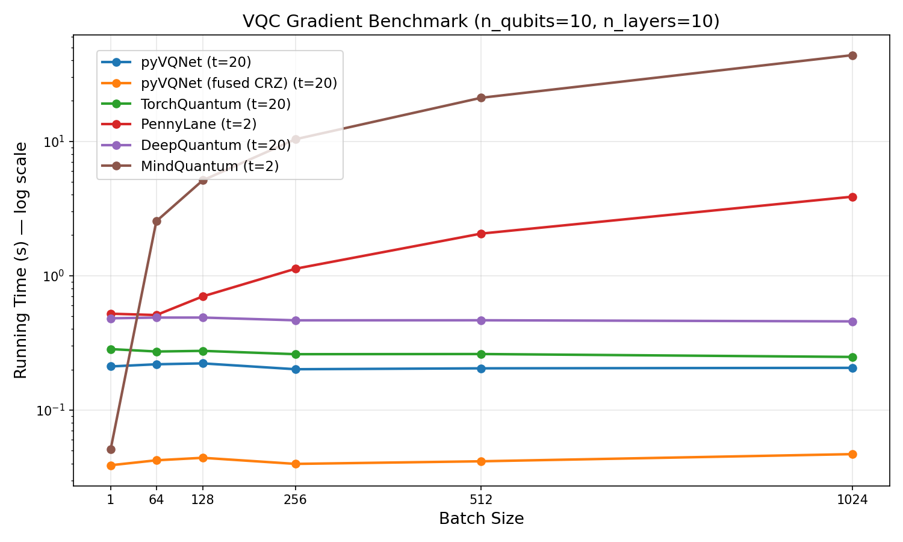

.. _vqc_api:

自动微分变分量子电路API
******************************************************************************

VQNet 基于自动微分算子的构建以及一些常用的量子逻辑门、量子电路和测量方法。自动微分可用于计算梯度，代替量子电路的参数平移方法。
我们可以像使用其他`Modules`\ 一样使用VQC算子构建复杂的神经网络。虚拟机的`QMachine`\ 需要在`Module`\ 中定义，并且机器中的`states`\ 需要根据输入的batchsize进行reset_states。详情请参见以下示例。

.. code-block::

    from pyvqnet.nn import Module,Linear,ModuleList
    from pyvqnet.qnn.vqc.qcircuit import VQC_HardwareEfficientAnsatz,RZZ,RZ
    from pyvqnet.qnn.vqc import Probability,QMachine
    from pyvqnet import tensor

    class QM(Module):
        def __init__(self, name=""):
            super().__init__(name)
            self.linearx = Linear(4,2)
            self.ansatz = VQC_HardwareEfficientAnsatz(4, ["rx", "RY", "rz"],
                                        entangle_gate="cnot",
                                        entangle_rules="linear",
                                        depth=2)
            #VQC based RZ on 0 bits
            self.encode1 = RZ(wires=0)
            #VQC based RZ on 1 bit
            self.encode2 = RZ(wires=1)
            #VQC-based probability measurement on 0, 2 bits
            self.measure = Probability(wires=[0,2])
            #Quantum device QMachine, uses 4 bits.
            self.device = QMachine(4)
        def forward(self, x, *args, **kwargs):
            #States must be reset to the same batchsize as the input.
            self.device.reset_states(x.shape[0])
            y = self.linearx(x)
            #Encode the input to the RZ gate. Note that the input must be of shape [batchsize,1]
            self.encode1(params = y[:, [0]],q_machine = self.device,)
            #Encode the input to the RZ gate. Note that the input must be of shape [batchsize,1]
            self.encode2(params = y[:, [1]],q_machine = self.device,)
            self.ansatz(q_machine =self.device)
            return self.measure(q_machine =self.device)

    bz=3
    inputx = tensor.arange(1.0,bz*4+1).reshape([bz,4])
    inputx.requires_grad= True
    #Define like other Modules
    qlayer = QM()
    #Prequel
    y = qlayer(inputx)

    y.backward()
    print(y)

以下示例演示了在GPU上进行变分量子计算（包括数据编码和参数化变分电路）：

.. code-block::

    from pyvqnet.nn import Module,Linear,ModuleList
    from pyvqnet.qnn.vqc.qcircuit import VQC_HardwareEfficientAnsatz,RZZ,RZ,rz,ry,cnot
    from pyvqnet.qnn.vqc import Probability,QMachine
    from pyvqnet import tensor
    from pyvqnet import DEV_GPU
    class QM(Module):
        def __init__(self, name=""):
            super().__init__(name)
            self.linearx = Linear(4,2)
            self.ansatz = VQC_HardwareEfficientAnsatz(4, ["rx", "RY", "rz"],
                                        entangle_gate="cnot",
                                        entangle_rules="linear",
                                        depth=2)
            #VQC based RZ on 0 bits
            self.encode1 = RZ(wires=0)
            #VQC based RZ on 1 bit
            self.encode2 = RZ(wires=1)
            #RZ with trainable parameters has_params = True, trainable = True
            self.vqc = RZ(has_params = True,trainable = True,wires=1)
            #VQC-based probability measurement on 0, 2 bits
            self.measure = Probability(wires=[0,2])
            #Quantum device QMachine, uses 4 bits.
            self.device = QMachine(4)
        def forward(self, x, *args, **kwargs):
            #States must be reset to the same batchsize as the input.
            self.device.reset_states(x.shape[0])
            y = self.linearx(x)
            #Encode the input to the RZ gate. Note that the input must be of shape [batchsize,1]
            self.encode1(params = y[:, 0],q_machine = self.device,)
            #Encode the input to the RZ gate. Note that the input must be of shape [batchsize,1]
            self.encode2(params = y[:, 1],q_machine = self.device,)
            #Variational circuit composed of RZ gates, will be included in training.
            self.vqc(q_machine =self.device)
            self.ansatz(q_machine =self.device)
            return self.measure(q_machine =self.device)

    bz =3
    #create tensor on GPU
    inputx = tensor.arange(1.0,bz*4+1,device=DEV_GPU).reshape([bz,4])
    inputx.requires_grad= True
    #Define like other Modules
    qlayer = QM()
    #move module to GPU
    qlayer = qlayer.to(DEV_GPU)
    #Forward
    y = qlayer(inputx)
    #Backward
    y.backward()
    print(y)

模拟器
=======================================

QMachine
-------------------------------

.. py:class:: pyvqnet.qnn.vqc.QMachine(num_wires, dtype=pyvqnet.kcomplex64)

    一个用于变分量子计算的模拟器类，包含状态向量，其states属性为量子电路的状态。

    :param num_wires: 量子比特数量。
    :param dtype: 计算数据的数据类型，默认为 pyvqnet.kcomplex64，对应参数精度为 pyvqnet.kfloat32。

    :return: 输出 QMachine。

    Example::
        
        from pyvqnet.qnn.vqc import QMachine
        qm  = QMachine(4)

        print(qm.states)

        # [[[[[1.+0.j 0.+0.j]
        #     [0.+0.j 0.+0.j]]

        #    [[0.+0.j 0.+0.j]
        #     [0.+0.j 0.+0.j]]]

        #   [[[0.+0.j 0.+0.j]
        #     [0.+0.j 0.+0.j]]

        #    [[0.+0.j 0.+0.j]
        #     [0.+0.j 0.+0.j]]]]]

    .. py:method:: reset_states(batchsize)
    
        重新初始化模拟器中的初始状态，并将其广播到
        (batchsize,[2]**num_qubits) 维度，以适应批量数据训练。

        :param batchsize: 批量处理大小。

量子门与量子门操作
=============================================

i
-------------------------------

.. py:function:: pyvqnet.qnn.vqc.i(q_machine, wires, params=None,  use_dagger=False)

    将量子逻辑门I应用于``q_machine``\ 中的状态向量。

    :param q_machine: 量子虚拟机设备。
    :param wires: 量子比特索引。
    :param params: 参数矩阵，默认为None，对于具有p个参数的逻辑门操作函数，输入参数的维度需为[1,p]或[p]。
    :param use_dagger: 是否进行共轭转置，默认为False。

    Example::
        
        from pyvqnet.qnn.vqc import i,QMachine
        qm  = QMachine(4)
        i(q_machine=qm, wires=1)
        print(qm.states)
        # [[[[[1.+0.j 0.+0.j]
        #     [0.+0.j 0.+0.j]]

        #    [[0.+0.j 0.+0.j]
        #     [0.+0.j 0.+0.j]]]

        #   [[[0.+0.j 0.+0.j]
        #     [0.+0.j 0.+0.j]]

        #    [[0.+0.j 0.+0.j]
        #     [0.+0.j 0.+0.j]]]]]

I
---------------------------------------------------------------

.. py:class:: pyvqnet.qnn.vqc.I(has_params: bool = False,trainable: bool = False,init_params=None,wires=None,dtype=pyvqnet.kcomplex64,use_dagger=False)
    
    定义一个I逻辑门类。

    :param has_params: 是否有参数，如RX、RY等门需设为True，无参数门需设为False，默认为False。
    :param trainable: 是否包含待训练参数。如果该层使用外部输入数据构建逻辑门矩阵，则设为False；如果包含待训练参数，则为True，默认为False。
    :param init_params: 初始化参数，用于编码经典数据QTensor，默认为None，如果是具有p个参数的含参逻辑门，输入数据维度需为[1,p]或[p]。
    :param wires: 量子比特作用的线索引，默认为None。
    :param dtype: 逻辑门内部矩阵的数据精度，可设为 pyvqnet.kcomplex64 或 pyvqnet.kcomplex128，分别对应float输入或double输入参数。
    :param use_dagger: 是否使用该门的转置共轭版本，默认为False。
    :return: 可用于训练模型的Module。

    Example::
    
        from pyvqnet.qnn.vqc import I,QMachine
        device = QMachine(4)
        layer = I(wires=0)
        batchsize=1
        device.reset_states(1)
        layer(q_machine = device)
        print(device.states)

hadamard
---------------------------------------------------------------

.. py:function:: pyvqnet.qnn.vqc.hadamard(q_machine, wires, params=None,  use_dagger=False)
    
    将量子逻辑门hadamard应用于``q_machine``\ 中的状态向量。

    :param q_machine: 量子虚拟机设备。
    :param wires: 量子比特索引。
    :param params: 参数矩阵，默认为None，对于具有p个参数的逻辑门操作函数，输入参数的维度需为[1,p]或[p]。
    :param use_dagger: 是否进行共轭转置，默认为False。

    Example::
        
        from pyvqnet.qnn.vqc import hadamard,QMachine
        qm  = QMachine(4)
        hadamard(q_machine=qm, wires=1)
        print(qm.states)
        # [[[[[0.7071068+0.j 0.       +0.j]
        #     [0.       +0.j 0.       +0.j]]
        # 
        #    [[0.7071068+0.j 0.       +0.j]
        #     [0.       +0.j 0.       +0.j]]]
        # 
        # 
        #   [[[0.       +0.j 0.       +0.j]
        #     [0.       +0.j 0.       +0.j]]
        # 
        #    [[0.       +0.j 0.       +0.j]
        #     [0.       +0.j 0.       +0.j]]]]]

Hadamard
---------------------------------------------------------------

.. py:class:: pyvqnet.qnn.vqc.Hadamard(has_params: bool = False,trainable: bool = False,init_params=None,wires=None,dtype=pyvqnet.kcomplex64,use_dagger=False)
    
    定义一个Hadamard逻辑门类。

    :param has_params: 是否有参数，如RX、RY等门需设为True，无参数门需设为False，默认为False。
    :param trainable: 是否包含待训练参数。如果该层使用外部输入数据构建逻辑门矩阵，则设为False；如果包含待训练参数，则为True，默认为False。
    :param init_params: 初始化参数，用于编码经典数据QTensor，默认为None，如果是具有p个参数的含参逻辑门，输入数据维度需为[1,p]或[p]。
    :param wires: 量子比特作用的线索引，默认为None。
    :param dtype: 逻辑门内部矩阵的数据精度，可设为 pyvqnet.kcomplex64 或 pyvqnet.kcomplex128，分别对应float输入或double输入参数。
    :param use_dagger: 是否使用该门的转置共轭版本，默认为False。
    :return: 可用于训练模型的Module。

    Example::
    
        from pyvqnet.qnn.vqc import Hadamard,QMachine
        device = QMachine(4)
        layer = Hadamard(wires=0)
        batchsize=1
        device.reset_states(1)
        layer(q_machine = device)
        print(device.states)

t
----------------

.. py:function:: pyvqnet.qnn.vqc.t(q_machine, wires, params=None,  use_dagger=False)
    
    将量子逻辑门t应用于``q_machine``\ 中的状态向量。

    :param q_machine: 量子虚拟机设备。
    :param wires: 量子比特索引。
    :param params: 参数矩阵，默认为None，对于具有p个参数的逻辑门操作函数，输入参数的维度需为[1,p]或[p]。
    :param use_dagger: 是否进行共轭转置，默认为False。

    Example::
        
        from pyvqnet.qnn.vqc import t,QMachine
        qm  = QMachine(4)
        t(q_machine=qm, wires=1)
        print(qm.states)
        # [[[[[1.+0.j 0.+0.j]
        #     [0.+0.j 0.+0.j]]
        # 
        #    [[0.+0.j 0.+0.j]
        #     [0.+0.j 0.+0.j]]]
        # 
        # 
        #   [[[0.+0.j 0.+0.j]
        #     [0.+0.j 0.+0.j]]
        # 
        #    [[0.+0.j 0.+0.j]
        #     [0.+0.j 0.+0.j]]]]]

T
---------------------------------------------------------------

.. py:class:: pyvqnet.qnn.vqc.T(has_params: bool = False,trainable: bool = False,init_params=None,wires=None,dtype=pyvqnet.kcomplex64,use_dagger=False)
    
    定义一个T逻辑门类。

    :param has_params: 是否有参数，如RX、RY等门需设为True，无参数门需设为False，默认为False。
    :param trainable: 是否包含待训练参数。如果该层使用外部输入数据构建逻辑门矩阵，则设为False；如果包含待训练参数，则为True，默认为False。
    :param init_params: 初始化参数，用于编码经典数据QTensor，默认为None，如果是具有p个参数的含参逻辑门，输入数据维度需为[1,p]或[p]。
    :param wires: 量子比特作用的线索引，默认为None。
    :param dtype: 逻辑门内部矩阵的数据精度，可设为 pyvqnet.kcomplex64 或 pyvqnet.kcomplex128，分别对应float输入或double输入参数。
    :param use_dagger: 是否使用该门的转置共轭版本，默认为False。
    :return: 可用于训练模型的Module。

    Example::
    
        from pyvqnet.qnn.vqc import T,QMachine
        device = QMachine(4)
        layer = T(wires=0)
        batchsize=1
        device.reset_states(1)
        layer(q_machine = device)
        print(device.states)

s
------

.. py:function:: pyvqnet.qnn.vqc.s(q_machine, wires, params=None,  use_dagger=False)
    
    将量子逻辑门s应用于``q_machine``\ 中的状态向量。

    :param q_machine: 量子虚拟机设备。
    :param wires: 量子比特索引。
    :param params: 参数矩阵，默认为None，对于具有p个参数的逻辑门操作函数，输入参数的维度需为[1,p]或[p]。
    :param use_dagger: 是否进行共轭转置，默认为False。

    Example::
        
        from pyvqnet.qnn.vqc import s,QMachine
        qm  = QMachine(4)
        s(q_machine=qm, wires=1)
        print(qm.states)
        # [[[[[1.+0.j 0.+0.j]       
        #     [0.+0.j 0.+0.j]]
        # 
        #    [[0.+0.j 0.+0.j]
        #     [0.+0.j 0.+0.j]]]
        # 
        # 
        #   [[[0.+0.j 0.+0.j]
        #     [0.+0.j 0.+0.j]]
        # 
        #    [[0.+0.j 0.+0.j]
        #     [0.+0.j 0.+0.j]]]]]

S
--------------------------------------------------------------

.. py:class:: pyvqnet.qnn.vqc.S(has_params: bool = False,trainable: bool = False,init_params=None,wires=None,dtype=pyvqnet.kcomplex64,use_dagger=False)
    
    定义一个S逻辑门类。

    :param has_params: 是否有参数，如RX、RY等门需设为True，无参数门需设为False，默认为False。
    :param trainable: 是否包含待训练参数。如果该层使用外部输入数据构建逻辑门矩阵，则设为False；如果包含待训练参数，则为True，默认为False。
    :param init_params: 初始化参数，用于编码经典数据QTensor，默认为None，如果是具有p个参数的含参逻辑门，输入数据维度需为[1,p]或[p]。
    :param wires: 量子比特作用的线索引，默认为None。
    :param dtype: 逻辑门内部矩阵的数据精度，可设为 pyvqnet.kcomplex64 或 pyvqnet.kcomplex128，分别对应float输入或double输入参数。
    :param use_dagger: 是否使用该门的转置共轭版本，默认为False。
    :return: 可用于训练模型的Module。

    Example::
    
        from pyvqnet.qnn.vqc import S,QMachine
        device = QMachine(4)
        layer = S(wires=0)
        batchsize=1
        device.reset_states(1)
        layer(q_machine = device)
        print(device.states)

paulix
---------------

.. py:function:: pyvqnet.qnn.vqc.paulix(q_machine, wires, params=None,  use_dagger=False)
    
    将量子逻辑门paulix应用于``q_machine``\ 中的状态向量。

    :param q_machine: 量子虚拟机设备。
    :param wires: 量子比特索引。
    :param params: 参数矩阵，默认为None，对于具有p个参数的逻辑门操作函数，输入参数的维度需为[1,p]或[p]。
    :param use_dagger: 是否进行共轭转置，默认为False。

    Example::
        
        from pyvqnet.qnn.vqc import paulix,QMachine
        qm  = QMachine(4)
        paulix(q_machine=qm, wires=1)
        print(qm.states)
        # [[[[[0.+0.j 0.+0.j]
        #     [0.+0.j 0.+0.j]]
        # 
        #    [[1.+0.j 0.+0.j]
        #     [0.+0.j 0.+0.j]]]
        # 
        # 
        #   [[[0.+0.j 0.+0.j]
        #     [0.+0.j 0.+0.j]]
        # 
        #    [[0.+0.j 0.+0.j]
        #     [0.+0.j 0.+0.j]]]]]

PauliX
---------------------------------------------------------------

.. py:class:: pyvqnet.qnn.vqc.PauliX(has_params: bool = False,trainable: bool = False,init_params=None,wires=None,dtype=pyvqnet.kcomplex64,use_dagger=False)
    
    定义一个PauliX逻辑门类。

    :param has_params: 是否有参数，如RX、RY等门需设为True，无参数门需设为False，默认为False。
    :param trainable: 是否包含待训练参数。如果该层使用外部输入数据构建逻辑门矩阵，则设为False；如果包含待训练参数，则为True，默认为False。
    :param init_params: 初始化参数，用于编码经典数据QTensor，默认为None，如果是具有p个参数的含参逻辑门，输入数据维度需为[1,p]或[p]。
    :param wires: 量子比特作用的线索引，默认为None。
    :param dtype: 逻辑门内部矩阵的数据精度，可设为 pyvqnet.kcomplex64 或 pyvqnet.kcomplex128，分别对应float输入或double输入参数。
    :param use_dagger: 是否使用该门的转置共轭版本，默认为False。
    :return: 可用于训练模型的Module。

    Example::
    
        from pyvqnet.qnn.vqc import PauliX,QMachine
        device = QMachine(4)
        layer = PauliX(wires=0)
        batchsize=1
        device.reset_states(1)
        layer(q_machine = device)
        print(device.states)

pauliy
----------------

.. py:function:: pyvqnet.qnn.vqc.pauliy(q_machine, wires, params=None,  use_dagger=False)
    
    将量子逻辑门pauliy应用于``q_machine``\ 中的状态向量。

    :param q_machine: 量子虚拟机设备。
    :param wires: 量子比特索引。
    :param params: 参数矩阵，默认为None，对于具有p个参数的逻辑门操作函数，输入参数的维度需为[1,p]或[p]。
    :param use_dagger: 是否进行共轭转置，默认为False。

    Example::
        
        from pyvqnet.qnn.vqc import pauliy,QMachine
        qm  = QMachine(4)
        pauliy(q_machine=qm, wires=1)
        print(qm.states)
        # [[[[[0.+0.j 0.+0.j]
        #     [0.+0.j 0.+0.j]]
        # 
        #    [[0.+1.j 0.+0.j]
        #     [0.+0.j 0.+0.j]]]
        # 
        # 
        #   [[[0.+0.j 0.+0.j]
        #     [0.+0.j 0.+0.j]]
        # 
        #    [[0.+0.j 0.+0.j]
        #     [0.+0.j 0.+0.j]]]]]

PauliY
---------------------------------------------------------------

.. py:class:: pyvqnet.qnn.vqc.PauliY(has_params: bool = False,trainable: bool = False,init_params=None,wires=None,dtype=pyvqnet.kcomplex64,use_dagger=False)
    
    定义一个PauliY逻辑门类。

    :param has_params: 是否有参数，如RX、RY等门需设为True，无参数门需设为False，默认为False。
    :param trainable: 是否包含待训练参数。如果该层使用外部输入数据构建逻辑门矩阵，则设为False；如果包含待训练参数，则为True，默认为False。
    :param init_params: 初始化参数，用于编码经典数据QTensor，默认为None，如果是具有p个参数的含参逻辑门，输入数据维度需为[1,p]或[p]。
    :param wires: 量子比特作用的线索引，默认为None。
    :param dtype: 逻辑门内部矩阵的数据精度，可设为 pyvqnet.kcomplex64 或 pyvqnet.kcomplex128，分别对应float输入或double输入参数。
    :param use_dagger: 是否使用该门的转置共轭版本，默认为False。
    :return: 可用于训练模型的Module。

    Example::
    
        from pyvqnet.qnn.vqc import PauliY,QMachine
        device = QMachine(4)
        layer = PauliY(wires=0)
        batchsize=1
        device.reset_states(1)
        layer(q_machine = device)
        print(device.states)

pauliz
-----------------

.. py:function:: pyvqnet.qnn.vqc.pauliz(q_machine, wires, params=None,  use_dagger=False)
    
    将量子逻辑门pauliz应用于``q_machine``\ 中的状态向量。

    :param q_machine: 量子虚拟机设备。
    :param wires: 量子比特索引。
    :param params: 参数矩阵，默认为None，对于具有p个参数的逻辑门操作函数，输入参数的维度需为[1,p]或[p]。
    :param use_dagger: 是否进行共轭转置，默认为False。

    Example::
        
        from pyvqnet.qnn.vqc import pauliz,QMachine
        qm  = QMachine(4)
        pauliz(q_machine=qm, wires=1)
        print(qm.states)
        # [[[[[1.+0.j 0.+0.j]
        #     [0.+0.j 0.+0.j]]
        # 
        #    [[0.+0.j 0.+0.j]
        #     [0.+0.j 0.+0.j]]]
        # 
        # 
        #   [[[0.+0.j 0.+0.j]
        #     [0.+0.j 0.+0.j]]
        # 
        #    [[0.+0.j 0.+0.j]
        #     [0.+0.j 0.+0.j]]]]]

PauliZ
---------------------------------------------------------------

.. py:class:: pyvqnet.qnn.vqc.PauliZ(has_params: bool = False,trainable: bool = False,init_params=None,wires=None,dtype=pyvqnet.kcomplex64,use_dagger=False)
    
    定义一个PauliZ逻辑门类。

    :param has_params: 是否有参数，如RX、RY等门需设为True，无参数门需设为False，默认为False。
    :param trainable: 是否包含待训练参数。如果该层使用外部输入数据构建逻辑门矩阵，则设为False；如果包含待训练参数，则为True，默认为False。
    :param init_params: 初始化参数，用于编码经典数据QTensor，默认为None，如果是具有p个参数的含参逻辑门，输入数据维度需为[1,p]或[p]。
    :param wires: 量子比特作用的线索引，默认为None。
    :param dtype: 逻辑门内部矩阵的数据精度，可设为 pyvqnet.kcomplex64 或 pyvqnet.kcomplex128，分别对应float输入或double输入参数。
    :param use_dagger: 是否使用该门的转置共轭版本，默认为False。
    :return: 可用于训练模型的Module。

    Example::
    
        from pyvqnet.qnn.vqc import PauliZ,QMachine
        device = QMachine(4)
        layer = PauliZ(wires=0)
        batchsize=1
        device.reset_states(1)
        layer(q_machine = device)
        print(device.states)

x1
--------

.. py:function:: pyvqnet.qnn.vqc.x1(q_machine, wires, params=None,  use_dagger=False)
    
    将量子逻辑门x1应用于``q_machine``\ 中的状态向量。

    :param q_machine: 量子虚拟机设备。
    :param wires: 量子比特索引。
    :param params: 参数矩阵，默认为None，对于具有p个参数的逻辑门操作函数，输入参数的维度需为[1,p]或[p]。
    :param use_dagger: 是否进行共轭转置，默认为False。

    Example::
        
        from pyvqnet.qnn.vqc import x1,QMachine
        qm  = QMachine(4)
        x1(q_machine=qm, wires=1)
        print(qm.states)
        # [[[[[0.7071068+0.j        0.       +0.j       ]
        #     [0.       +0.j        0.       +0.j       ]]
        # 
        #    [[0.       -0.7071068j 0.       +0.j       ]
        #     [0.       +0.j        0.       +0.j       ]]]
        # 
        # 
        #   [[[0.       +0.j        0.       +0.j       ]
        #     [0.       +0.j        0.       +0.j       ]]
        # 
        #    [[0.       +0.j        0.       +0.j       ]
        #     [0.       +0.j        0.       +0.j       ]]]]]

X1
---------------------------------------------------------------

.. py:class:: pyvqnet.qnn.vqc.X1(has_params: bool = False,trainable: bool = False,init_params=None,wires=None,dtype=pyvqnet.kcomplex64,use_dagger=False)
    
    定义一个X1逻辑门类。

    :param has_params: 是否有参数，如RX、RY等门需设为True，无参数门需设为False，默认为False。
    :param trainable: 是否包含待训练参数。如果该层使用外部输入数据构建逻辑门矩阵，则设为False；如果包含待训练参数，则为True，默认为False。
    :param init_params: 初始化参数，用于编码经典数据QTensor，默认为None，如果是具有p个参数的含参逻辑门，输入数据维度需为[1,p]或[p]。
    :param wires: 量子比特作用的线索引，默认为None。
    :param dtype: 逻辑门内部矩阵的数据精度，可设为 pyvqnet.kcomplex64 或 pyvqnet.kcomplex128，分别对应float输入或double输入参数。
    :param use_dagger: 是否使用该门的转置共轭版本，默认为False。
    :return: 可用于训练模型的Module。

    Example::
    
        from pyvqnet.qnn.vqc import X1,QMachine
        device = QMachine(4)
        layer = X1(wires=0)
        batchsize=1
        device.reset_states(1)
        layer(q_machine = device)
        print(device.states)

y1
-----------------

.. py:function:: pyvqnet.qnn.vqc.y1(q_machine, wires, params=None,  use_dagger=False)
    
    将量子逻辑门y1应用于``q_machine``\ 中的状态向量。

    :param q_machine: 量子虚拟机设备。
    :param wires: 量子比特索引。
    :param params: 参数矩阵，默认为None，对于具有p个参数的逻辑门操作函数，输入参数的维度需为[1,p]或[p]。
    :param use_dagger: 是否进行共轭转置，默认为False。

    Example::
        
        from pyvqnet.qnn.vqc import y1,QMachine
        qm  = QMachine(4)
        y1(q_machine=qm, wires=1)
        print(qm.states)
        # [[[[[0.7071068+0.j 0.       +0.j]
        #     [0.       +0.j 0.       +0.j]]
        # 
        #    [[0.7071068+0.j 0.       +0.j]
        #     [0.       +0.j 0.       +0.j]]]
        # 
        # 
        #   [[[0.       +0.j 0.       +0.j]
        #     [0.       +0.j 0.       +0.j]]
        # 
        #    [[0.       +0.j 0.       +0.j]
        #     [0.       +0.j 0.       +0.j]]]]]

Y1
---------------------------------------------------------------

.. py:class:: pyvqnet.qnn.vqc.Y1(has_params: bool = False,trainable: bool = False,init_params=None,wires=None,dtype=pyvqnet.kcomplex64,use_dagger=False)
    
    定义一个Y1逻辑门类。

    :param has_params: 是否有参数，如RX、RY等门需设为True，无参数门需设为False，默认为False。
    :param trainable: 是否包含待训练参数。如果该层使用外部输入数据构建逻辑门矩阵，则设为False；如果包含待训练参数，则为True，默认为False。
    :param init_params: 初始化参数，用于编码经典数据QTensor，默认为None，如果是具有p个参数的含参逻辑门，输入数据维度需为[1,p]或[p]。
    :param wires: 量子比特作用的线索引，默认为None。
    :param dtype: 逻辑门内部矩阵的数据精度，可设为 pyvqnet.kcomplex64 或 pyvqnet.kcomplex128，分别对应float输入或double输入参数。
    :param use_dagger: 是否使用该门的转置共轭版本，默认为False。
    :return: 可用于训练模型的Module。

    Example::
    
        from pyvqnet.qnn.vqc import Y1,QMachine
        device = QMachine(4)
        layer = Y1(wires=0)
        batchsize=1
        device.reset_states(1)
        layer(q_machine = device)
        print(device.states)

z1
---------------------------

.. py:function:: pyvqnet.qnn.vqc.z1(q_machine, wires, params=None,  use_dagger=False)
    
    将量子逻辑门z1应用于``q_machine``\ 中的状态向量。

    :param q_machine: 量子虚拟机设备。
    :param wires: 量子比特索引。
    :param params: 参数矩阵，默认为None，对于具有p个参数的逻辑门操作函数，输入参数的维度需为[1,p]或[p]。
    :param use_dagger: 是否进行共轭转置，默认为False。

    Example::
        
        from pyvqnet.qnn.vqc import z1,QMachine
        qm  = QMachine(4)
        z1(q_machine=qm, wires=1)
        print(qm.states)
        # [[[[[0.7071068-0.7071068j 0.       +0.j       ]
        #     [0.       +0.j        0.       +0.j       ]]
        # 
        #    [[0.       +0.j        0.       +0.j       ]
        #     [0.       +0.j        0.       +0.j       ]]]
        # 
        # 
        #   [[[0.       +0.j        0.       +0.j       ]
        #     [0.       +0.j        0.       +0.j       ]]
        # 
        #    [[0.       +0.j        0.       +0.j       ]
        #     [0.       +0.j        0.       +0.j       ]]]]]

Z1
---------------------------------------------------------------

.. py:class:: pyvqnet.qnn.vqc.Z1(has_params: bool = False,trainable: bool = False,init_params=None,wires=None,dtype=pyvqnet.kcomplex64,use_dagger=False)
    
    定义一个Z1逻辑门类。

    :param has_params: 是否有参数，如RX、RY等门需设为True，无参数门需设为False，默认为False。
    :param trainable: 是否包含待训练参数。如果该层使用外部输入数据构建逻辑门矩阵，则设为False；如果包含待训练参数，则为True，默认为False。
    :param init_params: 初始化参数，用于编码经典数据QTensor，默认为None，如果是具有p个参数的含参逻辑门，输入数据维度需为[1,p]或[p]。
    :param wires: 量子比特作用的线索引，默认为None。
    :param dtype: 逻辑门内部矩阵的数据精度，可设为 pyvqnet.kcomplex64 或 pyvqnet.kcomplex128，分别对应float输入或double输入参数。
    :param use_dagger: 是否使用该门的转置共轭版本，默认为False。
    :return: 可用于训练模型的Module。

    Example::
    
        from pyvqnet.qnn.vqc import Z1,QMachine
        device = QMachine(4)
        layer = Z1(wires=0)
        batchsize=1
        device.reset_states(1)
        layer(q_machine = device)
        print(device.states)

rx
----

.. py:function:: pyvqnet.qnn.vqc.rx(q_machine, wires, params=None,  use_dagger=False)
    
    将量子逻辑门rx应用于``q_machine``\ 中的状态向量。

    :param q_machine: 量子虚拟机设备。
    :param wires: 量子比特索引。
    :param params: 参数矩阵，默认为None，对于具有p个参数的逻辑门操作函数，输入参数的维度需为[1,p]或[p]。
    :param use_dagger: 是否进行共轭转置，默认为False。

    Example::
        
        from pyvqnet.qnn.vqc import rx,QMachine
        from pyvqnet.tensor import QTensor
        qm  = QMachine(4)
        rx(q_machine=qm, wires=1,params=QTensor([0.5]))
        print(qm.states)
        # [[[[[0.9689124+0.j       0.       +0.j      ]
        #     [0.       +0.j       0.       +0.j      ]]
        # 
        #    [[0.       -0.247404j 0.       +0.j      ]
        #     [0.       +0.j       0.       +0.j      ]]]
        # 
        # 
        #   [[[0.       +0.j       0.       +0.j      ]
        #     [0.       +0.j       0.       +0.j      ]]
        # 
        #    [[0.       +0.j       0.       +0.j      ]
        #     [0.       +0.j       0.       +0.j      ]]]]]

RX
---------------------------------------------------------------

.. py:class:: pyvqnet.qnn.vqc.RX(has_params: bool = False,trainable: bool = False,init_params=None,wires=None,dtype=pyvqnet.kcomplex64,use_dagger=False)
    
    定义一个RX逻辑门类。

    :param has_params: 是否有参数，如RX、RY等门需设为True，无参数门需设为False，默认为False。
    :param trainable: 是否包含待训练参数。如果该层使用外部输入数据构建逻辑门矩阵，则设为False；如果包含待训练参数，则为True，默认为False。
    :param init_params: 初始化参数，用于编码经典数据QTensor，默认为None，如果是具有p个参数的含参逻辑门，输入数据维度需为[1,p]或[p]。
    :param wires: 量子比特作用的线索引，默认为None。
    :param dtype: 逻辑门内部矩阵的数据精度，可设为 pyvqnet.kcomplex64 或 pyvqnet.kcomplex128，分别对应float输入或double输入参数。
    :param use_dagger: 是否使用该门的转置共轭版本，默认为False。
    :return: 可用于训练模型的Module。

    Example::

        from pyvqnet.qnn.vqc import RX,QMachine
        device = QMachine(4)
        layer = RX(has_params= True, trainable= True, wires=0)
        batchsize = 2
        device.reset_states(batchsize)
        layer(q_machine = device)
        print(device.states)

ry
------------

.. py:function:: pyvqnet.qnn.vqc.ry(q_machine, wires, params=None,  use_dagger=False)
    
    将量子逻辑门ry应用于``q_machine``\ 中的状态向量。

    :param q_machine: 量子虚拟机设备。
    :param wires: 量子比特索引。
    :param params: 参数矩阵，默认为None，对于具有p个参数的逻辑门操作函数，输入参数的维度需为[1,p]或[p]。
    :param use_dagger: 是否进行共轭转置，默认为False。

    Example::
        
        from pyvqnet.qnn.vqc import ry,QMachine
        from pyvqnet.tensor import QTensor
        qm  = QMachine(4)
        ry(q_machine=qm, wires=1,params=QTensor([0.5]))
        print(qm.states)
        # [[[[[0.9689124+0.j 0.       +0.j]
        #     [0.       +0.j 0.       +0.j]]
        # 
        #    [[0.247404 +0.j 0.       +0.j]
        #     [0.       +0.j 0.       +0.j]]]
        # 
        # 
        #   [[[0.       +0.j 0.       +0.j]
        #     [0.       +0.j 0.       +0.j]]
        # 
        #    [[0.       +0.j 0.       +0.j]
        #     [0.       +0.j 0.       +0.j]]]]]

RY
---------------------------------------------------------------

.. py:class:: pyvqnet.qnn.vqc.RY(has_params: bool = False,trainable: bool = False,init_params=None,wires=None,dtype=pyvqnet.kcomplex64,use_dagger=False)
    
    定义一个RY逻辑门类。

    :param has_params: 是否有参数，如RX、RY等门需设为True，无参数门需设为False，默认为False。
    :param trainable: 是否包含待训练参数。如果该层使用外部输入数据构建逻辑门矩阵，则设为False；如果包含待训练参数，则为True，默认为False。
    :param init_params: 初始化参数，用于编码经典数据QTensor，默认为None，如果是具有p个参数的含参逻辑门，输入数据维度需为[1,p]或[p]。
    :param wires: 量子比特作用的线索引，默认为None。
    :param dtype: 逻辑门内部矩阵的数据精度，可设为 pyvqnet.kcomplex64 或 pyvqnet.kcomplex128，分别对应float输入或double输入参数。
    :param use_dagger: 是否使用该门的转置共轭版本，默认为False。
    :return: 可用于训练模型的Module。

    Example::

        from pyvqnet.qnn.vqc import RY,QMachine
        device = QMachine(4)
        layer = RY(has_params= True, trainable= True, wires=0)
        batchsize = 2
        device.reset_states(batchsize)
        layer(q_machine = device)
        print(device.states)

rz
-----

.. py:function:: pyvqnet.qnn.vqc.rz(q_machine, wires, params=None,  use_dagger=False)
    
    将量子逻辑门rz应用于``q_machine``\ 中的状态向量。

    :param q_machine: 量子虚拟机设备。
    :param wires: 量子比特索引。
    :param params: 参数矩阵，默认为None，对于具有p个参数的逻辑门操作函数，输入参数的维度需为[1,p]或[p]。
    :param use_dagger: 是否进行共轭转置，默认为False。

    Example::
        
        from pyvqnet.qnn.vqc import rz,QMachine
        from pyvqnet.tensor import QTensor
        qm  = QMachine(4)
        rz(q_machine=qm, wires=1,params=QTensor([0.5]))
        print(qm.states)
        # [[[[[0.9689124-0.247404j 0.       +0.j      ]
        #     [0.       +0.j       0.       +0.j      ]]
        # 
        #    [[0.       +0.j       0.       +0.j      ]
        #     [0.       +0.j       0.       +0.j      ]]]
        # 
        # 
        #   [[[0.       +0.j       0.       +0.j      ]
        #     [0.       +0.j       0.       +0.j      ]]
        # 
        #    [[0.       +0.j       0.       +0.j      ]
        #     [0.       +0.j       0.       +0.j      ]]]]]

RZ
---------------------------------------------------------------

.. py:class:: pyvqnet.qnn.vqc.RZ(has_params: bool = False,trainable: bool = False,init_params=None,wires=None,dtype=pyvqnet.kcomplex64,use_dagger=False)
    
    定义一个RZ逻辑门类。

    :param has_params: 是否有参数，如RX、RY等门需设为True，无参数门需设为False，默认为False。
    :param trainable: 是否包含待训练参数。如果该层使用外部输入数据构建逻辑门矩阵，则设为False；如果包含待训练参数，则为True，默认为False。
    :param init_params: 初始化参数，用于编码经典数据QTensor，默认为None，如果是具有p个参数的含参逻辑门，输入数据维度需为[1,p]或[p]。
    :param wires: 量子比特作用的线索引，默认为None。
    :param dtype: 逻辑门内部矩阵的数据精度，可设为 pyvqnet.kcomplex64 或 pyvqnet.kcomplex128，分别对应float输入或double输入参数。
    :param use_dagger: 是否使用该门的转置共轭版本，默认为False。
    :return: 可用于训练模型的Module。

    Example::

        from pyvqnet.qnn.vqc import RZ,QMachine
        device = QMachine(4)
        layer = RZ(has_params= True, trainable= True, wires=0)
        batchsize = 2
        device.reset_states(batchsize)
        layer(q_machine = device)
        print(device.states)

crx
-------------

.. py:function:: pyvqnet.qnn.vqc.crx(q_machine, wires, params=None,  use_dagger=False)
    
    将量子逻辑门crx应用于``q_machine``\ 中的状态向量。

    :param q_machine: 量子虚拟机设备。
    :param wires: 量子比特索引。
    :param params: 参数矩阵，默认为None，对于具有p个参数的逻辑门操作函数，输入参数的维度需为[1,p]或[p]。
    :param use_dagger: 是否进行共轭转置，默认为False。

    Example::

        from pyvqnet.qnn.vqc import QMachine
        import pyvqnet.qnn.vqc as vqc
        from pyvqnet.tensor import QTensor
        qm = QMachine(4)
        vqc.crx(q_machine=qm,wires=[0,2], params=QTensor([0.5]))
        print(qm.states)

        # [[[[[1.+0.j 0.+0.j]
        #     [0.+0.j 0.+0.j]]
        # 
        #    [[0.+0.j 0.+0.j]
        #     [0.+0.j 0.+0.j]]]
        # 
        # 
        #   [[[0.+0.j 0.+0.j]
        #     [0.+0.j 0.+0.j]]
        # 
        #    [[0.+0.j 0.+0.j]
        #     [0.+0.j 0.+0.j]]]]]

CRX
---------------------------------------------------------------

.. py:class:: pyvqnet.qnn.vqc.CRX(has_params: bool = False,trainable: bool = False,init_params=None,wires=None,dtype=pyvqnet.kcomplex64,use_dagger=False)
    
     定义一个CRX逻辑门类。

    :param has_params: 是否有参数，如RX、RY等门需设为True，无参数门需设为False，默认为False。
    :param trainable: 是否包含待训练参数。如果该层使用外部输入数据构建逻辑门矩阵，则设为False；如果包含待训练参数，则为True，默认为False。
    :param init_params: 初始化参数，用于编码经典数据QTensor，默认为None，如果是具有p个参数的含参逻辑门，输入数据维度需为[1,p]或[p]。
    :param wires: 量子比特作用的线索引，默认为None。
    :param dtype: 逻辑门内部矩阵的数据精度，可设为 pyvqnet.kcomplex64 或 pyvqnet.kcomplex128，分别对应float输入或double输入参数。
    :param use_dagger: 是否使用该门的转置共轭版本，默认为False。
    :return: 可用于训练模型的Module。

    Example::

        from pyvqnet.qnn.vqc import CRX,QMachine
        device = QMachine(4)
        layer = CRX(has_params= True, trainable= True, wires=[0,2])
        batchsize = 2
        device.reset_states(batchsize)
        layer(q_machine = device)
        print(device.states)

cry
-----------------

.. py:function:: pyvqnet.qnn.vqc.cry(q_machine, wires, params=None,  use_dagger=False)
    
    将量子逻辑门cry应用于``q_machine``\ 中的状态向量。

    :param q_machine: 量子虚拟机设备。
    :param wires: 量子比特索引。
    :param params: 参数矩阵，默认为None，对于具有p个参数的逻辑门操作函数，输入参数的维度需为[1,p]或[p]。
    :param use_dagger: 是否进行共轭转置，默认为False。

    Example::

        from pyvqnet.qnn.vqc import QMachine
        import pyvqnet.qnn.vqc as vqc
        from pyvqnet.tensor import QTensor
        qm = QMachine(4)
        vqc.cry(q_machine=qm,wires=[0,2], params=QTensor([0.5]))
        print(qm.states)

        # [[[[[1.+0.j 0.+0.j]
        #     [0.+0.j 0.+0.j]]
        # 
        #    [[0.+0.j 0.+0.j]
        #     [0.+0.j 0.+0.j]]]
        # 
        # 
        #   [[[0.+0.j 0.+0.j]
        #     [0.+0.j 0.+0.j]]
        # 
        #    [[0.+0.j 0.+0.j]
        #     [0.+0.j 0.+0.j]]]]]

CRY
---------------------------------------------------------------

.. py:class:: pyvqnet.qnn.vqc.CRY(has_params: bool = False,trainable: bool = False,init_params=None,wires=None,dtype=pyvqnet.kcomplex64,use_dagger=False)
    
     定义一个CRY逻辑门类。

    :param has_params: 是否有参数，如RX、RY等门需设为True，无参数门需设为False，默认为False。
    :param trainable: 是否包含待训练参数。如果该层使用外部输入数据构建逻辑门矩阵，则设为False；如果包含待训练参数，则为True，默认为False。
    :param init_params: 初始化参数，用于编码经典数据QTensor，默认为None，如果是具有p个参数的含参逻辑门，输入数据维度需为[1,p]或[p]。
    :param wires: 量子比特作用的线索引，默认为None。
    :param dtype: 逻辑门内部矩阵的数据精度，可设为 pyvqnet.kcomplex64 或 pyvqnet.kcomplex128，分别对应float输入或double输入参数。
    :param use_dagger: 是否使用该门的转置共轭版本，默认为False。
    :return: 可用于训练模型的Module。

    Example::

        from pyvqnet.qnn.vqc import CRY,QMachine
        device = QMachine(4)
        layer = CRY(has_params= True, trainable= True, wires=[0,2])
        batchsize = 2
        device.reset_states(batchsize)
        layer(q_machine = device)
        print(device.states)

crz
------------

.. py:function:: pyvqnet.qnn.vqc.crz(q_machine, wires, params=None,  use_dagger=False)
    
    将量子逻辑门crz应用于``q_machine``\ 中的状态向量。

    :param q_machine: 量子虚拟机设备。
    :param wires: 量子比特索引。
    :param params: 参数矩阵，默认为None，对于具有p个参数的逻辑门操作函数，输入参数的维度需为[1,p]或[p]。
    :param use_dagger: 是否进行共轭转置，默认为False。

    Example::

        from pyvqnet.qnn.vqc import QMachine
        import pyvqnet.qnn.vqc as vqc
        from pyvqnet.tensor import QTensor
        qm = QMachine(4)
        vqc.crz(q_machine=qm,wires=[0,2], params=QTensor([0.5]))
        print(qm.states)
        
        # [[[[[1.+0.j 0.+0.j]
        #     [0.+0.j 0.+0.j]]
        # 
        #    [[0.+0.j 0.+0.j]
        #     [0.+0.j 0.+0.j]]]
        # 
        # 
        #   [[[0.+0.j 0.+0.j]
        #     [0.+0.j 0.+0.j]]
        # 
        #    [[0.+0.j 0.+0.j]
        #     [0.+0.j 0.+0.j]]]]]

CRZ
---------------------------------------------------------------

.. py:class:: pyvqnet.qnn.vqc.CRZ(has_params: bool = False,trainable: bool = False,init_params=None,wires=None,dtype=pyvqnet.kcomplex64,use_dagger=False)
    
    定义一个CRZ逻辑门类。

    :param has_params: 是否有参数，如RX、RY等门需设为True，无参数门需设为False，默认为False。
    :param trainable: 是否包含待训练参数。如果该层使用外部输入数据构建逻辑门矩阵，则设为False；如果包含待训练参数，则为True，默认为False。
    :param init_params: 初始化参数，用于编码经典数据QTensor，默认为None，如果是具有p个参数的含参逻辑门，输入数据维度需为[1,p]或[p]。
    :param wires: 量子比特作用的线索引，默认为None。
    :param dtype: 逻辑门内部矩阵的数据精度，可设为 pyvqnet.kcomplex64 或 pyvqnet.kcomplex128，分别对应float输入或double输入参数。
    :param use_dagger: 是否使用该门的转置共轭版本，默认为False。
    :return: 可用于训练模型的Module。

    Example::

        from pyvqnet.qnn.vqc import CRZ,QMachine
        device = QMachine(4)
        layer = CRZ(has_params= True, trainable= True, wires=[0,2])
        batchsize = 2
        device.reset_states(batchsize)
        layer(q_machine = device)
        print(device.states)
 

u1
-------------------------------

.. py:function:: pyvqnet.qnn.vqc.u1(q_machine, wires, params=None,  use_dagger=False)
    
    将量子逻辑门u1应用于``q_machine``\ 中的状态向量。

    :param q_machine: 量子虚拟机设备。
    :param wires: 量子比特索引。
    :param params: 参数矩阵，默认为None，对于具有p个参数的逻辑门操作函数，输入参数的维度需为[1,p]或[p]。
    :param use_dagger: 是否进行共轭转置，默认为False。

    Example::
        
        from pyvqnet.qnn.vqc import u1,QMachine
        from pyvqnet.tensor import QTensor
        qm  = QMachine(4)
        u1(q_machine=qm, wires=1,params=QTensor([24.0]))
        print(qm.states)
        # [[[[1.+0.j 0.+0.j]
        #     [0.+0.j 0.+0.j]]
        # 
        #    [[0.+0.j 0.+0.j]
        #     [0.+0.j 0.+0.j]]]
        # 
        # 
        #   [[[0.+0.j 0.+0.j]
        #     [0.+0.j 0.+0.j]]
        # 
        #    [[0.+0.j 0.+0.j]
        #     [0.+0.j 0.+0.j]]]]]

U1
--------------------------------------

.. py:class:: pyvqnet.qnn.vqc.U1(has_params: bool = False,trainable: bool = False,init_params=None,wires=None,dtype=pyvqnet.kcomplex64,use_dagger=False)
    
    定义一个U1逻辑门类。

    :param has_params: 是否有参数，如RX、RY等门需设为True，无参数门需设为False，默认为False。
    :param trainable: 是否包含待训练参数。如果该层使用外部输入数据构建逻辑门矩阵，则设为False；如果包含待训练参数，则为True，默认为False。
    :param init_params: 初始化参数，用于编码经典数据QTensor，默认为None，如果是具有p个参数的含参逻辑门，输入数据维度需为[1,p]或[p]。
    :param wires: 量子比特作用的线索引，默认为None。
    :param dtype: 逻辑门内部矩阵的数据精度，可设为 pyvqnet.kcomplex64 或 pyvqnet.kcomplex128，分别对应float输入或double输入参数。
    :param use_dagger: 是否使用该门的转置共轭版本，默认为False。
    :return: 可用于训练模型的Module。

    Example::

        from pyvqnet.qnn.vqc import U1,QMachine
        device = QMachine(4)
        layer = U1(has_params= True, trainable= True, wires=0)
        batchsize = 2
        device.reset_states(batchsize)
        layer(q_machine = device)
        print(device.states)

u2
------------------

.. py:function:: pyvqnet.qnn.vqc.u2(q_machine, wires, params=None,  use_dagger=False)
    
    将量子逻辑门u2应用于``q_machine``\ 中的状态向量。

    :param q_machine: 量子虚拟机设备。
    :param wires: 量子比特索引。
    :param params: 参数矩阵，默认为None，对于具有p个参数的逻辑门操作函数，输入参数的维度需为[1,p]或[p]。
    :param use_dagger: 是否进行共轭转置，默认为False。

    Example::
        
        from pyvqnet.qnn.vqc import u2,QMachine
        from pyvqnet.tensor import QTensor
        qm  = QMachine(4)
        u2(q_machine=qm, wires=1,params=QTensor([[24.0,-3]]))
        print(qm.states)
        # [[[[[0.7071068+0.j        0.       +0.j       ]
        #     [0.       +0.j        0.       +0.j       ]]
        # 
        #    [[0.2999398-0.6403406j 0.       +0.j       ]
        #     [0.       +0.j        0.       +0.j       ]]]
        # 
        # 
        #   [[[0.       +0.j        0.       +0.j       ]
        #     [0.       +0.j        0.       +0.j       ]]
        # 
        #    [[0.       +0.j        0.       +0.j       ]
        #     [0.       +0.j        0.       +0.j       ]]]]]

U2
-----------------------------------------------

.. py:class:: pyvqnet.qnn.vqc.U2(has_params: bool = False,trainable: bool = False,init_params=None,wires=None,dtype=pyvqnet.kcomplex64,use_dagger=False)
    
    定义一个U2逻辑门类。

    :param has_params: 是否有参数，如RX、RY等门需设为True，无参数门需设为False，默认为False。
    :param trainable: 是否包含待训练参数。如果该层使用外部输入数据构建逻辑门矩阵，则设为False；如果包含待训练参数，则为True，默认为False。
    :param init_params: 初始化参数，用于编码经典数据QTensor，默认为None，如果是具有p个参数的含参逻辑门，输入数据维度需为[1,p]或[p]。
    :param wires: 量子比特作用的线索引，默认为None。
    :param dtype: 逻辑门内部矩阵的数据精度，可设为 pyvqnet.kcomplex64 或 pyvqnet.kcomplex128，分别对应float输入或double输入参数。
    :param use_dagger: 是否使用该门的转置共轭版本，默认为False。
    :return: 可用于训练模型的Module。

    Example::

        from pyvqnet.qnn.vqc import U2,QMachine
        device = QMachine(4)
        layer = U2(has_params= True, trainable= True, wires=0)
        batchsize = 2
        device.reset_states(batchsize)
        layer(q_machine = device)
        print(device.states)

u3
------

.. py:function:: pyvqnet.qnn.vqc.u3(q_machine, wires, params=None,  use_dagger=False)
    
    将量子逻辑门u3应用于``q_machine``\ 中的状态向量。

    :param q_machine: 量子虚拟机设备。
    :param wires: 量子比特索引。
    :param params: 参数矩阵，默认为None，对于具有p个参数的逻辑门操作函数，输入参数的维度需为[1,p]或[p]。
    :param use_dagger: 是否进行共轭转置，默认为False。

    Example::
        
        from pyvqnet.qnn.vqc import u3,QMachine
        from pyvqnet.tensor import QTensor
        qm  = QMachine(4)
        u3(q_machine=qm, wires=1,params=QTensor([[24.0,-3,1]]))
        print(qm.states)
        # [[[[[0.843854 +0.j        0.       +0.j       ]
        #     [0.       +0.j        0.       +0.j       ]]
        # 
        #    [[0.5312032+0.0757212j 0.       +0.j       ]
        #     [0.       +0.j        0.       +0.j       ]]]
        # 
        # 
        #   [[[0.       +0.j        0.       +0.j       ]
        #     [0.       +0.j        0.       +0.j       ]]
        # 
        #    [[0.       +0.j        0.       +0.j       ]
        #     [0.       +0.j        0.       +0.j       ]]]]]

U3
-----------------------------------------

.. py:class:: pyvqnet.qnn.vqc.U3(has_params: bool = False,trainable: bool = False,init_params=None,wires=None,dtype=pyvqnet.kcomplex64,use_dagger=False)
    
    定义一个U3逻辑门类。

    :param has_params: 是否有参数，如RX、RY等门需设为True，无参数门需设为False，默认为False。
    :param trainable: 是否包含待训练参数。如果该层使用外部输入数据构建逻辑门矩阵，则设为False；如果包含待训练参数，则为True，默认为False。
    :param init_params: 初始化参数，用于编码经典数据QTensor，默认为None，如果是具有p个参数的含参逻辑门，输入数据维度需为[1,p]或[p]。
    :param wires: 量子比特作用的线索引，默认为None。
    :param dtype: 逻辑门内部矩阵的数据精度，可设为 pyvqnet.kcomplex64 或 pyvqnet.kcomplex128，分别对应float输入或double输入参数。
    :param use_dagger: 是否使用该门的转置共轭版本，默认为False。
    :return: 可用于训练模型的Module。

    Example::

        from pyvqnet.qnn.vqc import U3,QMachine
        device = QMachine(4)
        layer = U3(has_params= True, trainable= True, wires=0)
        batchsize = 2
        device.reset_states(batchsize)
        layer(q_machine = device)
        print(device.states)

cy
---------------------------------------------------------------

.. py:function:: pyvqnet.qnn.vqc.cy(q_machine, wires, params=None, use_dagger=False)

    将量子逻辑门cy应用于``q_machine``\ 中的状态向量。

    :param q_machine: 量子虚拟机设备。
    :param wires: 量子比特索引。
    :param params: 参数矩阵，默认为None。
    :param use_dagger: 是否使用共轭转置，默认为False。

    Example::

        from pyvqnet.qnn.vqc import cy,QMachine
        qm = QMachine(4)
        cy(q_machine=qm,wires=(1,0))
        print(qm.states)
        # [[[[[1.+0.j,0.+0.j],
        #     [0.+0.j,0.+0.j]],
        # 
        #    [[0.+0.j,0.+0.j],
        #     [0.+0.j,0.+0.j]]],
        # 
        # 
        #   [[[0.+0.j,0.+0.j],
        #     [0.+0.j,0.+0.j]],
        # 
        #    [[0.+0.j,0.+0.j],
        #     [0.+0.j,0.+0.j]]]]]

CY
---------------------------------------------------------------

.. py:class:: pyvqnet.qnn.vqc.CY(has_params: bool = False,trainable: bool = False,init_params=None,wires=None,dtype=pyvqnet.kcomplex64,use_dagger=False)

    定义一个CY逻辑门类。

    :param has_params: 是否有参数，如RX、RY等门需设为True，无参数门需设为False，默认为False。
    :param trainable: 是否带有待训练参数。如果该层使用外部输入数据构建逻辑门矩阵，则设为False；如果需要从该层初始化待训练参数，则为True，默认为False。
    :param init_params: 初始化参数，用于编码经典数据QTensor，默认为None，如果是具有p个参数的含参逻辑门，输入数据维度需为[1,p]或[p]。
    :param wires: 量子比特作用的线索引，默认为None。
    :param dtype: 逻辑门内部矩阵的数据精度，可设为 pyvqnet.kcomplex64 或 pyvqnet.kcomplex128，分别对应float输入或double输入参数。
    :param use_dagger: 是否使用该门的转置共轭版本，默认为False。
    :return: 可用于训练模型的Module。

    Example::

            from pyvqnet.qnn.vqc import CY,QMachine
            device = QMachine(4)
            layer = CY(wires=[0,1])
            batchsize = 2
            device.reset_states(batchsize)
            layer(q_machine = device)
            print(device.states)

cnot
-------------------

.. py:function:: pyvqnet.qnn.vqc.cnot(q_machine, wires, params=None,  use_dagger=False)
    
    将量子逻辑门cnot应用于``q_machine``\ 中的状态向量。

    :param q_machine: 量子虚拟机设备。
    :param wires: 量子比特索引。
    :param params: 参数矩阵，默认为None，对于具有p个参数的逻辑门操作函数，输入参数的维度需为[1,p]或[p]。
    :param use_dagger: 是否进行共轭转置，默认为False。

    Example::
        
        from pyvqnet.qnn.vqc import cnot,QMachine
        qm  = QMachine(4)
        cnot(q_machine=qm,wires=[1,0])
        print(qm.states)
        # [[[[[1.+0.j 0.+0.j]
        #     [0.+0.j 0.+0.j]]
        # 
        #    [[0.+0.j 0.+0.j]
        #     [0.+0.j 0.+0.j]]]
        # 
        # 
        #   [[[0.+0.j 0.+0.j]
        #     [0.+0.j 0.+0.j]]
        # 
        #    [[0.+0.j 0.+0.j]
        #     [0.+0.j 0.+0.j]]]]]

CNOT
-------------------------------------------

.. py:class:: pyvqnet.qnn.vqc.CNOT(has_params: bool = False,trainable: bool = False,init_params=None,wires=None,dtype=pyvqnet.kcomplex64,use_dagger=False)
    
    定义一个CNOT逻辑门类。

    :param has_params: 是否有参数，如RX、RY等门需设为True，无参数门需设为False，默认为False。
    :param trainable: 是否包含待训练参数。如果该层使用外部输入数据构建逻辑门矩阵，则设为False；如果包含待训练参数，则为True，默认为False。
    :param init_params: 初始化参数，用于编码经典数据QTensor，默认为None，如果是具有p个参数的含参逻辑门，输入数据维度需为[1,p]或[p]。
    :param wires: 量子比特作用的线索引，默认为None。
    :param dtype: 逻辑门内部矩阵的数据精度，可设为 pyvqnet.kcomplex64 或 pyvqnet.kcomplex128，分别对应float输入或double输入参数。
    :param use_dagger: 是否使用该门的转置共轭版本，默认为False。
    :return: 可用于训练模型的Module。

    Example::

        from pyvqnet.qnn.vqc import CNOT,QMachine
        device = QMachine(4)
        layer = CNOT(wires=[0,1])
        batchsize = 2
        device.reset_states(batchsize)
        layer(q_machine = device)
        print(device.states)

cr
-------------------

.. py:function:: pyvqnet.qnn.vqc.cr(q_machine, wires, params=None,  use_dagger=False)
    
    将量子逻辑门cr应用于``q_machine``\ 中的状态向量。

    :param q_machine: 量子虚拟机设备。
    :param wires: 量子比特索引。
    :param params: 参数矩阵，默认为None，对于具有p个参数的逻辑门操作函数，输入参数的维度需为[1,p]或[p]。
    :param use_dagger: 是否进行共轭转置，默认为False。

    Example::
        
        from pyvqnet.qnn.vqc import cr,QMachine
        from pyvqnet.tensor import QTensor
        qm  = QMachine(4)
        cr(q_machine=qm,wires=[1,0],params=QTensor([0.5]))
        print(qm.states)
        # [[[[[1.+0.j 0.+0.j]
        #     [0.+0.j 0.+0.j]]
        # 
        #    [[0.+0.j 0.+0.j]
        #     [0.+0.j 0.+0.j]]]
        # 
        # 
        #   [[[0.+0.j 0.+0.j]
        #     [0.+0.j 0.+0.j]]
        # 
        #    [[0.+0.j 0.+0.j]
        #     [0.+0.j 0.+0.j]]]]]

CR
---------------------------------------------------------------

.. py:class:: pyvqnet.qnn.vqc.CR(has_params: bool = False,trainable: bool = False,init_params=None,wires=None,dtype=pyvqnet.kcomplex64,use_dagger=False)
    
    定义一个CR逻辑门。

    :param has_params: 是否有参数，如RX、RY等门需设为True，无参数门需设为False，默认为False。
    :param trainable: 是否包含待训练参数。如果该层使用外部输入数据构建逻辑门矩阵，则设为False；如果包含待训练参数，则为True，默认为False。
    :param init_params: 初始化参数，用于编码经典数据QTensor，默认为None，如果是具有p个参数的含参逻辑门，输入数据维度需为[1,p]或[p]。
    :param wires: 量子比特作用的线索引，默认为None。
    :param dtype: 逻辑门内部矩阵的数据精度，可设为 pyvqnet.kcomplex64 或 pyvqnet.kcomplex128，分别对应float输入或double输入参数。
    :param use_dagger: 是否使用该门的转置共轭版本，默认为False。
    :return: 可用于训练模型的Module。

    Example::

        from pyvqnet.qnn.vqc import CR,QMachine
        device = QMachine(4)
        layer = CR(has_params= True, trainable= True, wires=[0,2])
        batchsize = 2
        device.reset_states(batchsize)
        layer(q_machine = device)
        print(device.states)

iswap
---------------

.. py:function:: pyvqnet.qnn.vqc.iswap(q_machine, wires, params=None,  use_dagger=False)
    
    将量子逻辑门iswap应用于``q_machine``\ 中的状态向量。

    :param q_machine: 量子虚拟机设备。
    :param wires: 量子比特索引。
    :param params: 参数矩阵，默认为None，对于具有p个参数的逻辑门操作函数，输入参数的维度需为[1,p]或[p]。
    :param use_dagger: 是否进行共轭转置，默认为False。

    Example::
        
        from pyvqnet.qnn.vqc import iswap,QMachine
        from pyvqnet.tensor import QTensor
        qm  = QMachine(4)
        iswap(q_machine=qm,wires=[1,0] )
        print(qm.states)
        # [[[[[1.+0.j 0.+0.j]
        #     [0.+0.j 0.+0.j]]
        # 
        #    [[0.+0.j 0.+0.j]
        #     [0.+0.j 0.+0.j]]]
        # 
        # 
        #   [[[0.+0.j 0.+0.j]
        #     [0.+0.j 0.+0.j]]
        # 
        #    [[0.+0.j 0.+0.j]
        #     [0.+0.j 0.+0.j]]]]]

iSWAP
---------------------------------------------------------------

.. py:class:: pyvqnet.qnn.vqc.iSWAP(has_params: bool = False,trainable: bool = False,init_params=None,wires=None,dtype=pyvqnet.kcomplex64,use_dagger=False)
    
    定义一个iSWAP逻辑门类。

    :param has_params: 是否有参数，如RX、RY等门需设为True，无参数门需设为False，默认为False。
    :param trainable: 是否包含待训练参数。如果该层使用外部输入数据构建逻辑门矩阵，则设为False；如果包含待训练参数，则为True，默认为False。
    :param init_params: 初始化参数，用于编码经典数据QTensor，默认为None，如果是具有p个参数的含参逻辑门，输入数据维度需为[1,p]或[p]。
    :param wires: 量子比特作用的线索引，默认为None。
    :param dtype: 逻辑门内部矩阵的数据精度，可设为 pyvqnet.kcomplex64 或 pyvqnet.kcomplex128，分别对应float输入或double输入参数。
    :param use_dagger: 是否使用该门的转置共轭版本，默认为False。
    :return: 可用于训练模型的Module。

    Example::

        from pyvqnet.qnn.vqc import iSWAP,QMachine
        device = QMachine(4)
        layer = iSWAP(wires=[0,1])
        batchsize = 2
        device.reset_states(batchsize)
        layer(q_machine = device)
        print(device.states)

swap
-------------------

.. py:function:: pyvqnet.qnn.vqc.swap(q_machine, wires, params=None,  use_dagger=False)
    
    将量子逻辑门swap应用于``q_machine``\ 中的状态向量。

    :param q_machine: 量子虚拟机设备。
    :param wires: 量子比特索引。
    :param params: 参数矩阵，默认为None，对于具有p个参数的逻辑门操作函数，输入参数的维度需为[1,p]或[p]。
    :param use_dagger: 是否进行共轭转置，默认为False。

    Example::
        
        from pyvqnet.qnn.vqc import swap,QMachine
        qm  = QMachine(4)
        swap(q_machine=qm,wires=[1,0])
        print(qm.states)
        # [[[[[1.+0.j 0.+0.j]
        #     [0.+0.j 0.+0.j]]
        # 
        #    [[0.+0.j 0.+0.j]
        #     [0.+0.j 0.+0.j]]]
        # 
        # 
        #   [[[0.+0.j 0.+0.j]
        #     [0.+0.j 0.+0.j]]
        # 
        #    [[0.+0.j 0.+0.j]
        #     [0.+0.j 0.+0.j]]]]]

SWAP
----------------------------------------

.. py:class:: pyvqnet.qnn.vqc.SWAP(has_params: bool = False,trainable: bool = False,init_params=None,wires=None,dtype=pyvqnet.kcomplex64,use_dagger=False)
    
    定义一个SWAP逻辑门类。

    :param has_params: 是否有参数，如RX、RY等门需设为True，无参数门需设为False，默认为False。
    :param trainable: 是否包含待训练参数。如果该层使用外部输入数据构建逻辑门矩阵，则设为False；如果包含待训练参数，则为True，默认为False。
    :param init_params: 初始化参数，用于编码经典数据QTensor，默认为None，如果是具有p个参数的含参逻辑门，输入数据维度需为[1,p]或[p]。
    :param wires: 量子比特作用的线索引，默认为None。
    :param dtype: 逻辑门内部矩阵的数据精度，可设为 pyvqnet.kcomplex64 或 pyvqnet.kcomplex128，分别对应float输入或double输入参数。
    :param use_dagger: 是否使用该门的转置共轭版本，默认为False。
    :return: 可用于训练模型的Module。

    Example::

        from pyvqnet.qnn.vqc import SWAP,QMachine
        device = QMachine(4)
        layer = SWAP(wires=[0,1])
        batchsize = 2
        device.reset_states(batchsize)
        layer(q_machine = device)
        print(device.states)

cswap
---------------------------------------------------------------

.. py:function:: pyvqnet.qnn.vqc.cswap(q_machine, wires, params=None, use_dagger=False)

    将量子逻辑门cswap应用于``q_machine``\ 中的状态向量。

    :param q_machine: 量子虚拟机设备。
    :param wires: 量子比特索引。
    :param params: 参数矩阵，默认为None。
    :param use_dagger: 是否使用共轭转置，默认为False。
    :return: 输出QTensor。

    Example::

        from pyvqnet.qnn.vqc import cswap,QMachine
        qm = QMachine(4)
        cswap(q_machine=qm,wires=[1,0,3],)
        print(qm.states)
        # [[[[[1.+0.j,0.+0.j],
        # [0.+0.j,0.+0.j]],
        # 
        # [[0.+0.j,0.+0.j],
        # [0.+0.j,0.+0.j]]],
        # 
        # 
        # [[[0.+0.j,0.+0.j],
        # [0.+0.j,0.+0.j]],
        # 
        # [[0.+0.j,0.+0.j],
        # [0.+0.j,0.+0.j]]]]]

CSWAP
-------------------------------------------------

.. py:class:: pyvqnet.qnn.vqc.CSWAP(has_params: bool = False, trainable: bool = False, init_params=None, wires=None, dtype=pyvqnet.kcomplex64, use_dagger=False)
    
    定义一个CSWAP逻辑门类。

    .. math:: CSWAP = \begin{bmatrix}
            1 & 0 & 0 & 0 & 0 & 0 & 0 & 0 \\
            0 & 1 & 0 & 0 & 0 & 0 & 0 & 0 \\
            0 & 0 & 1 & 0 & 0 & 0 & 0 & 0 \\
            0 & 0 & 0 & 1 & 0 & 0 & 0 & 0 \\
            0 & 0 & 0 & 0 & 1 & 0 & 0 & 0 \\
            0 & 0 & 0 & 0 & 0 & 0 & 1 & 0 \\
            0 & 0 & 0 & 0 & 0 & 1 & 0 & 0 \\
            0 & 0 & 0 & 0 & 0 & 0 & 0 & 1
        \end{bmatrix}.

    :param has_params: 是否有参数，如RX、RY等门需设为True，无参数门需设为False，默认为False。
    :param trainable: 是否带有待训练参数。如果该层使用外部输入数据构建逻辑门矩阵，则设为False；如果需要从该层初始化待训练参数，则为True，默认为False。
    :param init_params: 初始化参数，用于编码经典数据QTensor，默认为None，如果是具有p个参数的含参逻辑门，输入数据维度需为[1,p]或[p]。
    :param wires: 量子比特作用的线索引，默认为None。
    :param dtype: 逻辑门内部矩阵的数据精度，可设为 pyvqnet.kcomplex64 或 pyvqnet.kcomplex128，分别对应float输入或double输入参数。
    :param use_dagger: 是否使用该门的转置共轭版本，默认为False。
    :return: 可用于训练模型的Module。

    Example::

        from pyvqnet.qnn.vqc import CSWAP,QMachine
        device = QMachine(4)
        layer = CSWAP(wires=[0,1,2])
        batchsize = 2
        device.reset_states(batchsize)
        layer(q_machine = device)
        print(device.states)

        # [[[[[1.+0.j,0.+0.j],
        #     [0.+0.j,0.+0.j]],
        # 
        #    [[0.+0.j,0.+0.j],
        #     [0.+0.j,0.+0.j]]],
        # 
        # 
        #   [[[0.+0.j,0.+0.j],
        #     [0.+0.j,0.+0.j]],
        # 
        #    [[0.+0.j,0.+0.j],
        #     [0.+0.j,0.+0.j]]]],

        #  [[[[1.+0.j,0.+0.j],
        #     [0.+0.j,0.+0.j]],
        # 
        #    [[0.+0.j,0.+0.j],
        #     [0.+0.j,0.+0.j]]],

        #   [[[0.+0.j,0.+0.j],
        #     [0.+0.j,0.+0.j]],
        # 
        #    [[0.+0.j,0.+0.j],
        #     [0.+0.j,0.+0.j]]]]]

cz
-----------

.. py:function:: pyvqnet.qnn.vqc.cz(q_machine, wires, params=None,  use_dagger=False)
    
    将量子逻辑门cz应用于``q_machine``\ 中的状态向量。

    :param q_machine: 量子虚拟机设备。
    :param wires: 量子比特索引。
    :param params: 参数矩阵，默认为None，对于具有p个参数的逻辑门操作函数，输入参数的维度需为[1,p]或[p]。
    :param use_dagger: 是否进行共轭转置，默认为False。

    Example::
        
        from pyvqnet.qnn.vqc import cz,QMachine
        qm  = QMachine(4)
        cz(q_machine=qm,wires=[1,0])
        print(qm.states)
        # [[[[[1.+0.j 0.+0.j]
        #     [0.+0.j 0.+0.j]]
        # 
        #    [[0.+0.j 0.+0.j]
        #     [0.+0.j 0.+0.j]]]
        # 
        # 
        #   [[[0.+0.j 0.+0.j]
        #     [0.+0.j 0.+0.j]]
        # 
        #    [[0.+0.j 0.+0.j]
        #     [0.+0.j 0.+0.j]]]]]

CZ
--------------------------------------------

.. py:class:: pyvqnet.qnn.vqc.CZ(has_params: bool = False,trainable: bool = False,init_params=None,wires=None,dtype=pyvqnet.kcomplex64,use_dagger=False)
    
    定义一个CZ逻辑门类。

    :param has_params: 是否有参数，如RX、RY等门需设为True，无参数门需设为False，默认为False。
    :param trainable: 是否包含待训练参数。如果该层使用外部输入数据构建逻辑门矩阵，则设为False；如果包含待训练参数，则为True，默认为False。
    :param init_params: 初始化参数，用于编码经典数据QTensor，默认为None，如果是具有p个参数的含参逻辑门，输入数据维度需为[1,p]或[p]。
    :param wires: 量子比特作用的线索引，默认为None。
    :param dtype: 逻辑门内部矩阵的数据精度，可设为 pyvqnet.kcomplex64 或 pyvqnet.kcomplex128，分别对应float输入或double输入参数。
    :param use_dagger: 是否使用该门的转置共轭版本，默认为False。
    :return: 可用于训练模型的Module。

    Example::

        from pyvqnet.qnn.vqc import CZ,QMachine
        device = QMachine(4)
        layer = CZ(wires=[0,1])
        batchsize = 2
        device.reset_states(batchsize)
        layer(q_machine = device)
        print(device.states)
        
rxx
----------------

.. py:function:: pyvqnet.qnn.vqc.rxx(q_machine, wires, params=None,  use_dagger=False)
    
    将量子逻辑门rxx应用于``q_machine``\ 中的状态向量。

    :param q_machine: 量子虚拟机设备。
    :param wires: 量子比特索引。
    :param params: 参数矩阵，默认为None，对于具有p个参数的逻辑门操作函数，输入参数的维度需为[1,p]或[p]。
    :param use_dagger: 是否进行共轭转置，默认为False。

    Example::
        
        from pyvqnet.qnn.vqc import rxx,QMachine
        from pyvqnet.tensor import QTensor
        qm  = QMachine(4)
        rxx(q_machine=qm,wires=[1,0],params=QTensor([0.2]))
        print(qm.states)
        # [[[[[0.9950042+0.j        0.       +0.j       ]
        #     [0.       +0.j        0.       +0.j       ]]
        # 
        #    [[0.       +0.j        0.       +0.j       ]
        #     [0.       +0.j        0.       +0.j       ]]]
        # 
        # 
        #   [[[0.       +0.j        0.       +0.j       ]
        #     [0.       +0.j        0.       +0.j       ]]
        # 
        #    [[0.       -0.0998334j 0.       +0.j       ]
        #     [0.       +0.j        0.       +0.j       ]]]]]

RXX
------------------------------------------

.. py:class:: pyvqnet.qnn.vqc.RXX(has_params: bool = False,trainable: bool = False,init_params=None,wires=None,dtype=pyvqnet.kcomplex64,use_dagger=False)
    
    定义一个RXX逻辑门类。

    :param has_params: 是否有参数，如RX、RY等门需设为True，无参数门需设为False，默认为False。
    :param trainable: 是否包含待训练参数。如果该层使用外部输入数据构建逻辑门矩阵，则设为False；如果包含待训练参数，则为True，默认为False。
    :param init_params: 初始化参数，用于编码经典数据QTensor，默认为None，如果是具有p个参数的含参逻辑门，输入数据维度需为[1,p]或[p]。
    :param wires: 量子比特作用的线索引，默认为None。
    :param dtype: 逻辑门内部矩阵的数据精度，可设为 pyvqnet.kcomplex64 或 pyvqnet.kcomplex128，分别对应float输入或double输入参数。
    :param use_dagger: 是否使用该门的转置共轭版本，默认为False。
    :return: 可用于训练模型的Module。

    Example::

        from pyvqnet.qnn.vqc import RXX,QMachine
        device = QMachine(4)
        layer = RXX(has_params= True, trainable= True, wires=[0,2])
        batchsize = 2
        device.reset_states(batchsize)
        layer(q_machine = device)
        print(device.states)

ryy
---------------

.. py:function:: pyvqnet.qnn.vqc.ryy(q_machine, wires, params=None,  use_dagger=False)
    
    将量子逻辑门ryy应用于``q_machine``\ 中的状态向量。

    :param q_machine: 量子虚拟机设备。
    :param wires: 量子比特索引。
    :param params: 参数矩阵，默认为None，对于具有p个参数的逻辑门操作函数，输入参数的维度需为[1,p]或[p]。
    :param use_dagger: 是否进行共轭转置，默认为False。

    Example::
        
        from pyvqnet.qnn.vqc import ryy,QMachine
        from pyvqnet.tensor import QTensor
        qm  = QMachine(4)
        ryy(q_machine=qm,wires=[1,0],params=QTensor([0.2]))
        print(qm.states)
        # [[[[[0.9950042+0.j        0.       +0.j       ]
        #     [0.       +0.j        0.       +0.j       ]]
        # 
        #    [[0.       +0.j        0.       +0.j       ]
        #     [0.       +0.j        0.       +0.j       ]]]
        # 
        # 
        #   [[[0.       +0.j        0.       +0.j       ]
        #     [0.       +0.j        0.       +0.j       ]]
        # 
        #    [[0.       +0.0998334j 0.       +0.j       ]
        #     [0.       +0.j        0.       +0.j       ]]]]]

RYY
------------------------------------------

.. py:class:: pyvqnet.qnn.vqc.RYY(has_params: bool = False,trainable: bool = False,init_params=None,wires=None,dtype=pyvqnet.kcomplex64,use_dagger=False)
    
    定义一个RYY逻辑门类。

    :param has_params: 是否有参数，如RX、RY等门需设为True，无参数门需设为False，默认为False。
    :param trainable: 是否包含待训练参数。如果该层使用外部输入数据构建逻辑门矩阵，则设为False；如果包含待训练参数，则为True，默认为False。
    :param init_params: 初始化参数，用于编码经典数据QTensor，默认为None，如果是具有p个参数的含参逻辑门，输入数据维度需为[1,p]或[p]。
    :param wires: 量子比特作用的线索引，默认为None。
    :param dtype: 逻辑门内部矩阵的数据精度，可设为 pyvqnet.kcomplex64 或 pyvqnet.kcomplex128，分别对应float输入或double输入参数。
    :param use_dagger: 是否使用该门的转置共轭版本，默认为False。
    :return: 可用于训练模型的Module。

    Example::

        from pyvqnet.qnn.vqc import RYY,QMachine
        device = QMachine(4)
        layer = RYY(has_params= True, trainable= True, wires=[0,2])
        batchsize = 2
        device.reset_states(batchsize)
        layer(q_machine = device)
        print(device.states)

rzz
---------------

.. py:function:: pyvqnet.qnn.vqc.rzz(q_machine, wires, params=None,  use_dagger=False)
    
    将量子逻辑门rzz应用于``q_machine``\ 中的状态向量。

    :param q_machine: 量子虚拟机设备。
    :param wires: 量子比特索引。
    :param params: 参数矩阵，默认为None，对于具有p个参数的逻辑门操作函数，输入参数的维度需为[1,p]或[p]。
    :param use_dagger: 是否进行共轭转置，默认为False。

    Example::
        
        from pyvqnet.qnn.vqc import rzz,QMachine
        from pyvqnet.tensor import QTensor
        qm  = QMachine(4)
        rzz(q_machine=qm,wires=[1,0],params=QTensor([0.2]))
        print(qm.states)
        # [[[[[0.9950042-0.0998334j 0.       +0.j       ]
        #     [0.       +0.j        0.       +0.j       ]]
        # 
        #    [[0.       +0.j        0.       +0.j       ]
        #     [0.       +0.j        0.       +0.j       ]]]
        # 
        # 
        #   [[[0.       +0.j        0.       +0.j       ]
        #     [0.       +0.j        0.       +0.j       ]]
        # 
        #    [[0.       +0.j        0.       +0.j       ]
        #     [0.       +0.j        0.       +0.j       ]]]]]

RZZ
------------------------------------------

.. py:class:: pyvqnet.qnn.vqc.RZZ(has_params: bool = False,trainable: bool = False,init_params=None,wires=None,dtype=pyvqnet.kcomplex64,use_dagger=False)
    
    定义一个RZZ逻辑门类。

    :param has_params: 是否有参数，如RX、RY等门需设为True，无参数门需设为False，默认为False。
    :param trainable: 是否包含待训练参数。如果该层使用外部输入数据构建逻辑门矩阵，则设为False；如果包含待训练参数，则为True，默认为False。
    :param init_params: 初始化参数，用于编码经典数据QTensor，默认为None，如果是具有p个参数的含参逻辑门，输入数据维度需为[1,p]或[p]。
    :param wires: 量子比特作用的线索引，默认为None。
    :param dtype: 逻辑门内部矩阵的数据精度，可设为 pyvqnet.kcomplex64 或 pyvqnet.kcomplex128，分别对应float输入或double输入参数。
    :param use_dagger: 是否使用该门的转置共轭版本，默认为False。
    :return: 可用于训练模型的Module。

    Example::

        from pyvqnet.qnn.vqc import RZZ,QMachine
        device = QMachine(4)
        layer = RZZ(has_params= True, trainable= True, wires=[0,2])
        batchsize = 2
        device.reset_states(batchsize)
        layer(q_machine = device)
        print(device.states)

rzx
-------------

.. py:function:: pyvqnet.qnn.vqc.rzx(q_machine, wires, params=None,  use_dagger=False)
    
    将量子逻辑门rzx应用于``q_machine``\ 中的状态向量。

    :param q_machine: 量子虚拟机设备。
    :param wires: 量子比特索引。
    :param params: 参数矩阵，默认为None，对于具有p个参数的逻辑门操作函数，输入参数的维度需为[1,p]或[p]。
    :param use_dagger: 是否进行共轭转置，默认为False。

    Example::
        
        from pyvqnet.qnn.vqc import rzx,QMachine
        from pyvqnet.tensor import QTensor
        qm  = QMachine(4)
        rzx(q_machine=qm,wires=[1,0],params=QTensor([0.2]))
        print(qm.states)
        # [[[[[0.9950042+0.j        0.       +0.j       ]
        #     [0.       +0.j        0.       +0.j       ]]
        # 
        #    [[0.       +0.j        0.       +0.j       ]
        #     [0.       +0.j        0.       +0.j       ]]]
        # 
        # 
        #   [[[0.       -0.0998334j 0.       +0.j       ]
        #     [0.       +0.j        0.       +0.j       ]]
        # 
        #    [[0.       +0.j        0.       +0.j       ]
        #     [0.       +0.j        0.       +0.j       ]]]]]

RZX
------------------------------------------

.. py:class:: pyvqnet.qnn.vqc.RZX(has_params: bool = False,trainable: bool = False,init_params=None,wires=None,dtype=pyvqnet.kcomplex64,use_dagger=False)
    
    定义一个RZX逻辑门类。

    :param has_params: 是否有参数，如RX、RY等门需设为True，无参数门需设为False，默认为False。
    :param trainable: 是否包含待训练参数。如果该层使用外部输入数据构建逻辑门矩阵，则设为False；如果包含待训练参数，则为True，默认为False。
    :param init_params: 初始化参数，用于编码经典数据QTensor，默认为None，如果是具有p个参数的含参逻辑门，输入数据维度需为[1,p]或[p]。
    :param wires: 量子比特作用的线索引，默认为None。
    :param dtype: 逻辑门内部矩阵的数据精度，可设为 pyvqnet.kcomplex64 或 pyvqnet.kcomplex128，分别对应float输入或double输入参数。
    :param use_dagger: 是否使用该门的转置共轭版本，默认为False。
    :return: 可用于训练模型的Module。

    Example::

        from pyvqnet.qnn.vqc import RZX,QMachine
        device = QMachine(4)
        layer = RZX(has_params= True, trainable= True, wires=[0,2])
        batchsize = 2
        device.reset_states(batchsize)
        layer(q_machine = device)
        print(device.states)

toffoli
--------------------------

.. py:function:: pyvqnet.qnn.vqc.toffoli(q_machine, wires, params=None,  use_dagger=False)
    
    将量子逻辑门toffoli应用于``q_machine``\ 中的状态向量。

    :param q_machine: 量子虚拟机设备。
    :param wires: 量子比特索引。
    :param params: 参数矩阵，默认为None，对于具有p个参数的逻辑门操作函数，输入参数的维度需为[1,p]或[p]。
    :param use_dagger: 是否进行共轭转置，默认为False。
    :return: 输出QTensor。

    Example::
        
        from pyvqnet.qnn.vqc import toffoli,QMachine
        qm  = QMachine(4)
        toffoli(q_machine=qm,wires=[0,1,2])
        print(qm.states)
        # [[[[[1.+0.j 0.+0.j]
        #     [0.+0.j 0.+0.j]]
        # 
        #    [[0.+0.j 0.+0.j]
        #     [0.+0.j 0.+0.j]]]
        # 
        # 
        #   [[[0.+0.j 0.+0.j]
        #     [0.+0.j 0.+0.j]]
        # 
        #    [[0.+0.j 0.+0.j]
        #     [0.+0.j 0.+0.j]]]]]

Toffoli
-----------------------------------

.. py:class:: pyvqnet.qnn.vqc.Toffoli(has_params: bool = False,trainable: bool = False,init_params=None,wires=None,dtype=pyvqnet.kcomplex64,use_dagger=False)
    
    定义一个Toffoli逻辑门类。

    :param has_params: 是否有参数，如RX、RY等门需设为True，无参数门需设为False，默认为False。
    :param trainable: 是否包含待训练参数。如果该层使用外部输入数据构建逻辑门矩阵，则设为False；如果包含待训练参数，则为True，默认为False。
    :param init_params: 初始化参数，用于编码经典数据QTensor，默认为None，如果是具有p个参数的含参逻辑门，输入数据维度需为[1,p]或[p]。
    :param wires: 量子比特作用的线索引，默认为None。
    :param dtype: 逻辑门内部矩阵的数据精度，可设为 pyvqnet.kcomplex64 或 pyvqnet.kcomplex128，分别对应float输入或double输入参数。
    :param use_dagger: 是否使用该门的转置共轭版本，默认为False。
    :return: 可用于训练模型的Module。

    Example::

        from pyvqnet.qnn.vqc import Toffoli,QMachine
        device = QMachine(4)
        layer = Toffoli( wires=[0,2,1])
        batchsize = 2
        device.reset_states(batchsize)
        layer(q_machine = device)
        print(device.states)

isingxx
----------------------

.. py:function:: pyvqnet.qnn.vqc.isingxx(q_machine, wires, params=None,  use_dagger=False)
    
    将量子逻辑门isingxx应用于``q_machine``\ 中的状态向量。

    :param q_machine: 量子虚拟机设备。
    :param wires: 量子比特索引。
    :param params: 参数矩阵，默认为None，对于具有p个参数的逻辑门操作函数，输入参数的维度需为[1,p]或[p]。
    :param use_dagger: 是否进行共轭转置，默认为False。
    :return: 输出QTensor。

    Example::
    
        from pyvqnet.qnn.vqc import QMachine
        import pyvqnet.qnn.vqc as vqc
        from pyvqnet.tensor import QTensor
        qm = QMachine(4)
        vqc.isingxx(q_machine=qm,wires=[0,1], params = QTensor([0.5]))
        print(qm.states)

        # [[[[[0.9689124+0.j       0.       +0.j      ]
        #     [0.       +0.j       0.       +0.j      ]]
        # 
        #    [[0.       +0.j       0.       +0.j      ]
        #     [0.       +0.j       0.       +0.j      ]]]
        # 
        # 
        #   [[[0.       +0.j       0.       +0.j      ]
        #     [0.       +0.j       0.       +0.j      ]]
        # 
        #    [[0.       -0.247404j 0.       +0.j      ]
        #     [0.       +0.j       0.       +0.j      ]]]]]

IsingXX
---------------------------------------

.. py:class:: pyvqnet.qnn.vqc.IsingXX(has_params: bool = False,trainable: bool = False,init_params=None,wires=None,dtype=pyvqnet.kcomplex64,use_dagger=False)
    
    定义一个IsingXX逻辑门类。

    :param has_params: 是否有参数，如RX、RY等门需设为True，无参数门需设为False，默认为False。
    :param trainable: 是否包含待训练参数。如果该层使用外部输入数据构建逻辑门矩阵，则设为False；如果包含待训练参数，则为True，默认为False。
    :param init_params: 初始化参数，用于编码经典数据QTensor，默认为None，如果是具有p个参数的含参逻辑门，输入数据维度需为[1,p]或[p]。
    :param wires: 量子比特作用的线索引，默认为None。
    :param dtype: 逻辑门内部矩阵的数据精度，可设为 pyvqnet.kcomplex64 或 pyvqnet.kcomplex128，分别对应float输入或double输入参数。
    :param use_dagger: 是否使用该门的转置共轭版本，默认为False。
    :return: 可用于训练模型的Module。

    Example::

        from pyvqnet.qnn.vqc import IsingXX,QMachine
        device = QMachine(4)
        layer = IsingXX(has_params= True, trainable= True, wires=[0,2])
        batchsize = 2
        device.reset_states(batchsize)
        layer(q_machine = device)
        print(device.states)

isingyy
-------------------

.. py:function:: pyvqnet.qnn.vqc.isingyy(q_machine, wires, params=None,  use_dagger=False)
    
    将量子逻辑门isingyy应用于``q_machine``\ 中的状态向量。

    :param q_machine: 量子虚拟机设备。
    :param wires: 量子比特索引。
    :param params: 参数矩阵，默认为None，对于具有p个参数的逻辑门操作函数，输入参数的维度需为[1,p]或[p]。
    :param use_dagger: 是否进行共轭转置，默认为False。
    :return: 输出QTensor。

    Example::
    
        from pyvqnet.qnn.vqc import QMachine
        import pyvqnet.qnn.vqc as vqc
        from pyvqnet.tensor import QTensor
        qm = QMachine(4)
        vqc.isingyy(q_machine=qm,wires=[0,1], params = QTensor([0.5]))
        print(qm.states)

        # [[[[[0.9689124+0.j       0.       +0.j      ]
        #     [0.       +0.j       0.       +0.j      ]]
        # 
        #    [[0.       +0.j       0.       +0.j      ]
        #     [0.       +0.j       0.       +0.j      ]]]
        # 
        # 
        #   [[[0.       +0.j       0.       +0.j      ]
        #     [0.       +0.j       0.       +0.j      ]]
        # 
        #    [[0.       +0.247404j 0.       +0.j      ]
        #     [0.       +0.j       0.       +0.j      ]]]]]

IsingYY
---------------------------------------

.. py:class:: pyvqnet.qnn.vqc.IsingYY(has_params: bool = False,trainable: bool = False,init_params=None,wires=None,dtype=pyvqnet.kcomplex64,use_dagger=False)
    
    定义一个IsingYY逻辑门类。

    :param has_params: 是否有参数，如RX、RY等门需设为True，无参数门需设为False，默认为False。
    :param trainable: 是否包含待训练参数。如果该层使用外部输入数据构建逻辑门矩阵，则设为False；如果包含待训练参数，则为True，默认为False。
    :param init_params: 初始化参数，用于编码经典数据QTensor，默认为None，如果是具有p个参数的含参逻辑门，输入数据维度需为[1,p]或[p]。
    :param wires: 量子比特作用的线索引，默认为None。
    :param dtype: 逻辑门内部矩阵的数据精度，可设为 pyvqnet.kcomplex64 或 pyvqnet.kcomplex128，分别对应float输入或double输入参数。
    :param use_dagger: 是否使用该门的转置共轭版本，默认为False。
    :return: 可用于训练模型的Module。

    Example::

        from pyvqnet.qnn.vqc import IsingYY,QMachine
        device = QMachine(4)
        layer = IsingYY(has_params= True, trainable= True, wires=[0,2])
        batchsize = 2
        device.reset_states(batchsize)
        layer(q_machine = device)
        print(device.states)

isingzz
---------------------

.. py:function:: pyvqnet.qnn.vqc.isingzz(q_machine, wires, params=None,  use_dagger=False)
    
    将量子逻辑门isingzz应用于``q_machine``\ 中的状态向量。

    :param q_machine: 量子虚拟机设备。
    :param wires: 量子比特索引。
    :param params: 参数矩阵，默认为None，对于具有p个参数的逻辑门操作函数，输入参数的维度需为[1,p]或[p]。
    :param use_dagger: 是否进行共轭转置，默认为False。
    :return: 输出QTensor。

    Example::
    
        from pyvqnet.qnn.vqc import QMachine
        import pyvqnet.qnn.vqc as vqc
        from pyvqnet.tensor import QTensor
        qm = QMachine(4)
        vqc.isingzz(q_machine=qm,wires=[0,1], params = QTensor([0.5]))
        print(qm.states)

        # [[[[[0.9689124-0.247404j 0.       +0.j      ]
        #     [0.       +0.j       0.       +0.j      ]]
        # 
        #    [[0.       +0.j       0.       +0.j      ]
        #     [0.       +0.j       0.       +0.j      ]]]
        # 
        # 
        #   [[[0.       +0.j       0.       +0.j      ]
        #     [0.       +0.j       0.       +0.j      ]]
        # 
        #    [[0.       +0.j       0.       +0.j      ]
        #     [0.       +0.j       0.       +0.j      ]]]]]

IsingZZ
---------------------------------------

.. py:class:: pyvqnet.qnn.vqc.IsingZZ(has_params: bool = False,trainable: bool = False,init_params=None,wires=None,dtype=pyvqnet.kcomplex64,use_dagger=False)
    
    定义一个IsingZZ逻辑门类。

    :param has_params: 是否有参数，如RX、RY等门需设为True，无参数门需设为False，默认为False。
    :param trainable: 是否包含待训练参数。如果该层使用外部输入数据构建逻辑门矩阵，则设为False；如果包含待训练参数，则为True，默认为False。
    :param init_params: 初始化参数，用于编码经典数据QTensor，默认为None，如果是具有p个参数的含参逻辑门，输入数据维度需为[1,p]或[p]。
    :param wires: 量子比特作用的线索引，默认为None。
    :param dtype: 逻辑门内部矩阵的数据精度，可设为 pyvqnet.kcomplex64 或 pyvqnet.kcomplex128，分别对应float输入或double输入参数。
    :param use_dagger: 是否使用该门的转置共轭版本，默认为False。
    :return: 可用于训练模型的Module。

    Example::

        from pyvqnet.qnn.vqc import IsingZZ,QMachine
        device = QMachine(4)
        layer = IsingZZ(has_params= True, trainable= True, wires=[0,2])
        batchsize = 2
        device.reset_states(batchsize)
        layer(q_machine = device)
        print(device.states)

isingxy
---------------------

.. py:function:: pyvqnet.qnn.vqc.isingxy(q_machine, wires, params=None,  use_dagger=False)
    
    将量子逻辑门isingxy应用于``q_machine``\ 中的状态向量。

    :param q_machine: 量子虚拟机设备。
    :param wires: 量子比特索引。
    :param params: 参数矩阵，默认为None，对于具有p个参数的逻辑门操作函数，输入参数的维度需为[1,p]或[p]。
    :param use_dagger: 是否进行共轭转置，默认为False。
    :return: 输出QTensor。

    Example::
    
        from pyvqnet.qnn.vqc import QMachine
        import pyvqnet.qnn.vqc as vqc
        from pyvqnet.tensor import QTensor
        qm = QMachine(4)
        vqc.isingxy(q_machine=qm,wires=[0,1], params = QTensor([0.5]))
        print(qm.states)

        # [[[[[1.+0.j 0.+0.j]
        #     [0.+0.j 0.+0.j]]
        # 
        #    [[0.+0.j 0.+0.j]
        #     [0.+0.j 0.+0.j]]]
        # 
        # 
        #   [[[0.+0.j 0.+0.j]
        #     [0.+0.j 0.+0.j]]
        # 
        #    [[0.+0.j 0.+0.j]
        #     [0.+0.j 0.+0.j]]]]]

IsingXY
---------------------------------------

.. py:class:: pyvqnet.qnn.vqc.IsingXY(has_params: bool = False,trainable: bool = False,init_params=None,wires=None,dtype=pyvqnet.kcomplex64,use_dagger=False)
    
    定义一个IsingXY逻辑门类。

    :param has_params: 是否有参数，如RX、RY等门需设为True，无参数门需设为False，默认为False。
    :param trainable: 是否包含待训练参数。如果该层使用外部输入数据构建逻辑门矩阵，则设为False；如果包含待训练参数，则为True，默认为False。
    :param init_params: 初始化参数，用于编码经典数据QTensor，默认为None，如果是具有p个参数的含参逻辑门，输入数据维度需为[1,p]或[p]。
    :param wires: 量子比特作用的线索引，默认为None。
    :param dtype: 逻辑门内部矩阵的数据精度，可设为 pyvqnet.kcomplex64 或 pyvqnet.kcomplex128，分别对应float输入或double输入参数。
    :param use_dagger: 是否使用该门的转置共轭版本，默认为False。
    :return: 可用于训练模型的Module。

     Example::

         from pyvqnet.qnn.vqc import IsingXY,QMachine
         device = QMachine(4)
         layer = IsingXY(has_params= True, trainable= True, wires=[0,2])
         batchsize = 2
         device.reset_states(batchsize)
         layer(q_machine = device)
         print(device.states)

phaseshift
---------------

.. py:function:: pyvqnet.qnn.vqc.phaseshift(q_machine, wires, params=None,  use_dagger=False)
    
    将量子逻辑门phaseshift应用于``q_machine``\ 中的状态向量。

    :param q_machine: 量子虚拟机设备。
    :param wires: 量子比特索引。
    :param params: 参数矩阵，默认为None，对于具有p个参数的逻辑门操作函数，输入参数的维度需为[1,p]或[p]。
    :param use_dagger: 是否进行共轭转置，默认为False。
    :return: 输出QTensor。

    Example::
    
        from pyvqnet.qnn.vqc import QMachine
        import pyvqnet.qnn.vqc as vqc
        from pyvqnet.tensor import QTensor
        qm = QMachine(4)
        vqc.phaseshift(q_machine=qm,wires=[0], params = QTensor([0.5]))
        print(qm.states)

        # [[[[[1.+0.j 0.+0.j]
        #     [0.+0.j 0.+0.j]]
        # 
        #    [[0.+0.j 0.+0.j]
        #     [0.+0.j 0.+0.j]]]
        # 
        # 
        #   [[[0.+0.j 0.+0.j]
        #     [0.+0.j 0.+0.j]]
        # 
        #    [[0.+0.j 0.+0.j]
        #     [0.+0.j 0.+0.j]]]]]

PhaseShift
-----------------------------------------------

.. py:class:: pyvqnet.qnn.vqc.PhaseShift(has_params: bool = False,trainable: bool = False,init_params=None,wires=None,dtype=pyvqnet.kcomplex64,use_dagger=False)
    
    定义一个PhaseShift逻辑门类。

    :param has_params: 是否有参数，如RX、RY等门需设为True，无参数门需设为False，默认为False。
    :param trainable: 是否包含待训练参数。如果该层使用外部输入数据构建逻辑门矩阵，则设为False；如果包含待训练参数，则为True，默认为False。
    :param init_params: 初始化参数，用于编码经典数据QTensor，默认为None，如果是具有p个参数的含参逻辑门，输入数据维度需为[1,p]或[p]。
    :param wires: 量子比特作用的线索引，默认为None。
    :param dtype: 逻辑门内部矩阵的数据精度，可设为 pyvqnet.kcomplex64 或 pyvqnet.kcomplex128，分别对应float输入或double输入参数。
    :param use_dagger: 是否使用该门的转置共轭版本，默认为False。
    :return: 可用于训练模型的Module。

    Example::

        from pyvqnet.qnn.vqc import PhaseShift,QMachine
        device = QMachine(4)
        layer = PhaseShift(has_params= True, trainable= True, wires=1)
        batchsize = 2
        device.reset_states(batchsize)
        layer(q_machine = device)
        print(device.states)

multirz
--------------------

.. py:function:: pyvqnet.qnn.vqc.multirz(q_machine, wires, params=None,  use_dagger=False)
    
    将量子逻辑门multirz作用于``q_machine``\ 中的状态向量。

    :param q_machine: 量子虚拟机设备。
    :param wires: 量子比特索引。
    :param params: 参数矩阵，默认为None，对于具有p个参数的逻辑门操作函数，输入参数的维度需为[1,p]或[p]。
    :param use_dagger: 是否进行共轭转置，默认为False。
    :return: 输出QTensor。

    Example::
    
        from pyvqnet.qnn.vqc import QMachine
        import pyvqnet.qnn.vqc as vqc
        from pyvqnet.tensor import QTensor
        qm = QMachine(4)
        vqc.multirz(q_machine=qm,wires=[0, 1], params = QTensor([0.5]))
        print(qm.states)

        # [[[[[0.9689124-0.247404j 0.       +0.j      ]
        #     [0.       +0.j       0.       +0.j      ]]
        # 
        #    [[0.       +0.j       0.       +0.j      ]
        #     [0.       +0.j       0.       +0.j      ]]]
        # 
        # 
        #   [[[0.       +0.j       0.       +0.j      ]
        #     [0.       +0.j       0.       +0.j      ]]
        # 
        #    [[0.       +0.j       0.       +0.j      ]
        #     [0.       +0.j       0.       +0.j      ]]]]]

MultiRZ
-------------------------------------------------

.. py:class:: pyvqnet.qnn.vqc.MultiRZ(has_params: bool = False,trainable: bool = False,init_params=None,wires=None,dtype=pyvqnet.kcomplex64,use_dagger=False)
    
    定义一个MultiRZ逻辑门类。

    :param has_params: 是否有参数，如RX、RY等门需设为True，无参数门需设为False，默认为False。
    :param trainable: 是否包含待训练参数。如果该层使用外部输入数据构建逻辑门矩阵，则设为False；如果包含待训练参数，则为True，默认为False。
    :param init_params: 初始化参数，用于编码经典数据QTensor，默认为None，如果是具有p个参数的含参逻辑门，输入数据维度需为[1,p]或[p]。
    :param wires: 量子比特作用的线索引，默认为None。
    :param dtype: 逻辑门内部矩阵的数据精度，可设为 pyvqnet.kcomplex64 或 pyvqnet.kcomplex128，分别对应float输入或double输入参数。
    :param use_dagger: 是否使用该门的转置共轭版本，默认为False。
    :return: 可用于训练模型的Module。

    Example::

        from pyvqnet.qnn.vqc import MultiRZ,QMachine
        device = QMachine(4)
        layer = MultiRZ(has_params= True, trainable= True, wires=[0,2])
        batchsize = 2
        device.reset_states(batchsize)
        layer(q_machine = device)
        print(device.states)

sdg
--------------

.. py:function:: pyvqnet.qnn.vqc.sdg(q_machine, wires, params=None,  use_dagger=False)
    
    将量子逻辑门sdg应用于``q_machine``\ 中的状态向量。

    :param q_machine: 量子虚拟机设备。
    :param wires: 量子比特索引。
    :param params: 参数矩阵，默认为None，对于具有p个参数的逻辑门操作函数，输入参数的维度需为[1,p]或[p]。
    :param use_dagger: 是否进行共轭转置，默认为False。

    Example::
    
        from pyvqnet.qnn.vqc import QMachine
        import pyvqnet.qnn.vqc as vqc
        from pyvqnet.tensor import QTensor
        qm = QMachine(4)
        vqc.sdg(q_machine=qm,wires=[0])
        print(qm.states)

        # [[[[[1.+0.j 0.+0.j]
        #     [0.+0.j 0.+0.j]]
        # 
        #    [[0.+0.j 0.+0.j]
        #     [0.+0.j 0.+0.j]]]
        # 
        # 
        #   [[[0.+0.j 0.+0.j]
        #     [0.+0.j 0.+0.j]]
        # 
        #    [[0.+0.j 0.+0.j]
        #     [0.+0.j 0.+0.j]]]]]

SDG
----------------------------------------

.. py:class:: pyvqnet.qnn.vqc.SDG(has_params: bool = False,trainable: bool = False,init_params=None,wires=None,dtype=pyvqnet.kcomplex64,use_dagger=False)
    
    定义一个SDG逻辑门类。

    :param has_params: 是否有参数，如RX、RY等门需设为True，无参数门需设为False，默认为False。
    :param trainable: 是否包含待训练参数。如果该层使用外部输入数据构建逻辑门矩阵，则设为False；如果包含待训练参数，则为True，默认为False。
    :param init_params: 初始化参数，用于编码经典数据QTensor，默认为None，如果是具有p个参数的含参逻辑门，输入数据维度需为[1,p]或[p]。
    :param wires: 量子比特作用的线索引，默认为None。
    :param dtype: 逻辑门内部矩阵的数据精度，可设为 pyvqnet.kcomplex64 或 pyvqnet.kcomplex128，分别对应float输入或double输入参数。
    :param use_dagger: 是否使用该门的转置共轭版本，默认为False。
    :return: 可用于训练模型的Module。

    Example::
    
        from pyvqnet.qnn.vqc import SDG,QMachine
        device = QMachine(4)
        layer = SDG(wires=0)
        batchsize=1
        device.reset_states(1)
        layer(q_machine = device)
        print(device.states)

tdg
------------------

.. py:function:: pyvqnet.qnn.vqc.tdg(q_machine, wires, params=None,  use_dagger=False)
    
    将量子逻辑门tdg应用于``q_machine``\ 中的状态向量。

    :param q_machine: 量子虚拟机设备。
    :param wires: 量子比特索引。
    :param params: 参数矩阵，默认为None，对于具有p个参数的逻辑门操作函数，输入参数的维度需为[1,p]或[p]。
    :param use_dagger: 是否进行共轭转置，默认为False。

    Example::
    
        from pyvqnet.qnn.vqc import QMachine
        import pyvqnet.qnn.vqc as vqc
        from pyvqnet.tensor import QTensor
        qm = QMachine(4)
        vqc.tdg(q_machine=qm,wires=[0])
        print(qm.states)

        # [[[[[1.+0.j 0.+0.j]
        #     [0.+0.j 0.+0.j]]
        # 
        #    [[0.+0.j 0.+0.j]
        #     [0.+0.j 0.+0.j]]]
        # 
        # 
        #   [[[0.+0.j 0.+0.j]
        #     [0.+0.j 0.+0.j]]
        # 
        #    [[0.+0.j 0.+0.j]
        #     [0.+0.j 0.+0.j]]]]]

TDG
---------------------------------

.. py:class:: pyvqnet.qnn.vqc.TDG(has_params: bool = False,trainable: bool = False,init_params=None,wires=None,dtype=pyvqnet.kcomplex64,use_dagger=False)
    
    定义一个TDG逻辑门类。

    :param has_params: 是否有参数，如RX、RY等门需设为True，无参数门需设为False，默认为False。
    :param trainable: 是否包含待训练参数。如果该层使用外部输入数据构建逻辑门矩阵，则设为False；如果包含待训练参数，则为True，默认为False。
    :param init_params: 初始化参数，用于编码经典数据QTensor，默认为None，如果是具有p个参数的含参逻辑门，输入数据维度需为[1,p]或[p]。
    :param wires: 量子比特作用的线索引，默认为None。
    :param dtype: 逻辑门内部矩阵的数据精度，可设为 pyvqnet.kcomplex64 或 pyvqnet.kcomplex128，分别对应float输入或double输入参数。
    :param use_dagger: 是否使用该门的转置共轭版本，默认为False。
    :return: 可用于训练模型的Module。

    Example::
    
        from pyvqnet.qnn.vqc import TDG,QMachine
        device = QMachine(4)
        layer = TDG(wires=0)
        batchsize=1
        device.reset_states(1)
        layer(q_machine = device)
        print(device.states)

controlledphaseshift
-----------------------------

.. py:function:: pyvqnet.qnn.vqc.controlledphaseshift(q_machine, wires, params=None,  use_dagger=False)
    
    将量子逻辑门controlledphaseshift应用于``q_machine``\ 中的状态向量。

    :param q_machine: 量子虚拟机设备。
    :param wires: 量子比特索引。
    :param params: 参数矩阵，默认为None，对于具有p个参数的逻辑门操作函数，输入参数的维度需为[1,p]或[p]。
    :param use_dagger: 是否进行共轭转置，默认为False。

    Example::
    
        from pyvqnet.qnn.vqc import QMachine
        import pyvqnet.qnn.vqc as vqc
        from pyvqnet.tensor import QTensor
        qm = QMachine(4)
        for i in range(4):
            vqc.hadamard(q_machine=qm, wires=i)
        vqc.controlledphaseshift(q_machine=qm,params=QTensor([0.5]),wires=[0,1])
        print(qm.states)

        # [[[[[0.25     +0.j        0.25     +0.j       ]
        #     [0.25     +0.j        0.25     +0.j       ]]
        # 
        #    [[0.25     +0.j        0.25     +0.j       ]
        #     [0.25     +0.j        0.25     +0.j       ]]]
        # 
        # 
        #   [[[0.25     +0.j        0.25     +0.j       ]
        #     [0.25     +0.j        0.25     +0.j       ]]
        # 
        #    [[0.2193956+0.1198564j 0.2193956+0.1198564j]
        #     [0.2193956+0.1198564j 0.2193956+0.1198564j]]]]]

ControlledPhaseShift
----------------------------------------

.. py:class:: pyvqnet.qnn.vqc.ControlledPhaseShift(has_params: bool = False,trainable: bool = False,init_params=None,wires=None,dtype=pyvqnet.kcomplex64,use_dagger=False)
    
    定义一个ControlledPhaseShift逻辑门类。

    :param has_params: 是否有参数，如RX、RY等门需设为True，无参数门需设为False，默认为False。
    :param trainable: 是否包含待训练参数。如果该层使用外部输入数据构建逻辑门矩阵，则设为False；如果包含待训练参数，则为True，默认为False。
    :param init_params: 初始化参数，用于编码经典数据QTensor，默认为None，如果是具有p个参数的含参逻辑门，输入数据维度需为[1,p]或[p]。
    :param wires: 量子比特作用的线索引，默认为None。
    :param dtype: 逻辑门内部矩阵的数据精度，可设为 pyvqnet.kcomplex64 或 pyvqnet.kcomplex128，分别对应float输入或double输入参数。
    :param use_dagger: 是否使用该门的转置共轭版本，默认为False。
    :return: 可用于训练模型的Module。

    Example::

        from pyvqnet.qnn.vqc import ControlledPhaseShift,QMachine
        device = QMachine(4)
        layer = ControlledPhaseShift(has_params= True, trainable= True, wires=[0,2])
        batchsize = 2
        device.reset_states(batchsize)
        layer(q_machine = device)
        print(device.states)

multicontrolledx
---------------------------------------------------------------

.. py:function:: pyvqnet.qnn.vqc.multicontrolledx(q_machine, wires, params=None, use_dagger=False,control_values=None)
    
    将量子逻辑门multicontrolledx应用于``q_machine``\ 中的状态向量。

    :param q_machine: 量子虚拟机设备。
    :param wires: 量子比特索引。
    :param params: 参数矩阵，默认为None。
    :param use_dagger: 是否使用共轭转置，默认为False。
    :param control_values: 控制值，默认为None，控制比特为1时生效。

    Example::
 

        from pyvqnet.qnn.vqc import QMachine
        import pyvqnet.qnn.vqc as vqc
        from pyvqnet.tensor import QTensor
        qm = QMachine(4)
        for i in range(4):
            vqc.hadamard(q_machine=qm, wires=i)
        vqc.phaseshift(q_machine=qm,wires=[0], params = QTensor([0.5]))
        vqc.phaseshift(q_machine=qm,wires=[1], params = QTensor([2]))
        vqc.phaseshift(q_machine=qm,wires=[3], params = QTensor([3]))
        vqc.multicontrolledx(qm, wires=[0, 1, 3, 2])
        print(qm.states)

        # [[[[[ 0.25     +0.j       ,-0.2474981+0.03528j  ],
        #     [ 0.25     +0.j       ,-0.2474981+0.03528j  ]],
        # 
        #    [[-0.1040367+0.2273243j, 0.0709155-0.239731j ],
        #     [-0.1040367+0.2273243j, 0.0709155-0.239731j ]]],
        # 
        # 
        #   [[[ 0.2193956+0.1198564j,-0.2341141-0.0876958j],
        #     [ 0.2193956+0.1198564j,-0.2341141-0.0876958j]],
        # 
        #    [[-0.2002859+0.149618j , 0.1771674-0.176385j ],
        #     [-0.2002859+0.149618j , 0.1771674-0.176385j ]]]]]

MultiControlledX
---------------------------------------------------------------

.. py:class:: pyvqnet.qnn.vqc.MultiControlledX(has_params: bool = False,trainable: bool = False,init_params=None,wires=None,dtype=pyvqnet.kcomplex64,use_dagger=False,control_values=None)
    
    定义一个MultiControlledX逻辑门类。

    :param has_params: 是否含有参数，如RX、RY等门需设为True，无参数门需设为False，默认为False。
    :param trainable: 是否含有待训练参数。如果该层使用外部输入数据构建逻辑门矩阵，则设为False；如果需要从该层初始化待训练参数，则为True，默认为False。
    :param init_params: 用于编码经典数据QTensor的初始化参数，默认为None。
    :param wires: 量子比特作用的线索引，默认为None。
    :param dtype: 逻辑门内部矩阵的数据精度，可设为 pyvqnet.kcomplex64 或 pyvqnet.kcomplex128，分别对应float输入或double输入。
    :param use_dagger: 是否使用该门的转置共轭版本，默认为False。
    :param control_values: 控制值，默认为None，控制比特为1时生效。

    :return: 可用于训练模型的Module。

    Example::

        from pyvqnet.qnn.vqc import QMachine
        import pyvqnet.qnn.vqc as vqc
        from pyvqnet.tensor import QTensor
        from pyvqnet import kcomplex64

        qm = QMachine(4,dtype=kcomplex64)
        qm.reset_states(2)
        for i in range(4):
            vqc.hadamard(q_machine=qm, wires=i)
        vqc.isingzz(q_machine=qm, params=QTensor([0.25]), wires=[1,0])
        vqc.double_excitation(q_machine=qm, params=QTensor([0.55]), wires=[0,1,2,3])

        mcx = vqc.MultiControlledX( 
                        init_params=None,
                        wires=[2,3,0,1],
                        dtype=kcomplex64,
                        use_dagger=False,control_values=[1,0,0])
        y = mcx(q_machine = qm)
        print(qm.states)
        """
        [[[[[0.2480494-0.0311687j,0.2480494-0.0311687j],
            [0.2480494+0.0311687j,0.1713719-0.0215338j]],

        [[0.2480494+0.0311687j,0.2480494+0.0311687j],
            [0.2480494-0.0311687j,0.2480494+0.0311687j]]],

        [[[0.2480494+0.0311687j,0.2480494+0.0311687j],
            [0.2480494+0.0311687j,0.2480494+0.0311687j]],

        [[0.306086 -0.0384613j,0.2480494-0.0311687j],
            [0.2480494-0.0311687j,0.2480494-0.0311687j]]]],

        [[[[0.2480494-0.0311687j,0.2480494-0.0311687j],
            [0.2480494+0.0311687j,0.1713719-0.0215338j]],

        [[0.2480494+0.0311687j,0.2480494+0.0311687j],
            [0.2480494-0.0311687j,0.2480494+0.0311687j]]],

        [[[0.2480494+0.0311687j,0.2480494+0.0311687j],
            [0.2480494+0.0311687j,0.2480494+0.0311687j]],

        [[0.306086 -0.0384613j,0.2480494-0.0311687j],
            [0.2480494-0.0311687j,0.2480494-0.0311687j]]]]]
        """

single_excitation
-----------------------------

.. py:function:: pyvqnet.qnn.vqc.single_excitation(q_machine, wires, params=None,  use_dagger=False)
    
    将量子逻辑门single_excitation作用于``q_machine``\ 中的状态向量。

    :param q_machine: 量子虚拟机设备。
    :param wires: 量子比特索引。
    :param params: 参数矩阵，默认为None，对于具有p个参数的逻辑门操作函数，输入参数的维度需为[1,p]或[p]。
    :param use_dagger: 是否进行共轭转置，默认为False。

    Example::
    
        from pyvqnet.qnn.vqc import QMachine
        import pyvqnet.qnn.vqc as vqc
        from pyvqnet.tensor import QTensor
        qm = QMachine(4)
        vqc.single_excitation(q_machine=qm, wires=[0, 1],params=QTensor([0.5]))
        print(qm.states)

        # [[[[[1.+0.j 0.+0.j]
        #     [0.+0.j 0.+0.j]]
        # 
        #    [[0.+0.j 0.+0.j]
        #     [0.+0.j 0.+0.j]]]
        # 
        # 
        #   [[[0.+0.j 0.+0.j]
        #     [0.+0.j 0.+0.j]]
        # 
        #    [[0.+0.j 0.+0.j]
        #     [0.+0.j 0.+0.j]]]]]

double_excitation
--------------------------

.. py:function:: pyvqnet.qnn.vqc.double_excitation(q_machine, wires, params=None,  use_dagger=False)
    
    将量子逻辑门double_excitation作用于``q_machine``\ 中的状态向量。

    :param q_machine: 量子虚拟机设备。
    :param wires: 量子比特索引。
    :param params: 参数矩阵，默认为None，对于具有p个参数的逻辑门操作函数，输入参数的维度需为[1,p]或[p]。
    :param use_dagger: 是否进行共轭转置，默认为False。

    Example::
    
        from pyvqnet.qnn.vqc import QMachine
        import pyvqnet.qnn.vqc as vqc
        from pyvqnet.tensor import QTensor
        qm = QMachine(4)
        for i in range(4):
            vqc.hadamard(q_machine=qm, wires=i)
        vqc.isingzz(q_machine=qm, params=QTensor([0.55]), wires=[1,0])
        vqc.double_excitation(q_machine=qm, params=QTensor([0.55]), wires=[0,1,2,3])
        print(qm.states)

        # [[[[[0.2406063-0.0678867j 0.2406063-0.0678867j]
        #     [0.2406063-0.0678867j 0.1662296-0.0469015j]]
        # 
        #    [[0.2406063+0.0678867j 0.2406063+0.0678867j]
        #     [0.2406063+0.0678867j 0.2406063+0.0678867j]]]
        # 
        # 
        #   [[[0.2406063+0.0678867j 0.2406063+0.0678867j]
        #     [0.2406063+0.0678867j 0.2406063+0.0678867j]]
        # 
        #    [[0.2969014-0.0837703j 0.2406063-0.0678867j]
        #     [0.2406063-0.0678867j 0.2406063-0.0678867j]]]]]  

VQC_BasisEmbedding
--------------------------

.. py:function:: pyvqnet.qnn.vqc.VQC_BasisEmbedding(basis_state,q_machine)

    将二进制特征``basis_state``\ 编码为``q_machine``\ 中n个量子比特的基态。

    例如，对于``basis_state=([0, 1, 1])``\ ，量子系统的基态为 :math:`|011 \rangle`\ 。

    :param basis_state: 大小为``(n)``\ 的二进制输入。
    :param q_machine: 量子虚拟机设备。

    Example::
        
        from pyvqnet.qnn.vqc import VQC_BasisEmbedding,QMachine
        qm  = QMachine(3)
        VQC_BasisEmbedding(basis_state=[1,1,0],q_machine=qm)
        print(qm.states)
        # [[[[0.+0.j 0.+0.j]
        #    [0.+0.j 0.+0.j]]
        # 
        #   [[0.+0.j 0.+0.j]
        #    [1.+0.j 0.+0.j]]]]

VQC_AngleEmbedding
--------------------------

.. py:function:: pyvqnet.qnn.vqc.VQC_AngleEmbedding(input_feat, wires, q_machine: pyvqnet.qnn.vqc.QMachine, rotation: str = "X")

    将:math:`N`\ 个特征编码为:math:`n`\ 个量子比特的旋转角度，其中在``q_machine``\ 中:math:`N \leq n`\ 。

    旋转方式可选：'X'、'Y'、'Z'，``rotation``\ 参数定义如下：

    * ``rotation='X'`` 使用特征作为RX旋转角度。

    * ``rotation='Y'`` 使用特征作为RY旋转角度。

    * ``rotation='Z'`` 使用特征作为RZ旋转角度。

     ``wires``\ 表示量子比特上旋转门的索引。

    :param input_feat: 表示参数的数组。
    :param wires: 量子比特索引。
    :param q_machine: 量子虚拟机设备。
    :param rotation: 旋转门，默认为"X"。

    Example::

        from pyvqnet.qnn.vqc import VQC_AngleEmbedding, QMachine
        from pyvqnet.tensor import QTensor
        qm  = QMachine(2)
        VQC_AngleEmbedding(QTensor([2.2, 1]), [0, 1], q_machine=qm, rotation='X')
        print(qm.states)
        # [[[ 0.398068 +0.j         0.       -0.2174655j]
        #   [ 0.       -0.7821081j -0.4272676+0.j       ]]]

        VQC_AngleEmbedding(QTensor([2.2, 1]), [0, 1], q_machine=qm, rotation='Y')

        print(qm.states)
        # [[[-0.0240995+0.6589843j  0.4207355+0.2476033j]
        #   [ 0.4042482-0.2184162j  0.       -0.3401631j]]]

        VQC_AngleEmbedding(QTensor([2.2, 1]), [0, 1], q_machine=qm, rotation='Z')

        print(qm.states)

        # [[[0.659407 +0.0048471j 0.4870554-0.0332093j]
        #   [0.4569675+0.047989j  0.340018 +0.0099326j]]]

VQC_AmplitudeEmbedding
--------------------------

.. py:function:: pyvqnet.qnn.vqc.VQC_AmplitudeEmbeddingCircuit(input_feature, q_machine)

    将一个:math:`2^n`\ 维特征编码为``q_machine``\ 中:math:`n`\ 个量子比特的振幅向量。

    :param input_feature: 表示参数的numpy数组。
    :param q_machine: 量子虚拟机设备。

    Example::

        from pyvqnet.qnn.vqc import VQC_AmplitudeEmbedding, QMachine
        from pyvqnet.tensor import QTensor
        qm  = QMachine(3)
        VQC_AmplitudeEmbedding(QTensor([3.2,-2,-2,0.3,12,0.1,2,-1]), q_machine=qm)
        print(qm.states)

        # [[[[ 0.2473717+0.j -0.1546073+0.j]
        #    [-0.1546073+0.j  0.0231911+0.j]]
        # 
        #   [[ 0.9276441+0.j  0.0077304+0.j]
        #    [ 0.1546073+0.j -0.0773037+0.j]]]]

VQC_IQPEmbedding
--------------------------

.. py:function:: pyvqnet.qnn.vqc.VQC_IQPEmbedding(input_feat, q_machine: pyvqnet.qnn.vqc.QMachine, rep: int = 1)

    使用IQP线路的对角门将:math:`n`\ 个特征编码到``q_machine``\ 的:math:`n`\ 个量子比特中。

    该编码由`Havlicek et al. (2018) <https://arxiv.org/pdf/1804.11326.pdf>`_提出。

    通过指定``rep``\ ，可以重复基本IQP线路。

    :param input_feat: 表示参数的numpy数组。
    :param q_machine: 量子虚拟机设备。
    :param rep: 量子电路块的重复次数，默认为1。

    Example::

        from pyvqnet.qnn.vqc import VQC_IQPEmbedding, QMachine
        from pyvqnet.tensor import QTensor
        qm  = QMachine(3)
        VQC_IQPEmbedding(QTensor([3.2,-2,-2]), q_machine=qm)
        print(qm.states)        
        
        # [[[[ 0.0309356-0.3521973j  0.3256442+0.1376801j]
        #    [ 0.3256442+0.1376801j  0.2983474+0.1897071j]]
        # 
        #   [[ 0.0309356+0.3521973j -0.3170519-0.1564546j]
        #    [-0.3170519-0.1564546j -0.2310978-0.2675701j]]]]

VQC_RotCircuit
--------------------------

.. py:function:: pyvqnet.qnn.vqc.VQC_RotCircuit(q_machine, wire, params)

    在``q_machine``\ 的状态向量上应用任意单量子比特旋转。

    .. math::

        R(\phi,\theta,\omega) = RZ(\omega)RY(\theta)RZ(\phi)= \begin{bmatrix}
        e^{-i(\phi+\omega)/2}\cos(\theta/2) & -e^{i(\phi-\omega)/2}\sin(\theta/2) \\
        e^{-i(\phi-\omega)/2}\sin(\theta/2) & e^{i(\phi+\omega)/2}\cos(\theta/2)
        \end{bmatrix}.

    :param q_machine: 量子虚拟机设备。
    :param wire: 量子比特索引。
    :param params: 参数 :math:`[\phi, \theta, \omega]`\ 。
    :return: 输出QTensor。

    Example::

        from pyvqnet.qnn.vqc import VQC_RotCircuit, QMachine
        from pyvqnet.tensor import QTensor
        qm  = QMachine(3)
        VQC_RotCircuit(q_machine=qm, wire=[1],params=QTensor([2.0,1.5,2.1]))
        print(qm.states)

        # [[[[-0.3373617-0.6492732j  0.       +0.j       ]
        #    [ 0.6807868-0.0340677j  0.       +0.j       ]]
        # 
        #   [[ 0.       +0.j         0.       +0.j       ]
        #    [ 0.       +0.j         0.       +0.j       ]]]]

VQC_CRotCircuit
--------------------------

.. py:function:: pyvqnet.qnn.vqc.VQC_CRotCircuit(para,control_qubits,rot_wire,q_machine)

	受控旋转电路。

    .. math:: CR(\phi, \theta, \omega) = \begin{bmatrix}
            1 & 0 & 0 & 0 \\
            0 & 1 & 0 & 0\\
            0 & 0 & e^{-i(\phi+\omega)/2}\cos(\theta/2) & -e^{i(\phi-\omega)/2}\sin(\theta/2)\\
            0 & 0 & e^{-i(\phi-\omega)/2}\sin(\theta/2) & e^{i(\phi+\omega)/2}\cos(\theta/2)
        \end{bmatrix}.
    
    :param para: 表示参数的numpy数组。
    :param control_qubits: 控制比特索引。
    :param rot_wire: 旋转比特索引。
    :param q_machine: 量子虚拟机设备。
    :return: 输出QTensor。

    Example::

        from pyvqnet.tensor import QTensor
        from pyvqnet.qnn.vqc.qcircuit import VQC_CRotCircuit
        from pyvqnet.qnn.vqc import QMachine, MeasureAll
        p = QTensor([2, 3, 4.0])
        qm = QMachine(2)
        VQC_CRotCircuit(p, 0, 1, qm)
        m = MeasureAll(obs={"Z0": 1})
        exp = m(q_machine=qm)
        print(exp)

        # [[0.9999999]]

VQC_Controlled_Hadamard
--------------------------

.. py:function:: pyvqnet.qnn.vqc.VQC_Controlled_Hadamard(wires, q_machine)

    在``q_machine``\ 中应用受控Hadamard操作。

    .. math:: CH = \begin{bmatrix}
            1 & 0 & 0 & 0 \\
            0 & 1 & 0 & 0 \\
            0 & 0 & \frac{1}{\sqrt{2}} & \frac{1}{\sqrt{2}} \\
            0 & 0 & \frac{1}{\sqrt{2}} & -\frac{1}{\sqrt{2}}
        \end{bmatrix}.

    :param wires: 量子比特索引，第一个为控制比特，列表长度为2。
    :param q_machine: 量子虚拟机设备。

    Examples::

        from pyvqnet.tensor import QTensor
        from pyvqnet.qnn.vqc.qcircuit import VQC_Controlled_Hadamard
        from pyvqnet.qnn.vqc import QMachine, MeasureAll
        p = QTensor([0.2, 3, 4.0])

        qm = QMachine(3)

        VQC_Controlled_Hadamard([1, 0], qm)
        m = MeasureAll(obs={"Z0": 1})
        exp = m(q_machine=qm)
        print(exp)

        # [[1.]]

VQC_CCZ
--------------------------

.. py:function:: pyvqnet.qnn.vqc.VQC_CCZ(wires, q_machine)

    在``q_machine``\ 中应用受控-受控-Z逻辑。

    .. math::

        CCZ =
        \begin{pmatrix}
        1 & 0 & 0 & 0 & 0 & 0 & 0 & 0\\
        0 & 1 & 0 & 0 & 0 & 0 & 0 & 0\\
        0 & 0 & 1 & 0 & 0 & 0 & 0 & 0\\
        0 & 0 & 0 & 1 & 0 & 0 & 0 & 0\\
        0 & 0 & 0 & 0 & 1 & 0 & 0 & 0\\
        0 & 0 & 0 & 0 & 0 & 1 & 0 & 0\\
        0 & 0 & 0 & 0 & 0 & 0 & 1 & 0\\
        0 & 0 & 0 & 0 & 0 & 0 & 0 & -1
        \end{pmatrix}
    
    :param wires: 量子比特下标列表，第一个比特为控制比特，列表长度为3。
    :param q_machine: 量子虚拟机设备。

    :return:
            pyqpanda QCircuit 

    Example::

        from pyvqnet.tensor import QTensor
        from pyvqnet.qnn.vqc.qcircuit import VQC_CCZ
        from pyvqnet.qnn.vqc import QMachine, MeasureAll
        p = QTensor([0.2, 3, 4.0])

        qm = QMachine(3)

        VQC_CCZ([1, 0, 2], qm)
        m = MeasureAll(obs={"Z0": 1})
        exp = m(q_machine=qm)
        print(exp)

        # [[0.9999999]]

VQC_FermionicSingleExcitation
-----------------------------------------

.. py:function:: pyvqnet.qnn.vqc.VQC_FermionicSingleExcitation(weight, wires, q_machine)

    用于指数化泡利矩阵张量积的耦合簇单激发算符。其矩阵形式如下：

    .. math::

        \hat{U}_{pr}(\theta) = \mathrm{exp} \{ \theta_{pr} (\hat{c}_p^\dagger \hat{c}_r
        -\mathrm{H.c.}) \},

    :param weight: 量子比特p上的参数，只有一个元素。
    :param wires: 表示区间[r, p]中的量子比特索引子集。最小长度必须为2。第一个索引值解释为r，最后一个索引值解释为p。
                 中间索引由CNOT门作用，用于计算量子比特集合的奇偶性。
    :param q_machine: 量子虚拟机设备。

    :return:
            pyqpanda QCircuit

    Examples::

        from pyvqnet.tensor import QTensor
        from pyvqnet.qnn.vqc.qcircuit import VQC_FermionicSingleExcitation
        from pyvqnet.qnn.vqc import QMachine, MeasureAll
        qm = QMachine(3)
        p0 = QTensor([0.5])

        VQC_FermionicSingleExcitation(p0, [1, 0, 2], qm)
        m = MeasureAll(obs={"Z0": 1})
        exp = m(q_machine=qm)
        print(exp)

        # [[0.9999998]]

VQC_FermionicDoubleExcitation
-----------------------------------------

.. py:function:: pyvqnet.qnn.vqc.VQC_FermionicDoubleExcitation(weight, wires1, wires2, q_machine)

    用于指数化泡利矩阵张量积的耦合簇双激发算符，其矩阵形式如下：

    .. math::

        \hat{U}_{pqrs}(\theta) = \mathrm{exp} \{ \theta (\hat{c}_p^\dagger \hat{c}_q^\dagger
        \hat{c}_r \hat{c}_s - \mathrm{H.c.}) \},

    其中:math:`\hat{c}`\ 和:math:`\hat{c}^\dagger`\ 是费米子湮灭和产生算符，索引:math:`r, s`\ 和:math:`p, q`\ 分别位于占据和
    空的分子轨道中。使用`Jordan-Wigner变换 <https://arxiv.org/abs/1208.5986>`_，上述定义的费米子算符可以写成
    泡利矩阵的形式（更多细节参见`arXiv:1805.04340 <https://arxiv.org/abs/1805.04340>`_）

    .. math::

        \hat{U}_{pqrs}(\theta) = \mathrm{exp} \Big\{
        \frac{i\theta}{8} \bigotimes_{b=s+1}^{r-1} \hat{Z}_b \bigotimes_{a=q+1}^{p-1}
        \hat{Z}_a (\hat{X}_s \hat{X}_r \hat{Y}_q \hat{X}_p +
        \hat{Y}_s \hat{X}_r \hat{Y}_q \hat{Y}_p +\\ \hat{X}_s \hat{Y}_r \hat{Y}_q \hat{Y}_p +
        \hat{X}_s \hat{X}_r \hat{X}_q \hat{Y}_p - \mathrm{H.c.}  ) \Big\}

    :param weight: 可变参数。
    :param wires1: 表示区间[s, r]中占据量子比特子集的索引列表。第一个索引解释为s，最后一个为r。
     CNOT门作用于中间索引以计算量子比特集合的奇偶性。
    :param wires2: 表示区间[q, p]中占据量子比特子集的索引列表。第一个索引解释为q，最后一个为p。 
     CNOT门作用于中间索引以计算量子比特集合的奇偶性。
    :param q_machine: 量子虚拟机设备。

    :return:
        pyqpanda QCircuit

    Examples::

        from pyvqnet.tensor import QTensor
        from pyvqnet.qnn.vqc.qcircuit import VQC_FermionicDoubleExcitation
        from pyvqnet.qnn.vqc import QMachine, MeasureAll
        qm = QMachine(5)
        p0 = QTensor([0.5])

        VQC_FermionicDoubleExcitation(p0, [0, 1], [2, 3], qm)
        m = MeasureAll(obs={"Z0": 1})
        exp = m(q_machine=qm)
        print(exp)
        
        # [[0.9999998]]

VQC_UCCSD
-----------------------------------------

.. py:function:: pyvqnet.qnn.vqc.VQC_UCCSD(weights, wires, s_wires, d_wires, init_state, q_machine)

    实现酉耦合簇单激发和双激发设计(UCCSD)。UCCSD是提出的VQE设计，常用于运行量子化学模拟。

    在一阶Trotter近似下，UCCSD酉函数如下：

    .. math::

        \hat{U}(\vec{\theta}) =
        \prod_{p > r} \mathrm{exp} \Big\{\theta_{pr}
        (\hat{c}_p^\dagger \hat{c}_r-\mathrm{H.c.}) \Big\}
        \prod_{p > q > r > s} \mathrm{exp} \Big\{\theta_{pqrs}
        (\hat{c}_p^\dagger \hat{c}_q^\dagger \hat{c}_r \hat{c}_s-\mathrm{H.c.}) \Big\}

    其中:math:`\hat{c}`\ 和:math:`\hat{c}^\dagger`\ 是费米子湮灭和
    产生算符，索引:math:`r, s`\ 和:math:`p, q`\ 分别位于占据和
    空的分子轨道中。（更多细节参见`arXiv:1805.04340 <https://arxiv.org/abs/1805.04340>`_）:

    :param weights: 一个``(len(s_wires)+ len(d_wires))``\ 维张量，包含参数
         :math:`\theta_{pr}` 和 :math:`\theta_{pqrs}`\ ，输入到Z旋转
         ``FermionicSingleExcitation`` 和 ``FermionicDoubleExcitation``\ 。
    :param wires: 模板作用的量子比特索引。
    :param s_wires: 包含量子比特索引的列表序列``[r,...,p]``\ ，
         由单激发产生
         :math:`\vert r, p \rangle = \hat{c}_p^\dagger \hat{c}_r \vert \mathrm{HF} \rangle`\ ，
         其中:math:`\vert \mathrm{HF} \rangle`\ 表示Hartree-Fock参考态。
    :param d_wires: 列表的列表序列，每个列表包含两个列表
         指定索引``[s, ...,r]``\ 和``[q,...,p]``
         定义双激发：:math:`\vert s, r, q, p \rangle = \hat{c}_p^\dagger \hat{c}_q^\dagger \hat{c}_r\hat{c}_s \ vert \mathrm{HF} \rangle`\ 。
    :param init_state: 长度为``len(wires)``\ 的占据数向量表示
         高频态。``init_state``\ 是量子比特初始化状态。
    :param q_machine: 量子虚拟机设备。

    Examples::

        from pyvqnet.qnn.vqc import VQC_UCCSD, QMachine, MeasureAll
        from pyvqnet.tensor import QTensor
        p0 = QTensor([2, 0.5, -0.2, 0.3, -2, 1, 3, 0])
        s_wires = [[0, 1, 2], [0, 1, 2, 3, 4], [1, 2, 3], [1, 2, 3, 4, 5]]
        d_wires = [[[0, 1], [2, 3]], [[0, 1], [2, 3, 4, 5]], [[0, 1], [3, 4]],
                [[0, 1], [4, 5]]]
        qm = QMachine(6)

        VQC_UCCSD(p0, range(6), s_wires, d_wires, QTensor([1.0, 1, 0, 0, 0, 0]), qm)
        m = MeasureAll(obs={"Z1": 1})
        exp = m(q_machine=qm)
        print(exp)

        # [[0.963802]]

VQC_ZFeatureMap
-----------------------------------------

.. py:function:: pyvqnet.qnn.vqc.VQC_ZFeatureMap(input_feat, q_machine: pyvqnet.qnn.vqc.QMachine, data_map_func=None, rep: int = 2)

    一阶泡利Z演化电路。

    对于3个量子比特和2次重复，电路表示如下：

    .. parsed-literal::

        ┌───┐┌──────────────┐┌───┐┌──────────────┐
        ┤ H ├┤ U1(2.0*x[0]) ├┤ H ├┤ U1(2.0*x[0]) ├
        ├───┤├──────────────┤├───┤├──────────────┤
        ┤ H ├┤ U1(2.0*x[1]) ├┤ H ├┤ U1(2.0*x[1]) ├
        ├───┤├──────────────┤├───┤├──────────────┤
        ┤ H ├┤ U1(2.0*x[2]) ├┤ H ├┤ U1(2.0*x[2]) ├
        └───┘└──────────────┘└───┘└──────────────┘
    
    泡利字符串固定为``Z``\ 。因此，一阶展开将是不含纠缠门的电路。

    :param input_feat: 表示输入参数的数组。
    :param q_machine: 量子机器。
    :param data_map_func: 参数映射矩阵，设计为``data_map = lambda x: x``\ 。
    :param rep: 模块重复次数。
    
    Example::

        from pyvqnet.qnn.vqc import VQC_ZFeatureMap, QMachine, hadamard
        from pyvqnet.tensor import QTensor
        qm = QMachine(3)
        for i in range(3):
            hadamard(q_machine=qm, wires=[i])
        VQC_ZFeatureMap(input_feat=QTensor([[0.1,0.2,0.3]]),q_machine = qm)
        print(qm.states)
        
        # [[[[0.3535534+0.j        0.2918002+0.1996312j]
        #    [0.3256442+0.1376801j 0.1910257+0.2975049j]]
        # 
        #   [[0.3465058+0.0702402j 0.246323 +0.2536236j]
        #    [0.2918002+0.1996312j 0.1281128+0.3295255j]]]]

VQC_ZZFeatureMap
-----------------------------------------

.. py:function:: pyvqnet.qnn.vqc.VQC_ZZFeatureMap(input_feat, q_machine: pyvqnet.qnn.vqc.QMachine, data_map_func=None, entanglement: Union[str, List[List[int]],Callable[[int], List[int]]] = "full",rep: int = 2)

    二阶泡利Z演化电路。

    对于3个量子比特、1次重复和线性纠缠，电路表示如下：

    .. parsed-literal::

        ┌───┐┌─────────────────┐
        ┤ H ├┤ U1(2.0*φ(x[0])) ├──■────────────────────────────■────────────────────────────────────
        ├───┤├─────────────────┤┌─┴─┐┌──────────────────────┐┌─┴─┐
        ┤ H ├┤ U1(2.0*φ(x[1])) ├┤ X ├┤ U1(2.0*φ(x[0],x[1])) ├┤ X ├──■────────────────────────────■──
        ├───┤├─────────────────┤└───┘└──────────────────────┘└───┘┌─┴─┐┌──────────────────────┐┌─┴─┐
        ┤ H ├┤ U1(2.0*φ(x[2])) ├──────────────────────────────────┤ X ├┤ U1(2.0*φ(x[1],x[2])) ├┤ X ├
        └───┘└─────────────────┘                                  └───┘└──────────────────────┘└───┘
    
    其中``φ``\ 是经典非线性函数，默认为``φ(x) = x``\ ，``φ(x,y) = (pi - x)(pi - y)``\ ，设计如下：
    
    .. code-block::
        
        def data_map_func(x):
            coeff = x if x.shape[-1] == 1 else ft.reduce(lambda x, y: (np.pi - x) * (np.pi - y), x)
            return coeff

    :param input_feat: 表示输入参数的数组。
    :param q_machine: 量子机器。
    :param data_map_func: 参数映射矩阵。
    :param entanglement: 指定的纠缠结构。
    :param rep: 模块重复次数。
    
    Example::

        from pyvqnet.qnn.vqc import VQC_ZZFeatureMap, QMachine
        from pyvqnet.tensor import QTensor
        qm = QMachine(3)
        VQC_ZZFeatureMap(q_machine=qm, input_feat=QTensor([[0.1,0.2,0.3]]))
        print(qm.states)

        # [[[[-0.4234843-0.0480578j -0.144067 +0.1220178j]
        #    [-0.0800646+0.0484439j -0.5512857-0.2947832j]]
        # 
        #   [[ 0.0084012-0.0050071j -0.2593993-0.2717131j]
        #    [-0.1961917-0.3470543j  0.2786197+0.0732045j]]]]

VQC_AllSinglesDoubles
-----------------------------------------

.. py:function:: pyvqnet.qnn.vqc.VQC_AllSinglesDoubles(weights, q_machine: pyvqnet.qnn.vqc.QMachine, hf_state, wires, singles=None, doubles=None)

    在``q_machine``\ 上对初始Hartree-Fock态应用所有``SingleExcitation``\ 和``DoubleExcitation``\ 操作，制备分子关联态。

    :param weights: 大小为``(len(singles) + len(doubles),)``\ 的QTensor，包含按顺序输入到vqc.qCircuit.single_excitation和vqc.qCircuit.double_excitation操作的角度。
    :param q_machine: 量子机器。
    :param hf_state: 表示长度为``len(wires)``\ 的Hartree-Fock态占据数向量，``hf_state``\ 用于初始化量子比特。
    :param wires: 作用的量子比特。
    :param singles: 列表序列，包含single_exitation操作作用的两个量子比特索引。
    :param doubles: 列表序列，包含double_exitation操作作用的两个量子比特索引。

    例如，两个电子和六个量子比特情况下的量子电路如下所示：
    
.. image:: ./images/all_singles_doubles.png
    :width: 600 px
    :align: center

|

    Example::

        from pyvqnet.qnn.vqc import VQC_AllSinglesDoubles, QMachine
        from pyvqnet.tensor import QTensor
        qubits = 4
        qm = QMachine(qubits)

        VQC_AllSinglesDoubles(q_machine=qm, weights=QTensor([0.55, 0.11, 0.53]), 
                              hf_state = QTensor([1,1,0,0]), singles=[[0, 2], [1, 3]], doubles=[[0, 1, 2, 3]], wires=[0,1,2,3])
        print(qm.states)
        
        # [ 0.        +0.j  0.        +0.j  0.        +0.j -0.23728043+0.j
        #   0.        +0.j  0.        +0.j -0.27552837+0.j  0.        +0.j
        #   0.        +0.j -0.12207296+0.j  0.        +0.j  0.        +0.j
        #   0.9235152 +0.j  0.        +0.j  0.        +0.j  0.        +0.j]

VQC_BasisRotation
-----------------------------------------

.. py:function:: pyvqnet.qnn.vqc.VQC_BasisRotation(q_machine: pyvqnet.qnn.vqc.QMachine, wires, unitary_matrix: QTensor, check=False)

    实现一个可用于执行精确整体基旋转的电路。

    :class:`~.vqc.qCircuit.VQC_BasisRotation` 执行由`arXiv:1711.04789 <https://arxiv.org/abs/1711.04789>`_中给出的单粒子费米子确定的酉变换:math:`U(u)`
    
    .. math::

        U(u) = \exp{\left( \sum_{pq} \left[\log u \right]_{pq} (a_p^\dagger a_q - a_q^\dagger a_p) \right)}.
    
    :math:`U(u)` 使用论文`Optica, 3, 1460 (2016) <https://opg.optica.org/optica/fulltext.cfm?uri=optica-3-12-1460&id=355743>`_中给出的方案。
    输入酉矩阵的分解通过一系列:class:`~vqc.qCircuit.phaseshift`\ 和:class:`~vqc.qCircuit.single_exitation`\ 门高效实现。
    

    :param q_machine: 量子机器。
    :param wires: 作用的量子比特。
    :param unitary_matrix: 指定基变换的矩阵。
    :param check: 测试`unitary_matrix`\ 是否为酉矩阵。

    Example::

        from pyvqnet.qnn.vqc import VQC_BasisRotation, QMachine, hadamard, isingzz
        from pyvqnet.tensor import QTensor
        import numpy as np
        V = np.array([[0.73678+0.27511j, -0.5095 +0.10704j, -0.06847+0.32515j],
                      [0.73678+0.27511j, -0.5095 +0.10704j, -0.06847+0.32515j],
                      [-0.21271+0.34938j, -0.38853+0.36497j,  0.61467-0.41317j]])

        eigen_vals, eigen_vecs = np.linalg.eigh(V)
        umat = eigen_vecs.T
        wires = range(len(umat))
        
        qm = QMachine(len(umat))

        for i in range(len(umat)):
            hadamard(q_machine=qm, wires=i)
        isingzz(q_machine=qm, params=QTensor([0.55]), wires=[0,2])
        VQC_BasisRotation(q_machine=qm, wires=wires,unitary_matrix=QTensor(umat,dtype=qm.state.dtype))
        
        print(qm.states)
        
        # [[[[ 0.3402686-0.0960063j  0.4140436-0.3069579j]
        #    [ 0.1206574+0.1982292j  0.5662895-0.0949503j]]
        # 
        #   [[-0.1715559-0.1614315j  0.1624039-0.0598041j]
        #    [ 0.0608986-0.1078906j -0.305845 +0.1773662j]]]]

VQC_QuantumPoolingCircuit
-----------------------------------------

.. py:function:: pyvqnet.qnn.vqc.VQC_QuantumPoolingCircuit(ignored_wires, sinks_wires, params, q_machine)

    一种对数据进行下采样的量子电路。

    为减少电路中的量子比特数，首先在系统中创建量子比特对。在初始配对所有量子比特后，对每对量子比特应用一个广义的2量子比特酉操作。
    在应用双量子比特酉操作后，每对量子比特中的一个量子比特在神经网络的其余部分中被忽略。

    :param sources_wires: 将被忽略的源量子比特索引。
    :param sinks_wires: 保留的目标量子比特索引。
    :param params: 输入参数。
    :param q_machine: 量子虚拟机设备。

    :return:
        pyqpanda QCircuit

    Examples:: 

        from pyvqnet.qnn.vqc import VQC_QuantumPoolingCircuit, QMachine, MeasureAll
        import pyqpanda as pq
        from pyvqnet import tensor
        machine = pq.CPUQVM()
        machine.init_qvm()
        qlists = machine.qAlloc_many(4)
        p = tensor.full([6], 0.35)
        qm = QMachine(4)
        VQC_QuantumPoolingCircuit(q_machine=qm,
                                ignored_wires=[0, 1],
                                sinks_wires=[2, 3],
                                params=p)
        m = MeasureAll(obs={"Z1": 1})
        exp = m(q_machine=qm)
        print(exp)

ExpressiveEntanglingAnsatz
---------------------------------------------------------------

.. py:class:: pyvqnet.qnn.vqc.ExpressiveEntanglingAnsatz(type: int, num_wires: int, depth: int, name: str = "")

    来自论文`Expressibility and entangling capability of parameterized quantum circuits for hybrid quantum-classical algorithms <https://arxiv.org/pdf/1905.10876.pdf>`_的19种不同的ansatz。

    :param type: 电路类型，从1到19，共19种。
    :param num_wires: 量子比特数量。
    :param depth: 电路深度。
    :param name: 名称，默认为""。

    :return:
        一个ExpressiveEntanglingAnsatz实例。

    Example::

        from pyvqnet.qnn.vqc  import *
        import pyvqnet
        pyvqnet.utils.set_random_seed(42)
        from pyvqnet.nn import Module
        class QModel(Module):
            def __init__(self, num_wires, dtype,grad_mode=""):
                super(QModel, self).__init__()

                self._num_wires = num_wires
                self._dtype = dtype
                self.qm = QMachine(num_wires, dtype=dtype,grad_mode=grad_mode,save_ir=True)
                self.c1 = ExpressiveEntanglingAnsatz(13,3,2)
                self.measure = MeasureAll(obs = {
                    "Z1":1
                })

            def forward(self, x, *args, **kwargs):
                self.qm.reset_states(x.shape[0])
                self.c1(q_machine = self.qm)
                rlt = self.measure(q_machine=self.qm)
                return rlt
            

        input_x = tensor.QTensor([[0.1, 0.2, 0.3]])

        input_x.requires_grad = True

        qunatum_model = QModel(num_wires=3, dtype=pyvqnet.kcomplex64)

        batch_y = qunatum_model(input_x)
        z = vqc_to_originir_list(qunatum_model)
        for zi in z:
            print(zi)
        batch_y.backward()
        print(batch_y)

vqc_qft_add_to_register
-------------------------------------

.. py:function:: pyvqnet.qnn.vqc.vqc_qft_add_to_register(q_machine, m, k)

    将无符号整数`m`\ 编码到量子比特中，然后向其加上`k`\ 。

    .. math:: \text{Sum(k)}\vert m \rangle = \vert m + k \rangle.

    该酉操作的实现如下：

    (1). 通过将QFT应用于:math:`\vert m \rangle`\ 态，将状态从计算基转换到傅里叶基。

    (2). 使用:math:`R_Z`\ 门将第:math:`j`\ 个量子比特旋转角度:math:`\frac{2k\pi}{2^{j}}`\ ，得到新相位:math:`\frac{2(m + k)\pi}{2^{j}}`\ 。

    (3). 应用逆QFT回到计算基，得到:math:`m+k`\ 。

    :param q_machine: 模拟的量子机器。
    :param m: 嵌入到寄存器中的经典整数。
    :param k: 要加到寄存器的经典整数。

    :retrun: 返回目标和值的二进制表示。

    .. note::

        请注意，``q_machine``\ 使用的比特数需要足够，以使用X基态编码结果和的二进制值。

    Example::

        import numpy as np
        from pyvqnet.qnn.vqc import QMachine,Samples, vqc_qft_add_to_register
        dev = QMachine(4)
        vqc_qft_add_to_register(dev,3, 7)
        ma = Samples()
        y = ma(q_machine=dev)
        print(y)
        #[[1,0,1,0]]

vqc_qft_add_two_register
-------------------------------------

.. py:function:: vqc_qft_add_two_register(q_machine, m, k, wires_m, wires_k, wires_solution)

    将编码在两个量子比特中的无符号整数相加。

    .. math:: \text{Sum}_2\vert m \rangle \vert k \rangle \vert 0 \rangle = \vert m \rangle \vert k \rangle \vert m+k \rangle

    在这种情况下，我们可以将第三个寄存器（初始时为:math:`0`)理解为一个计数器，它将计算:math:`m`\ 和:math:`k`\ 相加的总单位数。二进制分解将使这变得容易。如果我们有:math:`\vert m \rangle = \vert \overline{q_0q_1q_2} \rangle`\ ，那么如果:math:`q_2 = 1`\ ，我们必须向计数器加:math:`1`\ ，否则不加。一般来说，如果第:math:`i`\ 个量子比特处于:math:`\vert 1 \rangle`\ 态，我们应该加:math:`2^{n-i-1}`\ 个单位，否则加0。

    :param q_machine: 模拟的量子机器。
    :param m: 嵌入到寄存器中作为左操作数的经典整数。
    :param k: 嵌入到寄存器中作为右操作数的经典整数。
    :param wires_m: 编码m的量子比特索引。
    :param wires_k: 编码k的量子比特索引。
    :param wires_solution: 编码解的量子比特索引。

    :retrun: 返回目标和值的二进制表示。

    .. note::

        ``wires_m``\ 使用的比特数需要足够，以使用X基态编码`m`\ 的二进制值。
        ``wires_k``\ 使用足够的比特数，以使用X基态编码`k`\ 的二进制值。
        ``wires_solution``\ 使用足够的比特数，以使用X基态编码结果的二进制值。

    Example::

        import numpy as np
        from pyvqnet.qnn.vqc import QMachine,Samples, vqc_qft_add_two_register

        wires_m = [0, 1, 2]             # 编码m所需的量子比特
        wires_k = [3, 4, 5]             # 编码k所需的量子比特
        wires_solution = [6, 7, 8, 9]   # 编码解所需的量子比特
        dev = QMachine(len(wires_m) + len(wires_k) + len(wires_solution))

        vqc_qft_add_two_register(dev,3, 7, wires_m, wires_k, wires_solution)

        ma = Samples(wires=wires_solution)
        y = ma(q_machine=dev)
        print(y)

vqc_qft_mul

-------------------------------------

.. py:function:: vqc_qft_mul(q_machine, m, k, wires_m, wires_k, wires_solution)

    将编码在两个量子比特中的值相乘。

    .. math:: \text{Mul}\vert m \rangle \vert k \rangle \vert 0 \rangle = \vert m \rangle \vert k \rangle \vert m\cdot k \rangle

    :param q_machine: 模拟的量子机器。
    :param m: 嵌入到寄存器中作为左操作数的经典整数。
    :param k: 嵌入到寄存器中作为右操作数的经典整数。
    :param wires_m: 编码m的量子比特索引。
    :param wires_k: 编码k的量子比特索引。
    :param wires_solution: 编码解的量子比特索引。

    :retrun: 返回目标乘积的二进制表示。

    .. note::

        ``wires_m``\ 需要使用足够的比特数，以使用X基态编码`m`\ 的二进制值。
        ``wires_k``\ 使用足够的比特数，以使用X基态编码`k`\ 的二进制值。
        ``wires_solution``\ 使用足够的比特数，以使用X基态编码结果的二进制值。

    Example::

        import numpy as np
        from pyvqnet.qnn.vqc import QMachine,Samples, vqc_qft_mul
        wires_m = [0, 1, 2]           # 编码m所需的量子比特
        wires_k = [3, 4, 5]           # 编码k所需的量子比特
        wires_solution = [6, 7, 8, 9, 10]  # 编码解所需的量子比特
        
        dev = QMachine(len(wires_m) + len(wires_k) + len(wires_solution))

        vqc_qft_mul(dev,3, 7, wires_m, wires_k, wires_solution)

        ma = Samples(wires=wires_solution)
        y = ma(q_machine=dev)
        print(y)
        #[[1,0,1,0,1]]

VQC_FABLE
--------------------

.. py:class:: pyvqnet.qnn.vqc.VQC_FABLE(wires)

    使用快速近似块编码方法构建基于VQC的QCircuit。对于特定结构的矩阵[`arXiv:2205.00081 <https://arxiv.org/abs/2205.00081>`_]，FABLE方法可以在不损失精度的情况下简化块编码电路。

    :param wires: 算符作用的qlist索引。

    :return: 返回基于VQC的FABLE类实例。

    Examples::

        from pyvqnet.qnn.vqc import VQC_FABLE
        from pyvqnet.qnn.vqc import QMachine
        from pyvqnet.dtype import float_dtype_to_complex_dtype
        import numpy as np
        from pyvqnet import QTensor
        
        A = QTensor(np.array([[0.1, 0.2 ], [0.3, 0.4 ]]) )
        qf = VQC_FABLE(list(range(3)))
        qm = QMachine(3,dtype=float_dtype_to_complex_dtype(A.dtype))
        qm.reset_states(1)
        z1 = qf(qm,A,0.001)
 
        """
        [[[[0.05     +0.j,0.15     +0.j],
        [0.05     +0.j,0.15     +0.j]],

        [[0.4974937+0.j,0.4769696+0.j],
        [0.4974937+0.j,0.4769696+0.j]]]]
        """

VQC_LCU
--------------------

.. py:class:: pyvqnet.qnn.vqc.VQC_LCU(wires)

    使用线性组合单元(LCU)构建基于VQC的QCircuit，`Hamiltonian Simulation via Qubitization <https://arxiv.org/abs/1610.06546>`_。
    输入dtype可以是kfloat32、kfloat64、kcomplex64、kcomplex128。
    输入应为厄米矩阵。

    :param wires: 算符作用的qlist索引，可能需要辅助量子比特。
    :param check_hermitian: 检查输入是否为厄米矩阵，默认为：True。

    Examples::

        from pyvqnet.qnn.vqc import VQC_LCU
        from pyvqnet.qnn.vqc import QMachine
        from pyvqnet.dtype import float_dtype_to_complex_dtype,kfloat64

        from pyvqnet import QTensor

        A = QTensor([[0.25,0,0,0.75],[0,-0.25,0.75,0],[0,0.75,0.25,0],[0.75,0,0,-0.25]],device=1001,dtype=kfloat64)
        qf = VQC_LCU(list(range(3)))
        qm = QMachine(3,dtype=float_dtype_to_complex_dtype(A.dtype))
        qm.reset_states(2)
        z1 = qf(qm,A)
        print(z1)
        """
        [[[[ 0.25     +0.j, 0.       +0.j],
        [ 0.       +0.j, 0.75     +0.j]],

        [[-0.4330127+0.j, 0.       +0.j],
        [ 0.       +0.j, 0.4330127+0.j]]],

        [[[ 0.25     +0.j, 0.       +0.j],
        [ 0.       +0.j, 0.75     +0.j]],

        [[-0.4330127+0.j, 0.       +0.j],
        [ 0.       +0.j, 0.4330127+0.j]]]]
        <QTensor [2, 2, 2, 2] DEV_CPU kcomplex128>
        """

VQC_QSVT
--------------------

.. py:class:: pyvqnet.qnn.vqc.VQC_QSVT(A, angles, wires)

    实现`\ 量子奇异值变换 <https://arxiv.org/abs/1806.01838>`__ (QSVT)电路。

    :param A: 要编码的通用:math:`(n \times m)`\ 矩阵。
    :param angles: 用于获得所需多项式的角度列表。
    :param wires: A作用的量子比特索引。

    Example::

        from pyvqnet import DEV_GPU
        from pyvqnet.qnn.vqc import QMachine,VQC_QSVT
        from pyvqnet.dtype import float_dtype_to_complex_dtype,kfloat64
        import numpy as np
        from pyvqnet import QTensor

        A = QTensor([[0.1, 0.2], [0.3, 0.4]])
        angles = QTensor([0.1, 0.2, 0.3])
        qm = QMachine(4,dtype=float_dtype_to_complex_dtype(A.dtype))
        qm.reset_states(1)
        qf = VQC_QSVT(A,angles,wires=[2,1,3])
        z1 = qf(qm)
        print(z1)
        """
        [[[[[ 0.9645935+0.2352667j,-0.0216623+0.0512362j],
        [-0.0062613+0.0308878j,-0.0199871+0.0985996j]],

        [[ 0.       +0.j       , 0.       +0.j       ],
            [ 0.       +0.j       , 0.       +0.j       ]]],

        [[[ 0.       +0.j       , 0.       +0.j       ],
            [ 0.       +0.j       , 0.       +0.j       ]],

        [[ 0.       +0.j       , 0.       +0.j       ],
            [ 0.       +0.j       , 0.       +0.j       ]]]]]
        """

量子测量
=============================================

VQC_Purity
----------------------

.. py:function:: pyvqnet.qnn.vqc.VQC_Purity(state, qubits_idx, num_wires)

    从状态向量``state``\ 计算特定量子比特``qubits_idx``\ 上的纯度。

    .. math::
        \gamma = \text{Tr}(\rho^2)

    其中:math:`\rho`\ 是密度矩阵。归一化量子态的纯度满足:math:`\frac{1}{d} \leq \gamma \leq 1`\ ，
    其中:math:`d`\ 是希尔伯特空间的维度。
    纯态的纯度为1。

    :param state: 从pyqpanda get_qstate()获取的量子态。
    :param qubits_idx: 要计算纯度的量子比特索引。
    :param num_wires: 量子比特索引。

    :return: 纯度。

    Example::

        from pyvqnet.qnn.vqc import VQC_Purity, rx, ry, cnot, QMachine
        from pyvqnet.tensor import QTensor
        from pyvqnet import kfloat64
        x = QTensor([[0.7, 0.4], [1.7, 2.4]], requires_grad=True)
        qm = QMachine(3)
        qm.reset_states(2)
        rx(q_machine=qm, wires=0, params=x[:, [0]])
        ry(q_machine=qm, wires=1, params=x[:, [1]])
        ry(q_machine=qm, wires=2, params=x[:, [1]])
        cnot(q_machine=qm, wires=[0, 1])
        cnot(q_machine=qm, wires=[2, 1])
        y = VQC_Purity(qm.states, [0, 1], num_wires=3)
        y.backward()
        print(y)

        # [0.9356751 0.875957]

VQC_VarMeasure
-------------------------------------

.. py:function:: pyvqnet.qnn.vqc.VQC_VarMeasure(q_machine, obs)

    返回``q_machine``\ 中状态向量上提供的可观测量``obs``\ 的测量方差。

    :param q_machine: 从pyqpanda get_qstate()获取的量子态。
    :param obs: 可观测量。

    :return: 方差值。

    Example::

        from pyvqnet.tensor import QTensor
        from pyvqnet.qnn.vqc import VQC_VarMeasure, rx, cnot, hadamard, QMachine,PauliY
        x = QTensor([[0.5]], requires_grad=True)
        qm = QMachine(3)
        rx(q_machine=qm, wires=0, params=x)
        var_result = VQC_VarMeasure(q_machine= qm, obs=PauliY(wires=0))
        var_result.backward()
        print(var_result)

        # [[0.7701511]]

VQC_DensityMatrixFromQstate
-------------------------------------

.. py:function:: pyvqnet.qnn.vqc.VQC_DensityMatrixFromQstate(state, indices)

    计算量子态``state``\ 在特定量子比特集``indices``\ 上的密度矩阵。

    :param state: 状态向量的一维列表。该列表的大小应为``(2**N,)``\ 对于``N``\ 个量子比特，qstate应从000 -> 111开始。
    :param indices: 所考虑子系统中量子比特索引的列表。

    :return: 大小为"(b, 2**len(indices), 2**len(indices))"的密度矩阵。

    Example::

        from pyvqnet.qnn.vqc import VQC_DensityMatrixFromQstate,rx,ry,cnot,QMachine
        from pyvqnet.tensor import QTensor
        from pyvqnet import kfloat64
        x = QTensor([[0.7,0.4],[1.7,2.4]],requires_grad=True)

        qm = QMachine(3)
        qm.reset_states(2)
        rx(q_machine=qm,wires=0,params=x[:,[0]])
        ry(q_machine=qm,wires=1,params=x[:,[1]])
        ry(q_machine=qm,wires=2,params=x[:,[1]])
        cnot(q_machine=qm,wires=[0,1])
        cnot(q_machine=qm,wires=[2, 1])
        y = VQC_DensityMatrixFromQstate(qm.states,[0,1])
        print(y)

        # [[[0.8155131+0.j        0.1718155+0.j        0.       +0.0627175j
        #   0.       +0.2976855j]
        #  [0.1718155+0.j        0.0669081+0.j        0.       +0.0244234j
        #   0.       +0.0627175j]
        #  [0.       -0.0627175j 0.       -0.0244234j 0.0089152+0.j
        #   0.0228937+0.j       ]
        #  [0.       -0.2976855j 0.       -0.0627175j 0.0228937+0.j
        #   0.1086637+0.j       ]]
        # 
        # [[0.3362115+0.j        0.1471083+0.j        0.       +0.1674582j
        #   0.       +0.3827205j]
        #  [0.1471083+0.j        0.0993662+0.j        0.       +0.1131119j
        #   0.       +0.1674582j]
        #  [0.       -0.1674582j 0.       -0.1131119j 0.1287589+0.j
        #   0.1906232+0.j       ]
        #  [0.       -0.3827205j 0.       -0.1674582j 0.1906232+0.j
        #   0.4356633+0.j       ]]]   

Probability
--------------------

.. py:class:: pyvqnet.qnn.vqc.Probability(wires, name="")

    计算量子电路在特定位上的概率测量结果。

    :param wires: 测量量子比特索引。
    :param name: 模块名称。

    .. py:method:: forward(q_machine)

        执行概率测量计算。

        :param q_machine: 量子态向量模拟器。
        :return: 概率测量结果。

    .. note::

        使用该类计算的概率测量结果通常为[b, len(wires)]，其中b是q_machine.reset_states(b)的批次数b。

 

    Example::

        from pyvqnet.qnn.vqc import Probability,rx,ry,cnot,QMachine,rz
        from pyvqnet.tensor import QTensor
        from pyvqnet import kfloat64
        x = QTensor([[0.56, 0.1],[0.56, 0.1]],requires_grad=True)
        qm = QMachine(4)
        qm.reset_states(2)
        rz(q_machine=qm,wires=0,params=x[:,[0]])
        rz(q_machine=qm,wires=1,params=x[:,[0]])
        cnot(q_machine=qm,wires=[0,1])
        ry(q_machine=qm,wires=2,params=x[:,[1]])
        cnot(q_machine=qm,wires=[0,2])
        rz(q_machine=qm,wires=3,params=x[:,[1]])
        ma = Probability(wires=1)
        y =ma(q_machine=qm)

        # [[1.0000002 0.       ]
        #  [1.0000002 0.       ]]        

MeasureAll
--------------------

.. py:class:: pyvqnet.qnn.vqc.MeasureAll(obs,name="")

    计算量子电路的测量结果。支持输入可观测量``obs``\ 。可以是字典格式，表示由多个泡利算符组成的可观测量，也可以是列表格式，表示具有多个期望值的可观测量的列表。
    例如：

        {\'X0\': 0.23} 表示对量子比特0施加PauliX效应，系数为0.23。

        {\'X1 Z2\': 2.4,\'Y2\': -0.5} 对应于期望值 2.4 * X1 @ Z2 - 0.5 * Y2。

        [{\'X1 Z2\': 4,\'Z1 Z0\': 3},{\'X1 Y2 Z0\': 3.5}] 对应于两个期望值 4 * X1 @ Z2 + 3 * Z1 @ Z0 和 3.5 * X1 @ Y2 @ Z0。

    :param obs: 可观测量，泡利算符字符串字典。

    .. note::

        如果``obs``\ 是列表，使用该类计算的测量结果通常为[b, obs列表长度]，其中b是q_machine.reset_states(b)的批次数b。

        如果``obs``\ 是字典，使用该类计算的测量结果通常为[b,1]，其中b是q_machine.reset_states(b)的批次数b。

    .. py:method:: forward(q_machine)

        执行测量操作。

        :param q_machine: 量子态向量模拟器。
        :return: 测量结果，QTensor。

    Example::

        from pyvqnet.qnn.vqc import MeasureAll,rx,ry,cnot,QMachine,rz
        from pyvqnet.tensor import QTensor
        from pyvqnet import kfloat64
        x = QTensor([[0.56, 0.1],[0.56, 0.1]],requires_grad=True)
        qm = QMachine(4)
        qm.reset_states(2)
        rz(q_machine=qm,wires=0,params=x[:,[0]])
        rz(q_machine=qm,wires=1,params=x[:,[0]])
        cnot(q_machine=qm,wires=[0,1])
        ry(q_machine=qm,wires=2,params=x[:,[1]])
        cnot(q_machine=qm,wires=[0,2])
        rz(q_machine=qm,wires=3,params=x[:,[1]])
        obs_list = [{
            "Z0 X2":1
        }, {
            "Z0 Y2":1
        }]
        ma = MeasureAll(obs=obs_list)
        y =ma(q_machine=qm)
        print(y)
 

Samples
----------------------------

.. py:class:: pyvqnet.qnn.vqc.Samples(wires=None, obs=None, shots = 1,name="")
    
    在指定的量子比特``wires``\ 上以``shots``\ 次采样获取观测``obs``\ 结果。

    .. py:method:: forward(q_machine)

        执行采样操作。

        :param q_machine: 当前生效的量子态向量模拟器。
        :return: 测量结果，QTensor。

    .. note::

        使用该类计算的测量结果通常为[b, shots, len(wires)]，其中b是q_machine.reset_states(b)的批次数b。

    :param wires: 采样量子比特索引。默认值：None，运行时使用模拟器的所有比特。
    :param obs: 此值只能为None。
    :param shots: 采样重复次数，默认值：1。
    :param name: 此模块的名称，默认值：""。
    :return: 一个测量方法类。

    Example::

        from pyvqnet.qnn.vqc import Samples,rx,ry,cnot,QMachine,rz
        from pyvqnet.tensor import QTensor
        from pyvqnet import kfloat64
        x = QTensor([[0.56, 0.1],[0.56, 0.1]],requires_grad=True)

        qm = QMachine(4)
        qm.reset_states(2)
        rz(q_machine=qm,wires=0,params=x[:,[0]])
        rx(q_machine=qm,wires=1,params=x[:,[0]])
        cnot(q_machine=qm,wires=[0,1])

        cnot(q_machine=qm,wires=[0,2])
        ry(q_machine=qm,wires=3,params=x[:,[1]])

        ma = Samples(wires=[0,1,2],shots=3)
        y = ma(q_machine=qm)
        print(y)
        """
        [[[0,0,0],
        [0,1,0],
        [0,0,0]],

        [[0,1,0],
        [0,0,0],
        [0,1,0]]]
        """

HermitianExpval
---------------------------------------------------------------

.. py:class:: pyvqnet.qnn.vqc.HermitianExpval(obs, name="")

    计算量子电路的厄米可观测量``obs``\ 的期望值。
    
    :param obs: 厄米量。
    :param name: 模块名称，默认为：""。
    :return: 一个HermitianExpval实例。

    .. py:method:: forward(q_machine)

        执行厄米测量。

        :param q_machine: 量子态向量模拟器。
        :return: 测量结果，QTensor。

    .. note::

        使用该类计算的测量结果通常为[b,1]，其中b是q_machine.reset_states(b)的批次数b。

    Example::

        from pyvqnet.qnn.vqc import qcircuit
        from pyvqnet.qnn.vqc import QMachine, RX, RY, CNOT, PauliX, qmatrix, PauliZ, VQC_RotCircuit,HermitianExpval
        from pyvqnet.tensor import QTensor, tensor
        import pyvqnet
        from pyvqnet.nn import Parameter
        import numpy as np
        bsz = 3
        H = np.array([[8, 4, 0, -6], [4, 0, 4, 0], [0, 4, 8, 0], [-6, 0, 0, 0]])
        class QModel(pyvqnet.nn.Module):
            def __init__(self, num_wires, dtype):
                super(QModel, self).__init__()
                self.rot_param = Parameter((3, ))
                self.rot_param.copy_value_from(tensor.QTensor([-0.5, 1, 2.3]))
                self._num_wires = num_wires
                self._dtype = dtype
                self.qm = QMachine(num_wires, dtype=dtype)
                self.rx_layer1 = VQC_RotCircuit
                self.ry_layer2 = RY(has_params=True,
                                    trainable=True,
                                    wires=0,
                                    init_params=tensor.QTensor([-0.5]))
                self.xlayer = PauliX(wires=0)
                self.cnot = CNOT(wires=[0, 1])
                self.measure = HermitianExpval(obs = {'wires':(1,0),'observables':tensor.to_tensor(H)})

            def forward(self, x, *args, **kwargs):
                self.qm.reset_states(x.shape[0])

                qcircuit.rx(q_machine=self.qm, wires=0, params=x[:, [1]])
                qcircuit.ry(q_machine=self.qm, wires=1, params=x[:, [0]])
                self.xlayer(q_machine=self.qm)
                self.rx_layer1(params=self.rot_param, wire=1, q_machine=self.qm)
                self.ry_layer2(q_machine=self.qm)
                self.cnot(q_machine=self.qm)
                rlt = self.measure(q_machine = self.qm)

                return rlt

        input_x = tensor.arange(1, bsz * 2 + 1,
                                dtype=pyvqnet.kfloat32).reshape([bsz, 2])
        input_x.requires_grad = True

        qunatum_model = QModel(num_wires=2, dtype=pyvqnet.kcomplex64)

        batch_y = qunatum_model(input_x)
        batch_y.backward()

        print(batch_y)

        # [[5.3798223],
        #  [7.1294155],
        #  [0.7028297]]

常用量子变分电路模板
=====================================================

VQC_HardwareEfficientAnsatz
-----------------------------------------

.. py:class:: pyvqnet.qnn.vqc.VQC_HardwareEfficientAnsatz(n_qubits,single_rot_gate_list,entangle_gate="CNOT",entangle_rules='linear',depth=1,initial=None,dtype=None)

    论文`Hardware-efficient Variational Quantum Eigensolver for Small Molecules <https://arxiv.org/pdf/1704.05018.pdf>`__中介绍的Hardware Efficient Ansatz的实现。

    :param n_qubits: 量子比特数量。
    :param single_rot_gate_list: 由作用于每个量子比特的一个或多个旋转门构成的单量子比特旋转门列表。目前支持Rx、Ry、Rz。
    :param entangle_gate: 非参数化的纠缠门。支持CNOT、CZ，默认为CNOT。
    :param entangle_rules: 纠缠门在电路中的使用方式。'linear'表示纠缠门作用于每个相邻量子比特。'all'表示纠缠门作用于任意两个量子比特。默认为linear。
    :param depth: ansatz的深度，默认为1。
    :param initial: 为参数初始化相同值，默认为None，此模块将随机初始化参数。
    :param dtype: 参数的数据类型。
    :return: 一个VQC_HardwareEfficientAnsatz实例。

    Example::

        from pyvqnet.nn import Module,Linear,ModuleList
        from pyvqnet.qnn.vqc.qcircuit import VQC_HardwareEfficientAnsatz,RZZ,RZ
        from pyvqnet.qnn.vqc import Probability,QMachine
        from pyvqnet import tensor

        class QM(Module):
            def __init__(self, name=""):
                super().__init__(name)
                self.linearx = Linear(4,2)
                self.ansatz = VQC_HardwareEfficientAnsatz(4, ["rx", "RY", "rz"],
                                            entangle_gate="cnot",
                                            entangle_rules="linear",
                                            depth=2)
                self.encode1 = RZ(wires=0)
                self.encode2 = RZ(wires=1)
                self.measure = Probability(wires=[0,2])
                self.device = QMachine(4)
            def forward(self, x, *args, **kwargs):
                self.device.reset_states(x.shape[0])
                y = self.linearx(x)
                self.encode1(params = y[:, [0]],q_machine = self.device,)
                self.encode2(params = y[:, [1]],q_machine = self.device,)
                self.ansatz(q_machine =self.device)
                return self.measure(q_machine =self.device)

        bz =3
        inputx = tensor.arange(1.0,bz*4+1).reshape([bz,4])
        inputx.requires_grad= True
        qlayer = QM()
        y = qlayer(inputx)
        y.backward()
        print(y)
        # [[0.3075959 0.2315064 0.2491432 0.2117545]
        #  [0.3075958 0.2315062 0.2491433 0.2117546]
        #  [0.3075958 0.2315062 0.2491432 0.2117545]]

VQC_BasicEntanglerTemplate
-------------------------------

.. py:class:: pyvqnet.qnn.vqc.VQC_BasicEntanglerTemplate(num_layer=1, num_qubits=1, rotation="RX", initial=None, dtype=None)

    由每个量子比特上的单参数单量子比特旋转组成的一层，后跟多个CNOT门的闭链或环组合。

    CNOT门环将每个量子比特连接到其邻居，最后一个量子比特被视为第一个量子比特的邻居。

    :param num_layers: 重复层数，默认为1。
    :param num_qubits: 量子比特数，默认为1。
    :param rotation: 使用的单参数单量子比特门，默认为`RX`\ 。
    :param initial: 为所有参数初始化相同值。默认为None，参数将随机初始化。
    :param dtype: 参数数据类型，默认为None，使用float32。
    :return: 一个VQC_BasicEntanglerTemplate实例。

    Example::

        from pyvqnet.nn import Module, Linear, ModuleList
        from pyvqnet.qnn.vqc.qcircuit import VQC_BasicEntanglerTemplate, RZZ, RZ
        from pyvqnet.qnn.vqc import Probability, QMachine
        from pyvqnet import tensor

        class QM(Module):
            def __init__(self, name=""):
                super().__init__(name)

                self.ansatz = VQC_BasicEntanglerTemplate(2,
                                                    4,
                                                    "rz",
                                                    initial=tensor.ones([1, 1]))

                self.measure = Probability(wires=[0, 2])
                self.device = QMachine(4)

            def forward(self,x, *args, **kwargs):

                self.ansatz(q_machine=self.device)
                return self.measure(q_machine=self.device)

        bz = 1
        inputx = tensor.arange(1.0, bz * 4 + 1).reshape([bz, 4])
        qlayer = QM()
        y = qlayer(inputx)
        y.backward()
        print(y)

        # [[1.0000002 0.        0.        0.       ]]

VQC_StronglyEntanglingTemplate
------------------------------------

.. py:class:: pyvqnet.qnn.vqc.VQC_StronglyEntanglingTemplate(num_layers=1, num_qubits=1, ranges=None,initial=None, dtype=None)

    由单量子比特旋转和纠缠器组成的一层，参见`circuit-centric classifier design <https://arxiv.org/abs/1804.00633>`__。

    :param num_layers: 重复层数，默认为1。
    :param num_qubits: 量子比特数，默认为1。
    :param ranges: 确定每个后续层的范围超参数的序列；默认为None，
                                对第:math:`l`\ 层和:math:`M`\ 个量子比特使用:math:`r=l \mod M`\ 。
    :param initial: 所有参数的初始值。默认为None，随机初始化。
    :param dtype: 参数数据类型，默认为None，使用float32。
    :return: 一个VQC_StronglyEntanglingTemplate实例。

    Example::

        from pyvqnet.nn import Module
        from pyvqnet.qnn.vqc.qcircuit import VQC_StronglyEntanglingTemplate
        from pyvqnet.qnn.vqc import Probability, QMachine
        from pyvqnet import tensor

        class QM(Module):
            def __init__(self, name=""):
                super().__init__(name)

                self.ansatz = VQC_StronglyEntanglingTemplate(2,
                                                    4,
                                                    None,
                                                    initial=tensor.ones([1, 1]))

                self.measure = Probability(wires=[0, 1])
                self.device = QMachine(4)

            def forward(self,x, *args, **kwargs):

                self.ansatz(q_machine=self.device)
                return self.measure(q_machine=self.device)

        bz = 1
        inputx = tensor.arange(1.0, bz * 4 + 1).reshape([bz, 4])
        qlayer = QM()
        y = qlayer(inputx)
        y.backward()
        print(y)

        # [[0.3745951 0.154298  0.059156  0.4119509]]

VQC_QuantumEmbedding
--------------------------

.. py:class:: pyvqnet.qnn.vqc.VQC_QuantumEmbedding( num_repetitions_input, depth_input, num_unitary_layers, num_repetitions,initial = None,dtype = None,name= "")

    使用RZ、RY、RZ创建将经典数据编码到量子态的变分量子电路。
    参考`Quantum embeddings for machine learning <https://arxiv.org/abs/2001.03622>`_。
    类初始化后，其成员函数``compute_circuit``\ 是一个运行函数，可以作为参数输入。
    ``QuantumLayerV2``\ 类构成量子机器学习模型的一层。

    :param num_repetitions_input: 在子模块中编码输入的重复次数。
    :param depth_input: 输入维度。
    :param num_unitary_layers: 变分量子门的重复次数。
    :param num_repetitions: 子模块的重复次数。
    :param initial: 参数初始化值，默认为None。
    :param dtype: 参数类型，默认为None，使用float32。
    :param name: 类名称。
    :return: 一个VQC_QuantumEmbedding实例。

    Example::

        from pyvqnet.nn import Module
        from pyvqnet.qnn.vqc.qcircuit import VQC_QuantumEmbedding
        from pyvqnet.qnn.vqc import  QMachine,MeasureAll
        from pyvqnet import tensor
        import pyvqnet
        depth_input = 2
        num_repetitions = 2
        num_repetitions_input = 2
        num_unitary_layers = 2
        nq = depth_input * num_repetitions_input
        bz = 12

        class QM(Module):
            def __init__(self, name=""):
                super().__init__(name)

                self.ansatz = VQC_QuantumEmbedding(num_repetitions_input, depth_input,
                                                num_unitary_layers,
                                                num_repetitions, initial=tensor.full([1],12.0),dtype=pyvqnet.kfloat64)
                self.measure = MeasureAll(obs={f"Z{nq-1}":1})
                self.device = QMachine(nq,dtype=pyvqnet.kcomplex128)

            def forward(self, x, *args, **kwargs):
                self.device.reset_states(x.shape[0])
                self.ansatz(x,q_machine=self.device)
                return self.measure(q_machine=self.device)

        inputx = tensor.arange(1.0, bz * depth_input + 1,
                                dtype=pyvqnet.kfloat64).reshape([bz, depth_input])
        qlayer = QM()
        y = qlayer(inputx)
        y.backward()
        print(y)
        # [[-0.2539548]
        #  [-0.1604787]
        #  [ 0.1492931]
        #  [-0.1711956]
        #  [-0.1577133]
        #  [ 0.1396999]
        #  [ 0.016864 ]
        #  [-0.0893069]
        #  [ 0.1897014]
        #  [ 0.0941301]
        #  [ 0.0550722]
        #  [ 0.2408579]]

量子机器学习模型接口
================================================

Quanvolution
---------------------------------------------------------------

.. py:class:: pyvqnet.qnn.qcnn.Quanvolution(params_shape, stride=(1, 1), kernel_initializer=quantum_uniform, machine_type_or_cloud_token: str = "cpu")

    基于"Quanvolutional Neural Networks: Powering Image Recognition with Quantum Circuits" (https://arxiv.org/abs/1904.04767)中实现的量子卷积，用变分量子电路替换经典卷积滤波器，以获得具有量子卷积滤波器的量子卷积神经网络。

    :param params_shape: 参数的形状，应为二维。
    :param stride: 滑动窗口的步长，默认为(1,1)。
    :param kernel_initializer: 卷积核初始化器参数。
    :param machine_type_or_cloud_token: 机器类型字符串或Qcloud令牌，默认为"cpu"。
    :return: 一个Quanvolution实例。

    Examples::

        from pyvqnet.qnn.qcnn import Quanvolution
        import pyvqnet.tensor as tensor
        qlayer = Quanvolution([4,2],(3,3))

        x = tensor.arange(1,25*25*3+1).reshape([3,1,25,25])

        y = qlayer(x)

        print(y.shape)

        y.backward()

        print(qlayer.m_para)
        print(qlayer.m_para.grad)
        #[3, 4, 8, 8]

        #[4.0270405,4.3587413,2.4935627,2.8155506,0.3314773,0.8889271,3.7357519, 0.9196261]
        #<Parameter [8] DEV_CPU kfloat32>

        #[ -0.2364242, -0.6942478, -8.445061 , -0.0558891, -0.       ,-49.498577 ,40.339344 , 40.339344 ]
        #<QTensor [8] DEV_CPU kfloat32>

QDRL
---------------------------------------------------------------

.. py:class:: pyvqnet.qnn.qdrl_vqc.QDRL(nq)

    基于"Data re-uploading for a universal quantum classifier" (https://arxiv.org/abs/1907.02085)的量子数据重上传(QDRL)算法，是一种将量子电路与经典神经网络结合的量子数据重上传模型。

    :param nq: 量子电路中使用的量子比特数。这决定了模型将处理的量子系统的规模。
    :return: 一个QDRL实例。

    Example::

        import numpy as np
        from pyvqnet.dtype import kfloat32
        from pyvqnet.qnn.qdrl_vqc import QDRL
        import pyvqnet.tensor as tensor

        # 设置量子比特数
        nq = 1

        # 初始化模型
        model = QDRL(nq)

        # 创建示例输入（假设输入是(batch_size, 3)形状的数据）
        # 假设batch_size为4，每个输入有3个特征
        x_input = tensor.QTensor(np.random.randn(4, 3), dtype=kfloat32)

        # 将输入通过模型
        output = model(x_input)

        output.backward()

        # 输出结果
        print("模型输出:")
        print(output)

QGRU
------------------------------------------------------------

.. py:class:: pyvqnet.qnn.qgru.QGRU(para_num, num_of_qubits,input_size,hidden_size,batch_first=True)

    基于量子变分电路的GRU（门控循环单元），使用量子电路进行状态更新和记忆保持。

    :param para_num: 量子电路中的参数数量。
    :param num_of_qubits: 量子比特数。
    :param input_size: 输入数据的特征维度。
    :param hidden_size: 隐藏单元的维度。
    :param batch_first: 输入的第一维是否为批量大小。
    :return: 一个QGRU实例。

    Example::

        import numpy as np
        from pyvqnet.tensor import tensor
        from pyvqnet.qnn.qgru import QGRU
        from pyvqnet.dtype import kfloat32
        # 使用示例
 
        # 设置参数
        para_num = 8
        num_of_qubits = 8
        input_size = 4
        hidden_size = 4
        batch_size = 1
        seq_length = 1
        # 创建QGRU模型
        qgru = QGRU(para_num, num_of_qubits, input_size, hidden_size, batch_first=True)

        # 创建输入数据
        x = tensor.QTensor(np.random.randn(batch_size, seq_length, input_size), dtype=kfloat32)

        # 调用模型
        output, h_t = qgru(x)
        output.backward()

        print("输出形状:", output.shape)  # 输出形状
        print("h_t形状:", h_t.shape)  # 最终隐藏状态形状

QLSTM
-------------------------------------------------------------

.. py:class:: pyvqnet.qnn.qlstm.QLSTM(para_num, num_of_qubits,input_size, hidden_size,batch_first=True)
    
    QLSTM（量子长短期记忆）是一种结合量子计算和经典LSTM的混合模型，旨在利用量子计算的并行性和经典LSTM的记忆能力来处理序列数据。

    :param para_num: 量子电路中的参数数量。
    :param num_of_qubits: 量子比特数。
    :param input_size: 输入数据的特征维度。
    :param hidden_size: 隐藏单元的维度。
    :param batch_first: 输入的第一维是否为批量大小。
    :return: 一个QLSTM实例。

    Example::

        import numpy as np
        from pyvqnet.tensor import tensor
        from pyvqnet.qnn.qlstm import QLSTM
        from pyvqnet.dtype import *
 
        para_num = 4
        num_of_qubits = 4
        input_size = 4
        hidden_size = 20
        batch_size = 3
        seq_length = 5
        qlstm = QLSTM(para_num, num_of_qubits, input_size, hidden_size, batch_first=True)
        x = tensor.QTensor(np.random.randn(batch_size, seq_length, input_size), dtype=kfloat32)

        output, (h_t, c_t) = qlstm(x)

        print("输出形状:", output.shape)
        print("h_t形状:", h_t.shape)
        print("c_t形状:", c_t.shape)

QMLPModel
--------------------------------------------------------------

.. py:class:: pyvqnet.qnn.qmlp.qmlp.QMLPModel(input_channels: int,output_channels: int,num_qubits: int, kernel: _size_type,stride: _size_type,padding: _padding_type = "valid",weight_initializer: Union[Callable, None] = None,bias_initializer: Union[Callable, None] = None,use_bias: bool = True,dtype: Union[int, None] = None)
    
    QMLPModel是一种基于QMLP的量子启发式神经网络：使用参数化双量子比特门的容错非线性量子MLP架构(https://arxiv.org/abs/2206.01345)。QMLPModel将量子电路与经典神经网络操作（如池化和全连接层）相结合，旨在处理量子数据并通过量子操作和经典层提取相关特征。

    :param input_channels: 输入特征数。
    :param output_channels: 输出特征数。
    :param num_qubits: 量子比特数。
    :param kernel: 平均池化窗口的大小。
    :param stride: 下采样的步长因子。
    :param padding: 填充方式，可选"valid"或"same"。
    :param weight_initializer: 权重初始化器，默认为正态分布。
    :param bias_initializer: 偏置初始化器，默认为零初始化。
    :param use_bias: 是否使用偏置，默认为True。
    :param dtype: 默认为None，使用默认数据类型。
    :return: 一个QMLPModel实例。

    Example::

        import numpy as np
        from pyvqnet.tensor import tensor
        from pyvqnet.qnn.qmlp.qmlp import QMLPModel
        from pyvqnet.dtype import *

        input_channels = 16
        output_channels = 10
        num_qubits = 4
        kernel = (2, 2)
        stride = (2, 2)
        padding = "valid"
        batch_size = 8

        model = QMLPModel(input_channels=num_qubits,
        output_channels=output_channels,
        num_qubits=num_qubits,
        kernel=kernel,
        stride=stride,
        padding=padding)

        x = tensor.QTensor(np.random.randn(batch_size, input_channels, 32, 32),dtype=kfloat32)

        output = model(x)

        print("输出形状:", output.shape)

QRLModel
-------------------------------------------------------------

.. py:class:: pyvqnet.qnn.qrl.QRLModel(num_qubits, n_layers)

    在:ref:`QDRL_DEMO`\ 中使用变分量子电路的量子深度强化学习模型。

    :param num_qubits: 量子电路中使用的量子比特数。
    :param n_layers: 变分量子电路的层数。
    :return: 一个QRLModel实例。

    Example::

        from pyvqnet.tensor import tensor, QTensor
        from pyvqnet.qnn.qrl import QRLModel

        num_qubits = 4
        model = QRLModel(num_qubits=num_qubits, n_layers=2)

        batch_size = 3
        x = QTensor([[1.1, 0.3, 1.2, 0.6], [0.2, 1.1, 0, 1.1], [1.3, 1.3, 0.3, 0.3]])
        output = model(x)
        output.backward()

        print("模型输出:", output)

QRNN
------------------------------------------------------------------

.. py:class:: pyvqnet.qnn.qrnn.QRNN(para_num, num_of_qubits=4,input_size=100,hidden_size=100,batch_first=True)

    QRNN（量子循环神经网络）是一种量子循环神经网络，旨在处理序列数据并捕获序列中的长期依赖关系。

    :param para_num: 量子电路中的参数数量。
    :param num_of_qubits: 量子比特数。
    :param input_size: 输入数据的特征维度。
    :param hidden_size: 隐藏单元的维度。
    :param batch_first: 输入的第一维是否为批量大小，默认为True。
    :return: 一个QRNN实例。

    Example::

        from pyvqnet.dtype import kfloat32
        from pyvqnet.qnn.qrnn import QRNN
        from pyvqnet.tensor import tensor, QTensor
        import numpy as np

 
        para_num = 8
        num_of_qubits = 8
        input_size = 4
        hidden_size = 4
        batch_size = 1
        seq_length = 1
        qrnn = QRNN(para_num, num_of_qubits, input_size, hidden_size, batch_first=True)

        x = tensor.QTensor(np.random.randn(batch_size, seq_length, input_size), dtype=kfloat32)

        output, h_t = qrnn(x)

        print("输出形状:", output.shape)
        print("h_t形状:", h_t.shape)

TTOLayer
----------------------------------------------------------------

.. py:class:: pyvqnet.qnn.ttolayer.TTOLayer(inp_modes,out_modes,mat_ranks,biases_initializer=tensor.zeros)

    TTOLayer基于"Compressing deep neural networks by matrix product operators" (https://arxiv.org/abs/1904.06194)，将输入张量分解以实现高维数据的高效表示。该层允许在秩约束下学习张量分解，与传统的全连接层相比，可以降低计算复杂度和内存使用。

    :param inp_modes: 输入张量的维度。
    :param out_modes: 输出张量的维度。
    :param mat_ranks: 张量分解中张量核的秩（分解秩）。
    :param biases_initializer: 偏置的初始化函数。
    :return: 一个TTOLayer实例。

    Example::

        from pyvqnet.tensor import tensor
        import numpy as np
        from pyvqnet.qnn.ttolayer import TTOLayer
        from pyvqnet.dtype import kfloat32

        inp_modes = [4, 5]
        out_modes = [4, 5]
        mat_ranks = [1, 3, 1]
        tto_layer = TTOLayer(inp_modes, out_modes, mat_ranks)

        batch_size = 2
        len = 4
        embed_size = 5
        inp = tensor.QTensor(np.random.randn(batch_size, len, embed_size), dtype=kfloat32)

        output = tto_layer(inp)

        print("输入形状:", inp.shape)
        print("输出形状:", output.shape)

其他函数
=====================

QuantumLayerAdjoint
-----------------------------------------
.. py:class:: pyvqnet.qnn.vqc.QuantumLayerAdjoint(general_module: pyvqnet.nn.Module, use_qpanda=False,name="")

    一个使用伴随矩阵方法进行梯度计算的自动微分QuantumLayer层，参考`Efficient calculation of gradients in classical simulations of variational quantum algorithms <https://arxiv.org/abs/2009.02823>`_。

    :param general_module: 仅使用`pyvqnet.qnn.vqc`\ 底层量子电路接口构建的`pyvqnet.nn.Module`\ 实例。
    :param use_qpanda: 是否使用qpanda线路进行前向传播，默认为False。
    :param name: 该层的名称，默认为""。

    .. note::

        general_module的QMachine应设置grad_method = "adjoint"。
        目前支持以下参数化逻辑门：`RX`\ 、`RY`\ 、`RZ`\ 、`PhaseShift`\ 、`RXX`\ 、`RYY`\ 、`RZZ`\ 、`RZX`\ 、`U1`\ 、`U2`\ 、`U3`\ 等不含参数化逻辑门的变分电路。

    Example::

        from pyvqnet import tensor
        from pyvqnet.qnn.vqc import QuantumLayerAdjoint, QMachine, RX, RY, CNOT, PauliX, qmatrix, PauliZ, T, MeasureAll, RZ, VQC_RotCircuit, VQC_HardwareEfficientAnsatz
        import pyvqnet
        from pyvqnet.utils import set_random_seed

        set_random_seed(42)
        class QModel(pyvqnet.nn.Module):
            def __init__(self, num_wires, dtype, grad_mode=""):
                super(QModel, self).__init__()

                self._num_wires = num_wires
                self._dtype = dtype
                self.qm = QMachine(num_wires, dtype=dtype, grad_mode=grad_mode)
                self.rx_layer = RX(has_params=True, trainable=False, wires=0)
                self.ry_layer = RY(has_params=True, trainable=False, wires=1)
                self.rz_layer = RZ(has_params=True, trainable=False, wires=1)
                self.rz_layer2 = RZ(has_params=True, trainable=True, wires=1)

                self.rot = VQC_HardwareEfficientAnsatz(6, ["rx", "RY", "rz"],
                                                    entangle_gate="cnot",
                                                    entangle_rules="linear",
                                                    depth=5)
                self.tlayer = T(wires=1)
                self.cnot = CNOT(wires=[0, 1])
                self.measure = MeasureAll(obs = {
                    "X1":1
                })

            def forward(self, x, *args, **kwargs):
                self.qm.reset_states(x.shape[0])

                self.rx_layer(params=x[:, [0]], q_machine=self.qm)
                self.cnot(q_machine=self.qm)
                self.ry_layer(params=x[:, [1]], q_machine=self.qm)
                self.tlayer(q_machine=self.qm)
                self.rz_layer(params=x[:, [2]], q_machine=self.qm)
                self.rz_layer2(q_machine=self.qm)
                self.rot(q_machine=self.qm)
                rlt = self.measure(q_machine=self.qm)

                return rlt

        input_x = tensor.QTensor([[0.1, 0.2, 0.3]])

        input_x = tensor.broadcast_to(input_x, [4, 3])

        input_x.requires_grad = True

        qunatum_model = QModel(num_wires=6,
                            dtype=pyvqnet.kcomplex64,
                            grad_mode="adjoint")

        adjoint_model = QuantumLayerAdjoint(qunatum_model)
        adjoint_model.train()
        batch_y = adjoint_model(input_x)
        batch_y.backward()
        print(batch_y)
        # [[-0.0778451],
        #  [-0.0778451],
        #  [-0.0778451],
        #  [-0.0778451]]

DataParallelVQCAdjointLayer
---------------------------------------------------------------

.. py:class:: pyvqnet.distributed.DataParallelVQCAdjointLayer(Comm_OP, vqc_module, name="")

使用伴随梯度计算创建具有数据并行性的VQC，用于批量数据。其中``vqc_module``\ 必须是``QuantumLayerAdjoint``\ 类型的VQC模块。

如果我们使用N个节点运行此模块，
在每个节点中，`batch_size/N`\ 个数据被前向运行变分量子电路以计算梯度。

:param Comm_OP: 设置分布式环境的通信控制器。
:param vqc_module: 具有forward()的QuantumLayerAdjoint类型的VQC模块，确保qmachine设置正确。
:param name: 模块名称。默认值为空字符串。
:return: 一个可以计算量子电路的模块。

Example::

    #mpirun -n 2 python test.py

    import sys
    sys.path.insert(0,"../../")
    from pyvqnet.distributed import CommController,DataParallelVQCAdjointLayer,\
    get_local_rank

    from pyvqnet.qnn import *
    from pyvqnet.qnn.vqc import *
    import pyvqnet
    from pyvqnet.nn import Module, Linear
    from pyvqnet.device import DEV_GPU_0

    bsize = 100

    class QModel(Module):
        def __init__(self, num_wires, dtype, grad_mode="adjoint"):
            super(QModel, self).__init__()

            self._num_wires = num_wires
            self._dtype = dtype
            self.qm = QMachine(num_wires, dtype=dtype, grad_mode=grad_mode)
            self.rx_layer = RX(has_params=True, trainable=False, wires=0)
            self.ry_layer = RY(has_params=True, trainable=False, wires=1)
            self.rz_layer = RZ(has_params=True, trainable=False, wires=1)
            self.u1 = U1(has_params=True, trainable=True, wires=[2])
            self.u2 = U2(has_params=True, trainable=True, wires=[3])
            self.u3 = U3(has_params=True, trainable=True, wires=[1])
            self.i = I(wires=[3])
            self.s = S(wires=[3])
            self.x1 = X1(wires=[3])
            self.y1 = Y1(wires=[3])
            self.z1 = Z1(wires=[3])
            self.x = PauliX(wires=[3])
            self.y = PauliY(wires=[3])
            self.z = PauliZ(wires=[3])
            self.swap = SWAP(wires=[2, 3])
            self.cz = CZ(wires=[2, 3])
            self.cr = CR(has_params=True, trainable=True, wires=[2, 3])
            self.rxx = RXX(has_params=True, trainable=True, wires=[2, 3])
            self.rzz = RYY(has_params=True, trainable=True, wires=[2, 3])
            self.ryy = RZZ(has_params=True, trainable=True, wires=[2, 3])
            self.rzx = RZX(has_params=True, trainable=False, wires=[2, 3])
            self.toffoli = Toffoli(wires=[2, 3, 4], use_dagger=True)

            self.h = Hadamard(wires=[1])

            self.iSWAP = iSWAP(wires=[0, 2])
            self.tlayer = T(wires=1)
            self.cnot = CNOT(wires=[0, 1])
            self.measure = MeasureAll(obs={'Z0': 2})

        def forward(self, x, *args, **kwargs):
            self.qm.reset_states(x.shape[0])
            self.i(q_machine=self.qm)
            self.s(q_machine=self.qm)
            self.swap(q_machine=self.qm)
            self.cz(q_machine=self.qm)
            self.x(q_machine=self.qm)
            self.x1(q_machine=self.qm)
            self.y(q_machine=self.qm)
            self.y1(q_machine=self.qm)
            self.z(q_machine=self.qm)
            self.z1(q_machine=self.qm)
            self.ryy(q_machine=self.qm)
            self.rxx(q_machine=self.qm)
            self.rzz(q_machine=self.qm)
            self.rzx(q_machine=self.qm, params=x[:, [1]])

            self.u1(q_machine=self.qm)
            self.u2(q_machine=self.qm)
            self.u3(q_machine=self.qm)
            self.rx_layer(params=x[:, [0]], q_machine=self.qm)
            self.cnot(q_machine=self.qm)
            self.h(q_machine=self.qm)
            self.iSWAP(q_machine=self.qm)
            self.ry_layer(params=x[:, [1]], q_machine=self.qm)
            self.tlayer(q_machine=self.qm)
            self.rz_layer(params=x[:, [2]], q_machine=self.qm)
            self.toffoli(q_machine=self.qm)
            rlt = self.measure(q_machine=self.qm)

            return rlt

    pyvqnet.utils.set_random_seed(42)

    Comm_OP = CommController("mpi")

    input_x = tensor.QTensor([[0.1, 0.2, 0.3]])
    input_x = tensor.broadcast_to(input_x, [bsize, 3])
    input_x.requires_grad = True

    qunatum_model = QModel(num_wires=6, dtype=pyvqnet.kcomplex64)

    l = DataParallelVQCAdjointLayer(
        Comm_OP,
        qunatum_model,
    )
    l.train()
    y = l(input_x)

    y.backward()

DataParallelVQCLayer
---------------------------------------------------------------

.. py:class:: pyvqnet.distributed.DataParallelVQCLayer(Comm_OP, vqc_module, name="")

    使用自动微分计算为批量数据创建具有数据并行性的VQC。
    如果我们使用N个节点运行此模块，
    在每个节点中，`batch_size/N`\ 的数据前向运行变分量子电路以计算梯度。

    :param Comm_OP: 设置分布式环境的通信控制器。
    :param vqc_module: 具有forward()的VQC模块，确保qmachine设置正确。
    :param name: 模块名称。默认为空字符串。
    :return: 可以计算量子电路的模块。

    Example::

        #mpirun -n 2 python xxx.py

        import pyvqnet.backends

        from pyvqnet.qnn.vqc import QMachine, cnot, rx, rz, ry, MeasureAll
        from pyvqnet.tensor import tensor

        from pyvqnet.distributed import CommController, DataParallelVQCLayer

        from pyvqnet.qnn import *
        from pyvqnet.qnn.vqc import *
        import pyvqnet
        from pyvqnet.nn import Module, Linear
        from pyvqnet.device import DEV_GPU_0

        class QModel(Module):

            def __init__(self, num_wires, num_layer, dtype, grad_mode=""):
                super(QModel, self).__init__()

                self._num_wires = num_wires
                self._dtype = dtype
                self.qm = QMachine(num_wires, dtype=dtype, grad_mode=grad_mode)

                self.measure = MeasureAll(obs=PauliX)
                self.n = num_wires
                self.l = num_layer

            def forward(self, param, *args, **kwargs):
                n = self.n
                l = self.l
                qm = self.qm
                qm.reset_states(param.shape[0])
                j = 0

                for j in range(l):
                    cnot(qm, wires=[j, (j + 1) % l])
                    for i in range(n):
                        rx(qm, i, param[:, 3 * n * j + i])
                    for i in range(n):
                        rz(qm, i, param[:, 3 * n * j + i + n], i)
                    for i in range(n):
                        rx(qm, i, param[:, 3 * n * j + i + 2 * n], i)

                y = self.measure(qm)
                return y

        n = 4
        b = 4
        l = 2

        input = tensor.ones([b, 3 * n * l])

        Comm = CommController("mpi")
        
        input.requires_grad = True
        qunatum_model = QModel(num_wires=n, num_layer=l, dtype=pyvqnet.kcomplex64)
        
        layer = qunatum_model

        layer = DataParallelVQCLayer(
            Comm,
            qunatum_model,
        )
        y = layer(input)
        y.backward()

vqc_to_originir_list
-------------------------------------

.. py:function:: pyvqnet.qnn.vqc.vqc_to_originir_list(vqc_model: pyvqnet.nn.Module)

    将VQNet vqc模块转换为originIR。

    vqc_model需要在此函数之前运行forward函数以获取输入数据。
    如果输入数据是批量数据，将为每个输入返回多个IR字符串。

    :param vqc_model: VQNet vqc模块，应首先运行forward。

    :return: originIR字符串或originIR字符串列表。

    Example::

        import pyvqnet
        import pyvqnet.tensor as tensor
        from pyvqnet.qnn.vqc import *
        from pyvqnet.nn import Module
        from pyvqnet.utils import set_random_seed
        set_random_seed(42)
        class QModel(Module):
            def __init__(self, num_wires, dtype,grad_mode=""):
                super(QModel, self).__init__()

                self._num_wires = num_wires
                self._dtype = dtype
                self.qm = QMachine(num_wires, dtype=dtype,grad_mode=grad_mode,save_ir=True)
                self.rx_layer = RX(has_params=True, trainable=False, wires=0)
                self.ry_layer = RY(has_params=True, trainable=False, wires=1)
                self.rz_layer = RZ(has_params=True, trainable=False, wires=1)
                self.u1 = U1(has_params=True,trainable=True,wires=[2])
                self.u2 = U2(has_params=True,trainable=True,wires=[3])
                self.u3 = U3(has_params=True,trainable=True,wires=[1])
                self.i = I(wires=[3])
                self.s = S(wires=[3])
                self.x1 = X1(wires=[3])
                self.y1 = Y1(wires=[3])
                self.z1 = Z1(wires=[3])
                self.x = PauliX(wires=[3])
                self.y = PauliY(wires=[3])
                self.z = PauliZ(wires=[3])
                self.swap = SWAP(wires=[2,3])
                self.cz = CZ(wires=[2,3])
                self.cr = CR(has_params=True,trainable=True,wires=[2,3])
                self.rxx = RXX(has_params=True,trainable=True,wires=[2,3])
                self.rzz = RYY(has_params=True,trainable=True,wires=[2,3])
                self.ryy = RZZ(has_params=True,trainable=True,wires=[2,3])
                self.rzx = RZX(has_params=True,trainable=False, wires=[2,3])
                self.toffoli = Toffoli(wires=[2,3,4],use_dagger=True)
                self.h =Hadamard(wires=[1])
                self.rot = VQC_HardwareEfficientAnsatz(6, ["rx", "RY", "rz"],
                                                    entangle_gate="cnot",
                                                    entangle_rules="linear",
                                                    depth=5)

                self.iSWAP = iSWAP( wires=[0,2])
                self.tlayer = T(wires=1)
                self.cnot = CNOT(wires=[0, 1])
                self.measure = MeasureAll(obs = {
                    "X1":1
                })

            def forward(self, x, *args, **kwargs):
                self.qm.reset_states(x.shape[0])
                self.i(q_machine=self.qm)
                self.s(q_machine=self.qm)
                self.swap(q_machine=self.qm)
                self.cz(q_machine=self.qm)
                self.x(q_machine=self.qm)
                self.x1(q_machine=self.qm)
                self.y(q_machine=self.qm)
                self.y1(q_machine=self.qm)
                self.z(q_machine=self.qm)
                self.z1(q_machine=self.qm)
                self.ryy(q_machine=self.qm)
                self.rxx(q_machine=self.qm)
                self.rzz(q_machine=self.qm)
                self.rzx(q_machine=self.qm,params = x[:,[1]])
                self.cr(q_machine=self.qm)
                self.u1(q_machine=self.qm)
                self.u2(q_machine=self.qm)
                self.u3(q_machine=self.qm)
                self.rx_layer(params = x[:,[0]], q_machine=self.qm)
                self.cnot(q_machine=self.qm)
                self.h(q_machine=self.qm)
                self.iSWAP(q_machine=self.qm)
                self.ry_layer(params = x[:,[1]], q_machine=self.qm)
                self.tlayer(q_machine=self.qm)
                self.rz_layer(params = x[:,[2]], q_machine=self.qm)
                self.toffoli(q_machine=self.qm)
                rlt = self.measure(q_machine=self.qm)

                return rlt
            

        input_x = tensor.QTensor([[0.1, 0.2, 0.3]])

        input_x = tensor.broadcast_to(input_x,[2,3])

        input_x.requires_grad = True

        qunatum_model = QModel(num_wires=6, dtype=pyvqnet.kcomplex64)

        batch_y = qunatum_model(input_x)
        batch_y.backward()
        ll = vqc_to_originir_list(qunatum_model)
        from pyqpanda import CPUQVM,convert_originir_str_to_qprog,convert_qprog_to_originir
        for l in ll :
            print(l)

            machine = CPUQVM()
            machine.init_qvm()
            prog, qv, cv = convert_originir_str_to_qprog(l, machine)
            print(machine.prob_run_dict(prog,qv))

        # QINIT 6
        # CREG 6
        # I q[3]
        # S q[3]
        # SWAP q[2],q[3]
        # CZ q[2],q[3]
        # X q[3]
        # X1 q[3]
        # Y q[3]
        # Y1 q[3]
        # Z q[3]
        # Z1 q[3]
        # RZZ q[2],q[3],(4.484121322631836)
        # RXX q[2],q[3],(5.302337169647217)
        # RYY q[2],q[3],(3.470323085784912)
        # RZX q[2],q[3],(0.20000000298023224)
        # CR q[2],q[3],(5.467088222503662)
        # U1 q[2],(6.254805088043213)
        # U2 q[3],(1.261604905128479,0.9901542067527771)
        # U3 q[1],(5.290454387664795,6.182775020599365,1.1797741651535034)
        # RX q[0],(0.10000000149011612)
        # CNOT q[0],q[1]
        # H q[1]
        # ISWAP q[0],q[2]
        # RY q[1],(0.20000000298023224)
        # T q[1]
        # RZ q[1],(0.30000001192092896)
        # DAGGER
        # TOFFOLI q[2],q[3],q[4]
        # ENDDAGGER

        # {'000000': 0.006448949346548678, '000001': 0.004089870964118778, '000010': 0.1660891289303212, '000011': 0.08520414851665635, '000100': 0.0048503036661063, '000101': 8.679196482917438e-05, '000110': 0.14379026566368325, '000111': 0.0005079553597106437, '001000': 0.0023774056959510325, '001001': 0.008241263544544148, '001010': 0.06122877075562884, '001011': 0.1984226195587807, '001100': 0.0, '001101': 0.0, '001110': 0.0, '001111': 0.0, '010000': 0.0, '010001': 0.0, '010010': 0.0, '010011': 0.0, '010100': 0.0, '010101': 0.0, '010110': 0.0, '010111': 0.0, '011000': 0.0, '011001': 0.0, '011010': 0.0, '011011': 0.0, '011100': 0.011362100696548312, '011101': 0.00019143557058348747, '011110': 0.3059886012103368, '011111': 0.0011203885556518832, '100000': 0.0, '100001': 0.0, '100010': 0.0, '100011': 0.0, '100100': 0.0, '100101': 0.0, '100110': 0.0, '100111': 0.0, '101000': 0.0, '101001': 0.0, '101010': 0.0, '101011': 0.0, '101100': 0.0, '101101': 0.0, '101110': 0.0, '101111': 0.0, '110000': 0.0, '110001': 0.0, '110010': 0.0, '110011': 0.0, '110100': 0.0, '110101': 0.0, '110110': 0.0, '110111': 0.0, '111000': 0.0, '111001': 0.0, '111010': 0.0, '111011': 0.0, '111100': 0.0, '111101': 0.0, '111110': 0.0, '111111': 0.0}
        # QINIT 6
        # CREG 6
        # I q[3]
        # S q[3]
        # SWAP q[2],q[3]
        # CZ q[2],q[3]
        # X q[3]
        # X1 q[3]
        # Y q[3]
        # Y1 q[3]
        # Z q[3]
        # Z1 q[3]
        # RZZ q[2],q[3],(4.484121322631836)
        # RXX q[2],q[3],(5.302337169647217)
        # RYY q[2],q[3],(3.470323085784912)
        # RZX q[2],q[3],(0.20000000298023224)
        # CR q[2],q[3],(5.467088222503662)
        # U1 q[2],(6.254805088043213)
        # U2 q[3],(1.261604905128479,0.9901542067527771)
        # U3 q[1],(5.290454387664795,6.182775020599365,1.1797741651535034)
        # RX q[0],(0.10000000149011612)
        # CNOT q[0],q[1]
        # H q[1]
        # ISWAP q[0],q[2]
        # RY q[1],(0.20000000298023224)
        # T q[1]
        # RZ q[1],(0.30000001192092896)
        # DAGGER
        # TOFFOLI q[2],q[3],q[4]
        # ENDDAGGER

        # {'000000': 0.006448949346548678, '000001': 0.004089870964118778, '000010': 0.1660891289303212, '000011': 0.08520414851665635, '000100': 0.0048503036661063, '000101': 8.679196482917438e-05, '000110': 0.14379026566368325, '000111': 0.0005079553597106437, '001000': 0.0023774056959510325, '001001': 0.008241263544544148, '001010': 0.06122877075562884, '001011': 0.1984226195587807, '001100': 0.0, '001101': 0.0, '001110': 0.0, '001111': 0.0, '010000': 0.0, '010001': 0.0, '010010': 0.0, '010011': 0.0, '010100': 0.0, '010101': 0.0, '010110': 0.0, '010111': 0.0, '011000': 0.0, '011001': 0.0, '011010': 0.0, '011011': 0.0, '011100': 0.011362100696548312, '011101': 0.00019143557058348747, '011110': 0.3059886012103368, '011111': 0.0011203885556518832, '100000': 0.0, '100001': 0.0, '100010': 0.0, '100011': 0.0, '100100': 0.0, '100101': 0.0, '100110': 0.0, '100111': 0.0, '101000': 0.0, '101001': 0.0, '101010': 0.0, '101011': 0.0, '101100': 0.0, '101101': 0.0, '101110': 0.0, '101111': 0.0, '110000': 0.0, '110001': 0.0, '110010': 0.0, '110011': 0.0, '110100': 0.0, '110101': 0.0, '110110': 0.0, '110111': 0.0, '111000': 0.0, '111001': 0.0, '111010': 0.0, '111011': 0.0, '111100': 0.0, '111101': 0.0, '111110': 0.0, '111111': 0.0}

originir_to_vqc
------------------------------------------

.. py:function:: pyvqnet.qnn.vqc.originir_to_vqc(originir, tmp="code_tmp.py", verbose=False)

    将originIR解析为vqc模型代码。
    该代码创建一个不含`Measure`\ 的变分量子电路`pyvqnet.nn.Module`\ ，并返回量子态的状态向量形式，如[b,2,...,2]。
    此函数将在"./origin_ir_gen_code/" + tmp + ".py"中生成定义相应VQNet模型的代码文件。

    :param originir: 原始IR。
    :param tmp: 代码文件名，默认为``code_tmp.py``\ 。
    :param verbose: 是否显示生成的代码，默认为False。
    :return:
        生成可运行代码。

    Example::

        from pyvqnet.qnn.vqc import originir_to_vqc
        ss = "QINIT 3\nCREG 3\nH q[1]"
    
        Z = originir_to_vqc(ss,verbose=True)

        exec(Z)
        m =Exported_Model()
        print(m(2))

        # from pyvqnet.nn import Module
        # from pyvqnet.tensor import QTensor
        # from pyvqnet.qnn.vqc import *
        # class Exported_Model(Module):
        # def __init__(self, name=""):
        # super().__init__(name)

        # self.q_machine = QMachine(num_wires=3)
        # self.H_0 = Hadamard(wires=1, use_dagger = False)

        # def forward(self, x, *args, **kwargs):
        # x = self.H_0(q_machine=self.q_machine)
        # return self.q_machine.states

        # [[[[0.7071068+0.j 0. +0.j]
        # [0.7071068+0.j 0. +0.j]]

        # [[0. +0.j 0. +0.j]
        # [0. +0.j 0. +0.j]]]]

model_summary
-----------------------------------------------

.. py:function:: pyvqnet.model_summary(vqc_module)

    打印在vqc_module中注册的经典层和量子门算符的信息。

    :param vqc_module: vqc模块。
    :return:
        摘要字符串。

    Example::

        import pyvqnet
        from pyvqnet.qnn.vqc import QMachine, RX, RY, CNOT, PauliX, qmatrix, PauliZ,MeasureAll
        from pyvqnet.tensor import QTensor, tensor
        from pyvqnet import kcomplex64
        
        from pyvqnet.nn import LSTM,Linear
        from pyvqnet import model_summary
        class QModel(pyvqnet.nn.Module):
            def __init__(self, num_wires, dtype):
                super(QModel, self).__init__()

                self._num_wires = num_wires
                self._dtype = dtype
                self.qm = QMachine(num_wires, dtype=dtype)
                self.rx_layer1 = RX(has_params=True,
                                    trainable=True,
                                    wires=1,
                                    init_params=tensor.QTensor([0.5]))
                self.ry_layer2 = RY(has_params=True,
                                    trainable=True,
                                    wires=0,
                                    init_params=tensor.QTensor([-0.5]))
                self.xlayer = PauliX(wires=0)
                self.cnot = CNOT(wires=[0, 1])
                self.measure = MeasureAll(obs = PauliZ)
                self.linear = Linear(24,2)
                self.lstm =LSTM(23,5)
            def forward(self, x, *args, **kwargs):
                return super().forward(x, *args, **kwargs)
        Z = QModel(4,kcomplex64)

        print(model_summary(Z))
        # ###################QModel Summary#######################

        # classic layers: {'Linear': 1, 'LSTM': 1}
        # total classic parameters: 650

        # =========================================
        # qubits num: 4
        # gates: {'RX': 1, 'RY': 1, 'PauliX': 1, 'CNOT': 1}
        # total quantum gates: 4
        # total quantum parameter gates: 2
        # total quantum parameters: 2
        # #########################################################

QNG
---------------------------------------------------------------

.. py:class:: pyvqnet.qnn.vqc.qng.QNG(qmodel, stepsize=0.01, momentum=0)

    量子机器学习模型通常使用梯度下降法来优化变分量子逻辑电路中的参数。经典梯度下降法的公式如下：

    .. math:: \theta_{t+1} = \theta_t -\eta \nabla \mathcal{L}(\theta),

    本质上，在每次迭代中，我们将计算参数空间中梯度下降最快的方向作为参数变化的方向。
    在空间的任何方向上，局部范围内的下降速度都不如负梯度方向快。
    在不同空间中，最陡下降方向的推导依赖于参数微分的范数——距离度量。距离度量在此起核心作用，
    不同的度量导致不同的最陡下降方向。对于经典优化问题中参数所在的欧几里得空间，最陡下降的方向就是负梯度的方向。
    即使如此，在参数优化的每一步中，随着损失函数随参数的变化，其参数空间也会发生变换。这使得找到另一种更好的距离范数成为可能。

    `\ 量子自然梯度法 <https://arxiv.org/abs/1909.02108>`_借鉴了`\ 经典自然梯度法Amari <https://www.mitpressjournals.org/doi/abs/10.1162/089976698300017746>`__的概念，
    我们将优化问题视为给定输入的可能输出值的概率分布（即最大似然估计），更好的方法是在分布
    空间中进行梯度下降，该空间是无量纲的且与参数化无关。因此，无论参数化如何，每个优化步骤都将始终为每个参数选择最优步长。
    在量子机器学习任务中，量子态空间具有一个独特的不变度量张量，称为Fubini-Study度量张量:math:`g_{ij}`\ 。
    该张量将量子电路参数空间中的最陡下降转换为分布空间中的最陡下降。
    量子自然梯度的公式如下：

    .. math:: \theta_{t+1} = \theta_t + momentum(x^{(t)} - x^{(t-1)}) - \eta g^{+}(\theta_t)\nabla \mathcal{L}(\theta)

    其中:math:`g^{+}`\ 是伪逆。

    `wrapper_calculate_qng`\ 是一个装饰器，需要添加到要计算量子自然梯度的模型的forward函数上。只有注册到模型的`Parameter`\ 类型的参数被优化。

    :param qmodel: 量子变分电路模型，需要使用`wrapper_calculate_qng`\ 作为forward函数的装饰器。
    :param stepsize: 梯度下降法的步长，默认为0.01。
    :param momentum: 动量，默认为0。

    .. note::

        仅在非批量数据上测试过。
        仅支持纯粹的变分量子电路。
        step()将更新输入和参数的梯度。
        step()仅更新模型参数的数值。

    Example::

        from pyvqnet.qnn.vqc import QMachine, RX, RY, RZ, CNOT, rz, PauliX, qmatrix, PauliZ, Probability, rx, ry, MeasureAll, U2
        from pyvqnet.tensor import QTensor, tensor
        import pyvqnet
        import numpy as np

        from pyvqnet.qnn.vqc import wrapper_calculate_qng

        class QModel(pyvqnet.nn.Module):
            def __init__(self, num_wires, dtype):
                super(QModel, self).__init__()

                self._num_wires = num_wires
                self._dtype = dtype
                self.qm = QMachine(num_wires, dtype=dtype)
                self.rz_layer1 = RZ(has_params=True, trainable=False, wires=0)
                self.rz_layer2 = RZ(has_params=True, trainable=False, wires=1)
                self.u2_layer1 = U2(has_params=True, trainable=False, wires=0)
                self.l_train1 = RY(has_params=True, trainable=True, wires=1)
                self.l_train1.params.init_from_tensor(
                    QTensor([333], dtype=pyvqnet.kfloat32))
                self.l_train2 = RX(has_params=True, trainable=True, wires=2)
                self.l_train2.params.init_from_tensor(
                    QTensor([4444], dtype=pyvqnet.kfloat32))
                self.xlayer = PauliX(wires=0)
                self.cnot01 = CNOT(wires=[0, 1])
                self.cnot12 = CNOT(wires=[1, 2])
                self.measure = MeasureAll(obs={'Y0': 1})

            @wrapper_calculate_qng
            def forward(self, x, *args, **kwargs):
                self.qm.reset_states(x.shape[0])

                ry(q_machine=self.qm, wires=0, params=np.pi / 4)
                ry(q_machine=self.qm, wires=1, params=np.pi / 3)
                ry(q_machine=self.qm, wires=2, params=np.pi / 7)
                self.rz_layer1(q_machine=self.qm, params=x[:, [0]])
                self.rz_layer2(q_machine=self.qm, params=x[:, [1]])

                self.u2_layer1(q_machine=self.qm, params=x[:, [4, 5]])  #

                self.cnot01(q_machine=self.qm)
                self.cnot12(q_machine=self.qm)
                ry(q_machine=self.qm, wires=0, params=np.pi / 7)
                ry(q_machine=self.qm, wires=1, params=x[:, [2]])
                rx(q_machine=self.qm, wires=2, params=x[:, [3]])
                rz(q_machine=self.qm, wires=1, params=x[:, [3]])
                ry(q_machine=self.qm, wires=0, params=np.pi / 7)
                rz(q_machine=self.qm, wires=1, params=x[:, [3]])

                self.cnot01(q_machine=self.qm)
                self.cnot12(q_machine=self.qm)
                rlt = self.measure(q_machine=self.qm)
                return rlt

        qmodel = QModel(3, pyvqnet.kcomplex64)

        x = QTensor([[1111.0, 2222, 333,444, 55, 666]], requires_grad=True)

        qng = pyvqnet.qnn.vqc.QNG(qmodel,0.01)
        qng.step(x)

        print(x)
        print(x.grad)

wrapper_single_qubit_op_fuse
---------------------------------------------------------------

.. py:function:: pyvqnet.qnn.vqc.wrapper_single_qubit_op_fuse(f)

    用于将单比特操作融合为Rot操作的装饰器。

    .. note::

        f是模块的forward函数，需要运行一次模型的forward函数才能生效。
        这里定义的模型继承自`pyvqnet.qnn.vqc.QModule`\ ，它是`pyvqnet.nn.Module`\ 的子类。

    Example::

        from pyvqnet import tensor
        from pyvqnet import kcomplex128
        from pyvqnet.tensor import adjoint
        import numpy as np
        from pyvqnet.qnn.vqc import single_qubit_ops_fuse, wrapper_single_qubit_op_fuse, QModule,op_history_summary
        from pyvqnet.qnn.vqc import QMachine, RX, RY, CNOT, PauliX, qmatrix, PauliZ, T, MeasureAll, RZ
        from pyvqnet.tensor import QTensor, tensor
        import pyvqnet
        import numpy as np
        from pyvqnet.utils import set_random_seed

        set_random_seed(42)

        class QModel(QModule):
            def __init__(self, num_wires, dtype):
                super(QModel, self).__init__()

                self._num_wires = num_wires
                self._dtype = dtype
                self.qm = QMachine(num_wires, dtype=dtype)
                self.rx_layer = RX(has_params=True, trainable=False, wires=0, dtype=dtype)
                self.ry_layer = RY(has_params=True, trainable=False, wires=1, dtype=dtype)
                self.rz_layer = RZ(has_params=True, trainable=False, wires=1, dtype=dtype)
                self.rz_layer2 = RZ(has_params=True, trainable=False, wires=1, dtype=dtype)
                self.tlayer = T(wires=1)
                self.cnot = CNOT(wires=[0, 1])
                self.measure = MeasureAll(obs={
                    "X1":1
                })

            @wrapper_single_qubit_op_fuse
            def forward(self, x, *args, **kwargs):
                self.qm.reset_states(x.shape[0])

                self.rx_layer(params=x[:, [0]], q_machine=self.qm)
                self.cnot(q_machine=self.qm)
                self.ry_layer(params=x[:, [1]], q_machine=self.qm)
                self.tlayer(q_machine=self.qm)
                self.rz_layer(params=x[:, [2]], q_machine=self.qm)
                self.rz_layer2(params=x[:, [3]], q_machine=self.qm)
                rlt = self.measure(q_machine=self.qm)

                return rlt

        input_x = tensor.QTensor([[0.1, 0.2, 0.3, 0.4], [0.1, 0.2, 0.3, 0.4]],
                                dtype=pyvqnet.kfloat64)

        input_xt = tensor.tile(input_x, (100, 1))
        input_xt.requires_grad = True

        qunatum_model = QModel(num_wires=2, dtype=pyvqnet.kcomplex128)
        batch_y = qunatum_model(input_xt)
        print(op_history_summary(qunatum_model.qm.op_history))

        # ###################Summary#######################
        # qubits num: 2
        # gates: {'rot': 2, 'cnot': 1}
        # total gates: 3
        # total parameter gates: 2
        # total parameters: 6
        # #################################################

wrapper_commute_controlled
---------------------------------------------------------------

.. py:function:: pyvqnet.qnn.vqc.wrapper_commute_controlled(f, direction = "right")

    用于受控门交换的装饰器。
    这是一种量子变换，用于将可交换的门移动到受控操作的控制比特和目标比特前面。
    控制比特两侧的对角门不影响受控门的结果；因此，我们可以将所有作用于第一个比特的单比特门推到右侧（并在必要时融合它们）。
    类似地，X门与CNOT和Toffoli的目标比特可互换（PauliY和CRY也是如此）。
    我们可以使用这种变换将单比特门尽可能深地推入受控操作中。

    .. note::

        f是模块的forward函数，需要运行一次模型的forward函数才能生效。
        这里定义的模型继承自`pyvqnet.qnn.vqc.QModule`\ ，它是`pyvqnet.nn.Module`\ 的子类。

    :param f: forward函数。
    :param direction: 移动单比特门的方向，可选值为"left"或"right"，默认为"right"。

    Example::

        from pyvqnet import tensor
        from pyvqnet.qnn.vqc import QMachine
        from pyvqnet import kcomplex128
        from pyvqnet.tensor import adjoint
        import numpy as np
        from pyvqnet.qnn.vqc import wrapper_commute_controlled, pauliy, QModule,op_history_summary

        from pyvqnet.qnn.vqc import QMachine, RX, RY, CNOT, S, CRY, PauliZ, PauliX, T, MeasureAll, RZ, CZ, PhaseShift, Toffoli, cnot, cry, toffoli
        from pyvqnet.tensor import QTensor, tensor
        import pyvqnet
        import numpy as np
        from pyvqnet.utils import set_random_seed
        from pyvqnet.qnn import expval, QuantumLayerV2
        import time
        from functools import partial
        set_random_seed(42)

        class QModel(QModule):
            def __init__(self, num_wires, dtype):
                super(QModel, self).__init__()

                self._num_wires = num_wires
                self._dtype = dtype
                self.qm = QMachine(num_wires, dtype=dtype)

                self.cz = CZ(wires=[0, 2])
                self.paulix = PauliX(wires=2)
                self.s = S(wires=0)
                self.ps = PhaseShift(has_params=True, trainable= True, wires=0, dtype=dtype)
                self.t = T(wires=0)
                self.rz = RZ(has_params=True, wires=1, dtype=dtype)
                self.measure = MeasureAll(obs={
                                "Z0":1
                })

            @partial(wrapper_commute_controlled, direction="left")
            def forward(self, x, *args, **kwargs):
                self.qm.reset_states(x.shape[0])
                self.cz(q_machine=self.qm)
                self.paulix(q_machine=self.qm)
                self.s(q_machine=self.qm)
                cnot(q_machine=self.qm, wires=[0, 1])
                pauliy(q_machine=self.qm, wires=1)
                cry(q_machine=self.qm, params=1 / 2, wires=[0, 1])
                self.ps(q_machine=self.qm)
                toffoli(q_machine=self.qm, wires=[0, 1, 2])
                self.t(q_machine=self.qm)
                self.rz(q_machine=self.qm)
                rlt = self.measure(q_machine=self.qm)

                return rlt

        import pyvqnet
        import pyvqnet.tensor as tensor
        input_x = tensor.QTensor([[0.1, 0.2, 0.3, 0.4], [0.1, 0.2, 0.3, 0.4]],
                                    dtype=pyvqnet.kfloat64)

        input_xt = tensor.tile(input_x, (100, 1))
        input_xt.requires_grad = True

        qunatum_model = QModel(num_wires=3, dtype=pyvqnet.kcomplex128)

        batch_y = qunatum_model(input_xt)
        for d in qunatum_model.qm.op_history:
            name = d["name"]
            wires = d["wires"]
            p = d["params"]
            print(f"name: {name} wires: {wires}, params = {p}")

        # name: s wires: (0,), params = None
        # name: phaseshift wires: (0,), params = [[4.744782]]
        # name: t wires: (0,), params = None
        # name: cz wires: (0, 2), params = None
        # name: paulix wires: (2,), params = None
        # name: cnot wires: (0, 1), params = None
        # name: pauliy wires: (1,), params = None
        # name: cry wires: (0, 1), params = [[0.5]]
        # name: rz wires: (1,), params = [[4.7447823]]
        # name: toffoli wires: (0, 1, 2), params = None
        # name: MeasureAll wires: [0], params = None

wrapper_merge_rotations
---------------------------------------------------------------

.. py:function:: pyvqnet.qnn.vqc.wrapper_merge_rotations(f)

    合并同类型旋转门的装饰器，包括"rx"、"ry"、"rz"、"phaseshift"、"crx"、"cry"、"crz"、"controlledphaseshift"、"isingxx"、
        "isingyy"、"isingzz"、"rot"。

    .. note::

        f是模块的forward函数，需要运行一次模型的forward函数才能生效。
        这里定义的模型继承自`pyvqnet.qnn.vqc.QModule`\ ，它是`pyvqnet.nn.Module`\ 的子类。

    :param f: forward函数。

    Example::

        import pyvqnet
        from pyvqnet.tensor import tensor

        from pyvqnet import tensor
        from pyvqnet.qnn.vqc import QMachine,op_history_summary
        from pyvqnet import kcomplex128
        from pyvqnet.tensor import adjoint
        import numpy as np

        from pyvqnet.qnn.vqc import *
        from pyvqnet.qnn.vqc import QModule
        from pyvqnet.tensor import QTensor, tensor
        import pyvqnet
        import numpy as np
        from pyvqnet.utils import set_random_seed

        set_random_seed(42)

        class QModel(QModule):
            def __init__(self, num_wires, dtype):
                super(QModel, self).__init__()

                self._num_wires = num_wires
                self._dtype = dtype
                self.qm = QMachine(num_wires, dtype=dtype)

                self.measure = MeasureAll(obs={
                                "Z0":1
                })

            @wrapper_merge_rotations
            def forward(self, x, *args, **kwargs):

                self.qm.reset_states(x.shape[0])
                
                rx(q_machine=self.qm, params=x[:, [1]], wires=(0, ))
                rx(q_machine=self.qm, params=x[:, [1]], wires=(0, ))
                rx(q_machine=self.qm, params=x[:, [1]], wires=(0, ))
                rot(q_machine=self.qm, params=x, wires=(1, ), use_dagger=True)
                rot(q_machine=self.qm, params=x, wires=(1, ), use_dagger=True)
                isingxy(q_machine=self.qm, params=x[:, [2]], wires=(0, 1))
                isingxy(q_machine=self.qm, params=x[:, [0]], wires=(0, 1))
                cnot(q_machine=self.qm, wires=[1, 2])
                ry(q_machine=self.qm, params=x[:, [1]], wires=(1, ))
                hadamard(q_machine=self.qm, wires=(2, ))
                crz(q_machine=self.qm, params=x[:, [2]], wires=(2, 0))
                ry(q_machine=self.qm, params=-x[:, [1]], wires=1)
                return self.measure(q_machine=self.qm)

        input_x = tensor.QTensor([[1, 2, 3], [1, 2, 3]], dtype=pyvqnet.kfloat64)

        input_x.requires_grad = True

        qunatum_model = QModel(num_wires=3, dtype=pyvqnet.kcomplex128)
        qunatum_model.use_merge_rotations = True
        batch_y = qunatum_model(input_x)
        print(op_history_summary(qunatum_model.qm.op_history))
        # ###################Summary#######################
        # qubits num: 3
        # gates: {'rx': 1, 'rot': 1, 'isingxy': 2, 'cnot': 1, 'hadamard': 1, 'crz': 1}
        # total gates: 7
        # total parameter gates: 5
        # total parameters: 7
        # #################################################

wrapper_compile
---------------------------------------------------------------

.. py:function:: pyvqnet.qnn.vqc.wrapper_compile(f,compile_rules=[commute_controlled_right, merge_rotations, single_qubit_ops_fuse])

    使用编译规则优化QModule的电路。

    .. note::

        f是模块的forward函数，需要运行一次模型的forward函数才能生效。
        这里定义的模型继承自`pyvqnet.qnn.vqc.QModule`\ ，它是`pyvqnet.nn.Module`\ 的子类。

    :param f: forward函数。

    Example::

        from functools import partial

        from pyvqnet.qnn.vqc import op_history_summary
        from pyvqnet.qnn.vqc import QModule
        from pyvqnet import tensor
        from pyvqnet.qnn.vqc import QMachine, wrapper_compile

        from pyvqnet.qnn.vqc import pauliy

        from pyvqnet.qnn.vqc import QMachine, ry,rz, ControlledPhaseShift, \
            rx, S, rot, isingxy,CSWAP, PauliX, T, MeasureAll, RZ, CZ, PhaseShift, u3, cnot, cry, toffoli, cy
        from pyvqnet.tensor import QTensor, tensor
        import pyvqnet

        class QModel_before(QModule):
            def __init__(self, num_wires, dtype):
                super(QModel_before, self).__init__()

                self._num_wires = num_wires
                self._dtype = dtype
                self.qm = QMachine(num_wires, dtype=dtype)
                self.qm.set_save_op_history_flag(True)
                self.cswap = CSWAP(wires=(0, 2, 1))
                self.cz = CZ(wires=[0, 2])

                self.paulix = PauliX(wires=2)

                self.s = S(wires=0)

                self.ps = PhaseShift(has_params=True,
                                        trainable=True,
                                        wires=0,
                                        dtype=dtype)

                self.cps = ControlledPhaseShift(has_params=True,
                                                trainable=True,
                                                wires=(1, 0),
                                                dtype=dtype)
                self.t = T(wires=0)
                self.rz = RZ(has_params=True, wires=1, dtype=dtype)

                self.measure = MeasureAll(obs={
                                "Z0":1
                })

            def forward(self, x, *args, **kwargs):
                self.qm.reset_states(x.shape[0])
                self.cz(q_machine=self.qm)
                self.paulix(q_machine=self.qm)
                rx(q_machine=self.qm,wires=1,params = x[:,[0]])
                ry(q_machine=self.qm,wires=1,params = x[:,[1]])
                rz(q_machine=self.qm,wires=1,params = x[:,[2]])
                rot(q_machine=self.qm, params=x[:, 0:3], wires=(1, ), use_dagger=True)
                rot(q_machine=self.qm, params=x[:, 1:4], wires=(1, ), use_dagger=True)
                isingxy(q_machine=self.qm, params=x[:, [2]], wires=(0, 1))
                u3(q_machine=self.qm, params=x[:, 0:3], wires=1)
                self.s(q_machine=self.qm)
                self.cswap(q_machine=self.qm)
                cnot(q_machine=self.qm, wires=[0, 1])
                ry(q_machine=self.qm,wires=2,params = x[:,[1]])
                pauliy(q_machine=self.qm, wires=1)
                cry(q_machine=self.qm, params=1 / 2, wires=[0, 1])
                self.ps(q_machine=self.qm)
                self.cps(q_machine=self.qm)
                ry(q_machine=self.qm,wires=2,params = x[:,[1]])
                rz(q_machine=self.qm,wires=2,params = x[:,[2]])
                toffoli(q_machine=self.qm, wires=[0, 1, 2])
                self.t(q_machine=self.qm)

                cy(q_machine=self.qm, wires=(2, 1))
                ry(q_machine=self.qm,wires=1,params = x[:,[1]])
                self.rz(q_machine=self.qm)

                rlt = self.measure(q_machine=self.qm)

                return rlt
        class QModel(QModule):
            def __init__(self, num_wires, dtype):
                super(QModel, self).__init__()

                self._num_wires = num_wires
                self._dtype = dtype
                self.qm = QMachine(num_wires, dtype=dtype)

                self.cswap = CSWAP(wires=(0, 2, 1))
                self.cz = CZ(wires=[0, 2])

                self.paulix = PauliX(wires=2)

                self.s = S(wires=0)

                self.ps = PhaseShift(has_params=True,
                                        trainable=True,
                                        wires=0,
                                        dtype=dtype)

                self.cps = ControlledPhaseShift(has_params=True,
                                                trainable=True,
                                                wires=(1, 0),
                                                dtype=dtype)
                self.t = T(wires=0)
                self.rz = RZ(has_params=True, wires=1, dtype=dtype)

                self.measure = MeasureAll(obs={
                                "Z0":1
                })

            @partial(wrapper_compile)
            def forward(self, x, *args, **kwargs):
                self.qm.reset_states(x.shape[0])
                self.cz(q_machine=self.qm)
                self.paulix(q_machine=self.qm)
                rx(q_machine=self.qm,wires=1,params = x[:,[0]])
                ry(q_machine=self.qm,wires=1,params = x[:,[1]])
                rz(q_machine=self.qm,wires=1,params = x[:,[2]])
                rot(q_machine=self.qm, params=x[:, 0:3], wires=(1, ), use_dagger=True)
                rot(q_machine=self.qm, params=x[:, 1:4], wires=(1, ), use_dagger=True)
                isingxy(q_machine=self.qm, params=x[:, [2]], wires=(0, 1))
                u3(q_machine=self.qm, params=x[:, 0:3], wires=1)
                self.s(q_machine=self.qm)
                self.cswap(q_machine=self.qm)
                cnot(q_machine=self.qm, wires=[0, 1])
                ry(q_machine=self.qm,wires=2,params = x[:,[1]])
                pauliy(q_machine=self.qm, wires=1)
                cry(q_machine=self.qm, params=1 / 2, wires=[0, 1])
                self.ps(q_machine=self.qm)
                self.cps(q_machine=self.qm)
                ry(q_machine=self.qm,wires=2,params = x[:,[1]])
                rz(q_machine=self.qm,wires=2,params = x[:,[2]])
                toffoli(q_machine=self.qm, wires=[0, 1, 2])
                self.t(q_machine=self.qm)

                cy(q_machine=self.qm, wires=(2, 1))
                ry(q_machine=self.qm,wires=1,params = x[:,[1]])
                self.rz(q_machine=self.qm)

                rlt = self.measure(q_machine=self.qm)

                return rlt

        import pyvqnet
        import pyvqnet.tensor as tensor
        input_x = tensor.QTensor([[0.1, 0.2, 0.3, 0.4], [0.1, 0.2, 0.3, 0.4]],
                                    dtype=pyvqnet.kfloat64)

        input_x.requires_grad = True
        num_wires = 3
        qunatum_model = QModel(num_wires=num_wires, dtype=pyvqnet.kcomplex128)
        qunatum_model_before = QModel_before(num_wires=num_wires, dtype=pyvqnet.kcomplex128)

        batch_y = qunatum_model(input_x)
        batch_y = qunatum_model_before(input_x)

        flatten_oph_names = []

        print("before")

        print(op_history_summary(qunatum_model_before.qm.op_history))
        flatten_oph_names = []
        for d in qunatum_model.compiled_op_historys:
                if "compile" in d.keys():
                    oph = d["op_history"]
                    for i in oph:
                        n = i["name"]
                        w = i["wires"]
                        p = i["params"]
                        flatten_oph_names.append({"name":n,"wires":w, "params": p})
        print("after")
        print(op_history_summary(qunatum_model.qm.op_history))

        # ###################Summary#######################
        # qubits num: 3
        # gates: {'cz': 1, 'paulix': 1, 'rx': 1, 'ry': 4, 'rz': 3, 'rot': 2, 'isingxy': 1, 'u3': 1, 's': 1, 'cswap': 1, 'cnot': 1, 'pauliy': 1, 'cry': 1, 'phaseshift': 1, 'controlledphaseshift': 1, 'toffoli': 1, 't': 1, 'cy': 1}
        # total gates: 24
        # total parameter gates: 15
        # total parameters: 21
        # #################################################
            
        # after

        # ###################Summary#######################
        # qubits num: 3
        # gates: {'cz': 1, 'rot': 7, 'isingxy': 1, 'u3': 1, 'cswap': 1, 'cnot': 1, 'cry': 1, 'controlledphaseshift': 1, 'toffoli': 1, 'cy': 1}
        # total gates: 16
        # total parameter gates: 11
        # total parameters: 27
        # #################################################

QNSPSAOptimizer
---------------------------------------------------------------

.. py:class:: pyvqnet.qnn.vqc.qng.QNSPSAOptimizer(stepsize=1e-3,regularization=1e-3,finite_diff_step=1e-2,resamplings=1,blocking=True,history_length=5,seed=None)

    量子自然SPSA(QNSPSA)优化器是一种用于量子电路的二阶随机优化器，结合了梯度下降和Fubini-Study度量张量信息。
    使用对称扰动进行梯度估计（类似于SPSA）：

    .. math::
        \widehat{\nabla f}(\mathbf{x}) \approx \frac{f(\mathbf{x}+\epsilon \mathbf{h})-f(\mathbf{x}-\epsilon \mathbf{h})}{2\epsilon}

    从状态重叠度量计算Fubini-Study度量：

    .. math::
        \widehat{\mathbf{g}}(\mathbf{x}) \approx \frac{\delta F}{8\epsilon^2}(\mathbf{h}_1\mathbf{h}_2^\intercal + \mathbf{h}_2\mathbf{h}_1^\intercal)
    .. math::
        \delta F = F(\mathbf{x}+\epsilon\mathbf{h}_1+\epsilon\mathbf{h}_2) - F(\mathbf{x}+\epsilon\mathbf{h}_1) - F(\mathbf{x}-\epsilon\mathbf{h}_1+\epsilon\mathbf{h}_2) + F(\mathbf{x}-\epsilon\mathbf{h}_1)

    其中δF衡量四个电路的重叠差异评估。

    更新规则：

    .. math::
        \mathbf{x}^{(t+1)} = \mathbf{x}^{(t)} - \eta \widehat{\mathbf{g}}^{-1}(\mathbf{x}^{(t)})\widehat{\nabla f}(\mathbf{x}^{(t)})
    
    :param stepsize: 用户定义的学习率超参数:math:`\eta`\ （默认：1e-3）
    :param regularization: Fubini-Study度量张量使用的正则化项:math:`\beta`\ ，用于数值稳定性（默认：1e-3）
    :param finite_diff_step: 用于计算有限差分梯度和Fubini-Study度量张量的步长:math:`\epsilon`\ （默认：1e-2）
    :param resamplings: 每次参数更新的平均采样次数（默认：1）
    :param blocking: 为True时，仅接受导致损失不大于先前损失值之和的更新（有助于收敛）（默认：True）
    :param history_length: 当``blocking``\ 为True时，容差设置为前``history_length``\ 个成本值的平均值（默认：5）
    :param seed: 随机采样的种子（默认：None）

    .. py:method:: step(qmodel, *args, **kwargs)
        使用优化器更新一次可训练参数。

        :param qmodel: 可训练的量子模型。
        :param args: qmodel的可变长度可训练QTensor。
        :param kwargs: qmodel的可变长度关键字参数。

        :return: 更新后的参数。

        Examples::

            from pyvqnet.tensor import QTensor,ones,randu
            from pyvqnet.qnn.vqc import rx,cry,QMachine,MeasureAll,QModule

            num_qubits = 2
            class QModuleDemo(QModule):
                def __init__(self, name=""):
                    super().__init__(name)
                    self.qm = QMachine(num_qubits)
                    self.ma = MeasureAll({"Z1 Z0":1})
                def forward(self,params):
                    qm = self.qm
                    qm.reset_states(1)
                    rx(qm, 0, params[0])
                    cry(qm, [0, 1], params[1])
                    return self.ma(qm)

            qmd = QModuleDemo()

            from pyvqnet.qnn.vqc.qnspsa import QNSPSAOptimizer
            params = QTensor([0.37454012, 0.95071431])

            params.requires_grad = True
            opt =  QNSPSAOptimizer(stepsize=5e-2,seed=1)
            for i in range(51):
                params = opt.step(qmd, params)
                loss =qmd(params)
                if i % 10 == 0:
                    print(f"Step {i}: cost = {loss}")

.. _benchmarks:

量子机器学习批量数据训练基准测试
==================================================================================

测试1：批量数据梯度比较（VQNet / DeepQuantum / Pennylane）
------------------------------------------------------------------------------------

在量子机器学习中，梯度计算是影响变分量子电路效率的关键因素。为评估不同框架下量子梯度计算的性能，本文在Linux系统下使用GPU对VQNet、Deepquantum和Pennylane进行了基准测试。测试在不同批量数据大小（batch size 16, 32）、电路深度（layer 2, 4）和量子比特数（qubit 4, 8, 12, 16）下进行。电路结构为CNOT + RX + RZ + RX编码层。记录了每个框架在10次运行中的平均运行时间。Deepquantum和Pennylane基于Torch的GPU后端实现，而VQNet使用自研GPU加速方案。

.. image:: ./images/grad-benchmarks.png
   :width: 600 px
   :align: center

|

.. code-block::

    import time
    import json
    from functools import reduce
    import numpy as np
    import pennylane as qml

    import matplotlib.pyplot as plt
    def benchmark(f, *args, trials=10, sync_fn=None):
        time0 = time.time()
        r = f(*args)
        if sync_fn:
            sync_fn(r)
        time1 = time.time()
        for _ in range(trials):
            r = f(*args)
        if sync_fn:
            sync_fn(r)
        time2 = time.time()
        if trials > 0:
            time21 = (time2 - time1) / trials
        else:
            time21 = 0
        ts = (time1 - time0, time21)

        print('staging time: %.6f s' % ts[0])
        if trials > 0:
            print('running time: %.6f s' % ts[1])
        return r, ts[1]

    import torch
    import deepquantum as dq
    def grad_dq(b, n, l, trials=10):
        def get_grad_dq(params):
            if params.grad != None:
                params.grad.zero_()
            cir = dq.QubitCircuit(n)
            for j in range(l):

                for i in range(n - 1):
                    cir.cnot(i, i + 1)
                cir.rxlayer(encode=True)
                cir.rzlayer(encode=True)
                cir.rxlayer(encode=True)
            for w in range(n):
                cir.observable(basis='z',wires=w)
            cir.to("cuda:0")
            cir(data=params)
            exp = cir.expectation()
            exp.backward(torch.ones_like(exp))
            return params.grad

        return benchmark(get_grad_dq, torch.ones([b,3 * n * l], requires_grad=True,device="cuda:0"),
                         sync_fn=lambda _: torch.cuda.synchronize())

    def grad_pl_torchlayer(b, n, l,t):

        dev = qml.device("default.qubit", wires=n)

        @qml.qnode(dev, interface="torch")
        def circuit(inputs,weights):
            params = inputs

            for j in range(l):
                for i in range(n - 1):
                    qml.CNOT(wires=[i, i + 1])
                for i in range(n):
                    qml.RX(params[:,3 * n * j + i], i)
                for i in range(n):
                    qml.RZ(params[:,3 * n * j + i + n], i)
                for i in range(n):
                    qml.RX(params[:,3 * n * j + i + 2 * n], i)

            obs = reduce(lambda x, y: x @ y, [qml.PauliZ(i) for i in range(n)])
            y = qml.expval(obs)
            return y

        def get_grad_pl(params):
            params.grad = None
            weight_shapes = {"weights": 1}

            qlayer = qml.qnn.TorchLayer(circuit, weight_shapes = weight_shapes)
            qlayer.to("cuda:0")
            y = qlayer(params)

            y.backward(torch.ones_like(y))
            return params.grad
        return benchmark(get_grad_pl, torch.ones([b,3 * n * l],device="cuda:0", requires_grad=True),trials=t,
                         sync_fn=lambda _: torch.cuda.synchronize())

    def grad_pyvqnet_vqc(b, n, l, t):
        from pyvqnet.qnn.vqc import QMachine,cnot,rx,rz,ry,MeasureAll
        from pyvqnet.tensor import tensor
        import pyvqnet
        pyvqnet.backends.set_backend("pyvqnet-ad")
        def pqctest(qm,param):
            param.zero_grad()
            qm.reset_states(param.shape[0])
            for j in range(l):
                for i in range(n - 1):
                    cnot(qm,[i, i + 1])
                for i in range(n):
                    rx(qm, i, param[:,3 * n * j + i])
                for i in range(n):
                    rz(qm, i, param[:,3 * n * j + i + n])
                for i in range(n):
                    rx(qm, i, param[:,3 * n * j + i + 2 * n])
            pauli_str =""
            for position in range(n):
                pauli_str += "Z" + str(position)+" "
            p_dict = {pauli_str:1}
            ma = MeasureAll(obs=p_dict)

            y = ma(qm)
            y.backward()

            return param.grad

        def get_grad(qm,values):
            r = pqctest(qm,values)

            return r

        input = tensor.ones([b,3 * n * l],device=pyvqnet.DEV_GPU)
        input.requires_grad = True
        qm = QMachine(n)
        qm.toGPU(pyvqnet.DEV_GPU)
        return benchmark(get_grad, qm, input, trials=t,
                         sync_fn=lambda r: r.numpy())

    N_LIST = [ 4,8,12,16 ]
    L_LIST =[2,4]
    B_LIST =[16, 32]
    def test_1():
        results ={}
        config_key = []
        for n in N_LIST:
            for l in L_LIST:
                for b in B_LIST:
                    for t in [10,]:
                        config_key.append(str(b) + '-' + str(n) + '-' + str(l))

                        dqr, ts1 = grad_pl_torchlayer(b,n, l, t)
                        results[str(b) + '-' + str(n) + '-' + str(l) + '-' + 'grad' + '-pl'] = ts1
                        print(f'PL batch={b} qubits={n} layers={l} trials={t}, grad avg={ts1:.4f}s')

                        dqr, ts3 = grad_dq(b, n, l, t)
                        results[str(b) + '-' + str(n) + '-' + str(l) + '-' + 'grad' + '-dq'] = ts3
                        print(f'DQ batch={b} qubits={n} layers={l} trials={t}, grad avg={ts3:.4f}s')

                        result, ts2 = grad_pyvqnet_vqc(b, n, l, t)
                        results[str(b) + '-' + str(n) + '-' + str(l) + '-' + 'grad' + '-pyvqnet'] = ts2
                        print(f'pyVQNet batch={b} qubits={n} layers={l} trials={t}, grad avg={ts2:.4f}s')

        with open('gradient_results.data', 'w') as f:
            json.dump(results, f)

        with open('gradient_results.data', 'r') as f:
            results = json.load(f)

        data = results

        sub_w  = 2
        sub_l = int(len(N_LIST)/2)
        assert len(N_LIST)%2==0
        fig, axes = plt.subplots(sub_w, sub_l, figsize=(12, 10))
        ax_i=0
        for n in N_LIST:
            config_key = []
            for l in L_LIST:
                for b in B_LIST:
                    for t in [10,]:
                        config_key.append(str(b) + '-' + str(n) + '-' + str(l))
            groups = config_key
            pl_times = [data[f'{group}-grad-pl'] for group in groups]
            dq_times = [data[f'{group}-grad-dq'] for group in groups]
            pyvqnet_times = [data[f'{group}-grad-pyvqnet'] for group in groups]

            x = np.arange(len(groups))
            width = 0.15

            ax = axes[int(ax_i/sub_w), ax_i %sub_w]
            ax_i +=1
            #fig, ax = plt.subplots(figsize=(10, 6))

            rects2 = ax.bar(x , pyvqnet_times, width, label='pyvqnet')
            rects3 = ax.bar(x + width, dq_times, width, label='deepquantum')
            rects1 = ax.bar(x - width, pl_times, width, label='pennylane')

            ax.set_ylabel('cost time (sec)')
            ax.set_title(f'Gradient benchmarks of {n}-Qubit Variational Quantum Circuit.')
            ax.set_xticks(x)
            ax.set_xlabel('batchsize-qubits-layer_depth')
            ax.set_xticklabels(groups)
            ax.legend()
            ax.grid(axis='y', linestyle='--', alpha=0.7)

            def autolabel(rects):

                for rect in rects:
                    height = rect.get_height()
                    ax.annotate(f'{height:.2f}',
                                xy=(rect.get_x() + rect.get_width() / 2, height),
                                xytext=(0, 3),  # 3 points vertical offset
                                textcoords="offset points",
                                ha='center', va='bottom')

            autolabel(rects1)
            autolabel(rects2)
            autolabel(rects3)
        fig.tight_layout()
        plt.savefig(f"grad-benchmarks.png")

    test_1()

测试2：10量子比特VQC梯度比较（含TorchQuantum）
------------------------------------------------------------------------------------

本测试基于本源量子大模型论文中使用的10量子比特、10层VQC电路，比较了VQNet、TorchQuantum（TQ）、DeepQuantum（DQ）、Pennylane（PL）和MindQuantum（MQ）五个框架的梯度计算性能。电路结构为：

  RY(data) -> [RY(param) -> CRZ(param) -> RY(param) -> CRZ(param)] x L

每层包含40个参数（4组 x 10量子比特），共400个参数。批量大小从1到1024。试验次数：VQNet / TQ / DQ各运行20次，PL / MQ各运行2次（后两者在批量数据下较慢，为节省时间限制为2次）。

|

.. code-block:: python

    from pyvqnet.tensor import tensor
    from pyvqnet.qnn.vqc import RX, RY, RZ, crz, PauliX, PauliY, PauliZ, paulix, pauliy, pauliz, rx, ry, rz, MeasureAll, fused_multi_crz
    from pyvqnet.nn import ParameterDict, Parameter
    from pyvqnet.qnn.vqc import QModule, QMachine
    import numpy as np
    import pyvqnet
    import time

    QuantumDevice = QMachine
    class Encoder(QModule):

        def __init__(self):
            super().__init__()
            pass

        def forward(self, x, qdev):
            raise NotImplementedError

    op_name_dict = {
        "x": PauliX,
        "y": PauliY,
        "z": PauliZ,
        "rx": RX,
        "ry": RY,
        "rz": RZ
    }

    func_name_dict = {
        "x": paulix,
        "y": pauliy,
        "z": pauliz,
        "rx": rx,
        "ry": ry,
        "rz": rz
    }

    class GeneralEncoder(Encoder):
        """func_list list of dict

        """

        def __init__(self, func_list):
            super().__init__()
            self.func_list = func_list

        def forward(self, x, qdev):
            for info in self.func_list:
                if op_name_dict[info["func"]].num_params > 0:
                    params = x[:, info["input_idx"]]
                else:
                    params = None

                func_name_dict[info["func"]](qdev,
                                             wires=info["wires"],
                                             params=params)

        def __call__(self, *args, **kwargs):
            return self.forward(*args, **kwargs)

    class VQC_new(QModule):
        """VQC using fused_multi_crz - one parameter vector per layer"""

        def __init__(self, n_wires: int = 4, n_qlayers: int = 1):
            super().__init__()
            self.n_wires = n_wires
            self.n_qlayers = n_qlayers
            self.dev = QuantumDevice(self.n_wires)
            enc_cnt = list()
            for i in range(self.n_wires):
                cnt = {'input_idx': [i], 'func': 'ry', 'wires': [i]}
                enc_cnt.append(cnt)

            self.encoder = GeneralEncoder(enc_cnt)
            self._use_vqnet = True

            self.params_ry1_dct = ParameterDict()
            self.params_ry2_dct = ParameterDict()
            self.params_crx1_dct = ParameterDict()
            self.params_crx2_dct = ParameterDict()

            for k in range(self.n_qlayers):
                self.params_crx1_dct[str(k)] = Parameter([self.n_wires])
                self.params_crx2_dct[str(k)] = Parameter([self.n_wires])
                for i in range(self.n_wires):
                    self.params_ry1_dct[str(i + k * self.n_wires)] = Parameter([1])
                    self.params_ry2_dct[str(i + k * self.n_wires)] = Parameter([1])

            self.use_pq3 = False

            obs_list = []
            for i in range(self.n_wires):
                obs_list.append({f"Z{i}": 1})

            self.measure = MeasureAll(obs=obs_list)

        def forward(self, x):
            q_device = self.dev
            q_device.reset_states(x.shape[0])

            self.encoder(x, q_device)

            for k in range(self.n_qlayers):
                for i in range(self.n_wires):
                    ry(q_machine=q_device, wires=i, params=self.params_ry1_dct[str(i + k * self.n_wires)])

                obj_qubits = [(i + 1) % self.n_wires for i in range(self.n_wires - 1, -1, -1)]
                ctrls = list(range(self.n_wires - 1, -1, -1))
                fused_multi_crz(
                    q_machine=q_device,
                    params=self.params_crx1_dct[str(k)],
                    obj_qubits=obj_qubits,
                    ctrls=ctrls)

                for i in range(self.n_wires):
                    ry(q_machine=q_device, params=self.params_ry2_dct[str(i + k * self.n_wires)], wires=i)

                obj_qubits = [(i - 1) % self.n_wires for i in [self.n_wires - 1] + list(range(self.n_wires - 1))]
                ctrls = [self.n_wires - 1] + list(range(self.n_wires - 1))
                fused_multi_crz(
                    q_machine=q_device,
                    params=self.params_crx2_dct[str(k)],
                    obj_qubits=obj_qubits,
                    ctrls=ctrls)

            if self.use_pq3:
                return x
            else:
                return self.measure(q_device)

    class VQC(QModule):
        """VQC using individual crz gates - one parameter per gate"""

        def __init__(self, n_wires: int = 4, n_qlayers: int = 1):
            super().__init__()
            self.n_wires = n_wires
            self.n_qlayers = n_qlayers
            self.dev = QuantumDevice(self.n_wires)
            enc_cnt = list()
            for i in range(self.n_wires):
                cnt = {'input_idx': [i], 'func': 'ry', 'wires': [i]}
                enc_cnt.append(cnt)

            self.encoder = GeneralEncoder(enc_cnt)
            self._use_vqnet = True

            self.params_ry1_dct = ParameterDict()
            self.params_ry2_dct = ParameterDict()
            self.params_crx1_dct = ParameterDict()
            self.params_crx2_dct = ParameterDict()

            for k in range(self.n_qlayers):
                for i in range(self.n_wires):
                    self.params_crx1_dct[str(i + k * self.n_wires)] = Parameter([1])
                    self.params_crx2_dct[str(i + k * self.n_wires)] = Parameter([1])
                    self.params_ry1_dct[str(i + k * self.n_wires)] = Parameter([1])
                    self.params_ry2_dct[str(i + k * self.n_wires)] = Parameter([1])

            self.use_pq3 = False

            obs_list = []
            for i in range(self.n_wires):
                obs_list.append({f"Z{i}": 1})

            self.measure = MeasureAll(obs=obs_list)

        def forward(self, x):
            q_device = self.dev
            q_device.reset_states(x.shape[0])

            self.encoder(x, q_device)

            for k in range(self.n_qlayers):
                for i in range(self.n_wires):
                    ry(q_machine=q_device, wires=i, params=self.params_ry1_dct[str(i + k * self.n_wires)])

                for i in range(self.n_wires - 1, -1, -1):
                    crz(
                        q_machine=q_device,
                        params=self.params_crx1_dct[str(i + k * self.n_wires)],
                        wires=[i, (i + 1) % self.n_wires])

                for i in range(self.n_wires):
                    ry(q_machine=q_device, params=self.params_ry2_dct[str(i + k * self.n_wires)], wires=i)

                for i in [self.n_wires - 1] + list(range(self.n_wires - 1)):
                    crz(
                        q_machine=q_device,
                        params=self.params_crx2_dct[str(i + k * self.n_wires)],
                        wires=[i, (i - 1) % self.n_wires])

            if self.use_pq3:
                return x
            else:
                return self.measure(q_device)

    def benchmark(f, *args, trials=10, sync_fn=None):
        time0 = time.time()
        r = f(*args)
        if sync_fn:
            sync_fn(r)
        time1 = time.time()
        for _ in range(trials):
            r = f(*args)
        if sync_fn:
            sync_fn(r)
        time2 = time.time()
        if trials > 0:
            time21 = (time2 - time1) / trials
        else:
            time21 = 0
        ts = (time1 - time0, time21)
        print('staging time: %.6f s' % ts[0])
        if trials > 0:
            print('running time: %.6f s' % ts[1])
        return r, ts

    def grad_pyvqnet_vqc_new(b, n, l, trials=10):
        """Test VQC_new (fused_multi_crz)"""
        pyvqnet.utils.set_random_seed(42)
        layer = VQC_new(n, l)
        layer.toGPU(pyvqnet.DEV_GPU)

        def get_grad(values):
            r = layer(values)
            r.backward()
            return values.grad

        input = tensor.ones([b, n], device=pyvqnet.DEV_GPU)
        input.requires_grad = True
        return benchmark(get_grad, input, trials=trials,
                         sync_fn=lambda r: r.numpy())

    def grad_pyvqnet_vqc(b, n, l, trials=10):
        pyvqnet.utils.set_random_seed(42)
        layer = VQC(n, l)
        layer.toGPU(pyvqnet.DEV_GPU)

        def get_grad(values):
            r = layer(values)
            r.backward()
            return values.grad

        input = tensor.ones([b, n], device=pyvqnet.DEV_GPU)
        input.requires_grad = True
        return benchmark(get_grad, input, trials=trials,
                         sync_fn=lambda r: r.numpy())

    def grad_tq_vqc_with_params(b, n, l, trials=10):
        """TorchQuantum VQC benchmark"""
        import torchquantum as tq
        import torch
        import torch.cuda

        class VQC_TQ(tq.QuantumModule):
            """TorchQuantum VQC matching VQNet's VQC structure"""

            def __init__(self, n_wires: int = 4, n_qlayers: int = 1):
                super().__init__()
                self.n_wires = n_wires
                self.n_qlayers = n_qlayers

                enc_cnt = list()
                for i in range(self.n_wires):
                    cnt = {'input_idx': [i], 'func': 'ry', 'wires': [i]}
                    enc_cnt.append(cnt)
                self.encoder = tq.GeneralEncoder(enc_cnt)

                self.params_ry1_dct = tq.QuantumModuleDict()
                self.params_ry2_dct = tq.QuantumModuleDict()
                self.params_crx1_dct = tq.QuantumModuleDict()
                self.params_crx2_dct = tq.QuantumModuleDict()

                for k in range(self.n_qlayers):
                    for i in range(self.n_wires):
                        self.params_ry1_dct[str(i + k * self.n_wires)] = tq.RY(has_params=True, trainable=True)
                        self.params_crx1_dct[str(i + k * self.n_wires)] = tq.CRZ(has_params=True, trainable=True)
                        self.params_ry2_dct[str(i + k * self.n_wires)] = tq.RY(has_params=True, trainable=True)
                        self.params_crx2_dct[str(i + k * self.n_wires)] = tq.CRZ(has_params=True, trainable=True)

                self.measure = tq.MeasureMultipleTimes([{'wires': range(self.n_wires), 'observables': ['z'] * self.n_wires}])

                from torchquantum import QuantumDevice as TQQuantumDevice
                self.dev = TQQuantumDevice(self.n_wires)

            def forward(self, x: torch.Tensor):
                q_device = self.dev
                q_device.reset_states(x.shape[0])
                self.encoder(q_device, x)

                for k in range(self.n_qlayers):
                    for i in range(self.n_wires):
                        self.params_ry1_dct[str(i + k * self.n_wires)](q_device, wires=i)

                    for i in range(self.n_wires - 1, -1, -1):
                        self.params_crx1_dct[str(i + k * self.n_wires)](q_device, wires=[i, (i + 1) % self.n_wires])

                    for i in range(self.n_wires):
                        self.params_ry2_dct[str(i + k * self.n_wires)](q_device, wires=i)

                    for i in [self.n_wires - 1] + list(range(self.n_wires - 1)):
                        self.params_crx2_dct[str(i + k * self.n_wires)](q_device, wires=[i, (i - 1) % self.n_wires])

                return self.measure(q_device)

        torch.manual_seed(42)
        layer = VQC_TQ(n, l)
        layer.to("cuda:0")

        def get_grad(values):
            r = layer(values)
            r.backward(torch.ones_like(r))
            return values.grad

        input = torch.ones([b, n], device="cuda:0")
        input.requires_grad = True
        return benchmark(get_grad, input, trials=trials,
                         sync_fn=lambda _: torch.cuda.synchronize())

    # ──────────────────────────────────────────────
    # PennyLane benchmark
    # ──────────────────────────────────────────────

    def grad_pl_vqc(b, n, l, trials=1):
        """PennyLane VQC (default.qubit) matching VQNet VQC structure."""
        import pennylane as qml
        from functools import reduce
        import torch
        dev = qml.device("default.qubit", wires=n)

        @qml.qnode(dev, interface="torch")
        def circuit(inputs, weights_ry1, weights_crz1, weights_ry2, weights_crz2):
            for j in range(l):
                for i in range(n):
                    qml.RY(inputs[:, i], wires=i)
                for i in range(n):
                    qml.RY(weights_ry1[j, i], wires=i)
                for i in range(n - 1, -1, -1):
                    qml.CRZ(weights_crz1[j, i], wires=[i, (i + 1) % n])
                for i in range(n):
                    qml.RY(weights_ry2[j, i], wires=i)
                for i in [n - 1] + list(range(n - 1)):
                    qml.CRZ(weights_crz2[j, i], wires=[i, (i - 1) % n])

            obs = reduce(lambda x, y: x @ y, [qml.PauliZ(i) for i in range(n)])
            return qml.expval(obs)

        weight_shapes = {
            "weights_ry1": (l, n),
            "weights_crz1": (l, n),
            "weights_ry2": (l, n),
            "weights_crz2": (l, n),
        }

        def get_grad_pl(inputs):
            torch.manual_seed(42)
            qlayer = qml.qnn.TorchLayer(circuit, weight_shapes=weight_shapes)
            qlayer.to("cuda:0")
            y = qlayer(inputs)
            y.backward(torch.ones_like(y))
            return inputs.grad

        params = torch.ones([b, n], device="cuda:0", requires_grad=True)
        return benchmark(get_grad_pl, params, trials=trials)

    # ──────────────────────────────────────────────
    # DeepQuantum benchmark
    # ──────────────────────────────────────────────

    def grad_dq_vqc(b, n, l, trials=10):
        """DeepQuantum VQC matching VQNet VQC structure."""
        import deepquantum as dq
        import torch
        import torch.cuda
        def get_grad_dq(input_data):
            cir = dq.QubitCircuit(n, reupload=True)
            for j in range(l):
                for i in range(n):
                    cir.ry(wires=i, encode=True)
                for i in range(n):
                    cir.ry(wires=i)
                for i in range(n - 1, -1, -1):
                    cir.crz(control=i, target=(i + 1) % n)
                for i in range(n):
                    cir.ry(wires=i)
                for i in [n - 1] + list(range(n - 1)):
                    cir.crz(control=i, target=(i - 1) % n)
            for w in range(n):
                cir.observable(basis='z', wires=w)
            cir.to("cuda:0")
            cir(data=input_data)
            exp = cir.expectation()
            exp.backward(torch.ones_like(exp))
            return input_data.grad

        params = torch.ones([b, n], device="cuda:0", requires_grad=True)
        return benchmark(get_grad_dq, params, trials=trials,
                         sync_fn=lambda _: torch.cuda.synchronize())

    # ──────────────────────────────────────────────
    # MindQuantum benchmark
    # ──────────────────────────────────────────────

    def grad_mq_vqc(b, n, l, trials=1):
        """MindQuantum VQC with mqvector_gpu (cuQuantum) backend."""
        from mindquantum.core.circuit import Circuit
        from mindquantum.core.gates import RY, RZ, X
        from mindquantum.core.operators import Hamiltonian, QubitOperator
        from mindquantum.simulator import Simulator

        total_circuit = Circuit()
        for j in range(l):
            layer_enc = Circuit()
            for i in range(n):
                layer_enc += RY(f'enc_{j}_{i}').on(i)
            layer_enc.as_encoder()

            layer_ans = Circuit()
            for i in range(n):
                layer_ans += RY(f'ry1_{j}_{i}').on(i)
            for i in range(n - 1, -1, -1):
                tgt = (i + 1) % n
                ctrl = i
                p = f'crz1_{j}_{i}'
                layer_ans += RZ({p: 0.5}).on(tgt)
                layer_ans += X.on(tgt, ctrl)
                layer_ans += RZ({p: -0.5}).on(tgt)
                layer_ans += X.on(tgt, ctrl)
            for i in range(n):
                layer_ans += RY(f'ry2_{j}_{i}').on(i)
            for i in [n - 1] + list(range(n - 1)):
                tgt = (i - 1) % n
                ctrl = i
                p = f'crz2_{j}_{i}'
                layer_ans += RZ({p: 0.5}).on(tgt)
                layer_ans += X.on(tgt, ctrl)
                layer_ans += RZ({p: -0.5}).on(tgt)
                layer_ans += X.on(tgt, ctrl)
            layer_ans.as_ansatz()

            total_circuit += layer_enc + layer_ans

        obs = ' '.join(f'Z{i}' for i in range(n))
        ham = Hamiltonian(QubitOperator(obs))
        sim = Simulator('mqvector_gpu', n)
        grad_ops = sim.get_expectation_with_grad(ham, total_circuit)
        n_ansatz_params = 4 * n * l
        ansatz_data = np.ones(n_ansatz_params, dtype=np.float32)

        def get_grad_mq(input_data):
            encoder_data = np.tile(input_data, (1, l)).astype(np.float32)
            _, g_enc, _ = grad_ops(encoder_data, ansatz_data)
            return g_enc

        def sync_mq(g_enc):
            g_enc_real = np.asarray(g_enc.real, dtype=np.float32)
            g = np.zeros((b, n), dtype=np.float32)
            for j in range(l):
                g += g_enc_real[:, 0, j * n : (j + 1) * n]
            return g

        input_data = np.ones((b, n), dtype=np.float32)
        return benchmark(get_grad_mq, input_data, trials=trials,
                         sync_fn=sync_mq)

    # ──────────────────────────────────────────────
    # Plotting
    # ──────────────────────────────────────────────

    def _parse_trials(results, fw):
        """Extract trials count from results keys like '*-grad-{fw}-t{N}'."""
        for k in results:
            if f'-grad-{fw}-t' in k:
                return k.split('-t')[-1]
        return '?'

    def plot_results(results, output_path="grad_benchmarks_10q_ry_crz.png"):
        """
        Line chart: x = batch size, y = running time (log scale).
        Keys format: "{batch}-{n}-{l}-grad-{framework}-t{trials}".
        """
        import matplotlib.pyplot as plt

        frameworks = ['pyvqnet', 'new', 'torchquantum', 'pl', 'dq', 'mq']
        labels_base = {
            'pyvqnet': 'pyVQNet',
            'new': 'pyVQNet (fused CRZ)',
            'torchquantum': 'TorchQuantum',
            'pl': 'PennyLane',
            'dq': 'DeepQuantum',
            'mq': 'MindQuantum',
        }
        colors = ['#1f77b4', '#ff7f0e', '#2ca02c', '#d62728', '#9467bd', '#8c564b']

        batch_sizes = sorted({int(k.split('-')[0]) for k in results})
        n_qubits = sorted({k.split('-')[1] for k in results})
        n_layers = sorted({k.split('-')[2] for k in results})
        n_q = int(n_qubits[0]) if n_qubits else 10
        n_l = int(n_layers[0]) if n_layers else 10

        fig, ax = plt.subplots(figsize=(10, 6))

        for fw, color in zip(frameworks, colors):
            trials_str = _parse_trials(results, fw)
            label = f"{labels_base[fw]} (t={trials_str})"
            times = []
            for bs in batch_sizes:
                candidates = [k for k in results if k.startswith(f'{bs}-{n_q}-{n_l}-grad-{fw}')]
                if candidates:
                    times.append(results[candidates[0]][1])
                else:
                    times.append(None)
            valid = [(bs, t) for bs, t in zip(batch_sizes, times) if t is not None]
            if valid:
                xs, ys = zip(*valid)
                ax.plot(xs, ys, marker='o', label=label, color=color, linewidth=2)

        ax.set_xlabel('Batch Size', fontsize=13)
        ax.set_ylabel('Running Time (s) — log scale', fontsize=13)
        ax.set_title(f'VQC Gradient Benchmark (n_qubits={n_q}, n_layers={n_l})', fontsize=14)
        ax.set_xticks(batch_sizes)
        ax.set_yscale('log')
        ax.legend(fontsize=11, loc='upper left', bbox_to_anchor=(0.02, 0.98))
        ax.grid(True, alpha=0.3)

        fig.tight_layout()
        fig.savefig(output_path, dpi=150)

    def test_3():
        """
        Run all benchmarks across multiple configs.
        Fast frameworks (pyvqnet, TQ, DQ): trials=100
        Slow frameworks (PL, MQ):         trials=2
        JSON keys include trials count so results are distinguishable.
        """
        import os
        import json
        json_path = "compare_grad_calc_results.json"
        if os.path.exists(json_path):
            print(f"{json_path} already exists, loading and plotting directly...")
            with open(json_path) as f:
                results = json.load(f)
            print()
            print("=== Loaded Results ===")
            for key, ts in results.items():
                print(f"{key}: staging={ts[0]:.4f}s, running={ts[1]:.4f}s")
            plot_results(results)
            return

        results = {}
        n_list = [10,]
        l_list = [10, ]
        b_list = [1024,512,256,128,64]
        t_fast, t_slow = 20, 2

        for n in n_list:
            for l in l_list:
                for b in b_list:
                    print(str(b) + '-' + str(n) + '-' + str(l) + '-' + 'grad')
                    print("grad_pyvqnet_vqc")
                    pyvqnet.utils.set_random_seed(42)
                    result2, ts = grad_pyvqnet_vqc(b, n, l, trials=t_fast)
                    results[str(b) + '-' + str(n) + '-' + str(l) + '-' + 'grad' + f'-pyvqnet-t{t_fast}'] = ts

                    print(str(b) + '-' + str(n) + '-' + str(l) + '-' + 'grad')
                    print("grad_pyvqnet_vqc_new")
                    pyvqnet.utils.set_random_seed(42)
                    result1, ts = grad_pyvqnet_vqc_new(b, n, l, trials=t_fast)
                    results[str(b) + '-' + str(n) + '-' + str(l) + '-' + 'grad' + f'-new-t{t_fast}'] = ts

                    print(str(b) + '-' + str(n) + '-' + str(l) + '-' + 'grad')
                    print("grad_torchquantum_vqc")
                    result_tq, ts = grad_tq_vqc_with_params(b, n, l, trials=t_fast)
                    results[str(b) + '-' + str(n) + '-' + str(l) + '-' + 'grad' + f'-torchquantum-t{t_fast}'] = ts

                    print(str(b) + '-' + str(n) + '-' + str(l) + '-' + 'grad')
                    print("grad_pennylane_vqc")
                    _, ts = grad_pl_vqc(b, n, l, trials=t_slow)
                    results[f'{b}-{n}-{l}-grad-pl-t{t_slow}'] = ts

                    print(str(b) + '-' + str(n) + '-' + str(l) + '-' + 'grad')
                    print("grad_deepquantum_vqc")
                    _, ts = grad_dq_vqc(b, n, l, trials=t_fast)
                    results[f'{b}-{n}-{l}-grad-dq-t{t_fast}'] = ts

                    print(str(b) + '-' + str(n) + '-' + str(l) + '-' + 'grad')
                    print("grad_mindquantum_vqc")
                    _, ts = grad_mq_vqc(b, n, l, trials=t_slow)
                    results[f'{b}-{n}-{l}-grad-mq-t{t_slow}'] = ts

        print("\n=== All Results ===")
        for key, ts in results.items():
            print(f"{key}: staging={ts[0]:.4f}s, running={ts[1]:.4f}s")

        with open('compare_grad_calc_results.json', 'w') as f:
            json.dump(results, f)
        print("Results saved to compare_grad_calc_results.json")

        # Also generate plot
        plot_results(results)

    test_3()

+------------------+----------------+
| Project          | Specification  |
+==================+================+
| CPU              | i9-9900K       |
+------------------+----------------+
| GPU              | GTX3090        |
+------------------+----------------+
| CUDA             | 12.6           |
+------------------+----------------+
| RAM              | 64GB           |
+------------------+----------------+
| deepquantum      | 4.5.0          |
+------------------+----------------+
| mindquantum      | 0.12.0         |
+------------------+----------------+
| pennylane        | 0.42.3         |
+------------------+----------------+
| pyvqnet          | 2.18.0         |
+------------------+----------------+
| torch            | 2.12.0         |
+------------------+----------------+
| torchquantum     | 0.2.0          |
+------------------+----------------+
